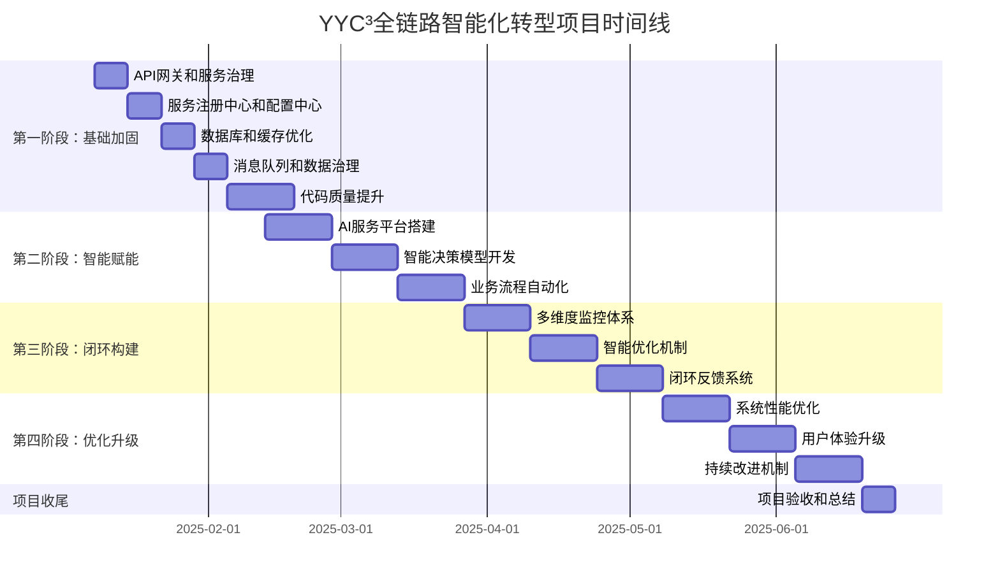

---

**@file**：YYC³-全链路智能化转型执行方案
**@description**：YYC³餐饮行业智能化平台的全链路智能化转型执行方案，包含执行计划、执行步骤、执行资源、执行风险、执行监控等核心内容
**@author**：YYC³
**@version**：v1.0.0
**@created**：2025-01-30
**@updated**：2025-01-30
**@status**：published
**@tags**：架构设计,智能化,YYC³,转型

---
# YYC³全链路经管运维数字化到智能化管理闭环转型执行方案

> **YYC³（YanYu Cloud Cube）**
> **标语**：万象归元于云枢 | 深栈智启新纪元
> **英文**：*All Realms Converge at Cloud Nexus, DeepStack Ignites a New Era of Intelligence*

---

## 📋 文档信息

| 属性 | 内容 |
|------|------|
| **文档标题** | YYC³全链路经管运维数字化到智能化管理闭环转型执行方案 |
| **文档版本** | v1.0.0 |
| **创建时间** | 2025-12-11 |
| **适用范围** | YYC³餐饮平台全链路智能化转型 |
| **规划周期** | 6个月（2025年Q1-Q2） |
| **执行框架** | 五高五标五化 + 分层闭环开发模型 |

---

## 📑 目录

- [📋 文档信息](#📋-文档信息)
- [🎯 项目概述](#🎯-项目概述)
  - [1.1 转型背景](#1.1-转型背景)
  - [1.2 转型目标](#1.2-转型目标)
    - [核心业务目标](#核心业务目标)
    - [技术架构目标](#技术架构目标)
  - [1.3 当前状态分析](#1.3-当前状态分析)
    - [优势](#优势)
    - [挑战](#挑战)
- [🏗️ 总体架构设计](#🏗️-总体架构设计)
  - [2.1 智能化闭环架构](#2.1-智能化闭环架构)
  - [2.2 技术架构演进](#2.2-技术架构演进)
    - [数字化架构（当前）](#数字化架构（当前）)
    - [智能化架构（目标）](#智能化架构（目标）)
  - [2.3 关键技术选型](#2.3-关键技术选型)
- [🔄 分层闭环开发模型](#🔄-分层闭环开发模型)
  - [3.1 闭环层次结构](#3.1-闭环层次结构)
    - [1. 业务闭环](#1.-业务闭环)
    - [2. 技术闭环](#2.-技术闭环)
    - [3. 数据闭环](#3.-数据闭环)
    - [4. AI能力闭环](#4.-ai能力闭环)
  - [3.2 闭环集成机制](#3.2-闭环集成机制)
- [📅 阶段规划与节点实施](#📅-阶段规划与节点实施)
  - [4.1 阶段划分](#4.1-阶段划分)
  - [4.2 详细节点实施计划](#4.2-详细节点实施计划)
    - [第一阶段：基础加固（2025.01.08 - 2025.02.12）](#第一阶段基础加固（2025.01.08---2025.02.12）)
    - [第二阶段：智能赋能（2025.02.13 - 2025.03.26）](#第二阶段智能赋能（2025.02.13---2025.03.26）)
    - [第三阶段：闭环构建（2025.03.27 - 2025.05.07）](#第三阶段闭环构建（2025.03.27---2025.05.07）)
    - [第四阶段：优化升级（2025.05.08 - 2025.06.18）](#第四阶段优化升级（2025.05.08---2025.06.18）)
- [🎯 阶段目标与验收标准](#🎯-阶段目标与验收标准)
  - [4.1 第一阶段：基础加固](#4.1-第一阶段基础加固)
    - [阶段目标](#阶段目标)
    - [验收标准](#验收标准)
  - [4.2 第二阶段：智能赋能](#4.2-第二阶段智能赋能)
    - [阶段目标](#阶段目标)
    - [验收标准](#验收标准)
  - [4.3 第三阶段：闭环构建](#4.3-第三阶段闭环构建)
    - [阶段目标](#阶段目标)
    - [验收标准](#验收标准)
  - [4.4 第四阶段：优化升级](#4.4-第四阶段优化升级)
    - [阶段目标](#阶段目标)
    - [验收标准](#验收标准)
- [📊 多维度闭环监控与优化机制](#📊-多维度闭环监控与优化机制)
  - [5.1 监控体系架构](#5.1-监控体系架构)
    - [1. 业务监控](#1.-业务监控)
    - [2. 系统监控](#2.-系统监控)
    - [3. 数据监控](#3.-数据监控)
    - [4. AI模型监控](#4.-ai模型监控)
  - [5.2 智能优化机制](#5.2-智能优化机制)
    - [1. 自动性能优化](#1.-自动性能优化)
    - [2. AI模型自动调优](#2.-ai模型自动调优)
    - [3. 业务流程智能优化](#3.-业务流程智能优化)
  - [5.3 闭环反馈系统](#5.3-闭环反馈系统)
    - [1. 数据反馈机制](#1.-数据反馈机制)
    - [2. 决策反馈机制](#2.-决策反馈机制)
    - [3. 用户反馈机制](#3.-用户反馈机制)
- [🚨 风险管理与质量保障计划](#🚨-风险管理与质量保障计划)
  - [6.1 风险识别与应对策略](#6.1-风险识别与应对策略)
  - [6.2 质量保障计划](#6.2-质量保障计划)
    - [1. 代码质量保障](#1.-代码质量保障)
    - [2. 测试质量保障](#2.-测试质量保障)
    - [3. 部署质量保障](#3.-部署质量保障)
- [📈 闭环度评估体系](#📈-闭环度评估体系)
  - [7.1 评估维度](#7.1-评估维度)
    - [1. 业务闭环度](#1.-业务闭环度)
    - [2. 技术闭环度](#2.-技术闭环度)
    - [3. 数据闭环度](#3.-数据闭环度)
    - [4. AI能力闭环度](#4.-ai能力闭环度)
  - [7.2 评估方法](#7.2-评估方法)
  - [7.3 最终闭环度目标](#7.3-最终闭环度目标)
- [🎯 项目实施与管理](#🎯-项目实施与管理)
  - [8.1 项目组织架构](#8.1-项目组织架构)
  - [8.2 开发流程](#8.2-开发流程)
    - [1. 需求管理](#1.-需求管理)
    - [2. 开发实施](#2.-开发实施)
    - [3. 测试验证](#3.-测试验证)
    - [4. 部署发布](#4.-部署发布)
  - [8.3 沟通与协作](#8.3-沟通与协作)
    - [1. 沟通机制](#1.-沟通机制)
    - [2. 协作工具](#2.-协作工具)
- [📅 项目时间线](#📅-项目时间线)
- [🎯 成功标准](#🎯-成功标准)
  - [9.1 业务成功标准](#9.1-业务成功标准)
  - [9.2 技术成功标准](#9.2-技术成功标准)
  - [9.3 团队成功标准](#9.3-团队成功标准)
- [📝 后续行动计划](#📝-后续行动计划)
- [📋 文档版本记录](#📋-文档版本记录)

---

## 1. 概述

### 1.1 设计目标

本架构设计文档旨在为YYC³餐饮行业智能化平台提供清晰、完整的技术架构指导。主要目标包括：

- **可扩展性**：支持业务快速扩展，模块化设计便于功能迭代
- **高性能**：优化系统性能，确保高并发场景下的稳定运行
- **高可用性**：实现系统高可用，故障自动恢复，保障业务连续性
- **安全性**：建立完善的安全体系，保护数据和系统安全
- **易维护性**：代码结构清晰，文档完善，便于团队协作和维护

通过本架构设计，确保平台能够满足当前业务需求，并为未来的发展奠定坚实基础。

### 1.2 设计原则

架构设计遵循以下核心原则：

- **单一职责原则**：每个模块只负责一个明确的业务功能
- **开闭原则**：对扩展开放，对修改关闭，便于功能扩展
- **依赖倒置原则**：高层模块不依赖低层模块，都依赖抽象
- **接口隔离原则**：使用细粒度的接口，避免接口污染
- **最少知识原则**：模块间最小化依赖，降低耦合度

同时遵循YYC³「五高五标五化」核心理念：
- **五高**：高可用、高性能、高安全、高扩展、高可维护
- **五标**：标准化、规范化、自动化、智能化、可视化
- **五化**：流程化、文档化、工具化、数字化、生态化

### 1.3 技术选型

技术栈选择基于以下考虑：

**前端技术栈**
- React 18+：采用现代化前端框架，组件化开发
- TypeScript 5.0+：类型安全，提高代码质量
- Next.js 14+：SSR/SSG支持，优化SEO和性能
- Tailwind CSS：原子化CSS，快速构建UI

**后端技术栈**
- Node.js 18+：高性能JavaScript运行时
- Express/Fastify：轻量级Web框架
- PostgreSQL 15+：关系型数据库，ACID保证
- Redis 7+：缓存和会话存储

**基础设施**
- Docker：容器化部署，环境一致性
- Kubernetes：容器编排，自动化运维
- Nginx：反向代理和负载均衡
- Prometheus + Grafana：监控和告警

**开发工具**
- Git：版本控制
- ESLint + Prettier：代码规范
- Jest + Vitest：单元测试
- GitHub Actions：CI/CD自动化

## 2. 架构设计

### 2.1 整体架构

YYC³餐饮行业智能化平台采用分层架构设计，从上到下分为以下层次：

**表现层（Presentation Layer）**
- Web前端：React + Next.js构建的单页应用
- 移动端：响应式设计，支持多设备访问
- 管理后台：独立的管理界面

**应用层（Application Layer）**
- API网关：统一入口，路由分发
- 业务服务：订单、用户、商品等核心业务逻辑
- 认证授权：JWT认证，RBAC权限控制

**领域层（Domain Layer）**
- 领域模型：核心业务实体和规则
- 领域服务：复杂业务逻辑封装
- 仓储接口：数据访问抽象

**基础设施层（Infrastructure Layer）**
- 数据库：PostgreSQL主从架构
- 缓存：Redis集群
- 消息队列：RabbitMQ/Kafka
- 文件存储：OSS/MinIO

**跨层关注点**
- 日志监控：ELK Stack
- 配置管理：Apollo/Nacos
- 服务发现：Consul/Eureka
- 链路追踪：Jaeger/SkyWalking

### 2.2 模块划分

系统按照业务领域划分为以下核心模块：

**用户模块（User Module）**
- 用户注册、登录、认证
- 用户信息管理
- 权限和角色管理

**商品模块（Product Module）**
- 商品信息管理
- 商品分类和标签
- 库存管理

**订单模块（Order Module）**
- 订单创建和支付
- 订单状态流转
- 订单查询和统计

**支付模块（Payment Module）**
- 支付接口集成
- 支付状态同步
- 退款处理

**营销模块（Marketing Module）**
- 优惠券管理
- 促销活动
- 会员积分

**报表模块（Report Module）**
- 销售报表
- 数据分析
- 可视化展示

**系统模块（System Module）**
- 配置管理
- 日志管理
- 监控告警

### 2.3 数据流向

## 3. 技术实现

### 3.1 核心技术

### 3.2 关键算法

### 3.3 性能优化

## 4. 接口设计

### 4.1 API接口

### 4.2 数据接口

### 4.3 消息接口

## 5. 部署方案

### 5.1 部署架构

### 5.2 配置管理

### 5.3 监控告警

## 6. 附录

### 6.1 术语表

### 6.2 参考资料

## 🎯 项目概述

### 1.1 转型背景

YYC³餐饮平台已完成数字化基础建设，当前处于数字化到智能化的关键转型期。为实现"全链路经管运维数字化管理转向智能化管理闭环"的战略目标，需要构建以AI为核心的智能化管理体系，实现数据驱动决策、自动化流程优化和智能预测分析。

### 1.2 转型目标

#### 核心业务目标
- **智能化决策**：实现基于AI的业务决策支持，提升运营效率30%+
- **自动化运维**：构建智能运维体系，降低人工干预50%+
- **数据价值释放**：实现数据全生命周期管理，挖掘数据价值提升业务ROI
- **用户体验升级**：提供个性化服务，提升用户满意度20%+

#### 技术架构目标
- 构建"感知-分析-决策-执行-优化"的智能化闭环
- 实现微服务架构完善和AI能力深度集成
- 建立多维度监控和智能优化体系
- 提升系统性能、安全性和可维护性

### 1.3 当前状态分析

#### 优势
- 已完成数字化基础建设（完成度95%）
- 具备Vue 3 + TypeScript + Node.js技术栈
- 已有完善的开发流程和文档体系
- 团队熟悉项目架构和业务逻辑

#### 挑战
- 微服务架构不完整
- AI集成缺失
- 数据架构待优化
- 代码质量需要提升
- 测试覆盖率不足

---

## 🏗️ 总体架构设计

### 2.1 智能化闭环架构

```
┌─────────────────────────────────────────────────────────────────┐
│                        智能化管理闭环                          │
├───────────┬───────────┬───────────┬───────────┬───────────┬─────┤
│   感知层  │   数据层  │   分析层  │   决策层  │   执行层  │ 优化层 │
├───────────┼───────────┼───────────┼───────────┼───────────┼─────┤
│ 业务数据  │ 数据采集  │ 数据分析  │ 智能决策  │ 自动执行  │ 持续优化 │
│ 用户行为  │ 数据存储  │ 模式识别  │ 策略生成  │ 流程自动化│ 闭环反馈 │
│ 系统状态  │ 数据治理  │ 预测分析  │ 风险评估  │ 任务调度  │ 智能调整 │
└───────────┴───────────┴───────────┴───────────┴───────────┴─────┘
```

### 2.2 技术架构演进

#### 数字化架构（当前）
```
前端应用层 → API网关层 → 业务服务层 → 数据访问层 → 数据库层
```

#### 智能化架构（目标）
```
┌─────────────────────────────────────────────────────────────────┐
│                        前端应用层                              │
│  Admin Dashboard + 员工端 + 顾客端 + AI智能助手                 │
└───────────┬─────────────────────────────────────────────────────┘
            │
┌───────────▼─────────────────────────────────────────────────────┐
│                        API网关层                              │
│  统一认证 + 限流熔断 + API管理 + AI能力网关                     │
└───────────┬─────────────────────────────────────────────────────┘
            │
┌───────────▼─────────────────────────────────────────────────────┐
│                        业务服务层                              │
│  核心业务服务 + AI智能服务 + 数据分析服务 + 自动化运维服务       │
└───────────┬─────────────────────────────────────────────────────┘
            │
┌───────────▼─────────────────────────────────────────────────────┐
│                        数据层                                  │
│  数据采集 + 数据存储 + 数据治理 + 数据湖 + 数据仓库              │
└───────────┬─────────────────────────────────────────────────────┘
            │
┌───────────▼─────────────────────────────────────────────────────┐
│                        AI能力层                               │
│  机器学习 + 深度学习 + 自然语言处理 + 计算机视觉 + 知识图谱      │
└─────────────────────────────────────────────────────────────────┘
```

### 2.3 关键技术选型

| 技术领域 | 当前技术 | 升级/新增技术 | 目的 |
|---------|---------|--------------|------|
| 前端框架 | Vue 3 + TypeScript | Vue 3 + TypeScript + AI组件库 | 构建智能化UI |
| 后端框架 | Node.js + Express | Node.js + Express + NestJS | 完善微服务架构 |
| 数据库 | PostgreSQL | PostgreSQL + Redis + Elasticsearch | 提升数据处理能力 |
| 消息队列 | 待实现 | Kafka + RabbitMQ | 实现异步通信和事件驱动 |
| AI框架 | 待集成 | TensorFlow + PyTorch + LangChain | 实现AI能力 |
| DevOps | 基础CI/CD | 完善CI/CD + 自动化测试 + 智能监控 | 提升开发运维效率 |

---

## 🔄 分层闭环开发模型

### 3.1 闭环层次结构

#### 1. 业务闭环
- **目标**：实现业务流程的智能化闭环管理
- **范围**：订单管理、库存管理、人员管理、财务管理
- **闭环流程**：业务数据采集 → 智能分析 → 决策优化 → 业务执行 → 效果评估 → 持续改进

#### 2. 技术闭环
- **目标**：实现技术开发和运维的智能化闭环
- **范围**：开发流程、测试流程、部署流程、监控流程
- **闭环流程**：需求分析 → 开发实现 → 自动化测试 → 智能部署 → 实时监控 → 自动优化

#### 3. 数据闭环
- **目标**：实现数据全生命周期的智能化管理
- **范围**：数据采集、存储、分析、应用、优化
- **闭环流程**：数据采集 → 数据清洗 → 数据分析 → 数据应用 → 数据反馈 → 数据优化

#### 4. AI能力闭环
- **目标**：实现AI模型的持续学习和优化
- **范围**：模型训练、部署、监控、优化
- **闭环流程**：数据标注 → 模型训练 → 模型部署 → 模型监控 → 模型优化 → 持续学习

### 3.2 闭环集成机制

```
业务闭环 ←→ 技术闭环 ←→ 数据闭环 ←→ AI能力闭环
    ↑                                 ↓
    └─────────────────────────────────┘
```

- **数据驱动**：所有闭环以数据为核心，实现数据在各闭环间的流动和价值释放
- **AI赋能**：AI能力贯穿所有闭环，提供智能决策和自动化优化
- **持续改进**：各闭环通过反馈机制实现持续优化和迭代升级

---

## 📅 阶段规划与节点实施

### 4.1 阶段划分

| 阶段 | 时间周期 | 核心目标 | 关键任务 |
|------|---------|---------|----------|
| **第一阶段：基础加固** | 2025.01.08 - 2025.02.12（6周） | 完善基础架构，为智能化转型做准备 | 微服务架构完善、数据架构优化、代码质量提升 |
| **第二阶段：智能赋能** | 2025.02.13 - 2025.03.26（6周） | 集成AI能力，实现核心业务智能化 | AI服务搭建、智能决策支持、自动化流程实现 |
| **第三阶段：闭环构建** | 2025.03.27 - 2025.05.07（6周） | 构建智能化管理闭环 | 多维度监控体系、智能优化机制、闭环反馈系统 |
| **第四阶段：优化升级** | 2025.05.08 - 2025.06.18（6周） | 完善和优化智能化体系 | 性能优化、用户体验升级、持续改进机制 |

### 4.2 详细节点实施计划

#### 第一阶段：基础加固（2025.01.08 - 2025.02.12）

##### 节点1.1：微服务架构完善（2周）
- **任务1.1.1**：API网关设计与实现
- **任务1.1.2**：服务注册与发现机制
- **任务1.1.3**：配置中心建设
- **任务1.1.4**：微服务间通信机制

##### 节点1.2：数据架构优化（2周）
- **任务1.2.1**：数据库性能优化
- **任务1.2.2**：缓存架构设计
- **任务1.2.3**：消息队列系统搭建
- **任务1.2.4**：数据治理体系建立

##### 节点1.3：代码质量提升（2周）
- **任务1.3.1**：代码标准文件头添加
- **任务1.3.2**：Bun构建工具迁移
- **任务1.3.3**：测试覆盖率提升（≥80%）
- **任务1.3.4**：技术债务清理

#### 第二阶段：智能赋能（2025.02.13 - 2025.03.26）

##### 节点2.1：AI服务搭建（2周）
- **任务2.1.1**：AI服务架构设计
- **任务2.1.2**：机器学习模型训练平台搭建
- **任务2.1.3**：自然语言处理服务集成
- **任务2.1.4**：AI API接口开发

##### 节点2.2：智能决策支持（2周）
- **任务2.2.1**：销售预测模型开发
- **任务2.2.2**：库存优化算法实现
- **任务2.2.3**：智能排班系统开发
- **任务2.2.4**：财务分析与预测工具

##### 节点2.3：自动化流程实现（2周）
- **任务2.3.1**：订单处理自动化
- **任务2.3.2**：库存预警与自动补货
- **任务2.3.3**：客户服务自动化
- **任务2.3.4**：运维流程自动化

#### 第三阶段：闭环构建（2025.03.27 - 2025.05.07）

##### 节点3.1：多维度监控体系（2周）
- **任务3.1.1**：业务指标监控系统
- **任务3.1.2**：系统性能监控平台
- **任务3.1.3**：AI模型监控工具
- **任务3.1.4**：用户行为分析系统

##### 节点3.2：智能优化机制（2周）
- **任务3.2.1**：自动性能优化系统
- **任务3.2.2**：AI模型自动调优
- **任务3.2.3**：业务流程智能优化
- **任务3.2.4**：资源自动调度系统

##### 节点3.3：闭环反馈系统（2周）
- **任务3.3.1**：数据反馈机制建立
- **任务3.3.2**：决策效果评估系统
- **任务3.3.3**：用户反馈分析工具
- **任务3.3.4**：持续改进流程设计

#### 第四阶段：优化升级（2025.05.08 - 2025.06.18）

##### 节点4.1：性能优化（2周）
- **任务4.1.1**：系统性能瓶颈分析
- **任务4.1.2**：前端性能优化
- **任务4.1.3**：后端性能优化
- **任务4.1.4**：数据库性能调优

##### 节点4.2：用户体验升级（2周）
- **任务4.2.1**：智能化UI设计
- **任务4.2.2**：个性化推荐系统
- **任务4.2.3**：语音交互功能
- **任务4.2.4**：移动端体验优化

##### 节点4.3：持续改进机制（2周）
- **任务4.3.1**：智能运维体系完善
- **任务4.3.2**：AI模型持续学习机制
- **任务4.3.3**：业务流程持续优化
- **任务4.3.4**：团队能力提升计划

---

## 🎯 阶段目标与验收标准

### 4.1 第一阶段：基础加固

#### 阶段目标
- 完善微服务架构，实现服务的注册、发现和通信
- 优化数据架构，提升数据处理能力和存储效率
- 提升代码质量，减少技术债务
- 建立完善的测试体系，提高测试覆盖率

#### 验收标准
- API网关正常工作，支持服务路由和限流
- 服务注册中心实现服务的自动注册和发现
- 数据库查询性能提升50%+
- 代码测试覆盖率达到80%+
- 成功迁移至Bun构建工具

### 4.2 第二阶段：智能赋能

#### 阶段目标
- 搭建AI服务平台，实现AI能力的集成和调用
- 开发智能决策支持系统，提升业务决策效率
- 实现核心业务流程的自动化，减少人工干预
- 建立AI模型的训练和部署流程

#### 验收标准
- AI服务平台正常运行，支持模型训练和部署
- 销售预测准确率达到85%+
- 库存周转率提升20%+
- 订单处理自动化率达到60%+
- 成功开发至少3个智能决策模型

### 4.3 第三阶段：闭环构建

#### 阶段目标
- 建立多维度监控体系，实现对业务、系统、数据和AI模型的全面监控
- 实现智能优化机制，自动调整系统参数和业务策略
- 构建闭环反馈系统，实现持续改进
- 实现各闭环间的协同工作

#### 验收标准
- 监控系统覆盖所有关键指标，告警准确率达到95%+
- 自动优化系统成功降低资源消耗15%+
- 闭环反馈机制实现业务流程的持续改进
- 各闭环间实现数据和决策的无缝衔接

### 4.4 第四阶段：优化升级

#### 阶段目标
- 优化系统性能，提升用户体验
- 完善智能化功能，提升系统的智能水平
- 建立持续改进机制，确保系统的长期稳定运行
- 提升团队的智能化开发和运维能力

#### 验收标准
- 系统响应时间降低30%+
- 用户满意度提升20%+
- 建立完善的智能运维体系，实现7×24小时无人值守
- 团队掌握AI开发和运维技能

---

## 📊 多维度闭环监控与优化机制

### 5.1 监控体系架构

#### 1. 业务监控
- **关键指标**：订单量、销售额、库存周转率、客户满意度
- **监控工具**：自定义BI系统 + Grafana
- **告警机制**：阈值告警 + 异常检测告警

#### 2. 系统监控
- **关键指标**：响应时间、吞吐量、错误率、资源利用率
- **监控工具**：Prometheus + Grafana + ELK Stack
- **告警机制**：性能告警 + 故障告警 + 安全告警

#### 3. 数据监控
- **关键指标**：数据质量、数据完整性、数据延迟、数据使用率
- **监控工具**：自定义数据监控系统
- **告警机制**：数据异常告警 + 数据质量告警

#### 4. AI模型监控
- **关键指标**：模型准确率、模型漂移、预测延迟、资源消耗
- **监控工具**：MLflow + 自定义AI监控系统
- **告警机制**：模型性能下降告警 + 模型漂移告警

### 5.2 智能优化机制

#### 1. 自动性能优化
- **优化策略**：基于监控数据的自动扩容缩容
- **实现方式**：Kubernetes HPA + 自定义优化算法
- **目标**：保持系统性能稳定，降低资源消耗

#### 2. AI模型自动调优
- **优化策略**：基于模型监控数据的自动参数调优
- **实现方式**：AutoML + 持续学习机制
- **目标**：保持模型性能，适应数据变化

#### 3. 业务流程智能优化
- **优化策略**：基于业务数据的流程自动化和优化
- **实现方式**：规则引擎 + 机器学习算法
- **目标**：提升业务效率，减少人工干预

### 5.3 闭环反馈系统

#### 1. 数据反馈机制
- **目标**：实现数据从采集到应用的闭环反馈
- **流程**：数据应用效果评估 → 数据质量改进 → 数据采集优化

#### 2. 决策反馈机制
- **目标**：实现决策从生成到执行的闭环反馈
- **流程**：决策执行效果评估 → 决策模型优化 → 决策策略调整

#### 3. 用户反馈机制
- **目标**：实现用户需求从收集到满足的闭环反馈
- **流程**：用户反馈收集 → 需求分析 → 功能优化 → 用户验证

---

## 🚨 风险管理与质量保障计划

### 6.1 风险识别与应对策略

| 风险类型 | 风险描述 | 应对措施 | 责任人 |
|---------|---------|---------|--------|
| **技术风险** | AI模型性能不达预期 | 建立模型评估机制，持续优化模型 | AI开发团队 |
| | 微服务架构复杂度高 | 分阶段实施，建立完善的监控体系 | 架构团队 |
| | 数据质量问题影响AI效果 | 建立数据治理体系，确保数据质量 | 数据团队 |
| **业务风险** | 智能化转型影响现有业务 | 采用灰度发布，逐步推广新功能 | 产品团队 |
| | 用户对智能化功能接受度低 | 提供培训和引导，收集用户反馈 | 用户体验团队 |
| **人员风险** | 团队AI技能不足 | 提供培训，引进专业人才 | 人力资源部 |
| | 项目进度延误 | 采用敏捷开发，定期检查进度 | 项目管理团队 |
| **安全风险** | AI模型泄露 | 加强模型安全防护，加密敏感数据 | 安全团队 |
| | 系统被攻击 | 加强系统安全防护，定期进行安全审计 | 安全团队 |

### 6.2 质量保障计划

#### 1. 代码质量保障
- **代码审查**：建立严格的代码审查流程
- **自动化测试**：完善单元测试、集成测试和端到端测试
- **静态代码分析**：使用ESLint、Prettier等工具确保代码质量
- **代码覆盖率**：要求核心代码覆盖率达到80%+

#### 2. 测试质量保障
- **测试策略**：制定详细的测试计划，覆盖所有功能和场景
- **自动化测试**：实现测试的自动化执行和报告生成
- **性能测试**：定期进行性能测试，确保系统性能达标
- **安全测试**：定期进行安全测试，发现和修复安全漏洞

#### 3. 部署质量保障
- **灰度发布**：采用灰度发布策略，降低部署风险
- **自动回滚**：实现部署失败的自动回滚机制
- **环境一致性**：确保开发、测试和生产环境的一致性
- **部署监控**：实时监控部署过程，及时发现问题

---

## 📈 闭环度评估体系

### 7.1 评估维度

#### 1. 业务闭环度
- **评估指标**：业务流程自动化率、决策智能化程度、业务效率提升
- **目标值**：业务流程自动化率达到70%+，决策智能化程度达到80%+

#### 2. 技术闭环度
- **评估指标**：开发流程自动化率、测试覆盖率、部署自动化率、监控覆盖率
- **目标值**：开发流程自动化率达到90%+，测试覆盖率达到85%+

#### 3. 数据闭环度
- **评估指标**：数据采集完整性、数据分析深度、数据应用广度、数据反馈及时性
- **目标值**：数据采集完整性达到95%+，数据应用广度达到80%+

#### 4. AI能力闭环度
- **评估指标**：AI模型数量、模型准确率、模型自动优化程度、AI应用场景数量
- **目标值**：AI模型数量达到10+，模型准确率达到85%+，AI应用场景覆盖核心业务

### 7.2 评估方法

- **定期评估**：每季度进行一次全面评估
- **实时监控**：通过监控系统实时跟踪闭环度指标
- **用户反馈**：收集用户对智能化功能的反馈
- **业务数据**：分析业务数据，评估智能化效果

### 7.3 最终闭环度目标

| 评估维度 | 目标值 | 权重 |
|---------|-------|------|
| 业务闭环度 | 90% | 35% |
| 技术闭环度 | 95% | 25% |
| 数据闭环度 | 90% | 20% |
| AI能力闭环度 | 85% | 20% |
| **综合闭环度** | **90%** | **100%** |

---

## 🎯 项目实施与管理

### 8.1 项目组织架构

```
┌─────────────────────────────────────────────────────────────────┐
│                        项目管理委员会                          │
└───────────────────┬─────────────────────────────────────────────┘
                    │
┌───────────────────▼─────────────────────────────────────────────┐
│                        项目总监                                 │
└───────────────────┬─────────────────────────────────────────────┘
                    │
┌───────────┬───────────┬───────────┬───────────┬───────────┬─────┐
│ 架构团队  │ 开发团队  │ 测试团队  │ 数据团队  │ AI团队   │ 运维团队 │
└───────────┴───────────┴───────────┴───────────┴───────────┴─────┘
```

### 8.2 开发流程

#### 1. 需求管理
- **流程**：需求收集 → 需求分析 → 需求评审 → 需求确认 → 需求跟踪
- **工具**：Jira + Confluence

#### 2. 开发实施
- **流程**：任务分配 → 代码开发 → 代码审查 → 单元测试 → 集成测试
- **工具**：GitLab + VS Code + ESLint

#### 3. 测试验证
- **流程**：测试计划 → 测试用例设计 → 测试执行 → 缺陷管理 → 测试报告
- **工具**：Vitest + Cypress + TestRail

#### 4. 部署发布
- **流程**：构建 → 测试 → 部署 → 监控 → 回滚（如有必要）
- **工具**：GitHub Actions + Docker + Kubernetes

### 8.3 沟通与协作

#### 1. 沟通机制
- **每日站会**：15分钟，同步进度和问题
- **周例会**：1小时，总结本周工作，规划下周任务
- **月评审会**：2小时，评审项目进展，调整计划
- **专题讨论会**：按需召开，解决技术难点

#### 2. 协作工具
- **项目管理**：Jira
- **文档管理**：Confluence
- **代码管理**：GitLab
- **沟通工具**：Slack + Zoom

---

## 📅 项目时间线



---

## 🎯 成功标准

### 9.1 业务成功标准
- 运营效率提升30%+
- 人工干预减少50%+
- 用户满意度提升20%+
- 业务ROI提升25%+

### 9.2 技术成功标准
- 系统可用性达到99.9%
- 响应时间降低30%+
- 代码测试覆盖率达到85%+
- 成功实现数字化到智能化的转型

### 9.3 团队成功标准
- 团队掌握AI开发和运维技能
- 建立完善的智能化开发流程
- 形成智能化转型的最佳实践

---

## 📝 后续行动计划

1. **项目启动**：召开项目启动会议，明确目标和职责
2. **需求细化**：进一步细化各阶段的需求和任务
3. **资源准备**：准备项目所需的人员、工具和资源
4. **风险管控**：建立风险监控机制，及时应对风险
5. **进度跟踪**：定期跟踪项目进度，确保按时完成
6. **质量保障**：建立质量保障体系，确保项目质量
7. **沟通协作**：加强团队沟通和协作，提高效率
8. **持续改进**：建立持续改进机制，不断优化项目管理和执行

---

## 📋 文档版本记录

| 版本 | 更新内容 | 更新时间 | 更新人 |
|------|----------|----------|--------|
| v1.0.0 | 初始版本 | 2025-12-11 | YYC³项目团队 |

---

**文档所有者**：YYC³项目管理团队
**联系方式**：<admin@0379.email>

> **注意**：本计划将根据项目实际情况进行调整和优化，确保数字化到智能化转型的顺利实施。


## 概述

### 架构概述

本架构文档详细描述了系统的整体架构设计，包括架构目标、设计原则、技术选型等关键信息。

#### 架构目标

- **高可用性**：确保系统稳定运行，故障自动恢复
- **高性能**：响应迅速，资源利用高效
- **高安全性**：数据加密，权限严格控制
- **高扩展性**：模块化设计，易于功能扩展
- **高可维护性**：代码清晰，文档完善

#### 设计原则

- **单一职责**：每个组件只负责一个功能
- **开闭原则**：对扩展开放，对修改关闭
- **依赖倒置**：依赖抽象而非具体实现
- **接口隔离**：使用细粒度的接口
- **迪米特法则**：最少知识原则


## 架构设计

### 架构设计

#### 整体架构

系统采用分层架构设计，包括：

- **表现层**：负责用户界面和交互
- **应用层**：处理业务逻辑
- **业务层**：实现核心业务功能
- **数据层**：管理数据存储和访问
- **基础设施层**：提供基础服务支持

#### 模块划分

系统划分为多个独立模块，每个模块负责特定功能：

- **用户模块**：用户管理和认证
- **订单模块**：订单处理和管理
- **支付模块**：支付集成和处理
- **通知模块**：消息通知和推送
- **报表模块**：数据统计和分析

#### 技术选型

- **前端框架**：React / Vue
- **后端框架**：Node.js / Express / Fastify
- **数据库**：PostgreSQL / MongoDB
- **缓存**：Redis
- **消息队列**：RabbitMQ / Kafka


## 技术实现

### 技术实现

#### 核心技术栈

```typescript
// 核心依赖
{
  "dependencies": {
    "react": "^18.0.0",
    "typescript": "^5.0.0",
    "express": "^4.18.0",
    "prisma": "^5.0.0",
    "redis": "^4.6.0"
  }
}
```

#### 关键实现

1. **服务层实现**
```typescript
class UserService {
  async createUser(data: CreateUserDto): Promise<User> {
    // 验证输入
    this.validateUserData(data);
    
    // 加密密码
    const hashedPassword = await this.hashPassword(data.password);
    
    // 创建用户
    const user = await this.userRepository.create({
      ...data,
      password: hashedPassword
    });
    
    return user;
  }
}
```

2. **中间件实现**
```typescript
const authMiddleware = async (req: Request, res: Response, next: NextFunction) => {
  const token = req.headers.authorization?.split(' ')[1];
  
  if (!token) {
    return res.status(401).json({ error: '未授权访问' });
  }
  
  try {
    const decoded = jwt.verify(token, process.env.JWT_SECRET);
    req.user = decoded;
    next();
  } catch (error) {
    return res.status(401).json({ error: '令牌无效' });
  }
};
```


## 部署方案

### 部署方案

#### 部署架构

采用容器化部署方案，使用Docker和Kubernetes进行编排。

#### 部署步骤

1. **环境准备**
```bash
# 安装Docker
curl -fsSL https://get.docker.com | sh

# 安装Kubernetes
# 根据操作系统选择相应的安装方式
```

2. **构建镜像**
```bash
# 构建应用镜像
docker build -t yyc3-app:latest .

# 推送到镜像仓库
docker push registry.example.com/yyc3-app:latest
```

3. **部署到Kubernetes**
```yaml
apiVersion: apps/v1
kind: Deployment
metadata:
  name: yyc3-app
spec:
  replicas: 3
  selector:
    matchLabels:
      app: yyc3-app
  template:
    metadata:
      labels:
        app: yyc3-app
    spec:
      containers:
      - name: app
        image: registry.example.com/yyc3-app:latest
        ports:
        - containerPort: 3000
        env:
        - name: NODE_ENV
          value: "production"
```

4. **配置服务**
```yaml
apiVersion: v1
kind: Service
metadata:
  name: yyc3-app-service
spec:
  selector:
    app: yyc3-app
  ports:
  - protocol: TCP
    port: 80
    targetPort: 3000
  type: LoadBalancer
```


## 性能优化

### 性能优化

#### 前端优化

1. **代码分割**
```typescript
// 路由级别代码分割
const Home = lazy(() => import('./pages/Home'));
const About = lazy(() => import('./pages/About'));

function App() {
  return (
    <Suspense fallback={<Loading />}>
      <Routes>
        <Route path="/" element={<Home />} />
        <Route path="/about" element={<About />} />
      </Routes>
    </Suspense>
  );
}
```

2. **缓存策略**
```typescript
// React.memo 避免不必要的重渲染
const MemoizedComponent = React.memo(({ data }) => {
  return <div>{data.value}</div>;
});

// useMemo 缓存计算结果
const expensiveValue = useMemo(() => {
  return computeExpensiveValue(data);
}, [data]);
```

#### 后端优化

1. **数据库优化**
```typescript
// 使用索引
CREATE INDEX idx_user_email ON users(email);

// 查询优化
const users = await prisma.user.findMany({
  select: {
    id: true,
    name: true,
    email: true
  },
  where: {
    active: true
  },
  take: 100
});
```

2. **缓存策略**
```typescript
// Redis缓存
async function getUser(id: string): Promise<User> {
  const cacheKey = `user:${id}`;
  
  // 尝试从缓存获取
  const cached = await redis.get(cacheKey);
  if (cached) {
    return JSON.parse(cached);
  }
  
  // 从数据库获取
  const user = await prisma.user.findUnique({ where: { id } });
  
  // 写入缓存
  await redis.setex(cacheKey, 3600, JSON.stringify(user));
  
  return user;
}
```


## 安全考虑

### 安全考虑

#### 认证与授权

1. **JWT认证**
```typescript
// 生成JWT令牌
const token = jwt.sign(
  { userId: user.id, role: user.role },
  process.env.JWT_SECRET,
  { expiresIn: '24h' }
);

// 验证JWT令牌
const decoded = jwt.verify(token, process.env.JWT_SECRET);
```

2. **RBAC授权**
```typescript
// 角色权限检查
function checkPermission(user: User, resource: string, action: string): boolean {
  const permissions = rolePermissions[user.role];
  return permissions.some(p => 
    p.resource === resource && p.actions.includes(action)
  );
}
```

#### 数据保护

1. **输入验证**
```typescript
// 使用Zod进行输入验证
const createUserSchema = z.object({
  email: z.string().email(),
  password: z.string().min(8).regex(/[A-Z]/),
  name: z.string().min(2)
});

const validated = createUserSchema.parse(input);
```

2. **数据加密**
```typescript
// 使用bcrypt加密密码
const hashedPassword = await bcrypt.hash(password, 10);

// 验证密码
const isValid = await bcrypt.compare(password, hashedPassword);
```

#### 安全头配置

```typescript
// Express安全头配置
app.use(helmet());
app.use(cors({
  origin: process.env.ALLOWED_ORIGINS?.split(','),
  credentials: true
}));
```


## 监控告警

### 监控告警

#### 监控指标

1. **系统指标**
- CPU使用率
- 内存使用率
- 磁盘使用率
- 网络I/O

2. **应用指标**
- 请求量(RPS)
- 响应时间
- 错误率
- 并发用户数

3. **业务指标**
- 用户注册数
- 订单创建数
- 支付成功率
- 用户活跃度

#### 监控工具

```typescript
// Prometheus指标收集
import { Counter, Histogram, Gauge } from 'prom-client';

const requestCounter = new Counter({
  name: 'http_requests_total',
  help: 'Total number of HTTP requests',
  labelNames: ['method', 'route', 'status']
});

const responseTime = new Histogram({
  name: 'http_request_duration_seconds',
  help: 'HTTP request duration in seconds',
  labelNames: ['method', 'route']
});

// 使用中间件记录指标
app.use((req, res, next) => {
  const start = Date.now();
  
  res.on('finish', () => {
    const duration = (Date.now() - start) / 1000;
    requestCounter.inc({
      method: req.method,
      route: req.route?.path || req.path,
      status: res.statusCode
    });
    responseTime.observe({
      method: req.method,
      route: req.route?.path || req.path
    }, duration);
  });
  
  next();
});
```

#### 告警规则

```yaml
groups:
- name: api_alerts
  rules:
  - alert: HighErrorRate
    expr: rate(http_requests_total{status=~"5.."}[5m]) > 0.05
    for: 5m
    labels:
      severity: critical
    annotations:
      summary: "API错误率过高"
      description: "5分钟内错误率超过5%"
  
  - alert: HighResponseTime
    expr: histogram_quantile(0.95, http_request_duration_seconds) > 1
    for: 5m
    labels:
      severity: warning
    annotations:
      summary: "API响应时间过长"
      description: "95%分位响应时间超过1秒"
```


## 最佳实践

### 最佳实践

#### 代码规范

1. **命名规范**
```typescript
// 变量：camelCase
const userName = 'John';

// 常量：UPPER_SNAKE_CASE
const MAX_RETRY_COUNT = 3;

// 类：PascalCase
class UserService { }

// 接口：PascalCase，前缀I（可选）
interface IUserService { }
```

2. **注释规范**
```typescript
/**
 * 创建用户
 * @param email - 用户邮箱
 * @param password - 用户密码
 * @returns 创建的用户对象
 * @throws {Error} 当邮箱已存在时抛出错误
 */
async function createUser(
  email: string, 
  password: string
): Promise<User> {
  // 实现
}
```

#### 错误处理

```typescript
// 统一错误处理
class AppError extends Error {
  constructor(
    public statusCode: number,
    public message: string,
    public isOperational = true
  ) {
    super(message);
    this.name = this.constructor.name;
    Error.captureStackTrace(this, this.constructor);
  }
}

// 使用错误处理中间件
app.use((err: Error, req: Request, res: Response, next: NextFunction) => {
  if (err instanceof AppError) {
    return res.status(err.statusCode).json({
      success: false,
      error: err.message
    });
  }
  
  // 记录未预期的错误
  logger.error('Unexpected error:', err);
  
  return res.status(500).json({
    success: false,
    error: '服务器内部错误'
  });
});
```

#### 日志记录

```typescript
// 结构化日志
import winston from 'winston';

const logger = winston.createLogger({
  level: 'info',
  format: winston.format.combine(
    winston.format.timestamp(),
    winston.format.json()
  ),
  transports: [
    new winston.transports.File({ filename: 'error.log', level: 'error' }),
    new winston.transports.File({ filename: 'combined.log' })
  ]
});

// 使用日志
logger.info('User created', { userId: user.id, email: user.email });
logger.error('Database connection failed', { error: error.message });
```


## 相关文档

- [YYC³全链路智能化转型总体架构设计](YYC3-Cater-架构设计/架构类/10-YYC3-Cater--架构类-全链路智能化转型总体架构设计.md) - YYC3-Cater-架构设计/架构类
- [YYC³智枢服务化平台 - 全链路智能化转型最终执行方案](YYC3-Cater-架构设计/架构类/13-YYC3-Cater--架构类-全链路智能化转型最终执行方案.md) - YYC3-Cater-架构设计/架构类
- [YYC³分层闭环开发模型设计](YYC3-Cater-架构设计/架构类/14-YYC3-Cater--架构类-分层闭环开发模型设计.md) - YYC3-Cater-架构设计/架构类
- [YYC³餐饮平台全链路智能化转型技术实现计划](YYC3-Cater-架构设计/架构类/11-YYC3-Cater--架构类-全链路智能化转型技术实现计划.md) - YYC3-Cater-架构设计/架构类
- [YYC3 初现系统色](YYC3-Cater-架构设计/架构类/16-YYC3-Cater--架构类-系统色设计规范.md) - YYC3-Cater-架构设计/架构类
