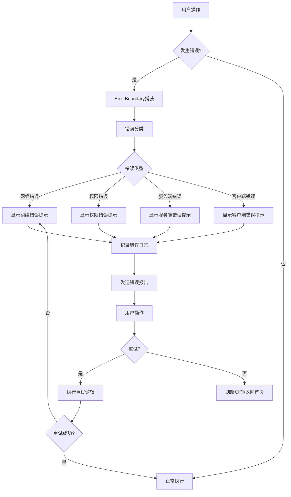
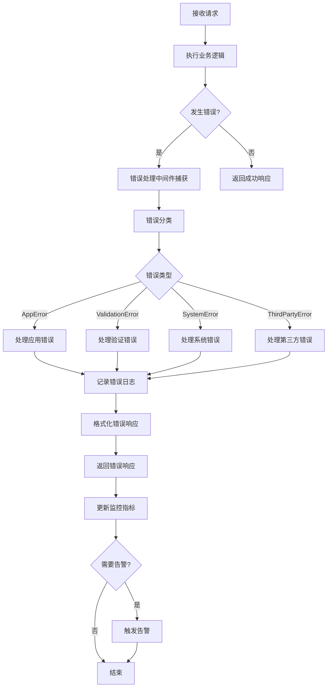
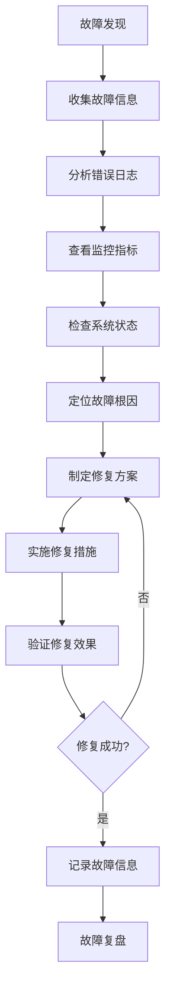

---

**@file**：YYC³-YYC3-错误处理架构设计文档
**@description**：YYC³餐饮行业智能化平台的YYC3-错误处理架构设计文档
**@author**：YYC³
**@version**：v1.0.0
**@created**：2025-01-30
**@updated**：2025-01-30
**@status**：published
**@tags**：架构设计,YYC³,系统架构

---
# 🔖 YYC³ 错误处理架构设计文档

> ***YanYuCloudCube***
> **标语**：言启象限 | 语枢未来
> ***Words Initiate Quadrants, Language Serves as Core for the Future***
> **标语**：万象归元于云枢 | 深栈智启新纪元
> ***All things converge in the cloud pivot; Deep stacks ignite a new era of intelligence***

---

## 📋 文档信息

| 属性 | 内容 |
|------|------|
| **文档标题** | YYC³ 错误处理架构设计文档 |
| **文档类型** | 架构设计文档 |
| **所属阶段** | 系统架构设计 |
| **遵循规范** | YYC³ 团队标准化规范 v1.0.0 |
| **版本号** | v1.0.0 |
| **创建日期** | 2025-01-30 |
| **作者** | YYC³ Team |
| **更新日期** | 2025-01-30 |

---

## 📑 目录

1. [错误处理概述](#1-错误处理概述)
2. [错误分类体系](#2-错误分类体系)
3. [错误处理架构设计](#3-错误处理架构设计)
4. [前端错误处理机制](#4-前端错误处理机制)
5. [后端错误处理机制](#5-后端错误处理机制)
6. [错误监控与告警](#6-错误监控与告警)
7. [故障排查与恢复](#7-故障排查与恢复)
8. [最佳实践与规范](#8-最佳实践与规范)

---

## 1. 概述

### 1.1 设计目标

本架构设计文档旨在为YYC³餐饮行业智能化平台提供清晰、完整的技术架构指导。主要目标包括：

- **可扩展性**：支持业务快速扩展，模块化设计便于功能迭代
- **高性能**：优化系统性能，确保高并发场景下的稳定运行
- **高可用性**：实现系统高可用，故障自动恢复，保障业务连续性
- **安全性**：建立完善的安全体系，保护数据和系统安全
- **易维护性**：代码结构清晰，文档完善，便于团队协作和维护

通过本架构设计，确保平台能够满足当前业务需求，并为未来的发展奠定坚实基础。

### 1.2 设计原则

架构设计遵循以下核心原则：

- **单一职责原则**：每个模块只负责一个明确的业务功能
- **开闭原则**：对扩展开放，对修改关闭，便于功能扩展
- **依赖倒置原则**：高层模块不依赖低层模块，都依赖抽象
- **接口隔离原则**：使用细粒度的接口，避免接口污染
- **最少知识原则**：模块间最小化依赖，降低耦合度

同时遵循YYC³「五高五标五化」核心理念：
- **五高**：高可用、高性能、高安全、高扩展、高可维护
- **五标**：标准化、规范化、自动化、智能化、可视化
- **五化**：流程化、文档化、工具化、数字化、生态化

### 1.3 技术选型

技术栈选择基于以下考虑：

**前端技术栈**
- React 18+：采用现代化前端框架，组件化开发
- TypeScript 5.0+：类型安全，提高代码质量
- Next.js 14+：SSR/SSG支持，优化SEO和性能
- Tailwind CSS：原子化CSS，快速构建UI

**后端技术栈**
- Node.js 18+：高性能JavaScript运行时
- Express/Fastify：轻量级Web框架
- PostgreSQL 15+：关系型数据库，ACID保证
- Redis 7+：缓存和会话存储

**基础设施**
- Docker：容器化部署，环境一致性
- Kubernetes：容器编排，自动化运维
- Nginx：反向代理和负载均衡
- Prometheus + Grafana：监控和告警

**开发工具**
- Git：版本控制
- ESLint + Prettier：代码规范
- Jest + Vitest：单元测试
- GitHub Actions：CI/CD自动化

## 2. 架构设计

### 2.1 整体架构

YYC³餐饮行业智能化平台采用分层架构设计，从上到下分为以下层次：

**表现层（Presentation Layer）**
- Web前端：React + Next.js构建的单页应用
- 移动端：响应式设计，支持多设备访问
- 管理后台：独立的管理界面

**应用层（Application Layer）**
- API网关：统一入口，路由分发
- 业务服务：订单、用户、商品等核心业务逻辑
- 认证授权：JWT认证，RBAC权限控制

**领域层（Domain Layer）**
- 领域模型：核心业务实体和规则
- 领域服务：复杂业务逻辑封装
- 仓储接口：数据访问抽象

**基础设施层（Infrastructure Layer）**
- 数据库：PostgreSQL主从架构
- 缓存：Redis集群
- 消息队列：RabbitMQ/Kafka
- 文件存储：OSS/MinIO

**跨层关注点**
- 日志监控：ELK Stack
- 配置管理：Apollo/Nacos
- 服务发现：Consul/Eureka
- 链路追踪：Jaeger/SkyWalking

### 2.2 模块划分

系统按照业务领域划分为以下核心模块：

**用户模块（User Module）**
- 用户注册、登录、认证
- 用户信息管理
- 权限和角色管理

**商品模块（Product Module）**
- 商品信息管理
- 商品分类和标签
- 库存管理

**订单模块（Order Module）**
- 订单创建和支付
- 订单状态流转
- 订单查询和统计

**支付模块（Payment Module）**
- 支付接口集成
- 支付状态同步
- 退款处理

**营销模块（Marketing Module）**
- 优惠券管理
- 促销活动
- 会员积分

**报表模块（Report Module）**
- 销售报表
- 数据分析
- 可视化展示

**系统模块（System Module）**
- 配置管理
- 日志管理
- 监控告警

### 2.3 数据流向

## 3. 技术实现

### 3.1 核心技术

### 3.2 关键算法

### 3.3 性能优化

## 4. 接口设计

### 4.1 API接口

### 4.2 数据接口

### 4.3 消息接口

## 5. 部署方案

### 5.1 部署架构

### 5.2 配置管理

### 5.3 监控告警

## 6. 附录

### 6.1 术语表

### 6.2 参考资料

## 1. 错误处理概述

### 1.1 设计目标

YYC³ 错误处理架构基于 **「五高五标五化」** 核心理念构建，旨在实现：

- **高可用**：确保系统在错误发生时能够优雅降级，不影响核心功能
- **高性能**：错误处理机制轻量高效，不影响系统整体性能
- **高安全**：敏感错误信息不泄露，防止信息泄露风险
- **高扩展**：支持自定义错误类型和处理策略
- **高可维护**：统一的错误处理流程，便于排查和修复

### 1.2 核心原则

#### 1.2.1 统一性原则
- 全局统一的错误处理机制
- 标准化的错误响应格式
- 一致的错误码体系

#### 1.2.2 可观测性原则
- 完整的错误日志记录
- 结构化的错误信息
- 实时错误监控和告警

#### 1.2.3 用户体验原则
- 友好的错误提示信息
- 清晰的错误恢复指引
- 适当的错误重试机制

#### 1.2.4 安全性原则
- 生产环境隐藏敏感信息
- 防止错误信息泄露
- 安全的错误日志存储

### 1.3 适用范围

本架构适用于 YYC³ 餐饮行业智能化平台的所有层级：

- **前端应用**：管理后台、移动端应用、小程序
- **后端服务**：API网关、微服务、业务服务
- **基础设施**：数据库、缓存、消息队列、第三方服务

---

## 2. 错误分类体系

### 2.1 按错误来源分类

#### 2.1.1 客户端错误（4xx）

| 错误码 | 名称 | 说明 | 处理策略 |
|--------|------|------|----------|
| 400 | Bad Request | 请求参数错误 | 返回详细验证错误信息 |
| 401 | Unauthorized | 未认证 | 重定向到登录页面 |
| 403 | Forbidden | 权限不足 | 提示权限不足，联系管理员 |
| 404 | Not Found | 资源不存在 | 返回友好提示信息 |
| 409 | Conflict | 资源冲突 | 提示冲突原因，建议解决方案 |
| 422 | Unprocessable Entity | 语义错误 | 返回字段级验证错误 |
| 429 | Too Many Requests | 请求过于频繁 | 返回重试等待时间 |

#### 2.1.2 服务端错误（5xx）

| 错误码 | 名称 | 说明 | 处理策略 |
|--------|------|------|----------|
| 500 | Internal Server Error | 服务器内部错误 | 记录详细日志，返回通用错误信息 |
| 502 | Bad Gateway | 网关错误 | 检查上游服务状态 |
| 503 | Service Unavailable | 服务不可用 | 返回维护提示，启用降级方案 |
| 504 | Gateway Timeout | 网关超时 | 检查服务响应时间，优化性能 |

### 2.2 按错误类型分类

#### 2.2.1 网络错误
- 请求超时
- 网络连接失败
- DNS解析失败
- CORS错误

#### 2.2.2 业务错误
- 参数验证失败
- 业务规则冲突
- 数据状态异常
- 权限验证失败

#### 2.2.3 系统错误
- 内存溢出
- 数据库连接失败
- 缓存服务异常
- 消息队列故障

#### 2.2.4 第三方服务错误
- 支付接口异常
- 短信发送失败
- 地图服务超时
- 文件上传失败

### 2.3 错误码体系

#### 2.3.1 错误码格式

```
YYC3-XXX-YYYY

XXX: 模块标识（如 AUTH、USER、ORDER）
YYYY: 具体错误编号（如 0001、0002）
```

#### 2.3.2 模块标识

| 模块 | 标识 | 说明 |
|------|------|------|
| 认证授权 | AUTH | 用户认证、权限验证 |
| 用户管理 | USER | 用户信息、账户管理 |
| 订单管理 | ORDER | 订单创建、支付、配送 |
| 商品管理 | PRODUCT | 商品信息、库存管理 |
| 营销活动 | PROMO | 优惠券、促销活动 |
| 支付服务 | PAYMENT | 支付接口、退款处理 |
| 消息通知 | NOTIFY | 短信、邮件、推送 |
| 文件服务 | FILE | 文件上传、下载、存储 |
| 系统管理 | SYSTEM | 系统配置、日志监控 |

#### 2.3.3 错误码示例

```typescript
// 认证模块错误码
const AUTH_ERROR_CODES = {
  INVALID_CREDENTIALS: 'YYC3-AUTH-0001',  // 用户名或密码错误
  TOKEN_EXPIRED: 'YYC3-AUTH-0002',         // 令牌已过期
  TOKEN_INVALID: 'YYC3-AUTH-0003',         // 令牌无效
  ACCOUNT_LOCKED: 'YYC3-AUTH-0004',         // 账户已锁定
  PERMISSION_DENIED: 'YYC3-AUTH-0005',      // 权限不足
}

// 订单模块错误码
const ORDER_ERROR_CODES = {
  PRODUCT_OUT_OF_STOCK: 'YYC3-ORDER-0001',  // 商品库存不足
  PAYMENT_FAILED: 'YYC3-ORDER-0002',         // 支付失败
  ORDER_NOT_FOUND: 'YYC3-ORDER-0003',         // 订单不存在
  ORDER_STATUS_INVALID: 'YYC3-ORDER-0004',   // 订单状态无效
  DELIVERY_FAILED: 'YYC3-ORDER-0005',        // 配送失败
}
```

---

## 3. 错误处理架构设计

### 3.1 整体架构

```
┌─────────────────────────────────────────────────────────────┐
│                        客户端层                              │
│  ┌──────────────┐  ┌──────────────┐  ┌──────────────┐      │
│  │  Web 应用    │  │  移动端应用  │  │  小程序      │      │
│  │ ErrorBoundary│  │ Error Handler│  │ Error Handler│     │
│  └──────────────┘  └──────────────┘  └──────────────┘      │
└─────────────────────────────────────────────────────────────┘
                              │
                              ▼
┌─────────────────────────────────────────────────────────────┐
│                        API 网关层                            │
│  ┌──────────────────────────────────────────────────────┐  │
│  │  全局错误处理中间件 (errorHandler)                    │  │
│  │  - 错误捕获与分类                                     │  │
│  │  - 错误响应格式化                                     │  │
│  │  - 错误日志记录                                       │  │
│  │  - 错误统计与监控                                     │  │
│  └──────────────────────────────────────────────────────┘  │
└─────────────────────────────────────────────────────────────┘
                              │
                              ▼
┌─────────────────────────────────────────────────────────────┐
│                        微服务层                              │
│  ┌──────────────┐  ┌──────────────┐  ┌──────────────┐      │
│  │  用户服务    │  │  订单服务    │  │  支付服务    │      │
│  │ Error Handler│  │ Error Handler│  │ Error Handler│     │
│  └──────────────┘  └──────────────┘  └──────────────┘      │
└─────────────────────────────────────────────────────────────┘
                              │
                              ▼
┌─────────────────────────────────────────────────────────────┐
│                      数据存储层                              │
│  ┌──────────────┐  ┌──────────────┐  ┌──────────────┐      │
│  │  MySQL       │  │  Redis       │  │  MongoDB     │      │
│  │ Error Handler│  │ Error Handler│  │ Error Handler│     │
│  └──────────────┘  └──────────────┘  └──────────────┘      │
└─────────────────────────────────────────────────────────────┘
                              │
                              ▼
┌─────────────────────────────────────────────────────────────┐
│                      监控与告警层                            │
│  ┌──────────────┐  ┌──────────────┐  ┌──────────────┐      │
│  │  日志系统     │  │  监控系统     │  │  告警系统     │      │
│  │  (ELK)       │  │  (Prometheus) │  │  (Alertmanager)│    │
│  └──────────────┘  └──────────────┘  └──────────────┘      │
└─────────────────────────────────────────────────────────────┘
```

### 3.2 错误处理流程

#### 3.2.1 前端错误处理流程



#### 3.2.2 后端错误处理流程



### 3.3 错误响应格式

#### 3.3.1 标准错误响应

```typescript
interface ErrorResponse {
  success: false;
  code: string;           // 错误码
  message: string;        // 错误信息
  details?: any;          // 错误详情（开发环境）
  timestamp: string;       // 时间戳
  requestId: string;      // 请求ID
  path?: string;          // 请求路径
  stack?: string;         // 堆栈信息（开发环境）
}
```

#### 3.3.2 错误响应示例

```json
{
  "success": false,
  "code": "YYC3-AUTH-0001",
  "message": "用户名或密码错误",
  "timestamp": "2025-01-30T10:30:00.000Z",
  "requestId": "req_1234567890"
}
```

```json
{
  "success": false,
  "code": "YYC3-ORDER-0001",
  "message": "商品库存不足",
  "details": {
    "productId": "prod_123",
    "productName": "招牌红烧肉套餐",
    "requestedQuantity": 10,
    "availableQuantity": 5
  },
  "timestamp": "2025-01-30T10:30:00.000Z",
  "requestId": "req_1234567890"
}
```

---

## 4. 前端错误处理机制

### 4.1 ErrorBoundary 组件

#### 4.1.1 组件概述

<mcfile name="ErrorBoundary.vue" path="/Users/yanyu/yyc3-catering-platform/frontend/apps/admin-dashboard/src/components/UI/ErrorBoundary.vue"></mcfile>

ErrorBoundary 组件是前端错误处理的核心组件，负责捕获 React 组件树中的错误，并提供友好的错误界面和恢复机制。

#### 4.1.2 核心功能

- **错误捕获**：捕获子组件渲染错误、生命周期错误、事件处理错误
- **错误分类**：自动识别网络错误、权限错误、服务端错误、客户端错误
- **错误展示**：提供友好的错误提示界面
- **错误恢复**：支持重试、刷新页面、返回首页等恢复操作
- **错误报告**：支持用户提交错误报告，帮助改进系统

#### 4.1.3 组件接口

```typescript
interface Props {
  fallback?: (error: Error, errorInfo: ErrorInfo) => void
  onError?: (error: Error, errorInfo: ErrorInfo) => void
  enableReporting?: boolean
  maxRetries?: number
  retryDelay?: number
}

interface ErrorInfo {
  message: string
  stack?: string
  componentStack?: string
  timestamp: number
  url: string
  userAgent: string
  userId?: string
}
```

#### 4.1.4 使用示例

```vue
<template>
  <ErrorBoundary
    :enable-reporting="true"
    :max-retries="3"
    :retry-delay="1000"
    @error="handleError"
  >
    <YourComponent />
  </ErrorBoundary>
</template>

<script setup lang="ts">
import ErrorBoundary from '@/components/UI/ErrorBoundary.vue'

const handleError = (error: Error, errorInfo: ErrorInfo) => {
  console.error('Error caught:', error, errorInfo)
  // 发送错误日志到服务器
  sendErrorLog(error, errorInfo)
}
</script>
```

### 4.2 全局错误监听

#### 4.2.1 window.onerror

监听全局 JavaScript 错误：

```typescript
const errorHandler = (event: ErrorEvent) => {
  handleError(
    new Error(event.message),
    event.error,
    'Global Error Event'
  )
  event.preventDefault()
}

window.addEventListener('error', errorHandler)
```

#### 4.2.2 unhandledrejection

监听未处理的 Promise 拒绝：

```typescript
const unhandledRejectionHandler = (event: PromiseRejectionEvent) => {
  handleError(
    new Error(event.reason?.message || 'Unhandled Promise Rejection'),
    event.reason,
    'Unhandled Promise Rejection'
  )
  event.preventDefault()
}

window.addEventListener('unhandledrejection', unhandledRejectionHandler)
```

### 4.3 错误分类与处理

#### 4.3.1 错误类型识别

```typescript
const analyzeError = (error: Error) => {
  const message = error.message.toLowerCase()

  if (message.includes('network') || 
      message.includes('fetch') || 
      message.includes('timeout')) {
    return 'network'
  } else if (message.includes('permission') || 
             message.includes('unauthorized') || 
             message.includes('403')) {
    return 'permission'
  } else if (message.includes('500') || 
             message.includes('server error')) {
    return 'server'
  } else {
    return 'client'
  }
}
```

#### 4.3.2 错误处理策略

| 错误类型 | 处理策略 | 用户提示 |
|---------|---------|---------|
| 网络错误 | 自动重试（最多3次） | 请检查网络连接，然后重试 |
| 权限错误 | 跳转到登录页面 | 您没有权限访问此页面，请联系管理员 |
| 服务端错误 | 显示通用错误信息 | 服务器暂时无法响应，请稍后再试 |
| 客户端错误 | 显示详细错误信息 | 出现了一些问题，请刷新页面重试 |

### 4.4 错误报告机制

#### 4.4.1 错误报告表单

```typescript
interface ErrorReport {
  errorInfo: ErrorInfo
  userDescription: string
  userContact: string
  userAgent: string
  timestamp: number
  url: string
}
```

#### 4.4.2 提交错误报告

```typescript
const submitReport = async (reportData: ErrorReport) => {
  try {
    await fetch('/api/error-reports', {
      method: 'POST',
      headers: {
        'Content-Type': 'application/json',
      },
      body: JSON.stringify(reportData),
    })
    
    ElMessage.success('错误报告已发送，感谢您的反馈')
  } catch (error) {
    console.error('Failed to submit error report:', error)
    ElMessage.error('发送报告失败，请稍后再试')
  }
}
```

---

## 5. 后端错误处理机制

### 5.1 全局错误处理中间件

#### 5.1.1 中件概述

<mcfile name="errorHandler.ts" path="/Users/yanyu/yyc3-catering-platform/backend/gateway/src/middleware/errorHandler.ts"></mcfile>

全局错误处理中间件是后端错误处理的核心组件，负责捕获所有未处理的错误，并返回标准化的错误响应。

#### 5.1.2 核心功能

- **错误捕获**：捕获所有未处理的错误
- **错误分类**：区分应用错误、验证错误、系统错误
- **错误日志**：记录详细的错误日志，包括请求上下文
- **错误响应**：返回标准化的错误响应格式
- **错误统计**：统计错误数量和类型，用于监控和分析

#### 5.1.3 自定义错误类

```typescript
export class AppError extends Error {
  public statusCode: number
  public isOperational: boolean
  public code?: string
  public details?: any

  constructor(
    message: string,
    statusCode: number = 500,
    isOperational: boolean = true,
    code?: string,
    details?: any
  ) {
    super(message)
    this.statusCode = statusCode
    this.isOperational = isOperational
    this.code = code
    this.details = details

    Error.captureStackTrace(this, this.constructor)
  }
}
```

#### 5.1.4 错误处理中间件

```typescript
export const errorHandler = (
  err: any, 
  req: Request, 
  res: Response, 
  next: NextFunction
): void => {
  // 默认错误配置
  let errorResponse: ErrorResponse = {
    success: false,
    message: 'Internal Server Error',
    code: 'INTERNAL_SERVER_ERROR',
    timestamp: new Date().toISOString()
  }

  let statusCode = 500

  // 处理应用错误
  if (err instanceof AppError) {
    statusCode = err.status
    errorResponse = {
      ...errorResponse,
      message: err.message,
      code: err.code
    }
  } else if (err instanceof Error) {
    // 处理原生错误
    statusCode = 500
    errorResponse = {
      ...errorResponse,
      message: err.message || 'Internal Server Error',
      code: 'INTERNAL_SERVER_ERROR'
    }
  }

  // 开发环境显示堆栈信息
  if (process.env.NODE_ENV === 'development') {
    errorResponse.stack = err.stack
  }

  // 记录错误日志
  logger.error('Error occurred', {
    error: err.message,
    code: errorResponse.code,
    status: statusCode,
    path: req.path,
    method: req.method,
    ip: req.ip,
    userId: req.user?.id,
    email: req.user?.email,
    roles: req.user?.roles,
    stack: err.stack
  })

  // 发送错误响应
  res.status(statusCode).json(errorResponse)
}
```

### 5.2 错误边界装饰器

#### 5.2.1 装饰器概述

<mcfile name="errorHandler.ts" path="/Users/yanyu/yyc3-catering-platform/backend/src/middleware/errorHandler.ts"></mcfile>

错误边界装饰器用于捕获控制器方法中的错误，并转换为标准的应用错误。

#### 5.2.2 装饰器实现

```typescript
export function catchError(
  errorMessage: string = '操作失败',
  statusCode: number = 500,
  code?: string
) {
  return function (
    target: any,
    propertyName: string,
    descriptor: PropertyDescriptor
  ) {
    const method = descriptor.value

    descriptor.value = async function (...args: any[]) {
      try {
        return await method.apply(this, args)
      } catch (error) {
        if (error instanceof AppError) {
          throw error
        }
        throw new AppError(errorMessage, statusCode, true, code)
      }
    }

    return descriptor
  }
}
```

#### 5.2.3 使用示例

```typescript
class UserController {
  @catchError('获取用户信息失败', 500, 'YYC3-USER-0001')
  async getUserInfo(req: Request, res: Response) {
    const userId = req.params.id
    const user = await userService.getUserById(userId)
    return res.json({ success: true, data: user })
  }
}
```

### 5.3 异步错误包装器

#### 5.3.1 包装器概述

异步错误包装器用于包装异步路由处理函数，自动捕获异步错误并传递给错误处理中间件。

#### 5.3.2 包装器实现

```typescript
export const asyncHandler = <T extends (...args: any[]) => Promise<any>>(
  fn: T
): ((...args: Parameters<T>) => void) => {
  return (...args: Parameters<T>) => {
    fn(...args).catch(args[2]) // args[2] 是 next 函数
  }
}
```

#### 5.3.3 使用示例

```typescript
router.get('/users/:id', asyncHandler(async (req, res, next) => {
  const userId = req.params.id
  const user = await userService.getUserById(userId)
  res.json({ success: true, data: user })
}))
```

### 5.4 验证错误处理

#### 5.4.1 Zod 验证错误

```typescript
if (err.name === 'ZodError') {
  response.code = ErrorCode.VALIDATION_ERROR
  response.message = '参数验证失败'
  response.data = err.errors
}
```

#### 5.4.2 Sequelize 验证错误

```typescript
if (err.name === 'SequelizeValidationError' || 
    err.name === 'SequelizeUniqueConstraintError') {
  response.code = ErrorCode.VALIDATION_ERROR
  response.message = '数据验证失败'
  response.data = err.errors
}
```

---

## 6. 错误监控与告警

### 6.1 监控指标

#### 6.1.1 错误率指标

<mcfile name="metrics.ts" path="/Users/yanyu/yyc3-catering-platform/backend/gateway/src/middleware/metrics.ts"></mcfile>

```typescript
interface Metrics {
  // 请求指标
  requestCount: number
  requestCountByMethod: Record<string, number>
  requestCountByPath: Record<string, number>
  errorCount: number
  errorCountByCode: Record<number, number>
  responseTime: number[]
  avgResponseTime: number
  maxResponseTime: number
  minResponseTime: number
  p95ResponseTime: number
  p99ResponseTime: number
  
  // 资源指标
  memoryUsage: NodeJS.MemoryUsage
  cpuUsage: number
  uptime: number
  
  // 告警状态
  activeAlerts: Alert[]
}
```

#### 6.1.2 错误率计算

```typescript
const calculateErrorRate = (): number => {
  if (metrics.requestCount === 0) return 0
  return (metrics.errorCount / metrics.requestCount) * 100
}
```

### 6.2 告警机制

#### 6.2.1 告警级别

| 级别 | 说明 | 响应时间 | 通知方式 |
|------|------|----------|----------|
| info | 信息性告警 | 无 | 日志记录 |
| warn | 警告告警 | 5分钟 | 邮件、企业微信 |
| error | 错误告警 | 1分钟 | 邮件、企业微信、电话 |
| critical | 严重告警 | 立即 | 邮件、企业微信、电话、短信 |

#### 6.2.2 告警规则

```typescript
interface AlertRule {
  id: string
  name: string
  metric: string
  threshold: number
  operator: '>' | '<' | '==' | '>=' | '<='
  level: 'info' | 'warn' | 'error' | 'critical'
  duration: number // 持续时间（秒）
  enabled: boolean
}

const alertRules: AlertRule[] = [
  {
    id: 'error-rate-high',
    name: '错误率过高',
    metric: 'errorRate',
    threshold: 5,
    operator: '>',
    level: 'error',
    duration: 300,
    enabled: true
  },
  {
    id: 'response-time-high',
    name: '响应时间过长',
    metric: 'avgResponseTime',
    threshold: 1000,
    operator: '>',
    level: 'warn',
    duration: 60,
    enabled: true
  },
  {
    id: 'memory-usage-high',
    name: '内存使用率过高',
    metric: 'memoryUsage',
    threshold: 90,
    operator: '>',
    level: 'critical',
    duration: 300,
    enabled: true
  }
]
```

#### 6.2.3 告警检查

```typescript
private checkForAlerts(req: Request, statusCode: number, responseTime: number): void {
  const now = Date.now()
  const timeSinceLastCheck = now - this.lastAlertCheck

  if (timeSinceLastCheck < this.alertCheckInterval) {
    return
  }

  this.lastAlertCheck = now

  // 检查错误率
  const errorRate = this.calculateErrorRate()
  if (errorRate > 5) {
    this.createAlert({
      id: `alert-${now}`,
      timestamp: new Date(),
      level: 'error',
      metric: 'errorRate',
      threshold: 5,
      currentValue: errorRate,
      message: `错误率过高: ${errorRate.toFixed(2)}%`,
      acknowledged: false,
      resolved: false
    })
  }

  // 检查响应时间
  if (this.metrics.avgResponseTime > 1000) {
    this.createAlert({
      id: `alert-${now}`,
      timestamp: new Date(),
      level: 'warn',
      metric: 'avgResponseTime',
      threshold: 1000,
      currentValue: this.metrics.avgResponseTime,
      message: `平均响应时间过长: ${this.metrics.avgResponseTime.toFixed(0)}ms`,
      acknowledged: false,
      resolved: false
    })
  }
}
```

### 6.3 根因分析

#### 6.3.1 根因分析接口

```typescript
interface RootCauseAnalysis {
  id: string
  timestamp: Date
  issue: string
  probableCause: string
  confidence: number
  relatedMetrics: string[]
  suggestedActions: string[]
  affectedServices: string[]
}
```

#### 6.3.2 根因分析实现

```typescript
public analyzeRootCause(alert: Alert): RootCauseAnalysis {
  const analysis: RootCauseAnalysis = {
    id: `rca-${Date.now()}`,
    timestamp: new Date(),
    issue: alert.message,
    probableCause: '',
    confidence: 0,
    relatedMetrics: [],
    suggestedActions: [],
    affectedServices: []
  }

  // 根据告警类型进行根因分析
  switch (alert.metric) {
    case 'errorRate':
      analysis.probableCause = '服务异常或依赖服务故障'
      analysis.confidence = 0.8
      analysis.relatedMetrics = ['errorCountByCode', 'responseTime']
      analysis.suggestedActions = [
        '检查服务日志',
        '检查依赖服务状态',
        '查看错误码分布'
      ]
      analysis.affectedServices = ['api-gateway', 'user-service', 'order-service']
      break

    case 'avgResponseTime':
      analysis.probableCause = '数据库查询慢或网络延迟高'
      analysis.confidence = 0.7
      analysis.relatedMetrics = ['p95ResponseTime', 'p99ResponseTime']
      analysis.suggestedActions = [
        '检查数据库查询性能',
        '检查网络连接状态',
        '查看慢查询日志'
      ]
      analysis.affectedServices = ['api-gateway', 'database']
      break

    case 'memoryUsage':
      analysis.probableCause = '内存泄漏或内存配置不足'
      analysis.confidence = 0.9
      analysis.relatedMetrics = ['cpuUsage', 'uptime']
      analysis.suggestedActions = [
        '检查内存使用情况',
        '分析内存泄漏',
        '增加内存配置'
      ]
      analysis.affectedServices = ['api-gateway']
      break
  }

  this.rootCauseAnalyses.push(analysis)
  return analysis
}
```

### 6.4 监控面板

#### 6.4.1 监控指标展示

<mcfile name="SystemMonitoring.vue" path="/Users/yanyu/yyc3-catering-platform/frontend/apps/admin-dashboard/src/views/SystemMonitoring.vue"></mcfile>

```vue
<template>
  <div class="system-monitoring">
    <el-row :gutter="20">
      <el-col :span="6">
        <el-card>
          <div class="metric-card">
            <div class="metric-title">请求总数</div>
            <div class="metric-value">{{ metrics.requestCount }}</div>
          </div>
        </el-card>
      </el-col>
      <el-col :span="6">
        <el-card>
          <div class="metric-card">
            <div class="metric-title">错误总数</div>
            <div class="metric-value error">{{ metrics.errorCount }}</div>
          </div>
        </el-card>
      </el-col>
      <el-col :span="6">
        <el-card>
          <div class="metric-card">
            <div class="metric-title">错误率</div>
            <div class="metric-value">{{ calculateErrorRate() }}%</div>
          </div>
        </el-card>
      </el-col>
      <el-col :span="6">
        <el-card>
          <div class="metric-card">
            <div class="metric-title">平均响应时间</div>
            <div class="metric-value">{{ metrics.avgResponseTime }}ms</div>
          </div>
        </el-card>
      </el-col>
    </el-row>
  </div>
</template>
```

#### 6.4.2 告警状态展示

<mcfile name="alert.ts" path="/Users/yanyu/yyc3-catering-platform/frontend/apps/admin-dashboard/src/stores/alert.ts"></mcfile>

```typescript
export const useAlertStore = defineStore('alert', () => {
  const alerts = ref<Alert[]>([])
  const activeAlerts = computed(() => alerts.value.filter(a => !a.resolved))

  const addAlert = (alert: Alert) => {
    alerts.value.push(alert)
  }

  const closeAlert = (alertId: string) => {
    const alert = alerts.value.find(a => a.id === alertId)
    if (alert) {
      alert.acknowledged = true
      alert.resolved = true
      alert.resolution = new Date()
    }
  }

  const clearAlerts = () => {
    alerts.value = []
  }

  return {
    alerts,
    activeAlerts,
    addAlert,
    closeAlert,
    clearAlerts
  }
})
```

---

## 7. 故障排查与恢复

### 7.1 故障排查流程

#### 7.1.1 故障发现

- **自动告警**：监控系统自动发送告警通知
- **用户反馈**：用户通过错误报告或客服反馈问题
- **主动巡检**：运维人员定期检查系统状态

#### 7.1.2 故障定位



#### 7.1.3 故障信息收集

```typescript
interface FaultInfo {
  id: string
  timestamp: Date
  level: 'info' | 'warn' | 'error' | 'critical'
  type: string
  message: string
  stack?: string
  context: {
    userId?: string
    requestId?: string
    path?: string
    method?: string
    userAgent?: string
  }
  metrics: {
    errorRate: number
    responseTime: number
    memoryUsage: number
    cpuUsage: number
  }
  rootCause?: string
  resolution?: string
  resolvedAt?: Date
}
```

### 7.2 故障恢复策略

#### 7.2.1 自动恢复

```typescript
class FaultRecovery {
  private recoveryStrategies: Map<string, RecoveryStrategy> = new Map()

  constructor() {
    this.registerRecoveryStrategies()
  }

  private registerRecoveryStrategies() {
    // 数据库连接失败恢复策略
    this.recoveryStrategies.set('DATABASE_CONNECTION_FAILED', {
      name: '数据库连接失败',
      maxRetries: 3,
      retryDelay: 5000,
      action: async () => {
        await database.reconnect()
      }
    })

    // 缓存服务失败恢复策略
    this.recoveryStrategies.set('CACHE_SERVICE_FAILED', {
      name: '缓存服务失败',
      maxRetries: 3,
      retryDelay: 3000,
      action: async () => {
        await cache.reconnect()
      }
    })

    // 第三方服务超时恢复策略
    this.recoveryStrategies.set('THIRD_PARTY_TIMEOUT', {
      name: '第三方服务超时',
      maxRetries: 2,
      retryDelay: 10000,
      action: async () => {
        await thirdPartyService.resetConnection()
      }
    })
  }

  async recover(faultType: string): Promise<boolean> {
    const strategy = this.recoveryStrategies.get(faultType)
    if (!strategy) {
      return false
    }

    for (let i = 0; i < strategy.maxRetries; i++) {
      try {
        await strategy.action()
        logger.info(`Recovery successful for ${strategy.name}`)
        return true
      } catch (error) {
        logger.error(`Recovery attempt ${i + 1} failed for ${strategy.name}`, error)
        if (i < strategy.maxRetries - 1) {
          await new Promise(resolve => setTimeout(resolve, strategy.retryDelay))
        }
      }
    }

    logger.error(`All recovery attempts failed for ${strategy.name}`)
    return false
  }
}
```

#### 7.2.2 手动恢复

当自动恢复失败时，需要运维人员手动介入：

1. **检查服务状态**：确认服务是否正常运行
2. **查看日志**：分析错误日志，定位问题
3. **重启服务**：必要时重启相关服务
4. **回滚版本**：如果是版本问题，回滚到稳定版本
5. **扩容资源**：如果是资源不足，增加服务器资源

### 7.3 故障复盘

#### 7.3.1 复盘会议

故障恢复后，组织复盘会议，讨论以下内容：

- 故障原因分析
- 故障影响评估
- 恢复过程回顾
- 改进措施制定
- 责任人明确

#### 7.3.2 复盘报告

```typescript
interface PostMortemReport {
  id: string
  incidentDate: Date
  incidentTitle: string
  incidentSummary: string
  impactAssessment: {
    affectedUsers: number
    affectedServices: string[]
    downtime: number
    businessImpact: string
  }
  rootCauseAnalysis: {
    primaryCause: string
    contributingFactors: string[]
    timeline: Array<{
      time: Date
      event: string
    }>
  }
  resolution: {
    actionsTaken: string[]
    resolutionTime: number
    successful: boolean
  }
  lessonsLearned: string[]
  actionItems: Array<{
    action: string
    owner: string
    dueDate: Date
    status: 'pending' | 'in_progress' | 'completed'
  }>
  attachments: string[]
}
```

---

## 8. 最佳实践与规范

### 8.1 错误处理最佳实践

#### 8.1.1 前端最佳实践

1. **使用 ErrorBoundary 包裹关键组件**
```vue
<ErrorBoundary>
  <CriticalComponent />
</ErrorBoundary>
```

2. **提供友好的错误提示**
```typescript
const getErrorMessage = (error: Error): string => {
  const errorType = analyzeError(error)
  switch (errorType) {
    case 'network':
      return '网络连接失败，请检查网络设置'
    case 'permission':
      return '您没有权限执行此操作'
    case 'server':
      return '服务器暂时无法响应，请稍后再试'
    default:
      return '操作失败，请重试'
  }
}
```

3. **实现自动重试机制**
```typescript
const retryWithBackoff = async <T>(
  fn: () => Promise<T>,
  maxRetries: number = 3,
  delay: number = 1000
): Promise<T> => {
  for (let i = 0; i < maxRetries; i++) {
    try {
      return await fn()
    } catch (error) {
      if (i === maxRetries - 1) throw error
      await new Promise(resolve => setTimeout(resolve, delay * Math.pow(2, i)))
    }
  }
  throw new Error('Max retries exceeded')
}
```

4. **记录详细的错误日志**
```typescript
const logError = (error: Error, context: any) => {
  const errorLog = {
    timestamp: new Date().toISOString(),
    error: {
      name: error.name,
      message: error.message,
      stack: error.stack
    },
    context
  }
  
  // 发送到日志服务器
  sendToLogServer(errorLog)
}
```

#### 8.1.2 后端最佳实践

1. **使用自定义错误类**
```typescript
throw new AppError(
  '用户名或密码错误',
  401,
  true,
  'YYC3-AUTH-0001'
)
```

2. **使用错误边界装饰器**
```typescript
@catchError('获取用户信息失败', 500, 'YYC3-USER-0001')
async getUserInfo(req: Request, res: Response) {
  const userId = req.params.id
  const user = await userService.getUserById(userId)
  return res.json({ success: true, data: user })
}
```

3. **使用异步错误包装器**
```typescript
router.get('/users/:id', asyncHandler(async (req, res, next) => {
  const userId = req.params.id
  const user = await userService.getUserById(userId)
  res.json({ success: true, data: user })
}))
```

4. **记录详细的错误日志**
```typescript
logger.error('Error occurred', {
  error: {
    name: err.name,
    message: err.message,
    code: err.code,
    statusCode: err.statusCode,
    stack: err.stack,
    details: err.details
  },
  request: {
    method: req.method,
    path: req.path,
    query: req.query,
    body: req.body,
    headers: req.headers
  },
  user: {
    id: req.user?.id,
    email: req.user?.email,
    roles: req.user?.roles
  }
})
```

### 8.2 错误处理规范

#### 8.2.1 错误码规范

- 错误码格式：`YYC3-XXX-YYYY`
- 模块标识使用大写字母
- 错误编号使用4位数字，从0001开始
- 错误码必须唯一且有意义

#### 8.2.2 错误信息规范

- 错误信息必须清晰、准确、友好
- 避免使用技术术语
- 提供错误原因和解决建议
- 支持多语言

#### 8.2.3 错误日志规范

- 日志级别：ERROR、WARN、INFO、DEBUG
- 日志格式：JSON格式，包含时间戳、错误信息、上下文
- 日志存储：按日期分文件，保留30天
- 日志查询：支持按时间、错误码、用户ID查询

#### 8.2.4 错误监控规范

- 监控指标：错误率、响应时间、资源使用率
- 告警规则：设置合理的阈值和持续时间
- 告警通知：多渠道通知，确保及时响应
- 监控面板：可视化展示，便于查看和分析

### 8.3 错误处理检查清单

#### 8.3.1 前端检查清单

- [ ] 使用 ErrorBoundary 包裹关键组件
- [ ] 实现全局错误监听
- [ ] 提供友好的错误提示
- [ ] 实现自动重试机制
- [ ] 记录详细的错误日志
- [ ] 支持错误报告功能
- [ ] 错误信息支持多语言
- [ ] 错误界面支持响应式设计

#### 8.3.2 后端检查清单

- [ ] 使用自定义错误类
- [ ] 实现全局错误处理中间件
- [ ] 使用错误边界装饰器
- [ ] 使用异步错误包装器
- [ ] 记录详细的错误日志
- [ ] 实现错误监控和告警
- [ ] 实现故障自动恢复
- [ ] 定期进行故障复盘

---

## 📄 文档标尾 (Footer)

> 「***YanYuCloudCube***」
> 「***<admin@0379.email>***」
> 「***Words Initiate Quadrants, Language Serves as Core for the Future***」
> 「***All things converge in the cloud pivot; Deep stacks ignite a new era of intelligence***」


## 概述

### 架构概述

本架构文档详细描述了系统的整体架构设计，包括架构目标、设计原则、技术选型等关键信息。

#### 架构目标

- **高可用性**：确保系统稳定运行，故障自动恢复
- **高性能**：响应迅速，资源利用高效
- **高安全性**：数据加密，权限严格控制
- **高扩展性**：模块化设计，易于功能扩展
- **高可维护性**：代码清晰，文档完善

#### 设计原则

- **单一职责**：每个组件只负责一个功能
- **开闭原则**：对扩展开放，对修改关闭
- **依赖倒置**：依赖抽象而非具体实现
- **接口隔离**：使用细粒度的接口
- **迪米特法则**：最少知识原则


## 架构设计

### 架构设计

#### 整体架构

系统采用分层架构设计，包括：

- **表现层**：负责用户界面和交互
- **应用层**：处理业务逻辑
- **业务层**：实现核心业务功能
- **数据层**：管理数据存储和访问
- **基础设施层**：提供基础服务支持

#### 模块划分

系统划分为多个独立模块，每个模块负责特定功能：

- **用户模块**：用户管理和认证
- **订单模块**：订单处理和管理
- **支付模块**：支付集成和处理
- **通知模块**：消息通知和推送
- **报表模块**：数据统计和分析

#### 技术选型

- **前端框架**：React / Vue
- **后端框架**：Node.js / Express / Fastify
- **数据库**：PostgreSQL / MongoDB
- **缓存**：Redis
- **消息队列**：RabbitMQ / Kafka


## 技术实现

### 技术实现

#### 核心技术栈

```typescript
// 核心依赖
{
  "dependencies": {
    "react": "^18.0.0",
    "typescript": "^5.0.0",
    "express": "^4.18.0",
    "prisma": "^5.0.0",
    "redis": "^4.6.0"
  }
}
```

#### 关键实现

1. **服务层实现**
```typescript
class UserService {
  async createUser(data: CreateUserDto): Promise<User> {
    // 验证输入
    this.validateUserData(data);
    
    // 加密密码
    const hashedPassword = await this.hashPassword(data.password);
    
    // 创建用户
    const user = await this.userRepository.create({
      ...data,
      password: hashedPassword
    });
    
    return user;
  }
}
```

2. **中间件实现**
```typescript
const authMiddleware = async (req: Request, res: Response, next: NextFunction) => {
  const token = req.headers.authorization?.split(' ')[1];
  
  if (!token) {
    return res.status(401).json({ error: '未授权访问' });
  }
  
  try {
    const decoded = jwt.verify(token, process.env.JWT_SECRET);
    req.user = decoded;
    next();
  } catch (error) {
    return res.status(401).json({ error: '令牌无效' });
  }
};
```


## 部署方案

### 部署方案

#### 部署架构

采用容器化部署方案，使用Docker和Kubernetes进行编排。

#### 部署步骤

1. **环境准备**
```bash
# 安装Docker
curl -fsSL https://get.docker.com | sh

# 安装Kubernetes
# 根据操作系统选择相应的安装方式
```

2. **构建镜像**
```bash
# 构建应用镜像
docker build -t yyc3-app:latest .

# 推送到镜像仓库
docker push registry.example.com/yyc3-app:latest
```

3. **部署到Kubernetes**
```yaml
apiVersion: apps/v1
kind: Deployment
metadata:
  name: yyc3-app
spec:
  replicas: 3
  selector:
    matchLabels:
      app: yyc3-app
  template:
    metadata:
      labels:
        app: yyc3-app
    spec:
      containers:
      - name: app
        image: registry.example.com/yyc3-app:latest
        ports:
        - containerPort: 3000
        env:
        - name: NODE_ENV
          value: "production"
```

4. **配置服务**
```yaml
apiVersion: v1
kind: Service
metadata:
  name: yyc3-app-service
spec:
  selector:
    app: yyc3-app
  ports:
  - protocol: TCP
    port: 80
    targetPort: 3000
  type: LoadBalancer
```


## 性能优化

### 性能优化

#### 前端优化

1. **代码分割**
```typescript
// 路由级别代码分割
const Home = lazy(() => import('./pages/Home'));
const About = lazy(() => import('./pages/About'));

function App() {
  return (
    <Suspense fallback={<Loading />}>
      <Routes>
        <Route path="/" element={<Home />} />
        <Route path="/about" element={<About />} />
      </Routes>
    </Suspense>
  );
}
```

2. **缓存策略**
```typescript
// React.memo 避免不必要的重渲染
const MemoizedComponent = React.memo(({ data }) => {
  return <div>{data.value}</div>;
});

// useMemo 缓存计算结果
const expensiveValue = useMemo(() => {
  return computeExpensiveValue(data);
}, [data]);
```

#### 后端优化

1. **数据库优化**
```typescript
// 使用索引
CREATE INDEX idx_user_email ON users(email);

// 查询优化
const users = await prisma.user.findMany({
  select: {
    id: true,
    name: true,
    email: true
  },
  where: {
    active: true
  },
  take: 100
});
```

2. **缓存策略**
```typescript
// Redis缓存
async function getUser(id: string): Promise<User> {
  const cacheKey = `user:${id}`;
  
  // 尝试从缓存获取
  const cached = await redis.get(cacheKey);
  if (cached) {
    return JSON.parse(cached);
  }
  
  // 从数据库获取
  const user = await prisma.user.findUnique({ where: { id } });
  
  // 写入缓存
  await redis.setex(cacheKey, 3600, JSON.stringify(user));
  
  return user;
}
```


## 安全考虑

### 安全考虑

#### 认证与授权

1. **JWT认证**
```typescript
// 生成JWT令牌
const token = jwt.sign(
  { userId: user.id, role: user.role },
  process.env.JWT_SECRET,
  { expiresIn: '24h' }
);

// 验证JWT令牌
const decoded = jwt.verify(token, process.env.JWT_SECRET);
```

2. **RBAC授权**
```typescript
// 角色权限检查
function checkPermission(user: User, resource: string, action: string): boolean {
  const permissions = rolePermissions[user.role];
  return permissions.some(p => 
    p.resource === resource && p.actions.includes(action)
  );
}
```

#### 数据保护

1. **输入验证**
```typescript
// 使用Zod进行输入验证
const createUserSchema = z.object({
  email: z.string().email(),
  password: z.string().min(8).regex(/[A-Z]/),
  name: z.string().min(2)
});

const validated = createUserSchema.parse(input);
```

2. **数据加密**
```typescript
// 使用bcrypt加密密码
const hashedPassword = await bcrypt.hash(password, 10);

// 验证密码
const isValid = await bcrypt.compare(password, hashedPassword);
```

#### 安全头配置

```typescript
// Express安全头配置
app.use(helmet());
app.use(cors({
  origin: process.env.ALLOWED_ORIGINS?.split(','),
  credentials: true
}));
```


## 监控告警

### 监控告警

#### 监控指标

1. **系统指标**
- CPU使用率
- 内存使用率
- 磁盘使用率
- 网络I/O

2. **应用指标**
- 请求量(RPS)
- 响应时间
- 错误率
- 并发用户数

3. **业务指标**
- 用户注册数
- 订单创建数
- 支付成功率
- 用户活跃度

#### 监控工具

```typescript
// Prometheus指标收集
import { Counter, Histogram, Gauge } from 'prom-client';

const requestCounter = new Counter({
  name: 'http_requests_total',
  help: 'Total number of HTTP requests',
  labelNames: ['method', 'route', 'status']
});

const responseTime = new Histogram({
  name: 'http_request_duration_seconds',
  help: 'HTTP request duration in seconds',
  labelNames: ['method', 'route']
});

// 使用中间件记录指标
app.use((req, res, next) => {
  const start = Date.now();
  
  res.on('finish', () => {
    const duration = (Date.now() - start) / 1000;
    requestCounter.inc({
      method: req.method,
      route: req.route?.path || req.path,
      status: res.statusCode
    });
    responseTime.observe({
      method: req.method,
      route: req.route?.path || req.path
    }, duration);
  });
  
  next();
});
```

#### 告警规则

```yaml
groups:
- name: api_alerts
  rules:
  - alert: HighErrorRate
    expr: rate(http_requests_total{status=~"5.."}[5m]) > 0.05
    for: 5m
    labels:
      severity: critical
    annotations:
      summary: "API错误率过高"
      description: "5分钟内错误率超过5%"
  
  - alert: HighResponseTime
    expr: histogram_quantile(0.95, http_request_duration_seconds) > 1
    for: 5m
    labels:
      severity: warning
    annotations:
      summary: "API响应时间过长"
      description: "95%分位响应时间超过1秒"
```


## 最佳实践

### 最佳实践

#### 代码规范

1. **命名规范**
```typescript
// 变量：camelCase
const userName = 'John';

// 常量：UPPER_SNAKE_CASE
const MAX_RETRY_COUNT = 3;

// 类：PascalCase
class UserService { }

// 接口：PascalCase，前缀I（可选）
interface IUserService { }
```

2. **注释规范**
```typescript
/**
 * 创建用户
 * @param email - 用户邮箱
 * @param password - 用户密码
 * @returns 创建的用户对象
 * @throws {Error} 当邮箱已存在时抛出错误
 */
async function createUser(
  email: string, 
  password: string
): Promise<User> {
  // 实现
}
```

#### 错误处理

```typescript
// 统一错误处理
class AppError extends Error {
  constructor(
    public statusCode: number,
    public message: string,
    public isOperational = true
  ) {
    super(message);
    this.name = this.constructor.name;
    Error.captureStackTrace(this, this.constructor);
  }
}

// 使用错误处理中间件
app.use((err: Error, req: Request, res: Response, next: NextFunction) => {
  if (err instanceof AppError) {
    return res.status(err.statusCode).json({
      success: false,
      error: err.message
    });
  }
  
  // 记录未预期的错误
  logger.error('Unexpected error:', err);
  
  return res.status(500).json({
    success: false,
    error: '服务器内部错误'
  });
});
```

#### 日志记录

```typescript
// 结构化日志
import winston from 'winston';

const logger = winston.createLogger({
  level: 'info',
  format: winston.format.combine(
    winston.format.timestamp(),
    winston.format.json()
  ),
  transports: [
    new winston.transports.File({ filename: 'error.log', level: 'error' }),
    new winston.transports.File({ filename: 'combined.log' })
  ]
});

// 使用日志
logger.info('User created', { userId: user.id, email: user.email });
logger.error('Database connection failed', { error: error.message });
```


## 相关文档

- [YYC3 初现系统色](YYC3-Cater-架构设计/架构类/16-YYC3-Cater--架构类-系统色设计规范.md) - YYC3-Cater-架构设计/架构类
- [🔖 YYC³ API 接口设计文档](YYC3-Cater-架构设计/架构类/05-YYC3-Cater--架构类-API接口设计文档.md) - YYC3-Cater-架构设计/架构类
- [🔖 YYC³ 监控架构设计文档](YYC3-Cater-架构设计/架构类/09-YYC3-Cater--架构类-监控架构设计文档.md) - YYC3-Cater-架构设计/架构类
- [YYC³智枢服务化平台 - 多维度闭环监控与优化机制设计](YYC3-Cater-架构设计/架构类/15-YYC3-Cater--架构类-多维度闭环监控与优化机制设计.md) - YYC3-Cater-架构设计/架构类
- [🔖 YYC³ 智能架构设计文档](YYC3-Cater-架构设计/架构类/08-YYC3-Cater--架构类-智能架构设计文档.md) - YYC3-Cater-架构设计/架构类
