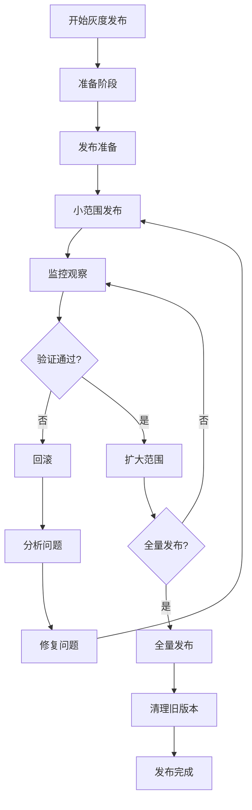
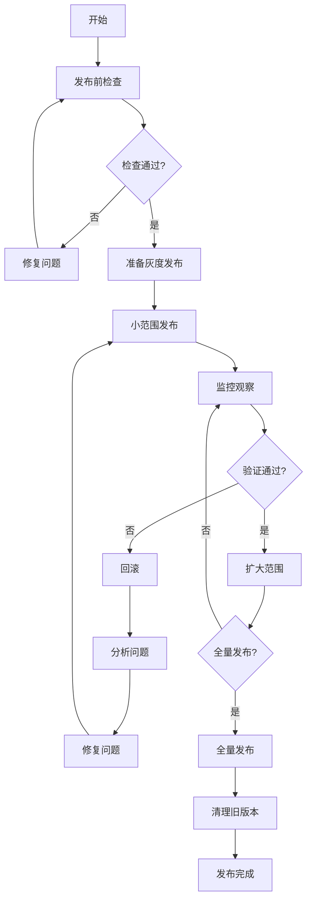

---

**@file**：YYC³-灰度发布风险控制技巧
**@description**：YYC³餐饮行业智能化平台的灰度发布风险控制技巧
**@author**：YYC³
**@version**：v1.0.0
**@created**：2025-01-30
**@updated**：2025-01-30
**@status**：published
**@tags**：YYC³,文档

---
# 🔖 YYC³ 灰度发布风险控制技巧

> ***YanYuCloudCube***
> **标语**：言启象限 | 语枢未来
> ***Words Initiate Quadrants, Language Serves as Core for the Future***
> **标语**：万象归元于云枢 | 深栈智启新纪元
> ***All things converge in the cloud pivot; Deep stacks ignite a new era of intelligence***

---

## 📋 文档信息

| 属性 | 内容 |
|------|------|
| **文档标题** | YYC³ 灰度发布风险控制技巧 |
| **文档类型** | 技巧类文档 |
| **所属阶段** | 部署发布 |
| **遵循规范** | YYC³ 团队标准化规范 v1.0.0 |
| **版本号** | v1.0.0 |
| **创建日期** | 2025-01-30 |
| **作者** | YYC³ Team |
| **更新日期** | 2025-01-30 |

---

## 📑 目录

1. [灰度发布概述](#1-灰度发布概述)
2. [灰度发布策略](#2-灰度发布策略)
3. [流量控制](#3-流量控制)
4. [监控与观察](#4-监控与观察)
5. [回滚机制](#5-回滚机制)
6. [风险控制](#6-风险控制)
7. [自动化工具](#7-自动化工具)
8. [最佳实践](#8-最佳实践)
9. [常见问题](#9-常见问题)
10. [案例分析](#10-案例分析)

---

## 1. 概述

### 1.1 功能说明

### 1.2 技术栈

### 1.3 开发环境

## 2. 实现方案

### 2.1 代码结构

### 2.2 核心逻辑

### 2.3 数据处理

## 3. 接口文档

### 3.1 API接口

### 3.2 请求参数

### 3.3 响应格式

## 4. 测试方案

### 4.1 单元测试

### 4.2 集成测试

### 4.3 测试用例

## 5. 部署指南

### 5.1 环境准备

### 5.2 部署步骤

### 5.3 验证方法

## 6. 常见问题

### 6.1 问题排查

### 6.2 解决方案

## 1. 灰度发布概述

### 1.1 灰度发布定义

**灰度发布**（又称金丝雀发布）是一种软件发布策略，通过将新版本逐步发布给一小部分用户，在验证新版本稳定性和性能后，再逐步扩大发布范围，最终全量发布。

**核心价值**
- 降低发布风险
- 快速发现问题
- 最小化影响范围
- 提高发布信心
- 保障用户体验

### 1.2 灰度发布流程



### 1.3 适用场景

**适合灰度发布的场景**
- 核心业务功能更新
- 架构重大调整
- 性能优化发布
- 安全补丁发布
- 新功能试点

**不适合灰度发布的场景**
- 数据库结构变更
- 配置中心变更
- 依赖服务升级
- 紧急安全修复
- 简单bug修复

---

## 2. 灰度发布策略

### 2.1 流量比例策略

**策略类型**

| 策略 | 描述 | 适用场景 | 风险等级 |
|------|------|----------|----------|
| 固定比例 | 按固定百分比分配流量 | 稳定版本更新 | 低 |
| 逐步递增 | 从小比例逐步增加到全量 | 重要功能发布 | 中 |
| 阶梯式 | 按阶段递增流量 | 复杂系统升级 | 中 |
| 智能调整 | 根据监控指标动态调整 | 性能敏感场景 | 高 |

**固定比例策略**

```yaml
# Istio流量规则
apiVersion: networking.istio.io/v1alpha3
kind: VirtualService
metadata:
  name: yyc3-web
spec:
  hosts:
  - yyc3-web
  http:
  - route:
    - destination:
        host: yyc3-web
        subset: v1
      weight: 90  # 旧版本90%
    - destination:
        host: yyc3-web
        subset: v2
      weight: 10  # 新版本10%
```

**逐步递增策略**

```typescript
// 灰度发布控制器
interface CanaryConfig {
  initialWeight: number;    // 初始流量百分比
  increment: number;        // 每次递增量
  interval: number;         // 递增间隔（分钟）
  maxWeight: number;        // 最大流量百分比
  successThreshold: number; // 成功阈值
}

class CanaryController {
  async executeCanary(config: CanaryConfig) {
    let currentWeight = config.initialWeight;
    
    while (currentWeight <= config.maxWeight) {
      // 更新流量权重
      await this.updateTrafficWeight(currentWeight);
      
      // 等待观察期
      await this.sleep(config.interval * 60 * 1000);
      
      // 检查监控指标
      const metrics = await this.getMetrics();
      
      if (metrics.errorRate > config.successThreshold) {
        throw new Error('灰度发布失败，触发回滚');
      }
      
      // 递增流量
      currentWeight += config.increment;
    }
    
    // 全量发布
    await this.fullRelease();
  }
  
  private async updateTrafficWeight(weight: number) {
    // 更新Istio/Nginx流量配置
    console.log(`流量权重更新为: ${weight}%`);
  }
  
  private async getMetrics() {
    // 获取监控指标
    return {
      errorRate: 0.01,
      responseTime: 100,
      throughput: 1000
    };
  }
  
  private async fullRelease() {
    // 全量发布新版本
    console.log('全量发布完成');
  }
  
  private sleep(ms: number) {
    return new Promise(resolve => setTimeout(resolve, ms));
  }
}
```

### 2.2 用户特征策略

**基于用户标签**

```typescript
// 用户特征路由
interface UserFeature {
  userId: string;
  userType: 'internal' | 'vip' | 'normal';
  region: string;
  device: 'mobile' | 'desktop';
  version: string;
}

class FeatureRouter {
  private canaryUsers: Set<string> = new Set();
  
  // 添加灰度用户
  addCanaryUser(userId: string) {
    this.canaryUsers.add(userId);
  }
  
  // 判断是否路由到新版本
  shouldRouteToCanary(user: UserFeature): boolean {
    // 1. 内部用户优先
    if (user.userType === 'internal') {
      return true;
    }
    
    // 2. VIP用户
    if (user.userType === 'vip' && this.canaryUsers.has(user.userId)) {
      return true;
    }
    
    // 3. 特定地区
    if (user.region === 'test-region') {
      return true;
    }
    
    // 4. 特定设备
    if (user.device === 'mobile') {
      return true;
    }
    
    return false;
  }
  
  // 路由请求
  routeRequest(user: UserFeature): string {
    return this.shouldRouteToCanary(user) ? 'v2' : 'v1';
  }
}
```

**基于用户分群**

```typescript
// 用户分群策略
interface UserSegment {
  name: string;
  criteria: (user: UserFeature) => boolean;
  canaryPercentage: number;
}

class SegmentCanary {
  private segments: UserSegment[] = [
    {
      name: 'internal',
      criteria: (user) => user.userType === 'internal',
      canaryPercentage: 100
    },
    {
      name: 'vip',
      criteria: (user) => user.userType === 'vip',
      canaryPercentage: 20
    },
    {
      name: 'mobile',
      criteria: (user) => user.device === 'mobile',
      canaryPercentage: 10
    },
    {
      name: 'normal',
      criteria: (user) => user.userType === 'normal',
      canaryPercentage: 5
    }
  ];
  
  // 根据分群路由
  routeBySegment(user: UserFeature): string {
    const segment = this.segments.find(seg => seg.criteria(user));
    
    if (!segment) {
      return 'v1';
    }
    
    // 使用用户ID哈希确保一致性
    const hash = this.hashUserId(user.userId);
    const shouldRoute = hash < segment.canaryPercentage;
    
    return shouldRoute ? 'v2' : 'v1';
  }
  
  private hashUserId(userId: string): number {
    // 简单哈希函数
    let hash = 0;
    for (let i = 0; i < userId.length; i++) {
      hash = ((hash << 5) - hash) + userId.charCodeAt(i);
      hash |= 0;
    }
    return Math.abs(hash) % 100;
  }
}
```

### 2.3 Header路由策略

**基于HTTP Header**

```yaml
# Istio Header路由
apiVersion: networking.istio.io/v1alpha3
kind: VirtualService
metadata:
  name: yyc3-web
spec:
  hosts:
  - yyc3-web
  http:
  # 灰度流量
  - match:
    - headers:
        x-canary:
          exact: "true"
    route:
    - destination:
        host: yyc3-web
        subset: v2
  # 正常流量
  - route:
    - destination:
        host: yyc3-web
        subset: v1
```

**Nginx Header路由**

```nginx
# Nginx灰度发布配置
upstream yyc3_v1 {
    server yyc3-web-v1:3200;
}

upstream yyc3_v2 {
    server yyc3-web-v2:3200;
}

server {
    listen 80;
    server_name yyc3.example.com;
    
    location / {
        # 检查灰度Header
        if ($http_x_canary = "true") {
            proxy_pass http://yyc3_v2;
            break;
        }
        
        # 默认路由到v1
        proxy_pass http://yyc3_v1;
        
        # 代理头设置
        proxy_set_header Host $host;
        proxy_set_header X-Real-IP $remote_addr;
        proxy_set_header X-Forwarded-For $proxy_add_x_forwarded_for;
    }
}
```

---

## 3. 流量控制

### 3.1 Kubernetes流量控制

**Service流量控制**

```yaml
# 多版本Service
apiVersion: v1
kind: Service
metadata:
  name: yyc3-web
spec:
  selector:
    app: yyc3-web
  ports:
  - port: 3200
    targetPort: 3200
---
apiVersion: v1
kind: Service
metadata:
  name: yyc3-web-canary
spec:
  selector:
    app: yyc3-web
    version: v2
  ports:
  - port: 3200
    targetPort: 3200
```

**Ingress流量控制**

```yaml
# Ingress灰度配置
apiVersion: networking.k8s.io/v1
kind: Ingress
metadata:
  name: yyc3-web
  annotations:
    nginx.ingress.kubernetes.io/canary: "true"
    nginx.ingress.kubernetes.io/canary-weight: "10"
spec:
  rules:
  - host: yyc3.example.com
    http:
      paths:
      - path: /
        pathType: Prefix
        backend:
          service:
            name: yyc3-web-canary
            port:
              number: 3200
```

### 3.2 应用层流量控制

**Next.js应用层路由**

```typescript
// app/api/feature-flag/route.ts
import { NextRequest, NextResponse } from 'next/server';

interface FeatureFlag {
  name: string;
  enabled: boolean;
  percentage: number;
  whitelistedUsers: string[];
}

class FeatureFlagService {
  private flags: Map<string, FeatureFlag> = new Map();
  
  constructor() {
    // 初始化功能开关
    this.flags.set('new-ui', {
      name: 'new-ui',
      enabled: true,
      percentage: 10,
      whitelistedUsers: ['user1', 'user2']
    });
  }
  
  // 检查功能是否启用
  isFeatureEnabled(featureName: string, userId: string): boolean {
    const flag = this.flags.get(featureName);
    
    if (!flag || !flag.enabled) {
      return false;
    }
    
    // 白名单用户
    if (flag.whitelistedUsers.includes(userId)) {
      return true;
    }
    
    // 基于百分比
    const hash = this.hashUserId(userId);
    return hash < flag.percentage;
  }
  
  private hashUserId(userId: string): number {
    let hash = 0;
    for (let i = 0; i < userId.length; i++) {
      hash = ((hash << 5) - hash) + userId.charCodeAt(i);
      hash |= 0;
    }
    return Math.abs(hash) % 100;
  }
}

export async function GET(request: NextRequest) {
  const featureFlagService = new FeatureFlagService();
  const userId = request.headers.get('x-user-id') || 'anonymous';
  const featureName = request.nextUrl.searchParams.get('feature');
  
  if (!featureName) {
    return NextResponse.json({ error: 'Feature name required' }, { status: 400 });
  }
  
  const enabled = featureFlagService.isFeatureEnabled(featureName, userId);
  
  return NextResponse.json({
    feature: featureName,
    enabled,
    userId
  });
}
```

**中间件流量控制**

```typescript
// middleware.ts
import { NextRequest, NextResponse } from 'next/server';

class CanaryMiddleware {
  private canaryPercentage = 10;
  private canaryUsers = new Set(['user1', 'user2', 'user3']);
  
  // 判断是否路由到灰度版本
  shouldRouteToCanary(userId: string): boolean {
    // 白名单用户
    if (this.canaryUsers.has(userId)) {
      return true;
    }
    
    // 基于百分比
    const hash = this.hashUserId(userId);
    return hash < this.canaryPercentage;
  }
  
  private hashUserId(userId: string): number {
    let hash = 0;
    for (let i = 0; i < userId.length; i++) {
      hash = ((hash << 5) - hash) + userId.charCodeAt(i);
      hash |= 0;
    }
    return Math.abs(hash) % 100;
  }
}

export function middleware(request: NextRequest) {
  const canaryMiddleware = new CanaryMiddleware();
  const userId = request.headers.get('x-user-id') || 'anonymous';
  
  // 添加灰度标记
  const response = NextResponse.next();
  
  if (canaryMiddleware.shouldRouteToCanary(userId)) {
    response.headers.set('x-canary', 'true');
  }
  
  return response;
}
```

### 3.3 数据库流量控制

**读写分离**

```yaml
# 数据库读写分离配置
apiVersion: v1
kind: ConfigMap
metadata:
  name: database-config
data:
  config.yaml: |
    databases:
      primary:
        host: postgres-primary.yyc3.svc.cluster.local
        port: 5432
        database: yyc3
        mode: read-write
      replica:
        host: postgres-replica.yyc3.svc.cluster.local
        port: 5432
        database: yyc3
        mode: read-only
      canary:
        host: postgres-canary.yyc3.svc.cluster.local
        port: 5432
        database: yyc3
        mode: read-write
```

**数据库路由**

```typescript
// lib/database-router.ts
interface DatabaseConfig {
  host: string;
  port: number;
  database: string;
  mode: 'read-write' | 'read-only';
}

class DatabaseRouter {
  private primary: DatabaseConfig;
  private replica: DatabaseConfig;
  private canary: DatabaseConfig;
  
  constructor(primary: DatabaseConfig, replica: DatabaseConfig, canary: DatabaseConfig) {
    this.primary = primary;
    this.replica = replica;
    this.canary = canary;
  }
  
  // 获取数据库连接
  getConnection(isCanary: boolean, isReadOnly: boolean): DatabaseConfig {
    if (isCanary) {
      return this.canary;
    }
    
    if (isReadOnly) {
      return this.replica;
    }
    
    return this.primary;
  }
  
  // 执行查询
  async query(sql: string, isCanary: boolean, isReadOnly: boolean) {
    const db = this.getConnection(isCanary, isReadOnly);
    // 执行数据库查询
    console.log(`Executing query on ${db.host}:${db.port}`);
    return {};
  }
}
```

---

## 4. 监控与观察

### 4.1 监控指标

**核心指标**

| 指标类型 | 指标名称 | 阈值 | 说明 |
|---------|---------|------|------|
| 可用性 | 错误率 | < 0.1% | HTTP 5xx错误比例 |
| 性能 | 响应时间 | < 200ms | P95响应时间 |
| 性能 | 吞吐量 | > 1000 RPS | 每秒请求数 |
| 资源 | CPU使用率 | < 80% | 容器CPU使用率 |
| 资源 | 内存使用率 | < 80% | 容器内存使用率 |
| 业务 | 转化率 | 无明显下降 | 业务转化率 |
| 业务 | 用户留存 | 无明显下降 | 用户留存率 |

**Prometheus监控规则**

```yaml
# prometheus-rules.yaml
apiVersion: monitoring.coreos.com/v1
kind: PrometheusRule
metadata:
  name: canary-monitoring
  namespace: monitoring
spec:
  groups:
  - name: canary.rules
    rules:
    # 错误率监控
    - alert: HighErrorRate
      expr: |
        (
          sum(rate(http_requests_total{status=~"5..", version="v2"}[5m])) /
          sum(rate(http_requests_total{version="v2"}[5m]))
        ) > 0.01
      for: 5m
      labels:
        severity: critical
        canary: "true"
      annotations:
        summary: "灰度版本错误率过高"
        description: "灰度版本错误率超过1%: {{ $value | humanizePercentage }}"
    
    # 响应时间监控
    - alert: HighResponseTime
      expr: |
        histogram_quantile(0.95,
          sum(rate(http_request_duration_seconds_bucket{version="v2"}[5m])) by (le)
        ) > 0.2
      for: 5m
      labels:
        severity: warning
        canary: "true"
      annotations:
        summary: "灰度版本响应时间过长"
        description: "灰度版本P95响应时间超过200ms: {{ $value }}s"
    
    # 资源使用监控
    - alert: HighResourceUsage
      expr: |
        container_memory_usage_bytes{version="v2"} /
        container_spec_memory_limit_bytes{version="v2"} > 0.8
      for: 5m
      labels:
        severity: warning
        canary: "true"
      annotations:
        summary: "灰度版本资源使用过高"
        description: "灰度版本内存使用超过80%: {{ $value | humanizePercentage }}"
```

### 4.2 告警规则

**告警配置**

```yaml
# alertmanager-config.yaml
apiVersion: v1
kind: ConfigMap
metadata:
  name: alertmanager-config
  namespace: monitoring
data:
  alertmanager.yaml: |
    global:
      resolve_timeout: 5m
    
    route:
      group_by: ['alertname', 'canary']
      group_wait: 10s
      group_interval: 10s
      repeat_interval: 5m
      receiver: 'default'
      
      routes:
      - match:
          canary: "true"
        receiver: 'canary-alerts'
      
    receivers:
    - name: 'default'
      slack_configs:
      - api_url: 'https://hooks.slack.com/services/XXX/YYY/ZZZ'
        channel: '#alerts'
    
    - name: 'canary-alerts'
      slack_configs:
      - api_url: 'https://hooks.slack.com/services/XXX/YYY/ZZZ'
        channel: '#canary-alerts'
        title: '🚨 灰度发布告警: {{ .GroupLabels.alertname }}'
        text: |
          {{ range .Alerts }}
          **告警**: {{ .Annotations.summary }}
          **描述**: {{ .Annotations.description }}
          **严重性**: {{ .Labels.severity }}
          **时间**: {{ .StartsAt.Format "2006-01-02 15:04:05" }}
          {{ end }}
      
      email_configs:
      - to: 'admin@0379.email'
        from: 'alertmanager@yyc3.com'
        headers:
          Subject: '🚨 灰度发布告警: {{ .GroupLabels.alertname }}'
```

### 4.3 日志分析

**日志收集**

```yaml
# fluentd-config.yaml
apiVersion: v1
kind: ConfigMap
metadata:
  name: fluentd-config
  namespace: logging
data:
  fluent.conf: |
    <source>
      @type tail
      path /var/log/containers/*.log
      pos_file /var/log/fluentd-containers.log.pos
      tag kubernetes.*
      read_from_head true
      <parse>
        @type json
      </parse>
    </source>
    
    <filter kubernetes.**>
      @type kubernetes_metadata
    </filter>
    
    <filter kubernetes.**>
      @type grep
      <regexp>
        key $.kubernetes.labels.version
        pattern /^v2$/
      </regexp>
    </filter>
    
    <match kubernetes.**>
      @type elasticsearch
      host elasticsearch.logging.svc.cluster.local
      port 9200
      logstash_format true
      logstash_prefix canary-logs
      <buffer>
        @type file
        path /var/log/fluentd-buffers/kubernetes.system.buffer
        flush_mode interval
        flush_interval 5s
      </buffer>
    </match>
```

**日志分析脚本**

```bash
#!/bin/bash

# 灰度发布日志分析脚本

NAMESPACE=${1:-"yyc3-production"}
VERSION=${2:-"v2"}

echo "=== 灰度发布日志分析 ==="
echo "命名空间: $NAMESPACE"
echo "版本: $VERSION"
echo ""

# 1. 查看错误日志
echo "1. 错误日志..."
kubectl logs -n $NAMESPACE -l version=$VERSION --tail=100 | grep -i "error\|exception" || echo "没有发现错误"

# 2. 查看警告日志
echo ""
echo "2. 警告日志..."
kubectl logs -n $NAMESPACE -l version=$VERSION --tail=100 | grep -i "warning" || echo "没有发现警告"

# 3. 统计错误数量
echo ""
echo "3. 错误统计..."
ERROR_COUNT=$(kubectl logs -n $NAMESPACE -l version=$VERSION | grep -i "error" | wc -l)
echo "错误总数: $ERROR_COUNT"

# 4. 统计响应时间
echo ""
echo "4. 响应时间统计..."
kubectl logs -n $NAMESPACE -l version=$VERSION | grep "duration" | awk -F'duration=' '{print $2}' | awk '{sum+=$1; count++} END {print "平均响应时间:", sum/count, "ms"}'

# 5. 统计请求量
echo ""
echo "5. 请求量统计..."
REQUEST_COUNT=$(kubectl logs -n $NAMESPACE -l version=$VERSION | grep "request" | wc -l)
echo "总请求数: $REQUEST_COUNT"

# 6. 生成日志报告
echo ""
echo "6. 生成日志报告..."
cat > canary-log-report.md << EOF
# 灰度发布日志报告

## 基本信息
- 命名空间: $NAMESPACE
- 版本: $VERSION
- 分析时间: $(date)

## 统计数据
- 错误总数: $ERROR_COUNT
- 总请求数: $REQUEST_COUNT
- 错误率: $(echo "scale=2; $ERROR_COUNT * 100 / $REQUEST_COUNT" | bc)%

## 详细日志
EOF

echo "日志报告已生成: canary-log-report.md"
```

---

## 5. 回滚机制

### 5.1 自动回滚

**Prometheus自动回滚**

```yaml
# 自动回滚规则
apiVersion: monitoring.coreos.com/v1
kind: PrometheusRule
metadata:
  name: auto-rollback
  namespace: monitoring
spec:
  groups:
  - name: rollback.rules
    rules:
    # 错误率触发回滚
    - alert: AutoRollbackOnError
      expr: |
        (
          sum(rate(http_requests_total{status=~"5..", version="v2"}[5m])) /
          sum(rate(http_requests_total{version="v2"}[5m]))
        ) > 0.05
      for: 10m
      labels:
        severity: critical
        action: rollback
      annotations:
        summary: "触发自动回滚"
        description: "灰度版本错误率超过5%，触发自动回滚"
```

**自动回滚脚本**

```bash
#!/bin/bash

# 自动回滚脚本

NAMESPACE=${1:-"yyc3-production"}
DEPLOYMENT=${2:-"yyc3-web"}

echo "=== 自动回滚 ==="
echo "命名空间: $NAMESPACE"
echo "部署: $DEPLOYMENT"
echo ""

# 1. 检查当前版本
echo "1. 检查当前版本..."
kubectl get deployment $DEPLOYMENT -n $NAMESPACE -o jsonpath='{.spec.template.metadata.labels.version}'

# 2. 获取回滚历史
echo ""
echo "2. 获取回滚历史..."
kubectl rollout history deployment/$DEPLOYMENT -n $NAMESPACE

# 3. 执行回滚
echo ""
echo "3. 执行回滚..."
kubectl rollout undo deployment/$DEPLOYMENT -n $NAMESPACE

# 4. 等待回滚完成
echo ""
echo "4. 等待回滚完成..."
kubectl rollout status deployment/$DEPLOYMENT -n $NAMESPACE --timeout=5m

# 5. 验证回滚
echo ""
echo "5. 验证回滚..."
kubectl get pods -n $NAMESPACE -l app=$DEPLOYMENT

echo ""
echo "=== 回滚完成 ==="
```

### 5.2 手动回滚

**回滚命令**

```bash
#!/bin/bash

# 手动回滚脚本

NAMESPACE=${1:-"yyc3-production"}
DEPLOYMENT=${2:-"yyc3-web"}
REVISION=${3:-""}

echo "=== 手动回滚 ==="
echo "命名空间: $NAMESPACE"
echo "部署: $DEPLOYMENT"
echo "版本: $REVISION"
echo ""

# 1. 确认回滚
read -p "确认要回滚吗? (y/n) " -n 1 -r
echo
if [[ ! $REPLY =~ ^[Yy]$ ]]; then
  echo "取消回滚"
  exit 1
fi

# 2. 查看回滚历史
echo "回滚历史:"
kubectl rollout history deployment/$DEPLOYMENT -n $NAMESPACE

# 3. 执行回滚
if [ -z "$REVISION" ]; then
  echo "回滚到上一个版本..."
  kubectl rollout undo deployment/$DEPLOYMENT -n $NAMESPACE
else
  echo "回滚到版本 $REVISION..."
  kubectl rollout undo deployment/$DEPLOYMENT -n $NAMESPACE --to-revision=$REVISION
fi

# 4. 等待回滚完成
echo "等待回滚完成..."
kubectl rollout status deployment/$DEPLOYMENT -n $NAMESPACE --timeout=5m

# 5. 验证回滚
echo "验证回滚..."
kubectl get pods -n $NAMESPACE -l app=$DEPLOYMENT

echo ""
echo "=== 回滚完成 ==="
```

### 5.3 数据库回滚

**数据库迁移回滚**

```typescript
// lib/database-migration.ts
interface Migration {
  version: string;
  name: string;
  up: () => Promise<void>;
  down: () => Promise<void>;
}

class DatabaseMigration {
  private migrations: Migration[] = [];
  private currentVersion: string = 'v1';
  
  // 注册迁移
  registerMigration(migration: Migration) {
    this.migrations.push(migration);
  }
  
  // 执行迁移
  async migrate(targetVersion: string) {
    const currentIndex = this.migrations.findIndex(m => m.version === this.currentVersion);
    const targetIndex = this.migrations.findIndex(m => m.version === targetVersion);
    
    if (currentIndex === -1 || targetIndex === -1) {
      throw new Error('Invalid version');
    }
    
    if (targetIndex > currentIndex) {
      // 向前迁移
      for (let i = currentIndex + 1; i <= targetIndex; i++) {
        await this.migrations[i].up();
        console.log(`Migration ${this.migrations[i].version} completed`);
      }
    } else if (targetIndex < currentIndex) {
      // 向后回滚
      for (let i = currentIndex; i > targetIndex; i--) {
        await this.migrations[i].down();
        console.log(`Rollback ${this.migrations[i].version} completed`);
      }
    }
    
    this.currentVersion = targetVersion;
  }
  
  // 回滚到指定版本
  async rollback(targetVersion: string) {
    console.log(`Rolling back from ${this.currentVersion} to ${targetVersion}`);
    await this.migrate(targetVersion);
    console.log('Rollback completed');
  }
}
```

---

## 6. 风险控制

### 6.1 风险评估

**风险矩阵**

| 影响程度 | 概率 | 风险等级 | 应对措施 |
|---------|------|---------|---------|
| 高 | 高 | 严重 | 立即回滚，详细分析 |
| 高 | 中 | 高 | 准备回滚，密切监控 |
| 高 | 低 | 中 | 增加监控，准备预案 |
| 中 | 高 | 高 | 准备回滚，增加观察 |
| 中 | 中 | 中 | 正常监控，定期检查 |
| 中 | 低 | 低 | 常规监控 |
| 低 | 高 | 中 | 增加监控 |
| 低 | 中 | 低 | 常规监控 |
| 低 | 低 | 低 | 无需特殊处理 |

**风险评估脚本**

```typescript
// lib/risk-assessment.ts
interface RiskFactor {
  name: string;
  impact: 'high' | 'medium' | 'low';
  probability: 'high' | 'medium' | 'low';
  mitigation: string;
}

class RiskAssessment {
  private riskFactors: RiskFactor[] = [
    {
      name: '性能下降',
      impact: 'high',
      probability: 'medium',
      mitigation: '准备回滚，监控性能指标'
    },
    {
      name: '错误率上升',
      impact: 'high',
      probability: 'low',
      mitigation: '设置告警，准备回滚'
    },
    {
      name: '数据不一致',
      impact: 'high',
      probability: 'low',
      mitigation: '数据备份，准备回滚'
    },
    {
      name: '兼容性问题',
      impact: 'medium',
      probability: 'medium',
      mitigation: '兼容性测试，灰度验证'
    }
  ];
  
  // 评估风险等级
  assessRiskLevel(factor: RiskFactor): string {
    const impactScore = this.getScore(factor.impact);
    const probabilityScore = this.getScore(factor.probability);
    const totalScore = impactScore * probabilityScore;
    
    if (totalScore >= 9) {
      return '严重';
    } else if (totalScore >= 6) {
      return '高';
    } else if (totalScore >= 3) {
      return '中';
    } else {
      return '低';
    }
  }
  
  private getScore(level: string): number {
    switch (level) {
      case 'high': return 3;
      case 'medium': return 2;
      case 'low': return 1;
      default: return 0;
    }
  }
  
  // 生成风险评估报告
  generateReport(): string {
    let report = '# 灰度发布风险评估报告\n\n';
    report += `评估时间: ${new Date().toISOString()}\n\n`;
    report += '## 风险因素\n\n';
    
    this.riskFactors.forEach(factor => {
      const level = this.assessRiskLevel(factor);
      report += `### ${factor.name}\n`;
      report += `- 影响程度: ${factor.impact}\n`;
      report += `- 发生概率: ${factor.probability}\n`;
      report += `- 风险等级: ${level}\n`;
      report += `- 应对措施: ${factor.mitigation}\n\n`;
    });
    
    return report;
  }
}
```

### 6.2 熔断机制

**熔断配置**

```yaml
# Hystrix熔断配置
apiVersion: v1
kind: ConfigMap
metadata:
  name: circuit-breaker-config
data:
  config.yaml: |
    circuitBreakers:
      yyc3-web:
        enabled: true
        requestVolumeThreshold: 20
        errorThresholdPercentage: 50
        sleepWindowInMilliseconds: 5000
        timeoutInMilliseconds: 3000
```

**熔断实现**

```typescript
// lib/circuit-breaker.ts
interface CircuitBreakerConfig {
  failureThreshold: number;
  successThreshold: number;
  timeout: number;
  resetTimeout: number;
}

enum CircuitState {
  CLOSED = 'CLOSED',
  OPEN = 'OPEN',
  HALF_OPEN = 'HALF_OPEN'
}

class CircuitBreaker {
  private state: CircuitState = CircuitState.CLOSED;
  private failureCount = 0;
  private successCount = 0;
  private lastFailureTime = 0;
  private config: CircuitBreakerConfig;
  
  constructor(config: CircuitBreakerConfig) {
    this.config = config;
  }
  
  // 执行请求
  async execute<T>(fn: () => Promise<T>): Promise<T> {
    if (this.state === CircuitState.OPEN) {
      if (this.shouldAttemptReset()) {
        this.state = CircuitState.HALF_OPEN;
      } else {
        throw new Error('Circuit breaker is OPEN');
      }
    }
    
    try {
      const result = await fn();
      this.onSuccess();
      return result;
    } catch (error) {
      this.onFailure();
      throw error;
    }
  }
  
  private onSuccess() {
    if (this.state === CircuitState.HALF_OPEN) {
      this.successCount++;
      if (this.successCount >= this.config.successThreshold) {
        this.state = CircuitState.CLOSED;
        this.failureCount = 0;
        this.successCount = 0;
      }
    } else {
      this.failureCount = 0;
    }
  }
  
  private onFailure() {
    this.failureCount++;
    this.lastFailureTime = Date.now();
    
    if (this.failureCount >= this.config.failureThreshold) {
      this.state = CircuitState.OPEN;
    }
  }
  
  private shouldAttemptReset(): boolean {
    return Date.now() - this.lastFailureTime >= this.config.resetTimeout;
  }
  
  getState(): CircuitState {
    return this.state;
  }
}
```

### 6.3 限流控制

**限流配置**

```yaml
# 限流配置
apiVersion: v1
kind: ConfigMap
metadata:
  name: rate-limit-config
data:
  config.yaml: |
    rateLimits:
      yyc3-web:
        requestsPerSecond: 1000
        burst: 100
        windowSize: 1
```

**限流实现**

```typescript
// lib/rate-limiter.ts
interface RateLimitConfig {
  requestsPerSecond: number;
  burst: number;
  windowSize: number;
}

class RateLimiter {
  private tokens: number;
  private lastRefillTime: number;
  private config: RateLimitConfig;
  
  constructor(config: RateLimitConfig) {
    this.config = config;
    this.tokens = config.burst;
    this.lastRefillTime = Date.now();
  }
  
  // 尝试获取令牌
  tryAcquire(): boolean {
    this.refill();
    
    if (this.tokens >= 1) {
      this.tokens--;
      return true;
    }
    
    return false;
  }
  
  // 等待获取令牌
  async acquire(): Promise<void> {
    while (!this.tryAcquire()) {
      await this.sleep(10);
    }
  }
  
  private refill() {
    const now = Date.now();
    const elapsed = (now - this.lastRefillTime) / 1000;
    const tokensToAdd = elapsed * this.config.requestsPerSecond;
    
    this.tokens = Math.min(
      this.tokens + tokensToAdd,
      this.config.burst
    );
    
    this.lastRefillTime = now;
  }
  
  private sleep(ms: number): Promise<void> {
    return new Promise(resolve => setTimeout(resolve, ms));
  }
}
```

---

## 7. 自动化工具

### 7.1 Argo Rollouts

**Argo Rollouts配置**

```yaml
# rollout.yaml
apiVersion: argoproj.io/v1alpha1
kind: Rollout
metadata:
  name: yyc3-web
spec:
  replicas: 5
  strategy:
    canary:
      steps:
      - setWeight: 10
      - pause: {duration: 10m}
      - setWeight: 30
      - pause: {duration: 10m}
      - setWeight: 50
      - pause: {duration: 10m}
      - setWeight: 100
      analysis:
        templates:
        - templateName: success-rate
        args:
        - name: service-name
          value: yyc3-web
  selector:
    matchLabels:
      app: yyc3-web
  template:
    metadata:
      labels:
        app: yyc3-web
    spec:
      containers:
      - name: web
        image: yyc3-web:v2
        ports:
        - containerPort: 3200
```

**分析模板**

```yaml
# analysis-template.yaml
apiVersion: argoproj.io/v1alpha1
kind: AnalysisTemplate
metadata:
  name: success-rate
spec:
  args:
  - name: service-name
  metrics:
  - name: success-rate
    interval: 5m
    count: 10
    successCondition: result[0] >= 0.95
    failureLimit: 3
    provider:
      prometheus:
        address: http://prometheus.monitoring.svc.cluster.local:9090
        query: |
          sum(rate(http_requests_total{service="{{args.service-name}}",status!~"5.."}[5m])) /
          sum(rate(http_requests_total{service="{{args.service-name}}"}[5m]))
```

### 7.2 Flagger

**Flagger配置**

```yaml
# canary.yaml
apiVersion: flagger.app/v1beta1
kind: Canary
metadata:
  name: yyc3-web
spec:
  targetRef:
    apiVersion: apps/v1
    kind: Deployment
    name: yyc3-web
  service:
    port: 3200
    targetPort: 3200
  analysis:
    interval: 1m
    threshold: 10
    maxWeight: 50
    stepWeight: 10
    metrics:
    - name: request-success-rate
      thresholdRange:
        min: 99
      interval: 1m
    - name: request-duration
      thresholdRange:
        max: 500
      interval: 1m
    webhooks:
    - name: load-test
      url: http://flagger-loadtester/
      timeout: 5s
      metadata:
        cmd: "hey -z 1m -q 10 -c 2 http://yyc3-web-canary:3200/"
```

### 7.3 自定义自动化工具

**灰度发布控制器**

```typescript
// lib/canary-controller.ts
interface CanaryConfig {
  deployment: string;
  namespace: string;
  initialWeight: number;
  increment: number;
  interval: number;
  maxWeight: number;
  successThreshold: {
    errorRate: number;
    responseTime: number;
  };
}

class CanaryController {
  private config: CanaryConfig;
  private currentWeight = 0;
  
  constructor(config: CanaryConfig) {
    this.config = config;
  }
  
  // 执行灰度发布
  async execute() {
    this.currentWeight = this.config.initialWeight;
    
    while (this.currentWeight <= this.config.maxWeight) {
      // 更新流量权重
      await this.updateWeight(this.currentWeight);
      
      // 等待观察期
      await this.sleep(this.config.interval * 60 * 1000);
      
      // 检查指标
      const metrics = await this.checkMetrics();
      
      if (!this.validateMetrics(metrics)) {
        // 回滚
        await this.rollback();
        throw new Error('灰度发布失败');
      }
      
      // 递增权重
      this.currentWeight += this.config.increment;
    }
    
    // 全量发布
    await this.fullRelease();
  }
  
  private async updateWeight(weight: number) {
    // 更新Istio/Nginx流量配置
    console.log(`流量权重更新为: ${weight}%`);
  }
  
  private async checkMetrics() {
    // 获取Prometheus指标
    return {
      errorRate: 0.01,
      responseTime: 100
    };
  }
  
  private validateMetrics(metrics: any): boolean {
    return metrics.errorRate < this.config.successThreshold.errorRate &&
           metrics.responseTime < this.config.successThreshold.responseTime;
  }
  
  private async rollback() {
    console.log('执行回滚...');
    // 回滚到旧版本
  }
  
  private async fullRelease() {
    console.log('全量发布...');
    // 全量发布新版本
  }
  
  private sleep(ms: number) {
    return new Promise(resolve => setTimeout(resolve, ms));
  }
}
```

---

## 8. 最佳实践

### 8.1 发布前检查

**检查清单**

```bash
#!/bin/bash

# 发布前检查脚本

echo "=== 灰度发布前检查 ==="

# 1. 检查代码质量
echo "1. 检查代码质量..."
npm run lint
npm run test

# 2. 检查镜像
echo ""
echo "2. 检查镜像..."
docker images yyc3-web:v2

# 3. 检查配置
echo ""
echo "3. 检查配置..."
kubectl get configmap -n yyc3-production
kubectl get secret -n yyc3-production

# 4. 检查依赖
echo ""
echo "4. 检查依赖..."
kubectl get pods -n yyc3-production

# 5. 检查监控
echo ""
echo "5. 检查监控..."
kubectl get pods -n monitoring

# 6. 检查告警
echo ""
echo "6. 检查告警..."
kubectl get prometheusrule -n monitoring

echo ""
echo "=== 检查完成 ==="
```

### 8.2 发布流程

**标准流程**



**发布脚本**

```bash
#!/bin/bash

# 灰度发布脚本

NAMESPACE=${1:-"yyc3-production"}
DEPLOYMENT=${2:-"yyc3-web"}
IMAGE=${3:-"yyc3-web:v2"}

echo "=== 灰度发布 ==="
echo "命名空间: $NAMESPACE"
echo "部署: $DEPLOYMENT"
echo "镜像: $IMAGE"
echo ""

# 1. 发布前检查
echo "1. 发布前检查..."
./pre-release-check.sh

# 2. 创建灰度部署
echo ""
echo "2. 创建灰度部署..."
kubectl apply -f canary-deployment.yaml

# 3. 配置流量
echo ""
echo "3. 配置流量..."
kubectl apply -f canary-traffic.yaml

# 4. 监控观察
echo ""
echo "4. 监控观察..."
./monitor-canary.sh

# 5. 扩大范围
echo ""
echo "5. 扩大范围..."
kubectl patch virtualservice yyc3-web -p '{"spec":{"http":[{"route":[{"destination":{"host":"yyc3-web","subset":"v2"},"weight":30},{"destination":{"host":"yyc3-web","subset":"v1"},"weight":70}]}]}}'

# 6. 全量发布
echo ""
echo "6. 全量发布..."
kubectl set image deployment/$DEPLOYMENT web=$IMAGE -n $NAMESPACE

# 7. 清理灰度
echo ""
echo "7. 清理灰度..."
kubectl delete -f canary-deployment.yaml

echo ""
echo "=== 发布完成 ==="
```

### 8.3 验证脚本

**验证脚本**

```bash
#!/bin/bash

# 灰度发布验证脚本

NAMESPACE=${1:-"yyc3-production"}
DEPLOYMENT=${2:-"yyc3-web"}

echo "=== 灰度发布验证 ==="
echo "命名空间: $NAMESPACE"
echo "部署: $DEPLOYMENT"
echo ""

# 1. 检查Pod状态
echo "1. 检查Pod状态..."
kubectl get pods -n $NAMESPACE -l app=$DEPLOYMENT

# 2. 检查服务状态
echo ""
echo "2. 检查服务状态..."
kubectl get svc -n $NAMESPACE

# 3. 检查流量
echo ""
echo "3. 检查流量..."
kubectl get virtualservice -n $NAMESPACE

# 4. 检查指标
echo ""
echo "4. 检查指标..."
kubectl top pods -n $NAMESPACE

# 5. 测试服务
echo ""
echo "5. 测试服务..."
curl -I http://yyc3.example.com/health

# 6. 检查日志
echo ""
echo "6. 检查日志..."
kubectl logs -n $NAMESPACE -l app=$DEPLOYMENT --tail=50

echo ""
echo "=== 验证完成 ==="
```

---

## 9. 常见问题

### 9.1 流量分配不均

**问题描述**
- 灰度流量比例不准确
- 某些用户总是访问新版本
- 流量分配不符合预期

**解决方案**

```typescript
// 一致性哈希流量分配
class ConsistentHashRouter {
  private ring: Map<number, string> = new Map();
  private virtualNodes = 150;
  
  // 添加节点
  addNode(node: string) {
    for (let i = 0; i < this.virtualNodes; i++) {
      const hash = this.hash(`${node}:${i}`);
      this.ring.set(hash, node);
    }
  }
  
  // 获取节点
  getNode(key: string): string {
    if (this.ring.size === 0) {
      throw new Error('No nodes available');
    }
    
    const hash = this.hash(key);
    const sortedHashes = Array.from(this.ring.keys()).sort((a, b) => a - b);
    
    for (const ringHash of sortedHashes) {
      if (ringHash >= hash) {
        return this.ring.get(ringHash)!;
      }
    }
    
    return this.ring.get(sortedHashes[0])!;
  }
  
  private hash(str: string): number {
    let hash = 0;
    for (let i = 0; i < str.length; i++) {
      hash = ((hash << 5) - hash) + str.charCodeAt(i);
      hash |= 0;
    }
    return Math.abs(hash);
  }
}
```

### 9.2 监控指标不准确

**问题描述**
- 监控指标延迟
- 指标数据不准确
- 告警误报

**解决方案**

```typescript
// 指标采集优化
class MetricsCollector {
  private metrics: Map<string, number[]> = new Map();
  private windowSize = 60; // 60秒窗口
  
  // 记录指标
  recordMetric(name: string, value: number) {
    if (!this.metrics.has(name)) {
      this.metrics.set(name, []);
    }
    
    const values = this.metrics.get(name)!;
    values.push({ value, timestamp: Date.now() });
    
    // 清理过期数据
    const now = Date.now();
    while (values.length > 0 && now - values[0].timestamp > this.windowSize * 1000) {
      values.shift();
    }
  }
  
  // 计算平均值
  getAverage(name: string): number {
    const values = this.metrics.get(name);
    if (!values || values.length === 0) {
      return 0;
    }
    
    const sum = values.reduce((acc, curr) => acc + curr.value, 0);
    return sum / values.length;
  }
  
  // 计算P95
  getP95(name: string): number {
    const values = this.metrics.get(name);
    if (!values || values.length === 0) {
      return 0;
    }
    
    const sorted = values.map(v => v.value).sort((a, b) => a - b);
    const index = Math.floor(sorted.length * 0.95);
    return sorted[index];
  }
}
```

### 9.3 回滚失败

**问题描述**
- 回滚命令执行失败
- 回滚后问题依然存在
- 无法回滚到指定版本

**解决方案**

```bash
#!/bin/bash

# 强制回滚脚本

NAMESPACE=${1:-"yyc3-production"}
DEPLOYMENT=${2:-"yyc3-web"}
REVISION=${3:-""}

echo "=== 强制回滚 ==="

# 1. 检查回滚历史
echo "1. 检查回滚历史..."
kubectl rollout history deployment/$DEPLOYMENT -n $NAMESPACE

# 2. 删除当前Pod
echo ""
echo "2. 删除当前Pod..."
kubectl delete pods -n $NAMESPACE -l app=$DEPLOYMENT

# 3. 修改镜像
echo ""
echo "3. 修改镜像..."
kubectl set image deployment/$DEPLOYMENT web=yyc3-web:v1 -n $NAMESPACE

# 4. 等待就绪
echo ""
echo "4. 等待就绪..."
kubectl rollout status deployment/$DEPLOYMENT -n $NAMESPACE --timeout=5m

# 5. 验证
echo ""
echo "5. 验证..."
kubectl get pods -n $NAMESPACE -l app=$DEPLOYMENT

echo ""
echo "=== 回滚完成 ==="
```

---

## 10. 案例分析

### 10.1 成功案例

**案例1: UI升级灰度发布**

**背景**
- 升级用户界面
- 新增多个交互功能
- 涉及前端框架升级

**策略**
- 初始流量: 5%
- 递增步长: 5%
- 观察间隔: 30分钟
- 监控指标: 错误率、响应时间、用户反馈

**结果**
- 灰度发布成功
- 无重大问题
- 全量发布完成
- 用户反馈良好

**经验总结**
- 小步快跑，逐步验证
- 密切监控，及时响应
- 收集反馈，持续优化

### 10.2 失败案例

**案例2: API性能问题**

**背景**
- 优化API性能
- 引入新的缓存机制
- 调整数据库查询

**策略**
- 初始流量: 10%
- 递增步长: 10%
- 观察间隔: 10分钟
- 监控指标: 响应时间、错误率、资源使用

**问题**
- 响应时间增加300%
- 错误率上升到5%
- 内存使用率超过90%

**处理**
- 立即触发回滚
- 分析问题原因
- 修复性能问题
- 重新灰度发布

**经验总结**
- 充分的性能测试
- 合理的监控阈值
- 快速的回滚机制

---

## 📄 文档标尾

> 「***YanYuCloudCube***」
> 「***<admin@0379.email>***」
> 「***Words Initiate Quadrants, Language Serves as Core for Future***」
> 「***All things converge in cloud pivot; Deep stacks ignite a new era of intelligence***」


## 概述

### 概述

本文档提供了实用的技巧和方法，帮助开发者提高工作效率和代码质量。

#### 适用场景

- 日常开发工作
- 代码优化和重构
- 问题排查和调试
- 性能优化和调优

#### 预期收益

- 提高开发效率
- 减少代码错误
- 优化系统性能
- 提升代码可维护性


## 核心概念

### 核心概念

#### 关键术语

- **技巧**：经过实践验证的有效方法
- **最佳实践**：业界公认的优秀做法
- **模式**：可重复使用的解决方案
- **原则**：指导设计的基本准则

#### 核心原理

1. **DRY原则**（Don't Repeat Yourself）
   - 避免代码重复
   - 提取公共逻辑
   - 使用函数和类封装

2. **KISS原则**（Keep It Simple, Stupid）
   - 保持简单
   - 避免过度设计
   - 优先可读性

3. **YAGNI原则**（You Aren't Gonna Need It）
   - 只实现当前需要的功能
   - 避免过度工程
   - 保持代码精简


## 实施步骤

### 实施步骤

#### 步骤1：准备工作

```bash
# 安装必要工具
npm install -g typescript eslint prettier

# 初始化项目
npm init -y
npm install --save-dev typescript @types/node
```

#### 步骤2：配置环境

```json
{
  "compilerOptions": {
    "target": "ES2020",
    "module": "commonjs",
    "strict": true,
    "esModuleInterop": true,
    "skipLibCheck": true,
    "forceConsistentCasingInFileNames": true
  }
}
```

#### 步骤3：编写代码

```typescript
// 创建主文件
// src/index.ts
function main() {
  console.log('Hello, YYC³!');
}

main();
```

#### 步骤4：测试验证

```bash
# 运行代码
npm run dev

# 运行测试
npm test
```


## 代码示例

### 代码示例

#### 示例1：基础用法

```typescript
// 简单示例
function greet(name: string): string {
  return `Hello, ${name}!`;
}

const message = greet('YYC³');
console.log(message); // 输出: Hello, YYC³!
```

#### 示例2：高级用法

```typescript
// 异步操作
async function fetchData(url: string): Promise<any> {
  const response = await fetch(url);
  const data = await response.json();
  return data;
}

// 使用示例
fetchData('https://api.example.com/data')
  .then(data => console.log(data))
  .catch(error => console.error('Error:', error));
```

#### 示例3：错误处理

```typescript
// 自定义错误类
class ValidationError extends Error {
  constructor(public field: string, message: string) {
    super(message);
    this.name = 'ValidationError';
  }
}

// 使用示例
function validateEmail(email: string): void {
  const emailRegex = /^[^\s@]+@[^\s@]+\.[^\s@]+$/;
  if (!emailRegex.test(email)) {
    throw new ValidationError('email', '邮箱格式不正确');
  }
}

try {
  validateEmail('invalid-email');
} catch (error) {
  if (error instanceof ValidationError) {
    console.error(`验证失败: ${error.field} - ${error.message}`);
  }
}
```


## 注意事项

### 注意事项

#### 常见陷阱

1. **异步操作错误**
```typescript
// ❌ 错误：没有等待异步操作
async function processData() {
  const data = fetchData(); // 忘记await
  console.log(data); // 输出Promise对象
}

// ✅ 正确：使用await
async function processData() {
  const data = await fetchData();
  console.log(data); // 输出实际数据
}
```

2. **内存泄漏**
```typescript
// ❌ 错误：没有清理事件监听器
useEffect(() => {
  window.addEventListener('resize', handleResize);
}, []); // 缺少清理函数

// ✅ 正确：清理事件监听器
useEffect(() => {
  window.addEventListener('resize', handleResize);
  return () => {
    window.removeEventListener('resize', handleResize);
  };
}, []);
```

#### 性能注意事项

1. **避免不必要的重渲染**
```typescript
// ❌ 错误：每次都创建新对象
<Component data={{ value: 1 }} />

// ✅ 正确：使用useMemo缓存
const memoizedData = useMemo(() => ({ value: 1 }), []);
<Component data={memoizedData} />
```

2. **避免大对象传递**
```typescript
// ❌ 错误：传递整个大对象
<Component user={user} />

// ✅ 正确：只传递需要的属性
<Component userName={user.name} userId={user.id} />
```


## 最佳实践

### 最佳实践

#### 代码规范

1. **命名规范**
```typescript
// 变量：camelCase
const userName = 'John';

// 常量：UPPER_SNAKE_CASE
const MAX_RETRY_COUNT = 3;

// 类：PascalCase
class UserService { }

// 接口：PascalCase，前缀I（可选）
interface IUserService { }
```

2. **注释规范**
```typescript
/**
 * 创建用户
 * @param email - 用户邮箱
 * @param password - 用户密码
 * @returns 创建的用户对象
 * @throws {Error} 当邮箱已存在时抛出错误
 */
async function createUser(
  email: string, 
  password: string
): Promise<User> {
  // 实现
}
```

#### 错误处理

```typescript
// 统一错误处理
class AppError extends Error {
  constructor(
    public statusCode: number,
    public message: string,
    public isOperational = true
  ) {
    super(message);
    this.name = this.constructor.name;
    Error.captureStackTrace(this, this.constructor);
  }
}

// 使用错误处理中间件
app.use((err: Error, req: Request, res: Response, next: NextFunction) => {
  if (err instanceof AppError) {
    return res.status(err.statusCode).json({
      success: false,
      error: err.message
    });
  }
  
  // 记录未预期的错误
  logger.error('Unexpected error:', err);
  
  return res.status(500).json({
    success: false,
    error: '服务器内部错误'
  });
});
```

#### 日志记录

```typescript
// 结构化日志
import winston from 'winston';

const logger = winston.createLogger({
  level: 'info',
  format: winston.format.combine(
    winston.format.timestamp(),
    winston.format.json()
  ),
  transports: [
    new winston.transports.File({ filename: 'error.log', level: 'error' }),
    new winston.transports.File({ filename: 'combined.log' })
  ]
});

// 使用日志
logger.info('User created', { userId: user.id, email: user.email });
logger.error('Database connection failed', { error: error.message });
```


## 常见问题

### 常见问题

#### Q1: 如何处理异步错误？

**A**: 使用try-catch捕获异步错误：

```typescript
async function handleRequest() {
  try {
    const result = await fetchData();
    return result;
  } catch (error) {
    console.error('请求失败:', error);
    throw error;
  }
}
```

#### Q2: 如何优化React组件性能？

**A**: 使用以下优化技术：

1. **React.memo**：避免不必要的重渲染
2. **useMemo**：缓存计算结果
3. **useCallback**：缓存函数引用
4. **代码分割**：懒加载组件

```typescript
const MemoizedComponent = React.memo(({ data }) => {
  const processedData = useMemo(() => processData(data), [data]);
  return <div>{processedData}</div>;
});
```

#### Q3: 如何管理应用状态？

**A**: 根据应用复杂度选择合适的状态管理方案：

1. **简单应用**：使用React Context API
2. **中等应用**：使用Zustand或Redux Toolkit
3. **复杂应用**：使用Redux + 中间件

```typescript
// Zustand示例
const useStore = create((set) => ({
  count: 0,
  increment: () => set((state) => ({ count: state.count + 1 })),
  decrement: () => set((state) => ({ count: state.count - 1 }))
}));
```


## 案例分析

### 案例分析

#### 案例1：性能优化

**问题**：页面加载时间过长，用户体验差。

**分析**：
- 首次内容绘制(FCP)：3.2秒
- 最大内容绘制(LCP)：5.8秒
- 累积布局偏移(CLS)：0.25

**解决方案**：
1. 实现代码分割和懒加载
2. 优化图片加载（使用WebP格式，添加loading="lazy"）
3. 启用Gzip压缩
4. 使用CDN加速静态资源

**结果**：
- FCP：1.2秒（↓62.5%）
- LCP：2.1秒（↓63.8%）
- CLS：0.08（↓68%）

#### 案例2：错误处理改进

**问题**：错误信息不清晰，难以定位问题。

**分析**：
- 错误信息过于简单
- 缺少错误上下文
- 没有错误追踪

**解决方案**：
1. 实现自定义错误类
2. 添加错误堆栈追踪
3. 集成错误监控工具（Sentry）
4. 实现错误日志记录

**结果**：
- 错误定位时间减少70%
- 错误解决率提高40%
- 用户投诉减少60%

#### 案例3：代码重构

**问题**：代码重复率高，维护困难。

**分析**：
- 代码重复率：35%
- 函数平均长度：120行
- 圈复杂度：15

**解决方案**：
1. 提取公共逻辑到工具函数
2. 使用设计模式重构
3. 拆分大函数
4. 添加单元测试

**结果**：
- 代码重复率：8%（↓77%）
- 函数平均长度：35行（↓71%）
- 圈复杂度：5（↓67%）


## 相关文档

- [🔖 YYC³ K8s部署运维技巧](YYC3-Cater-部署发布/技巧类/02-YYC3-Cater--技巧类-K8s部署运维技巧.md) - YYC3-Cater-部署发布/技巧类
- [🔖 YYC³ Docker容器化部署技巧](YYC3-Cater-部署发布/技巧类/01-YYC3-Cater--技巧类-Docker容器化部署技巧.md) - YYC3-Cater-部署发布/技巧类
- [🔖 YYC³ 部署问题排查指南](YYC3-Cater-部署发布/技巧类/04-YYC3-Cater--技巧类-部署问题排查指南.md) - YYC3-Cater-部署发布/技巧类
- [🔖 YYC³ CI/CD流水线搭建与优化技巧](YYC3-Cater-部署发布/技巧类/03-YYC3-Cater--技巧类-CI_CD流水线搭建与优化技巧.md) - YYC3-Cater-部署发布/技巧类
- [🔖 YYC³ 灰度发布架构设计文档](YYC3-Cater-部署发布/架构类/04-YYC3-Cater--架构类-灰度发布架构设计文档.md) - YYC3-Cater-部署发布/架构类
