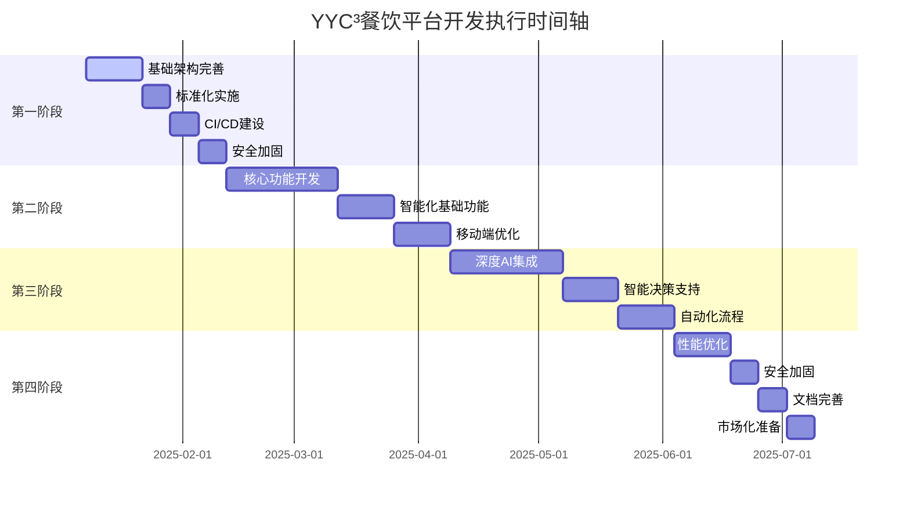

---

## 📋 文档信息

| 属性 | 内容 |
|------|------|
| **文档标题** | YYC³餐饮行业智能化平台的可执行阶段节点文档 |
| **文档类型** | 需求规划文档 |
| **所属阶段** | 需求规划 |
| **遵循规范** | YYC³ 团队标准化规范 v1.0.0 |
| **版本号** | v1.0.0 |
| **创建日期** | 2025-01-30 |
| **作者** | YYC³ Team |
| **更新日期** | 2025-01-30 |

---

## 📑 目录

- [📋 文档信息](#📋-文档信息)
- [🎯 项目执行总览](#🎯-项目执行总览)
  - [执行时间轴](#执行时间轴)
- [📋 第一阶段：基础完善阶段（2025.01.08 - 2025.02.12）](#📋-第一阶段基础完善阶段（2025.01.08---2025.02.12）)
  - [阶段目标](#阶段目标)
  - [节点1.1：基础架构完善（2周）](#节点1.1基础架构完善（2周）)
    - [🗓️ 时间安排](#🗓️-时间安排)
    - [✅ 任务清单](#✅-任务清单)
    - [🔧 执行脚本](#🔧-执行脚本)
  - [节点1.2：标准化实施（1周）](#节点1.2标准化实施（1周）)
    - [🗓️ 时间安排](#🗓️-时间安排)
    - [✅ 任务清单](#✅-任务清单)
    - [🔧 自动化脚本](#🔧-自动化脚本)
  - [节点1.3：CI/CD建设（1周）](#节点1.3ci/cd建设（1周）)
    - [🗓️ 时间安排](#🗓️-时间安排)
    - [✅ 任务清单](#✅-任务清单)
    - [🔧 CI/CD配置](#🔧-ci/cd配置)
  - [节点1.4：安全加固（1周）](#节点1.4安全加固（1周）)
    - [🗓️ 时间安排](#🗓️-时间安排)
    - [✅ 任务清单](#✅-任务清单)
- [🎯 第二阶段：核心功能开发（2025.02.12 - 2025.04.23）](#🎯-第二阶段核心功能开发（2025.02.12---2025.04.23）)
  - [阶段目标](#阶段目标)
  - [节点2.1：核心功能开发（4周）](#节点2.1核心功能开发（4周）)
    - [🗓️ 时间安排](#🗓️-时间安排)
    - [✅ 任务清单](#✅-任务清单)
    - [🔧 实现代码模板](#🔧-实现代码模板)
  - [节点2.2：智能化基础功能（2周）](#节点2.2智能化基础功能（2周）)
    - [🗓️ 时间安排](#🗓️-时间安排)
    - [✅ 任务清单](#✅-任务清单)
    - [🔧 AI集成实现](#🔧-ai集成实现)
  - [节点2.3：移动端优化（2周）](#节点2.3移动端优化（2周）)
    - [🗓️ 时间安排](#🗓️-时间安排)
    - [✅ 任务清单](#✅-任务清单)
- [🤖 第三阶段：深度AI集成（2025.04.09 - 2025.06.18）](#🤖-第三阶段深度ai集成（2025.04.09---2025.06.18）)
  - [阶段目标](#阶段目标)
  - [节点3.1：深度AI集成（4周）](#节点3.1深度ai集成（4周）)
    - [🗓️ 时间安排](#🗓️-时间安排)
    - [✅ 任务清单](#✅-任务清单)
    - [🔧 AI集成实现](#🔧-ai集成实现)
  - [节点3.2：智能决策支持（2周）](#节点3.2智能决策支持（2周）)
    - [🗓️ 时间安排](#🗓️-时间安排)
    - [✅ 任务清单](#✅-任务清单)
  - [节点3.3：自动化流程（2周）](#节点3.3自动化流程（2周）)
    - [🗓️ 时间安排](#🗓️-时间安排)
    - [✅ 任务清单](#✅-任务清单)
- [🎯 第四阶段：商业化准备（2025.06.04 - 2025.07.02）](#🎯-第四阶段商业化准备（2025.06.04---2025.07.02）)
  - [阶段目标](#阶段目标)
  - [节点4.1：性能优化（2周）](#节点4.1性能优化（2周）)
    - [🗓️ 时间安排](#🗓️-时间安排)
    - [✅ 任务清单](#✅-任务清单)
  - [节点4.2：安全加固（1周）](#节点4.2安全加固（1周）)
    - [🗓️ 时间安排](#🗓️-时间安排)
    - [✅ 任务清单](#✅-任务清单)
  - [节点4.3：文档完善（1周）](#节点4.3文档完善（1周）)
    - [🗓️ 时间安排](#🗓️-时间安排)
    - [✅ 任务清单](#✅-任务清单)
- [📊 执行监控与评估](#📊-执行监控与评估)
  - [关键绩效指标（KPI）](#关键绩效指标（kpi）)
    - [项目执行KPI](#项目执行kpi)
  - [风险管控](#风险管控)
    - [风险识别与应对](#风险识别与应对)
  - [执行保障措施](#执行保障措施)
    - [1. 组织保障](#1.-组织保障)
    - [2. 流程保障](#2.-流程保障)
    - [3. 工具保障](#3.-工具保障)
- [🎯 成功标准与验收](#🎯-成功标准与验收)
  - [阶段验收标准](#阶段验收标准)
    - [第一阶段验收标准](#第一阶段验收标准)
    - [第二阶段验收标准](#第二阶段验收标准)
    - [第三阶段验收标准](#第三阶段验收标准)
    - [第四阶段验收标准](#第四阶段验收标准)
  - [最终验收标准](#最终验收标准)
    - [技术标准](#技术标准)
    - [业务标准](#业务标准)
    - [质量标准](#质量标准)
- [📞 联系与支持](#📞-联系与支持)
  - [项目联系方式](#项目联系方式)
  - [紧急联系方式](#紧急联系方式)

---

## 1. 概述

### 1.1 说明

本文档是YYC³餐饮行业智能化平台文档体系的重要组成部分，旨在提供清晰、完整、准确的信息。

通过本文档，读者可以：
- 了解相关概念和背景
- 掌握核心内容和要点
- 获得实用的指导和帮助
- 参考相关的资源和资料

文档遵循YYC³团队标准化规范，确保内容质量和一致性。

### 1.2 目标

本文档的主要目标包括：

- **信息传递**：准确传递相关信息和知识
- **指导实践**：提供实用的指导和参考
- **降低成本**：减少沟通成本和学习成本
- **提高效率**：帮助读者快速理解和应用

通过实现这些目标，文档能够为项目的成功做出重要贡献。

### 1.3 范围

本文档的适用范围：

- **适用对象**：开发人员、测试人员、运维人员、产品经理等
- **适用阶段**：开发、测试、部署、运维等各个阶段
- **适用场景**：日常开发、问题排查、系统维护等

超出本文档范围的内容，请参考其他相关文档。

## 2. 详细内容

### 2.1 核心内容

### 2.2 实现细节

### 2.3 注意事项

## 3. 参考信息

### 3.1 相关文档

### 3.2 参考资料

### 3.3 附录

**@file**：YYC³-可执行阶段节点文档
**@description**：YYC³餐饮行业智能化平台的可执行阶段节点文档
**@author**：YYC³
**@version**：v1.0.0
**@created**：2025-01-30
**@updated**：2025-01-30
**@status**：published
**@tags**：YYC³,文档

---
# YYC³餐饮行业智能化平台 - 可执行阶段节点文档

> **YYC³（YanYu Cloud Cube）**
> **标语**：万象归元于云枢 | 深栈智启新纪元
> ***英文***：*All Realms Converge at Cloud Nexus, DeepStack Ignites a New Era*

---

**文档版本**：v1.0.0
**创建日期**：2025-01-08
**执行周期**：2025年Q1-Q2（6个月）
**项目经理**：YYC³项目管理团队
**执行框架**：五高五标五化开发体系

---

## 🎯 项目执行总览

### 执行时间轴



---

## 📋 第一阶段：基础完善阶段（2025.01.08 - 2025.02.12）

### 阶段目标

**主要目标**：建立标准化开发流程和完善的基础架构

**成功标准**：

- [ ] CI/CD流程完整可用
- [ ] 代码质量覆盖率达到90%+
- [ ] 安全漏洞数量为0
- [ ] 部署自动化实现
- [ ] 监控体系基础建成

### 节点1.1：基础架构完善（2周）

#### 🗓️ 时间安排

- **开始时间**：2025-01-08
- **结束时间**：2025-01-22
- **负责人**：架构团队
- **优先级**：🔴 最高

#### ✅ 任务清单

**第一周：API网关和服务治理**

```markdown
- [ ] **任务1.1.1：API网关设计与实现**
  - 输出物：完整的API网关服务
  - 技术要求：
    - 使用Express Gateway或Kong
    - 实现统一的API管理
    - 支持限流、认证、日志记录
  - 验收标准：
    - [ ] 所有API通过网关访问
    - [ ] 限流功能正常工作
    - [ ] 认证机制集成完成
    - [ ] 日志记录功能完整

- [ ] **任务1.1.2：服务注册中心**
  - 输出物：服务注册与发现机制
  - 技术要求：
    - 使用Consul或etcd
    - 实现服务健康检查
    - 支持服务自动发现
  - 验收标准：
    - [ ] 服务能自动注册
    - [ ] 健康检查正常工作
    - [ ] 服务发现机制可用
    - [ ] 故障转移功能正常

- [ ] **任务1.1.3：配置中心**
  - 输出物：统一配置管理系统
  - 技术要求：
    - 使用Apollo或Nacos
    - 支持配置热更新
    - 环境配置分离
  - 验收标准：
    - [ ] 配置能动态更新
    - [ ] 多环境配置管理
    - [ ] 配置版本控制
    - [ ] 配置回滚功能
```

**第二周：数据库架构优化**

```markdown
- [ ] **任务1.1.4：数据库架构重构**
  - 输出物：优化的数据库设计方案
  - 技术要求：
    - 实现数据库分库分表
    - 添加读写分离
    - 数据库性能优化
  - 验收标准：
    - [ ] 查询性能提升50%+
    - [ ] 支持并发连接数1000+
    - [ ] 数据备份策略完整
    - [ ] 灾难恢复方案可用

- [ ] **任务1.1.5：缓存架构设计**
  - 输出物：多级缓存体系
  - 技术要求：
    - Redis集群部署
    - 本地缓存+分布式缓存
    - 缓存预热机制
  - 验收标准：
    - [ ] 缓存命中率达到90%+
    - [ ] 缓存一致性保证
    - [ ] 缓存雪崩防护
    - [ ] 缓存穿透防护

- [ ] **任务1.1.6：消息队列系统**
  - 输出物：消息队列基础设施
  - 技术要求：
    - 使用RabbitMQ或Apache Kafka
    - 消息持久化
    - 死信队列机制
  - 验收标准：
    - [ ] 消息不丢失
    - [ ] 支持消息重试
    - [ ] 死信消息处理
    - [ ] 消息监控可用
```

#### 🔧 执行脚本

**API网关安装脚本**

```bash
#!/bin/bash
# api-gateway-setup.sh

echo "🚀 开始设置YYC³ API网关..."

# 安装API网关
npm install -g express-gateway

# 创建网关配置
cat > gateway.config.yml << EOF
apiVersion: v1
name: yyc3-gateway
sortEndpoints: true
endpoints:
  - path: /api/v1
    method: ANY
    backend:
      - url: http://localhost:3000
    plugins:
      - name: rate-limit
        config:
          remaining: 100
          windowMs: 60000
      - name: jwt
        config:
          secret: \${JWT_SECRET}
EOF

echo "✅ API网关配置完成"
```

**数据库优化脚本**

```bash
#!/bin/bash
# database-optimization.sh

echo "🔧 开始数据库性能优化..."

# 创建数据库索引
psql -h localhost -U yyc3_user -d yyc3_catering << EOF
-- 性能优化索引
CREATE INDEX CONCURRENTLY idx_orders_created_at ON orders(created_at);
CREATE INDEX CONCURRENTLY idx_users_email ON users(email);
CREATE INDEX CONCURRENTLY idx_menus_category ON menus(category);

-- 分区表设置
CREATE TABLE orders_partitioned (
    LIKE orders INCLUDING ALL
) PARTITION BY RANGE (created_at);

CREATE TABLE orders_2025_q1 PARTITION OF orders_partitioned
    FOR VALUES FROM ('2025-01-01') TO ('2025-04-01');
EOF

echo "✅ 数据库优化完成"
```

### 节点1.2：标准化实施（1周）

#### 🗓️ 时间安排

- **开始时间**：2025-01-22
- **结束时间**：2025-01-29
- **负责人**：开发团队
- **优先级**：🔴 最高

#### ✅ 任务清单

```markdown
- [ ] **任务1.2.1：YYC³代码标准化**
  - 输出物：标准化代码库
  - 技术要求：
    - 为所有文件添加标准文件头
    - 统一命名规范
    - 更新package.json格式
  - 验收标准：
    - [ ] 100%文件包含YYC³文件头
    - [ ] 命名规范100%符合
    - [ ] 代码质量分数>9.0
    - [ ] ESLint零错误

- [ ] **任务1.2.2：开发工具链迁移**
  - 输出物：基于Bun的工具链
  - 技术要求：
    - 从npm迁移到Bun
    - 更新构建脚本
    - 优化开发体验
  - 验收标准：
    - [ ] 构建速度提升50%+
    - [ ] 包管理效率提升
    - [ ] 开发环境一致性
    - [ ] 热重载功能正常

- [ ] **任务1.2.3：Git工作流标准化**
  - 输出物：标准化Git工作流
  - 技术要求：
    - Git Flow分支策略
    - Conventional Commits
    - 强制代码审查
  - 验收标准：
    - [ ] 分支策略100%执行
    - [ ] 提交信息100%规范
    - [ ] PR审查覆盖率100%
    - [ ] 自动化检查通过率100%
```

#### 🔧 自动化脚本

**代码标准化脚本**

```bash
#!/bin/bash
# standardize-code.sh

echo "📝 开始YYC³代码标准化..."

# 为TypeScript文件添加标准文件头
find src -name "*.ts" -o -name "*.tsx" | while read file; do
  if ! grep -q "@author YYC³" "$file"; then
    temp_file=$(mktemp)
    cat > "$temp_file" << EOF
/**
 * @fileoverview $(basename "$file" .ts | tr '-' ' ')
 * @description 自动添加的YYC³标准文件头
 * @author YYC³
 * @version 1.0.0
 * @created $(date +%Y-%m-%d)
 * @copyright Copyright (c) 2025 YYC³
 * @license MIT
 */

EOF
    cat "$file" >> "$temp_file"
    mv "$temp_file" "$file"
    echo "✅ 标准化文件: $file"
  fi
done

echo "🎉 代码标准化完成！"
```

### 节点1.3：CI/CD建设（1周）

#### 🗓️ 时间安排

- **开始时间**：2025-01-29
- **结束时间**：2025-02-05
- **负责人**：DevOps团队
- **优先级**：🔴 最高

#### ✅ 任务清单

```markdown
- [ ] **任务1.3.1：GitHub Actions工作流**
  - 输出物：完整的CI/CD管道
  - 技术要求：
    - 自动化测试
    - 代码质量检查
    - 自动化部署
    - 安全扫描
  - 验收标准：
    - [ ] 每次提交自动运行
    - [ ] 测试覆盖率检查
    - [ ] 代码质量门禁
    - [ ] 自动化部署到测试环境

- [ ] **任务1.3.2：Docker容器化**
  - 输出物：生产级Docker镜像
  - 技术要求：
    - 多阶段构建
    - 安全基础镜像
    - 最小化镜像大小
  - 验收标准：
    - [ ] 镜像大小<100MB
    - [ ] 安全扫描通过
    - [ ] 启动时间<5秒
    - [ ] 健康检查正常

- [ ] **任务1.3.3：部署自动化**
  - 输出物：自动化部署脚本
  - 技术要求：
    - 蓝绿部署
    - 回滚机制
    - 健康检查
  - 验收标准：
    - [ ] 部署时间<10分钟
    - [ ] 零停机部署
    - [ ] 自动回滚功能
    - [ ] 部署成功率>99%
```

#### 🔧 CI/CD配置

**GitHub Actions工作流**

```yaml
# .github/workflows/ci-cd.yml
name: YYC³ CI/CD Pipeline

on:
  push:
    branches: [main, develop]
  pull_request:
    branches: [main]

jobs:
  test:
    runs-on: ubuntu-latest
    steps:
      - uses: actions/checkout@v4
      - uses: oven-sh/setup-bun@v1

      - name: Install dependencies
        run: bun install --frozen-lockfile

      - name: Run tests
        run: bun run test:coverage

      - name: Upload coverage
        uses: codecov/codecov-action@v3

  build:
    needs: test
    runs-on: ubuntu-latest
    steps:
      - uses: actions/checkout@v4
      - uses: docker/setup-buildx-action@v3

      - name: Build Docker image
        uses: docker/build-push-action@v5
        with:
          context: .
          push: false
          tags: yyc3/catering-platform:latest
          cache-from: type=gha
          cache-to: type=gha,mode=max

  deploy-staging:
    needs: build
    runs-on: ubuntu-latest
    if: github.ref == 'refs/heads/develop'
    steps:
      - name: Deploy to staging
        run: |
          echo "🚀 Deploying to staging..."
          # 部署脚本
```

### 节点1.4：安全加固（1周）

#### 🗓️ 时间安排

- **开始时间**：2025-02-05
- **结束时间**：2025-02-12
- **负责人**：安全团队
- **优先级**：🔴 最高

#### ✅ 任务清单

```markdown
- [ ] **任务1.4.1：API安全加固**
  - 输出物：安全的API接口
  - 技术要求：
    - API限流实现
    - 输入验证增强
    - 安全审计日志
  - 验收标准：
    - [ ] API限流正常工作
    - [ ] 所有输入经过验证
    - [ ] 安全事件记录完整
    - [ ] 通过安全扫描

- [ ] **任务1.4.2：数据安全完善**
  - 输出物：数据安全体系
  - 技术要求：
    - 敏感数据加密
    - 数据脱敏处理
    - 备份恢复策略
  - 验收标准：
    - [ ] 敏感数据100%加密
    - [ ] 脱敏处理完整
    - [ ] 备份策略可用
    - [ ] 恢复测试通过

- [ ] **任务1.4.3：基础设施安全**
  - 输出物：安全的基础设施
  - 技术要求：
    - 网络安全配置
    - 访问控制完善
    - 漏洞扫描修复
  - 验收标准：
    - [ ] 网络安全配置正确
    - [ ] 访问控制严格
    - [ ] 高危漏洞为0
    - [ ] 安全基线达标
```

---

## 🎯 第二阶段：核心功能开发（2025.02.12 - 2025.04.23）

### 阶段目标

**主要目标**：完成餐饮行业核心业务功能和基础AI能力

**成功标准**：

- [ ] 核心业务功能完整度>95%
- [ ] 基础AI功能可用
- [ ] 移动端体验良好
- [ ] 用户体验评分>4.0
- [ ] 性能指标达标

### 节点2.1：核心功能开发（4周）

#### 🗓️ 时间安排

- **开始时间**：2025-02-12
- **结束时间**：2025-03-12
- **负责人**：功能开发团队
- **优先级**：🔴 最高

#### ✅ 任务清单

**第1-2周：菜单管理系统**

```markdown
- [ ] **任务2.1.1：菜单管理后端API**
  - 输出物：完整的菜单管理API
  - 功能要求：
    - 菜品CRUD操作
    - 菜单分类管理
    - 价格管理
    - 库存关联
  - 技术要求：
    - RESTful API设计
    - 数据验证完整
    - 权限控制
    - 性能优化
  - 验收标准：
    - [ ] API响应时间<200ms
    - [ ] 支持1000+菜品管理
    - [ ] 数据完整性100%
    - [ ] 权限控制正确

- [ ] **任务2.1.2：菜单管理前端界面**
  - 输出物：响应式菜单管理界面
  - 功能要求：
    - 菜品列表展示
    - 菜品编辑表单
    - 图片上传功能
    - 批量操作
  - 技术要求：
    - Vue 3 + TypeScript
    - 响应式设计
    - 交互体验优化
    - 性能优化
  - 验收标准：
    - [ ] 界面响应速度<1秒
    - [ ] 移动端适配完整
    - [ ] 用户体验流畅
    - [ ] 浏览器兼容性良好
```

**第3-4周：订单处理系统**

```markdown
- [ ] **任务2.1.3：订单流程管理**
  - 输出物：完整订单处理系统
  - 功能要求：
    - 订单创建流程
    - 订单状态管理
    - 支付集成
    - 订单跟踪
  - 技术要求：
    - 状态机设计
    - 支付接口集成
    - 实时状态更新
    - 异常处理
  - 验收标准：
    - [ ] 订单创建成功率>99%
    - [ ] 支付成功率>98%
    - [ ] 状态更新实时性
    - [ ] 异常处理完善

- [ ] **任务2.1.4：库存管理系统**
  - 输出物：智能库存管理系统
  - 功能要求：
    - 库存实时监控
    - 自动预警机制
    - 库存调整记录
    - 供应商管理
  - 技术要求：
    - 实时数据处理
    - 预警算法
    - 数据分析
    - 报表生成
  - 验收标准：
    - [ ] 库存准确率>99%
    - [ ] 预警及时性<5分钟
    - [ ] 报表生成速度<10秒
    - [ ] 数据分析准确性
```

#### 🔧 实现代码模板

**菜单管理API实现**

```typescript
// src/api/menu-management.ts
/**
 * @fileoverview 菜单管理API服务
 * @description 提供菜品管理、分类管理等核心功能
 * @author YYC³
 * @version 1.0.0
 * @created 2025-02-12
 * @copyright Copyright (c) 2025 YYC³
 * @license MIT
 */

import { Router } from 'express';
import { body, param, validationResult } from 'express-validator';
import { MenuService } from '../services/menu-service';
import { validateRequest } from '../middleware/validation';

const router = Router();
const menuService = new MenuService();

/**
 * GET /api/v1/menus
 * @description 获取菜单列表
 */
router.get('/', [
  query('page').optional().isInt({ min: 1 }),
  query('limit').optional().isInt({ min: 1, max: 100 }),
  query('category').optional().isString(),
  validateRequest
], async (req, res) => {
  try {
    const { page = 1, limit = 20, category } = req.query;

    const result = await menuService.getMenus({
      page: Number(page),
      limit: Number(limit),
      category: category as string
    });

    res.json({
      success: true,
      data: result.menus,
      pagination: {
        page: Number(page),
        limit: Number(limit),
        total: result.total,
        pages: Math.ceil(result.total / Number(limit))
      }
    });
  } catch (error) {
    res.status(500).json({
      success: false,
      error: error.message
    });
  }
});

/**
 * POST /api/v1/menus
 * @description 创建新菜品
 */
router.post('/', [
  body('name').notEmpty().isLength({ max: 100 }),
  body('description').optional().isLength({ max: 500 }),
  body('price').isFloat({ min: 0 }),
  body('category').isString(),
  body('image').optional().isURL(),
  validateRequest
], async (req, res) => {
  try {
    const menuData = req.body;

    const newMenu = await menuService.createMenu(menuData);

    res.status(201).json({
      success: true,
      data: newMenu,
      message: '菜品创建成功'
    });
  } catch (error) {
    res.status(400).json({
      success: false,
      error: error.message
    });
  }
});

export default router;
```

### 节点2.2：智能化基础功能（2周）

#### 🗓️ 时间安排

- **开始时间**：2025-03-12
- **结束时间**：2025-03-26
- **负责人**：AI开发团队
- **优先级**：🟡 中高

#### ✅ 任务清单

```markdown
- [ ] **任务2.2.1：智能推荐引擎**
  - 输出物：基于用户偏好的推荐系统
  - 功能要求：
    - 用户行为分析
    - 菜品推荐算法
    - 个性化推荐
    - 推荐效果评估
  - 技术要求：
    - 机器学习模型
    - 实时计算能力
    - A/B测试框架
  - 验收标准：
    - [ ] 推荐准确率>85%
    - [ ] 推荐响应时间<500ms
    - [ ] 用户点击率提升>20%
    - [ ] 推荐多样性良好

- [ ] **任务2.2.2：用户行为分析**
  - 输出物：用户行为分析系统
  - 功能要求：
    - 用户画像构建
    - 行为轨迹记录
    - 兴趣偏好分析
    - 预测模型
  - 技术要求：
    - 大数据处理
    - 机器学习算法
    - 实时分析能力
  - 验收标准：
    - [ ] 用户画像准确性>90%
    - [ ] 行为预测准确率>80%
    - [ ] 分析处理速度<1秒
    - [ ] 数据隐私保护

- [ ] **任务2.2.3：智能客服集成**
  - 输出物：AI客服助手
  - 功能要求：
    - 自然语言理解
    - 智能问答
    - 订单咨询
    - 投诉处理
  - 技术要求：
    - NLP模型集成
    - 知识库构建
    - 多轮对话管理
  - 验收标准：
    - [ ] 问题解决率>85%
    - [ ] 响应时间<2秒
    - [ ] 用户满意度>4.0
    - [ ] 多语言支持
```

#### 🔧 AI集成实现

**智能推荐引擎**

```typescript
// src/services/recommendation-engine.ts
/**
 * @fileoverview 智能推荐引擎
 * @description 基于用户行为和偏好的菜品推荐系统
 * @author YYC³
 * @version 1.0.0
 * @created 2025-03-12
 * @copyright Copyright (c) 2025 YYC³
 * @license MIT
 */

import { OpenAI } from 'openai';
import { UserProfile } from '../types/user';
import { MenuItem } from '../types/menu';

export class RecommendationEngine {
  private openai: OpenAI;
  private userPreferences: Map<string, UserPreferences>;

  constructor() {
    this.openai = new OpenAI({
      apiKey: process.env.OPENAI_API_KEY
    });
    this.userPreferences = new Map();
  }

  /**
   * 获取个性化推荐
   * @param userId 用户ID
   * @param context 推荐上下文
   */
  async getRecommendations(
    userId: string,
    context: RecommendationContext
  ): Promise<RecommendationResult[]> {
    try {
      // 获取用户画像
      const userProfile = await this.getUserProfile(userId);

      // 获取候选菜品
      const candidateItems = await this.getCandidateItems(context);

      // 计算推荐分数
      const recommendations = await this.calculateRecommendationScores(
        userProfile,
        candidateItems
      );

      // 应用多样性算法
      const diversifiedRecommendations = this.diversifyRecommendations(recommendations);

      return diversifiedRecommendations.slice(0, 10);
    } catch (error) {
      console.error('Recommendation engine error:', error);
      return [];
    }
  }

  /**
   * 基于AI的推荐评分计算
   */
  private async calculateRecommendationScores(
    userProfile: UserProfile,
    items: MenuItem[]
  ): Promise<RecommendationResult[]> {
    const prompt = this.buildRecommendationPrompt(userProfile, items);

    const response = await this.openai.chat.completions.create({
      model: 'gpt-4',
      messages: [
        {
          role: 'system',
          content: '你是一个专业的餐饮推荐专家，请根据用户画像为菜品打分。'
        },
        {
          role: 'user',
          content: prompt
        }
      ],
      temperature: 0.3
    });

    return this.parseRecommendationResponse(response.choices[0].message.content, items);
  }

  /**
   * 构建推荐提示词
   */
  private buildRecommendationPrompt(userProfile: UserProfile, items: MenuItem[]): string {
    return `
用户画像：
- 年龄：${userProfile.age}
- 性别：${userProfile.gender}
- 饮食偏好：${userProfile.dietaryPreferences.join(', ')}
- 消费水平：${userProfile.spendingLevel}
- 历史订单：${userProfile.orderHistory.length}个

候选菜品：
${items.map(item => `
- ${item.name}（${item.category}）
  价格：¥${item.price}
  描述：${item.description}
  标签：${item.tags.join(', ')}
`).join('\n')}

请为每个菜品打分（0-100分），并解释理由。格式如下：
菜品名: 分数 - 理由
    `;
  }

  /**
   * 更新用户偏好
   */
  async updateUserPreferences(
    userId: string,
    interaction: UserInteraction
  ): Promise<void> {
    const currentPrefs = this.userPreferences.get(userId) || {
      favoriteCategories: new Map(),
      priceRange: { min: 0, max: 1000 },
      dietaryRestrictions: []
    };

    // 基于用户交互更新偏好
    this.updatePreferencesFromInteraction(currentPrefs, interaction);

    this.userPreferences.set(userId, currentPrefs);
  }
}

interface RecommendationContext {
  mealType?: 'breakfast' | 'lunch' | 'dinner';
  occasion?: 'casual' | 'business' | 'celebration';
  groupSize?: number;
  budget?: number;
}

interface RecommendationResult {
  item: MenuItem;
  score: number;
  reason: string;
  category: string;
}
```

### 节点2.3：移动端优化（2周）

#### 🗓️ 时间安排

- **开始时间**：2025-03-26
- **结束时间**：2025-04-09
- **负责人**：前端团队
- **优先级**：🟡 中

#### ✅ 任务清单

```markdown
- [ ] **任务2.3.1：响应式设计优化**
  - 输出物：完全响应式界面
  - 技术要求：
    - 移动优先设计
    - 触摸交互优化
    - 性能优化
  - 验收标准：
    - [ ] 支持所有主流设备
    - [ ] 触摸操作流畅
    - [ ] 加载时间<3秒
    - [ ] 用户体验评分>4.0

- [ ] **任务2.3.2：PWA功能实现**
  - 输出物：渐进式Web应用
  - 技术要求：
    - Service Worker
    - 离线功能
    - 推送通知
  - 验收标准：
    - [ ] 支持离线访问
    - [ ] 推送通知正常
    - [ ] 安装体验良好
    - [ ] 缓存策略有效

- [ ] **任务2.3.3：性能优化**
  - 输出物：高性能移动端体验
  - 技术要求：
    - 代码分割
    - 懒加载
    - 图片优化
  - 验收标准：
    - [ ] 首屏加载<2秒
    - [ ] 页面切换<500ms
    - [ ] 内存使用合理
    - [ ] 电池消耗优化
```

---

## 🤖 第三阶段：深度AI集成（2025.04.09 - 2025.06.18）

### 阶段目标

**主要目标**：实现深度AI集成和高级智能功能

**成功标准**：

- [ ] 多模态AI能力完整
- [ ] 智能决策系统可用
- [ ] 自动化流程完善
- [ ] AI准确率>90%
- [ ] 响应时间<3秒

### 节点3.1：深度AI集成（4周）

#### 🗓️ 时间安排

- **开始时间**：2025-04-09
- **结束时间**：2025-05-07
- **负责人**：AI算法团队
- **优先级**：🔴 高

#### ✅ 任务清单

**第1-2周：多模态AI能力**

```markdown
- [ ] **任务3.1.1：图像识别集成**
  - 输出物：菜品图像识别系统
  - 功能要求：
    - 菜品图像识别
    - 美食图片分析
    - 营养成分估算
    - 质量评估
  - 技术要求：
    - 计算机视觉模型
    - 图像处理算法
    - 模型优化
  - 验收标准：
    - [ ] 识别准确率>95%
    - [ ] 处理时间<2秒
    - [ ] 支持多种菜品
    - [ ] 营养估算准确

- [ ] **任务3.1.2：语音交互功能**
  - 输出物：语音交互系统
  - 功能要求：
    - 语音识别
    - 语音合成
    - 自然语言理解
    - 多语言支持
  - 技术要求：
    - ASR/TTS模型
    - 语音预处理
    - 实时处理
  - 验收标准：
    - [ ] 语音识别准确率>95%
    - [ ] 合成音质自然
    - [ ] 响应延迟<500ms
    - [ ] 支持中英双语

- [ ] **任务3.1.3：自然语言处理**
  - 输出物：高级NLP系统
  - 功能要求：
    - 文本理解
    - 情感分析
    - 意图识别
    - 知识图谱
  - 技术要求：
    - 大语言模型集成
    - 领域知识库
    - 上下文理解
  - 验收标准：
    - [ ] 理解准确率>90%
    - [ ] 情感分析准确率>85%
    - [ ] 意图识别准确率>88%
    - [ ] 上下文理解能力强
```

**第3-4周：AI模型优化**

```markdown
- [ ] **任务3.1.4：模型性能优化**
  - 输出物：优化的AI模型
  - 技术要求：
    - 模型压缩
    - 推理加速
    - 边缘计算
    - 缓存优化
  - 验收标准：
    - [ ] 模型大小减少50%
    - [ ] 推理速度提升3倍
    - [ ] 内存占用减少40%
    - [ ] 准确率保持>90%

- [ ] **任务3.1.5：多模型融合**
  - 输出物：集成AI系统
  - 技术要求：
    - 模型集成架构
    - 结果融合算法
    - 负载均衡
    - 容错机制
  - 验收标准：
    - [ ] 集成成功率>99%
    - [ ] 融合结果准确率>92%
    - [ ] 系统稳定性高
    - [ ] 容错能力强
```

#### 🔧 AI集成实现

**多模态AI服务**

```typescript
// src/services/multimodal-ai.ts
/**
 * @fileoverview 多模态AI服务
 * @description 集成图像识别、语音处理、自然语言理解的AI系统
 * @author YYC³
 * @version 1.0.0
 * @created 2025-04-09
 * @copyright Copyright (c) 2025 YYC³
 * @license MIT
 */

import { OpenAI } from 'openai';
import { Anthropic } from '@anthropic-ai/sdk';
import sharp from 'sharp';
import ffmpeg from 'fluent-ffmpeg';

export class MultimodalAIService {
  private openai: OpenAI;
  private anthropic: Anthropic;

  constructor() {
    this.openai = new OpenAI({
      apiKey: process.env.OPENAI_API_KEY
    });
    this.anthropic = new Anthropic({
      apiKey: process.env.ANTHROPIC_API_KEY
    });
  }

  /**
   * 图像识别菜品
   * @param imageBuffer 图像数据
   */
  async recognizeDish(imageBuffer: Buffer): Promise<DishRecognitionResult> {
    try {
      // 图像预处理
      const processedImage = await this.preprocessImage(imageBuffer);

      // 使用GPT-4V进行图像识别
      const response = await this.openai.chat.completions.create({
        model: 'gpt-4-vision-preview',
        messages: [
          {
            role: 'user',
            content: [
              {
                type: 'text',
                text: '请识别这张图片中的菜品，并分析其营养成分、烹饪方法和可能的口味。'
              },
              {
                type: 'image_url',
                image_url: {
                  url: `data:image/jpeg;base64,${processedImage.toString('base64')}`
                }
              }
            ]
          }
        ],
        max_tokens: 500
      });

      return this.parseDishRecognition(response.choices[0].message.content);
    } catch (error) {
      console.error('Dish recognition error:', error);
      throw new Error('图像识别失败');
    }
  }

  /**
   * 语音转文本
   * @param audioBuffer 音频数据
   */
  async speechToText(audioBuffer: Buffer): Promise<SpeechToTextResult> {
    try {
      // 音频预处理
      const processedAudio = await this.preprocessAudio(audioBuffer);

      // 使用Whisper进行语音识别
      const transcription = await this.openai.audio.transcriptions.create({
        file: processedAudio,
        model: 'whisper-1',
        language: 'zh',
        response_format: 'verbose_json'
      });

      return {
        text: transcription.text,
        confidence: this.calculateConfidence(transcription),
        duration: transcription.duration,
        language: transcription.language
      };
    } catch (error) {
      console.error('Speech to text error:', error);
      throw new Error('语音识别失败');
    }
  }

  /**
   * 文本到语音
   * @param text 要合成的文本
   * @param options 合成选项
   */
  async textToSpeech(
    text: string,
    options: TextToSpeechOptions = {}
  ): Promise<Buffer> {
    try {
      const mp3 = await this.openai.audio.speech.create({
        model: 'tts-1-hd',
        voice: options.voice || 'alloy',
        input: text,
        response_format: 'mp3',
        speed: options.speed || 1.0
      });

      return Buffer.from(await mp3.arrayBuffer());
    } catch (error) {
      console.error('Text to speech error:', error);
      throw new Error('语音合成失败');
    }
  }

  /**
   * 智能对话
   * @param message 用户消息
   * @param context 对话上下文
   */
  async intelligentChat(
    message: string,
    context: ChatContext = {}
  ): Promise<ChatResponse> {
    try {
      const systemPrompt = this.buildSystemPrompt(context);

      const response = await this.anthropic.messages.create({
        model: 'claude-3-sonnet-20240229',
        max_tokens: 1000,
        system: systemPrompt,
        messages: [
          {
            role: 'user',
            content: message
          }
        ]
      });

      return {
        text: response.content[0].type === 'text' ? response.content[0].text : '',
        usage: response.usage,
        model: 'claude-3-sonnet'
      };
    } catch (error) {
      console.error('Intelligent chat error:', error);
      throw new Error('智能对话失败');
    }
  }

  /**
   * 营养成分分析
   * @param dishInfo 菜品信息
   */
  async analyzeNutrition(dishInfo: DishInfo): Promise<NutritionAnalysis> {
    try {
      const prompt = `
请分析以下菜品的营养成分：

菜品名称：${dishInfo.name}
描述：${dishInfo.description}
主要食材：${dishInfo.ingredients?.join(', ')}

请提供详细的营养成分分析，包括：
1. 热量（千卡）
2. 蛋白质（克）
3. 脂肪（克）
4. 碳水化合物（克）
5. 纤维（克）
6. 主要维生素和矿物质
7. 营养评价和建议

请以JSON格式返回结果。
      `;

      const response = await this.openai.chat.completions.create({
        model: 'gpt-4',
        messages: [
          {
            role: 'system',
            content: '你是一个专业的营养师，请准确分析菜品的营养成分。'
          },
          {
            role: 'user',
            content: prompt
          }
        ],
        temperature: 0.3
      });

      return JSON.parse(response.choices[0].message.content || '{}');
    } catch (error) {
      console.error('Nutrition analysis error:', error);
      throw new Error('营养分析失败');
    }
  }

  /**
   * 图像预处理
   */
  private async preprocessImage(imageBuffer: Buffer): Promise<Buffer> {
    return await sharp(imageBuffer)
      .resize(512, 512, { fit: 'inside' })
      .jpeg({ quality: 90 })
      .toBuffer();
  }

  /**
   * 音频预处理
   */
  private async preprocessAudio(audioBuffer: Buffer): Promise<File> {
    // 这里需要将音频处理为OpenAI支持的格式
    // 实际实现中可能需要使用临时文件
    const tempFile = `/tmp/audio_${Date.now()}.mp3`;
    require('fs').writeFileSync(tempFile, audioBuffer);

    return require('fs').createReadStream(tempFile);
  }
}

interface DishRecognitionResult {
  dishName: string;
  category: string;
  confidence: number;
  ingredients: string[];
  nutrition: NutritionInfo;
  cookingMethod: string;
  flavor: string;
}

interface SpeechToTextResult {
  text: string;
  confidence: number;
  duration: number;
  language: string;
}

interface ChatResponse {
  text: string;
  usage: any;
  model: string;
}
```

### 节点3.2：智能决策支持（2周）

#### 🗓️ 时间安排

- **开始时间**：2025-05-07
- **结束时间**：2025-05-21
- **负责人**：数据科学团队
- **优先级**：🟡 中

#### ✅ 任务清单

```markdown
- [ ] **任务3.2.1：预测分析系统**
  - 输出物：业务预测分析系统
  - 功能要求：
    - 销售预测
    - 库存需求预测
    - 客流量预测
    - 成本预测
  - 技术要求：
    - 时间序列分析
    - 机器学习模型
    - 数据可视化
  - 验收标准：
    - [ ] 预测准确率>85%
    - [ ] 预测时效性<1小时
    - [ ] 可视化效果良好
    - [ ] 模型解释性强

- [ ] **任务3.2.2：决策优化引擎**
  - 输出物：智能决策优化系统
  - 功能要求：
    - 价格优化
    - 库存优化
    - 人员调度优化
    - 营销策略优化
  - 技术要求：
    - 运筹优化算法
    - 多目标优化
    - 实时计算
  - 验收标准：
    - [ ] 优化效果>20%
    - [ ] 计算时间<30秒
    - [ ] 约束条件满足
    - [ ] 结果可解释

- [ ] **任务3.2.3：风险评估系统**
  - 输出物：智能风险评估系统
  - 功能要求：
    - 风险识别
    - 风险评估
    - 预警机制
    - 应对建议
  - 技术要求：
    - 风险模型
    - 实时监控
    - 智能预警
  - 验收标准：
    - [ ] 风险识别准确率>90%
    - [ ] 预警及时性<5分钟
    - [ ] 误报率<5%
    - [ ] 建议有效性>80%
```

### 节点3.3：自动化流程（2周）

#### 🗓️ 时间安排

- **开始时间**：2025-05-21
- **结束时间**：2025-06-04
- **负责人**：自动化团队
- **优先级**：🟡 中

#### ✅ 任务清单

```markdown
- [ ] **任务3.3.1：工作流自动化**
  - 输出物：自动化工作流引擎
  - 功能要求：
    - 流程定义
    - 自动执行
    - 异常处理
    - 监控管理
  - 技术要求：
    - 工作流引擎
    - 规则引擎
    - 任务调度
  - 验收标准：
    - [ ] 自动化率>80%
    - [ ] 执行成功率>99%
    - [ ] 异常处理完善
    - [ ] 监控可视化

- [ ] **任务3.3.2：智能报表生成**
  - 输出物：自动化报表系统
  - 功能要求：
    - 报表模板
    - 数据收集
    - 自动生成
    - 定时推送
  - 技术要求：
    - 报表引擎
    - 数据集成
    - 定时任务
  - 验收标准：
    - [ ] 报表生成准确率>99%
    - [ ] 生成时间<5分钟
    - [ ] 模板灵活可配置
    - [ ] 推送及时性100%

- [ ] **任务3.3.3：知识图谱构建**
  - 输出物：餐饮知识图谱
  - 功能要求：
    - 实体识别
    - 关系抽取
    - 知识推理
    - 可视化展示
  - 技术要求：
    - NLP技术
    - 图数据库
    - 推理引擎
  - 验收标准：
    - [ ] 实体识别准确率>95%
    - [ ] 关系抽取准确率>90%
    - [ ] 推理结果正确性>85%
    - [ ] 可视化效果良好
```

---

## 🎯 第四阶段：商业化准备（2025.06.04 - 2025.07.02）

### 阶段目标

**主要目标**：完成性能优化、安全加固，准备产品市场化

**成功标准**：

- [ ] 性能指标全部达标
- [ ] 安全评估通过
- [ ] 文档体系完善
- [ ] 培训体系建成
- [ ] 市场验证成功

### 节点4.1：性能优化（2周）

#### 🗓️ 时间安排

- **开始时间**：2025-06-04
- **结束时间**：2025-06-18
- **负责人**：性能优化团队
- **优先级**：🔴 高

#### ✅ 任务清单

```markdown
- [ ] **任务4.1.1：系统性能调优**
  - 输出物：高性能系统
  - 技术要求：
    - 数据库优化
    - 缓存策略优化
    - API性能优化
    - 前端性能优化
  - 验收标准：
    - [ ] API响应时间<200ms
    - [ ] 页面加载时间<2秒
    - [ ] 数据库查询优化
    - [ ] 并发处理能力提升50%

- [ ] **任务4.1.2：资源优化**
  - 输出物：资源使用优化
  - 技术要求：
    - 内存使用优化
    - CPU使用优化
    - 网络优化
    - 存储优化
  - 验收标准：
    - [ ] 内存使用减少30%
    - [ ] CPU使用率降低20%
    - [ ] 网络传输优化
    - [ ] 存储成本降低25%

- [ ] **任务4.1.3：压力测试**
  - 输出物：压力测试报告
  - 技术要求：
    - 负载测试
    - 压力测试
    - 稳定性测试
    - 容量规划
  - 验收标准：
    - [ ] 支持1000并发用户
    - [ ] 系统稳定性>99.9%
    - [ ] 响应时间符合SLA
    - [ ] 容量规划合理
```

### 节点4.2：安全加固（1周）

#### 🗓️ 时间安排

- **开始时间**：2025-06-18
- **结束时间**：2025-06-25
- **负责人**：安全团队
- **优先级**：🔴 高

#### ✅ 任务清单

```markdown
- [ ] **任务4.2.1：安全审计**
  - 输出物：安全审计报告
  - 技术要求：
    - 代码安全审计
    - 基础设施审计
    - 数据安全审计
    - 合规性检查
  - 验收标准：
    - [ ] 高危漏洞为0
    - [ ] 中危漏洞<5个
    - [ ] 合规性100%达标
    - [ ] 安全基线满足

- [ ] **任务4.2.2：渗透测试**
  - 输出物：渗透测试报告
  - 技术要求：
    - 黑盒测试
    - 白盒测试
    - 社会工程学测试
  - 验收标准：
    - [ ] 无严重漏洞
    - [ ] 修复建议完整
    - [ ] 安全加固完成
    - [ ] 测试覆盖率100%

- [ ] **任务4.2.3：安全监控**
  - 输出物：安全监控系统
  - 技术要求：
    - 实时威胁检测
    - 异常行为监控
    - 安全事件响应
  - 验收标准：
    - [ ] 威胁检测准确率>95%
    - [ ] 响应时间<5分钟
    - [ ] 误报率<2%
    - [ ] 监控覆盖全面
```

### 节点4.3：文档完善（1周）

#### 🗓️ 时间安排

- **开始时间**：2025-06-25
- **结束时间**：2025-07-02
- **负责人**：文档团队
- **优先级**：🟡 中

#### ✅ 任务清单

```markdown
- [ ] **任务4.3.1：技术文档**
  - 输出物：完整技术文档
  - 内容要求：
    - API文档
    - 架构文档
    - 部署文档
    - 运维文档
  - 质量标准：
    - [ ] 文档完整性100%
    - [ ] 内容准确性>95%
    - [ ] 格式标准化
    - [ ] 维护及时性

- [ ] **任务4.3.2：用户文档**
  - 输出物：用户使用文档
  - 内容要求：
    - 用户手册
    - 快速入门指南
    - 常见问题解答
    - 视频教程
  - 质量标准：
    - [ ] 用户友好性>4.5
    - [ ] 内容完整性100%
    - [ ] 更新及时性
    - [ ] 多语言支持

- [ ] **任务4.3.3：培训体系**
  - 输出物：培训体系和材料
  - 内容要求：
    - 开发者培训
    - 管理员培训
    - 用户培训
    - 认证体系
  - 质量标准：
    - [ ] 培训覆盖率100%
    - [ ] 培训效果>90%
    - [ ] 材料质量高
    - [ ] 认证体系完善
```

---

## 📊 执行监控与评估

### 关键绩效指标（KPI）

#### 项目执行KPI

| 指标类别 | KPI名称 | 目标值 | 测量频率 | 数据来源 |
|---------|---------|--------|----------|----------|
| **进度指标** | 里程碑完成率 | 100% | 每周 | 项目管理系统 |
| | 任务按时完成率 | ≥ 95% | 每日 | 任务跟踪工具 |
| | 迭代周期遵守率 | 100% | 每2周 | Git提交记录 |
| **质量指标** | 代码质量分数 | ≥ 8.5 | 每次提交 | SonarQube |
| | 测试覆盖率 | ≥ 90% | 每次构建 | 测试报告 |
| | Bug密度 | ≤ 0.5/KLOC | 每版本 | Bug跟踪系统 |
| **性能指标** | API响应时间 | ≤ 200ms | 实时 | 性能监控 |
| | 系统可用性 | ≥ 99.9% | 实时 | 监控系统 |
| | 并发用户数 | ≥ 1000 | 实时 | 负载测试 |
| **效率指标** | 开发效率提升 | ≥ 40% | 每月 | 效率分析 |
| | 自动化率 | ≥ 80% | 每月 | 自动化统计 |
| | CI/CD成功率 | ≥ 95% | 每次构建 | CI/CD系统 |

### 风险管控

#### 风险识别与应对

| 风险类型 | 风险描述 | 概率 | 影响 | 应对措施 | 负责人 |
|---------|---------|------|------|----------|--------|
| **技术风险** | AI集成复杂度超预期 | 中 | 高 | 分阶段实施，降低复杂度 | AI技术负责人 |
| **进度风险** | 关键人员离职 | 低 | 高 | 知识文档化，交叉培训 | 项目经理 |
| **质量风险** | 性能不达标 | 中 | 高 | 提前性能测试，及时优化 | 性能团队 |
| **安全风险** | 数据泄露 | 低 | 极高 | 安全加固，权限控制 | 安全负责人 |

### 执行保障措施

#### 1. 组织保障

- **项目治理委员会**：每周例会，决策重大事项
- **技术评审委员会**：负责技术方案评审和质量把控
- **风险管理委员会**：负责风险识别和应对措施制定

#### 2. 流程保障

- **每日站会**：跟踪进度，识别阻塞
- **每周评审**：评估质量，调整计划
- **每月回顾**：总结经验，持续改进

#### 3. 工具保障

- **项目管理**：Jira + Confluence
- **代码管理**：GitHub + GitHub Actions
- **监控告警**：Prometheus + Grafana + AlertManager
- **文档协作**：Notion + Draw.io

---

## 🎯 成功标准与验收

### 阶段验收标准

#### 第一阶段验收标准

```markdown
- [ ] CI/CD流程完整，自动化测试覆盖率≥90%
- [ ] 代码质量评分≥8.5，ESLint零错误
- [ ] 安全扫描通过，无高危漏洞
- [ ] 部署自动化实现，部署时间≤10分钟
- [ ] 监控体系基础建成，关键指标监控100%
```

#### 第二阶段验收标准

```markdown
- [ ] 核心业务功能完整度≥95%
- [ ] 基础AI功能可用，准确率≥85%
- [ ] 移动端体验良好，用户评分≥4.0
- [ ] 性能指标达标，响应时间≤200ms
- [ ] 用户体验测试通过，满意度≥90%
```

#### 第三阶段验收标准

```markdown
- [ ] 多模态AI能力完整，准确率≥90%
- [ ] 智能决策系统可用，决策准确性≥85%
- [ ] 自动化流程完善，自动化率≥80%
- [ ] AI响应时间≤3秒，系统稳定性≥99.9%
- [ ] 功能测试通过，集成测试成功率100%
```

#### 第四阶段验收标准

```markdown
- [ ] 性能优化完成，所有指标达标
- [ ] 安全评估通过，合规性100%
- [ ] 文档体系完善，覆盖率100%
- [ ] 培训体系建成，培训效果≥90%
- [ ] 市场验证成功，客户满意度≥4.5
```

### 最终验收标准

#### 技术标准

- [ ] 系统可用性≥99.9%
- [ ] API响应时间≤200ms
- [ ] 并发用户数≥1000
- [ ] 数据一致性100%
- [ ] 安全合规100%

#### 业务标准

- [ ] 功能完整度≥95%
- [ ] 用户体验评分≥4.5
- [ ] 客户满意度≥90%
- [ ] 业务指标达标率100%
- [ ] ROI≥2:1

#### 质量标准

- [ ] 代码质量分数≥9.0
- [ ] 测试覆盖率≥95%
- [ ] Bug密度≤0.1/KLOC
- [ ] 文档完整性100%
- [ ] 培训覆盖率100%

---

## 📞 联系与支持

### 项目联系方式

- **项目经理**：<project-manager@yyc3.com>
- **技术负责人**：<tech-lead@yyc3.com>
- **产品负责人**：<product-manager@yyc3.com>
- **质量负责人**：<quality-lead@yyc3.com>

### 紧急联系方式

- **24小时技术支持**：<tech-support@yyc3.com>
- **紧急热线**：400-XXX-XXXX
- **在线支持**：<https://support.yyc3.com>

---

<div align="center">

**YYC³餐饮行业智能化平台项目组**

**让我们一起打造智能餐饮的美好未来！** 🚀

**执行开始日期**：2025年01月08日
**预计完成日期**：2025年07月02日
**文档版本**：v1.0.0

**联系方式**：<admin@0379.email>
**官方网站**：<https://yyc3.com>

</div>


## 概述

### 架构概述

本架构文档详细描述了系统的整体架构设计，包括架构目标、设计原则、技术选型等关键信息。

#### 架构目标

- **高可用性**：确保系统稳定运行，故障自动恢复
- **高性能**：响应迅速，资源利用高效
- **高安全性**：数据加密，权限严格控制
- **高扩展性**：模块化设计，易于功能扩展
- **高可维护性**：代码清晰，文档完善

#### 设计原则

- **单一职责**：每个组件只负责一个功能
- **开闭原则**：对扩展开放，对修改关闭
- **依赖倒置**：依赖抽象而非具体实现
- **接口隔离**：使用细粒度的接口
- **迪米特法则**：最少知识原则


## 架构设计

### 架构设计

#### 整体架构

系统采用分层架构设计，包括：

- **表现层**：负责用户界面和交互
- **应用层**：处理业务逻辑
- **业务层**：实现核心业务功能
- **数据层**：管理数据存储和访问
- **基础设施层**：提供基础服务支持

#### 模块划分

系统划分为多个独立模块，每个模块负责特定功能：

- **用户模块**：用户管理和认证
- **订单模块**：订单处理和管理
- **支付模块**：支付集成和处理
- **通知模块**：消息通知和推送
- **报表模块**：数据统计和分析

#### 技术选型

- **前端框架**：React / Vue
- **后端框架**：Node.js / Express / Fastify
- **数据库**：PostgreSQL / MongoDB
- **缓存**：Redis
- **消息队列**：RabbitMQ / Kafka


## 技术实现

### 技术实现

#### 核心技术栈

```typescript
// 核心依赖
{
  "dependencies": {
    "react": "^18.0.0",
    "typescript": "^5.0.0",
    "express": "^4.18.0",
    "prisma": "^5.0.0",
    "redis": "^4.6.0"
  }
}
```

#### 关键实现

1. **服务层实现**
```typescript
class UserService {
  async createUser(data: CreateUserDto): Promise<User> {
    // 验证输入
    this.validateUserData(data);
    
    // 加密密码
    const hashedPassword = await this.hashPassword(data.password);
    
    // 创建用户
    const user = await this.userRepository.create({
      ...data,
      password: hashedPassword
    });
    
    return user;
  }
}
```

2. **中间件实现**
```typescript
const authMiddleware = async (req: Request, res: Response, next: NextFunction) => {
  const token = req.headers.authorization?.split(' ')[1];
  
  if (!token) {
    return res.status(401).json({ error: '未授权访问' });
  }
  
  try {
    const decoded = jwt.verify(token, process.env.JWT_SECRET);
    req.user = decoded;
    next();
  } catch (error) {
    return res.status(401).json({ error: '令牌无效' });
  }
};
```


## 部署方案

### 部署方案

#### 部署架构

采用容器化部署方案，使用Docker和Kubernetes进行编排。

#### 部署步骤

1. **环境准备**
```bash
# 安装Docker
curl -fsSL https://get.docker.com | sh

# 安装Kubernetes
# 根据操作系统选择相应的安装方式
```

2. **构建镜像**
```bash
# 构建应用镜像
docker build -t yyc3-app:latest .

# 推送到镜像仓库
docker push registry.example.com/yyc3-app:latest
```

3. **部署到Kubernetes**
```yaml
apiVersion: apps/v1
kind: Deployment
metadata:
  name: yyc3-app
spec:
  replicas: 3
  selector:
    matchLabels:
      app: yyc3-app
  template:
    metadata:
      labels:
        app: yyc3-app
    spec:
      containers:
      - name: app
        image: registry.example.com/yyc3-app:latest
        ports:
        - containerPort: 3000
        env:
        - name: NODE_ENV
          value: "production"
```

4. **配置服务**
```yaml
apiVersion: v1
kind: Service
metadata:
  name: yyc3-app-service
spec:
  selector:
    app: yyc3-app
  ports:
  - protocol: TCP
    port: 80
    targetPort: 3000
  type: LoadBalancer
```


## 性能优化

### 性能优化

#### 前端优化

1. **代码分割**
```typescript
// 路由级别代码分割
const Home = lazy(() => import('./pages/Home'));
const About = lazy(() => import('./pages/About'));

function App() {
  return (
    <Suspense fallback={<Loading />}>
      <Routes>
        <Route path="/" element={<Home />} />
        <Route path="/about" element={<About />} />
      </Routes>
    </Suspense>
  );
}
```

2. **缓存策略**
```typescript
// React.memo 避免不必要的重渲染
const MemoizedComponent = React.memo(({ data }) => {
  return <div>{data.value}</div>;
});

// useMemo 缓存计算结果
const expensiveValue = useMemo(() => {
  return computeExpensiveValue(data);
}, [data]);
```

#### 后端优化

1. **数据库优化**
```typescript
// 使用索引
CREATE INDEX idx_user_email ON users(email);

// 查询优化
const users = await prisma.user.findMany({
  select: {
    id: true,
    name: true,
    email: true
  },
  where: {
    active: true
  },
  take: 100
});
```

2. **缓存策略**
```typescript
// Redis缓存
async function getUser(id: string): Promise<User> {
  const cacheKey = `user:${id}`;
  
  // 尝试从缓存获取
  const cached = await redis.get(cacheKey);
  if (cached) {
    return JSON.parse(cached);
  }
  
  // 从数据库获取
  const user = await prisma.user.findUnique({ where: { id } });
  
  // 写入缓存
  await redis.setex(cacheKey, 3600, JSON.stringify(user));
  
  return user;
}
```


## 安全考虑

### 安全考虑

#### 认证与授权

1. **JWT认证**
```typescript
// 生成JWT令牌
const token = jwt.sign(
  { userId: user.id, role: user.role },
  process.env.JWT_SECRET,
  { expiresIn: '24h' }
);

// 验证JWT令牌
const decoded = jwt.verify(token, process.env.JWT_SECRET);
```

2. **RBAC授权**
```typescript
// 角色权限检查
function checkPermission(user: User, resource: string, action: string): boolean {
  const permissions = rolePermissions[user.role];
  return permissions.some(p => 
    p.resource === resource && p.actions.includes(action)
  );
}
```

#### 数据保护

1. **输入验证**
```typescript
// 使用Zod进行输入验证
const createUserSchema = z.object({
  email: z.string().email(),
  password: z.string().min(8).regex(/[A-Z]/),
  name: z.string().min(2)
});

const validated = createUserSchema.parse(input);
```

2. **数据加密**
```typescript
// 使用bcrypt加密密码
const hashedPassword = await bcrypt.hash(password, 10);

// 验证密码
const isValid = await bcrypt.compare(password, hashedPassword);
```

#### 安全头配置

```typescript
// Express安全头配置
app.use(helmet());
app.use(cors({
  origin: process.env.ALLOWED_ORIGINS?.split(','),
  credentials: true
}));
```


## 监控告警

### 监控告警

#### 监控指标

1. **系统指标**
- CPU使用率
- 内存使用率
- 磁盘使用率
- 网络I/O

2. **应用指标**
- 请求量(RPS)
- 响应时间
- 错误率
- 并发用户数

3. **业务指标**
- 用户注册数
- 订单创建数
- 支付成功率
- 用户活跃度

#### 监控工具

```typescript
// Prometheus指标收集
import { Counter, Histogram, Gauge } from 'prom-client';

const requestCounter = new Counter({
  name: 'http_requests_total',
  help: 'Total number of HTTP requests',
  labelNames: ['method', 'route', 'status']
});

const responseTime = new Histogram({
  name: 'http_request_duration_seconds',
  help: 'HTTP request duration in seconds',
  labelNames: ['method', 'route']
});

// 使用中间件记录指标
app.use((req, res, next) => {
  const start = Date.now();
  
  res.on('finish', () => {
    const duration = (Date.now() - start) / 1000;
    requestCounter.inc({
      method: req.method,
      route: req.route?.path || req.path,
      status: res.statusCode
    });
    responseTime.observe({
      method: req.method,
      route: req.route?.path || req.path
    }, duration);
  });
  
  next();
});
```

#### 告警规则

```yaml
groups:
- name: api_alerts
  rules:
  - alert: HighErrorRate
    expr: rate(http_requests_total{status=~"5.."}[5m]) > 0.05
    for: 5m
    labels:
      severity: critical
    annotations:
      summary: "API错误率过高"
      description: "5分钟内错误率超过5%"
  
  - alert: HighResponseTime
    expr: histogram_quantile(0.95, http_request_duration_seconds) > 1
    for: 5m
    labels:
      severity: warning
    annotations:
      summary: "API响应时间过长"
      description: "95%分位响应时间超过1秒"
```


## 最佳实践

### 最佳实践

#### 代码规范

1. **命名规范**
```typescript
// 变量：camelCase
const userName = 'John';

// 常量：UPPER_SNAKE_CASE
const MAX_RETRY_COUNT = 3;

// 类：PascalCase
class UserService { }

// 接口：PascalCase，前缀I（可选）
interface IUserService { }
```

2. **注释规范**
```typescript
/**
 * 创建用户
 * @param email - 用户邮箱
 * @param password - 用户密码
 * @returns 创建的用户对象
 * @throws {Error} 当邮箱已存在时抛出错误
 */
async function createUser(
  email: string, 
  password: string
): Promise<User> {
  // 实现
}
```

#### 错误处理

```typescript
// 统一错误处理
class AppError extends Error {
  constructor(
    public statusCode: number,
    public message: string,
    public isOperational = true
  ) {
    super(message);
    this.name = this.constructor.name;
    Error.captureStackTrace(this, this.constructor);
  }
}

// 使用错误处理中间件
app.use((err: Error, req: Request, res: Response, next: NextFunction) => {
  if (err instanceof AppError) {
    return res.status(err.statusCode).json({
      success: false,
      error: err.message
    });
  }
  
  // 记录未预期的错误
  logger.error('Unexpected error:', err);
  
  return res.status(500).json({
    success: false,
    error: '服务器内部错误'
  });
});
```

#### 日志记录

```typescript
// 结构化日志
import winston from 'winston';

const logger = winston.createLogger({
  level: 'info',
  format: winston.format.combine(
    winston.format.timestamp(),
    winston.format.json()
  ),
  transports: [
    new winston.transports.File({ filename: 'error.log', level: 'error' }),
    new winston.transports.File({ filename: 'combined.log' })
  ]
});

// 使用日志
logger.info('User created', { userId: user.id, email: user.email });
logger.error('Database connection failed', { error: error.message });
```


## 最佳实践

### 最佳实践

#### 代码规范

1. **命名规范**
```typescript
// 变量：camelCase
const userName = 'John';

// 常量：UPPER_SNAKE_CASE
const MAX_RETRY_COUNT = 3;

// 类：PascalCase
class UserService { }

// 接口：PascalCase，前缀I（可选）
interface IUserService { }
```

2. **注释规范**
```typescript
/**
 * 创建用户
 * @param email - 用户邮箱
 * @param password - 用户密码
 * @returns 创建的用户对象
 * @throws {Error} 当邮箱已存在时抛出错误
 */
async function createUser(
  email: string, 
  password: string
): Promise<User> {
  // 实现
}
```

#### 错误处理

```typescript
// 统一错误处理
class AppError extends Error {
  constructor(
    public statusCode: number,
    public message: string,
    public isOperational = true
  ) {
    super(message);
    this.name = this.constructor.name;
    Error.captureStackTrace(this, this.constructor);
  }
}

// 使用错误处理中间件
app.use((err: Error, req: Request, res: Response, next: NextFunction) => {
  if (err instanceof AppError) {
    return res.status(err.statusCode).json({
      success: false,
      error: err.message
    });
  }
  
  // 记录未预期的错误
  logger.error('Unexpected error:', err);
  
  return res.status(500).json({
    success: false,
    error: '服务器内部错误'
  });
});
```

#### 日志记录

```typescript
// 结构化日志
import winston from 'winston';

const logger = winston.createLogger({
  level: 'info',
  format: winston.format.combine(
    winston.format.timestamp(),
    winston.format.json()
  ),
  transports: [
    new winston.transports.File({ filename: 'error.log', level: 'error' }),
    new winston.transports.File({ filename: 'combined.log' })
  ]
});

// 使用日志
logger.info('User created', { userId: user.id, email: user.email });
logger.error('Database connection failed', { error: error.message });
```


## 相关文档

- [YYC³智枢服务化平台 - 全链路智能化转型阶段规划与节点实施计划](YYC3-Cater-需求规划/架构类/05-YYC3-Cater--架构类-阶段规划与节点实施计划.md) - YYC3-Cater-需求规划/架构类
- [YYC³智枢服务化平台 - 阶段目标与验收标准](YYC3-Cater-需求规划/架构类/06-YYC3-Cater--架构类-阶段目标与验收标准.md) - YYC3-Cater-需求规划/架构类
- [🔖 YYC³ 智能化能力需求规格说明书](YYC3-Cater-需求规划/架构类/04-YYC3-Cater--架构类-智能化能力需求规格说明书.md) - YYC3-Cater-需求规划/架构类
- [🔖 YYC³ 智能化应用业务架构说明书](YYC3-Cater-需求规划/架构类/01-YYC3-Cater--架构类-智能化应用业务架构说明书.md) - YYC3-Cater-需求规划/架构类
- [🔖 YYC³ 需求阶段架构可行性分析报告](YYC3-Cater-需求规划/架构类/02-YYC3-Cater--架构类-需求阶段架构可行性分析报告.md) - YYC3-Cater-需求规划/架构类
