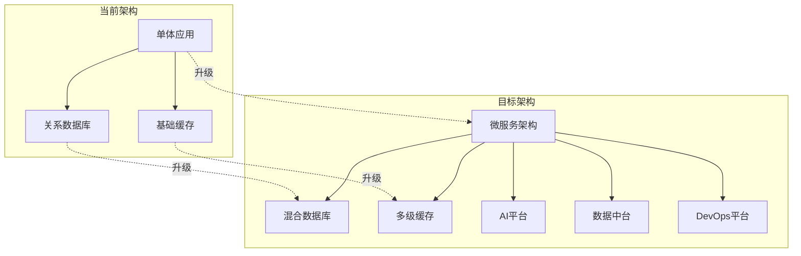

# YYC³餐饮行业智能化平台 - 五高五标五化深度规划

## 📊 项目现状分析

### 当前完成度：约40%

- ✅ **架构设计**：95%完成 - 微服务架构、技术栈选择完整
- ✅ **核心业务逻辑**：60%完成 - 智能代理、连锁运营、食品安全溯源
- ❌ **工程配置**：20%完成 - 缺少入口文件、构建配置、环境配置
- ❌ **前端实现**：30%完成 - 基础框架存在，业务组件缺失
- ❌ **测试覆盖**：0%完成 - 完全没有测试文件
- ❌ **部署配置**：10%完成 - 缺少Docker、CI/CD配置

## 🎯 五高五标五化战略规划

### 📈 五高标准 - 高维度品质要求

#### 1. 🚀 高性能

**目标：** 亚秒级响应，支持万级并发

```typescript
// 性能优化架构
interface PerformanceMetrics {
  apiLatency: '<100ms'           // API响应时间
  pageLoadTime: '<2s'           // 页面加载时间
  databaseQuery: '<50ms'        // 数据库查询时间
  cacheHitRate: '>95%'          // 缓存命中率
  concurrentUsers: 10000        // 并发用户数
}
```

**实现策略：**

- Redis多级缓存（本地+分布式）
- 数据库读写分离 + 连接池优化
- CDN静态资源加速
- API网关限流和负载均衡
- 前端代码分割和懒加载

#### 2. 🛡️ 高安全

**目标：** 企业级安全，零数据泄露

```typescript
// 安全架构设计
interface SecurityArchitecture {
  authentication: 'JWT + OAuth2.0'    // 认证机制
  authorization: 'RBAC + ABAC'       // 授权模型
  encryption: 'AES-256 + TLS 1.3'     // 加密标准
  audit: '全链路审计日志'             // 审计追踪
  compliance: '等保三级'             // 安全合规
}
```

**实现策略：**

- 多因素身份认证
- 细粒度权限控制
- 数据传输加密
- 安全代码扫描
- 定期安全审计

#### 3. 📊 高智能

**目标：** AI驱动决策，自动化运营

```typescript
// 智能化能力
interface IntelligentCapabilities {
  aiRecommendation: '菜品推荐'         // AI推荐系统
  demandForecast: '销量预测'          // 需求预测
  inventoryOptimization: '库存优化'    // 智能补货
  staffScheduling: '智能排班'          // 人员调度
  qualityControl: '质量监控'          // 品质控制
}
```

**实现策略：**

- 机器学习模型集成
- 实时数据分析
- 智能决策引擎
- 自动化工作流
- 持续学习优化

#### 4. 🔄 高可用

**目标：** 99.99%可用性，故障自愈

```typescript
// 高可用架构
interface HighAvailability {
  redundancy: '多活数据中心'           // 冗余设计
  failover: '<30s自动切换'           // 故障转移
  backup: '实时数据备份'             // 备份策略
  monitoring: '全链路监控'           // 监控体系
  disasterRecovery: 'RTO<1h, RPO<5min' // 容灾能力
}
```

**实现策略：**

- 微服务容错设计
- 服务熔断和降级
- 自动扩缩容
- 健康检查机制
- 灾备方案

#### 5. 🌐 高扩展

**目标：** 支持千店连锁，快速扩展

```typescript
// 扩展性设计
interface Scalability {
  horizontalScaling: '服务水平扩展'     // 水平扩展
  multiTenant: '多租户隔离'           // 多租户
  pluginArchitecture: '插件化架构'     // 插件架构
  apiStandardization: '标准化API'      // API标准
  microFrontend: '微前端架构'          // 微前端
}
```

**实现策略：**

- 容器化部署
- 微服务架构
- 多租户数据隔离
- 标准化接口设计
- 插件化功能扩展

### 📏 五标标准 - 精准化规范体系

#### 1. 🍽️ 餐饮行业标准

**规范领域：**

- 食品安全国家标准（GB 2760-2014）
- HACCP食品安全管理体系
- ISO 22000食品安全管理
- 餐饮服务食品安全操作规范

**技术实现：**

```typescript
// 食品安全标准接口
interface FoodSafetyStandards {
  haccpCompliance: 'HACCP合规检查'
  temperatureControl: '温湿度监控'
  shelfLifeManagement: '保质期管理'
  supplierQualification: '供应商资质'
  traceabilityRecord: '溯源记录'
}
```

#### 2. 🏢 企业管理标准

**管理规范：**

- ISO 9001质量管理体系
- 餐饮连锁企业管理规范
- 数字化转型成熟度评估
- 信息化项目建设规范

**技术实现：**

```typescript
// 企业管理标准
interface ManagementStandards {
  qualityManagement: '质量管理'
  processOptimization: '流程优化'
  performanceMetrics: '绩效指标'
  continuousImprovement: '持续改进'
  riskManagement: '风险管理'
}
```

#### 3. 💻 技术开发标准

**开发规范：**

- 代码规范（ESLint + Prettier）
- API设计规范（OpenAPI 3.0）
- 数据库设计规范
- 测试覆盖率标准（>80%）
- 文档规范（README + API文档）

**技术实现：**

```typescript
// 技术开发标准
interface TechnicalStandards {
  codeQuality: '代码质量检查'
  apiDocumentation: 'API文档'
  testCoverage: '测试覆盖率'
  versionControl: '版本控制'
  deploymentPipeline: '部署流水线'
}
```

#### 4. 📱 用户体验标准

**体验规范：**

- 响应式设计标准
- 无障碍访问标准（WCAG 2.1）
- 加载性能标准（<2s首屏）
- 用户界面一致性标准
- 错误处理和提示标准

**技术实现：**

```typescript
// 用户体验标准
interface UXStandards {
  responsiveDesign: '响应式设计'
  accessibility: '无障碍访问'
  performanceMetrics: '性能指标'
  userInterfaceConsistency: '界面一致性'
  errorHandling: '错误处理'
}
```

#### 5. 📈 数据分析标准

**数据规范：**

- 数据收集标准
- 数据质量标准
- 数据分析算法标准
- 数据可视化标准
- 数据隐私保护标准

**技术实现：**

```typescript
// 数据分析标准
interface DataStandards {
  dataCollection: '数据收集'
  dataQuality: '数据质量'
  analyticsAlgorithms: '分析算法'
  visualization: '数据可视化'
  privacyProtection: '隐私保护'
}
```

### 🔧 五化实施 - 系统化落地策略

#### 1. 🤖 智能化实施

**实施路径：**

```typescript
// 智能化实施路线图
const IntelligentRoadmap = {
  phase1: {
    duration: '3个月',
    focus: '基础智能功能',
    features: ['智能推荐', '销量预测', '库存优化']
  },
  phase2: {
    duration: '6个月',
    focus: '高级智能分析',
    features: ['客户画像', '动态定价', '智能排班']
  },
  phase3: {
    duration: '12个月',
    focus: 'AI深度集成',
    features: ['语音交互', '图像识别', '决策自动化']
  }
}
```

#### 2. 📊 数字化实施

**数字化转型：**

```typescript
// 数字化实施框架
interface DigitalTransformation {
  businessDigitization: {
    orderManagement: '订单管理数字化'
    inventoryManagement: '库存管理数字化'
    financialManagement: '财务管理数字化'
    customerManagement: '客户管理数字化'
  }
  operationDigitization: {
    kitchenOperations: '厨房运营数字化'
    staffManagement: '人员管理数字化'
    qualityControl: '质量控制数字化'
    supplyChain: '供应链数字化'
  }
  dataDigitization: {
    dataCollection: '数据采集'
    dataProcessing: '数据处理'
    dataAnalysis: '数据分析'
    dataVisualization: '数据可视化'
  }
}
```

#### 3. 🌐 平台化实施

**平台化建设：**

```typescript
// 平台化架构设计
interface PlatformArchitecture {
  servicePlatform: {
    microservices: '微服务平台'
    apiGateway: 'API网关'
    serviceMesh: '服务网格'
    messageQueue: '消息队列'
  }
  dataPlatform: {
    dataLake: '数据湖'
    dataWarehouse: '数据仓库'
    realtimeProcessing: '实时处理'
    dataGovernance: '数据治理'
  }
  devPlatform: {
    cicd: 'CI/CD平台'
    monitoring: '监控平台'
    logging: '日志平台'
    security: '安全平台'
  }
}
```

#### 4. 🔄 服务化实施

**服务化架构：**

```typescript
// 服务化实施策略
interface ServiceOrientedArchitecture {
  businessServices: [
    '订单服务', '库存服务', '客户服务',
    '支付服务', '通知服务', '报表服务'
  ]
  platformServices: [
    '认证服务', '配置服务', '网关服务',
    '监控服务', '日志服务', '缓存服务'
  ]
  infrastructureServices: [
    '数据库服务', '文件服务', '消息服务',
    '搜索服务', '调度服务', '存储服务'
  ]
}
```

#### 5. 📦 产品化实施

**产品化交付：**

```typescript
// 产品化实施计划
interface ProductDelivery {
  coreProducts: [
    '智能点餐系统', '智慧后厨系统', '连锁管理系统',
    '食品安全溯源系统', '客户关系管理系统', '数据分析系统'
  ]
  supportingProducts: [
    '移动应用', '小程序', '开放平台',
    'API市场', '插件市场', '解决方案市场'
  ]
  services: [
    '实施服务', '培训服务', '运维服务',
    '咨询服务', '定制开发', '技术支持'
  ]
}
```

## 🚀 项目完善路线图

### 第一阶段：基础完善（1-2个月）

**目标：** 建立可运行的基础版本

**核心任务：**

1. **工程配置补全**（优先级：🔴 极高）
   - 创建后端网关入口文件
   - 配置前端构建工具
   - 设置环境配置文件
   - 建立开发工具配置

2. **核心功能实现**（优先级：🔴 高）
   - 补全API接口实现
   - 完善前端业务组件
   - 建立数据库连接
   - 实现基础认证授权

3. **测试框架建立**（优先级：🔴 高）
   - 配置测试环境
   - 编写单元测试
   - 建立集成测试
   - 设置代码覆盖率检查

### 第二阶段：智能升级（3-4个月）

**目标：** 实现AI驱动的智能功能

**核心任务：**

1. **AI模型集成**（优先级：🔴 高）
   - 集成OpenAI GPT模型
   - 实现智能推荐算法
   - 建立机器学习平台
   - 开发预测分析功能

2. **数据中台建设**（优先级：🟡 中）
   - 构建数据湖架构
   - 建立实时数据处理
   - 实现数据可视化
   - 完善数据治理体系

3. **业务流程优化**（优先级：🟡 中）
   - 实现自动化工作流
   - 优化用户操作流程
   - 建立智能决策支持
   - 完善异常处理机制

### 第三阶段：平台扩展（5-6个月）

**目标：** 构建完整的餐饮生态平台

**核心任务：**

1. **微服务架构升级**（优先级：🟡 中）
   - 完善微服务拆分
   - 实现服务网格
   - 建立分布式配置
   - 完善服务监控

2. **容器化部署**（优先级：🟡 中）
   - 创建Docker镜像
   - 配置Kubernetes集群
   - 建立CI/CD流水线
   - 实现自动化部署

3. **开放平台建设**（优先级：🟢 低）
   - 开发API开放平台
   - 建立开发者生态
   - 创建应用市场
   - 完善文档体系

### 第四阶段：生态完善（7-12个月）

**目标：** 打造完整的餐饮数字化生态

**核心任务：**

1. **多端产品完善**
   - 移动端应用优化
   - 小程序生态建设
   - 硬件设备集成
   - IoT设备支持

2. **行业解决方案**
   - 连锁餐饮解决方案
   - 团餐管理解决方案
   - 食堂管理解决方案
   - 外卖平台解决方案

3. **生态合作建设**
   - 第三方系统集成
   - 供应链平台对接
   - 支付平台集成
   - 营销工具集成

## 📊 技术架构演进

### 当前架构 → 目标架构



## 🎯 成功指标

### 技术指标

- **性能**：API响应时间 < 100ms，页面加载时间 < 2s
- **可用性**：系统可用性 > 99.99%
- **安全性**：零安全事件，等保三级认证
- **扩展性**：支持10000+门店，100000+并发用户
- **智能化**：AI决策准确率 > 95%

### 业务指标

- **效率提升**：运营效率提升 50%+
- **成本降低**：运营成本降低 30%+
- **客户满意度**：客户满意度 > 95%
- **营收增长**：营收增长 20%+
- **市场占有率**：市场占有率 > 10%

## 🏆 总结

基于"五高五标五化"的深度规划，YYC³餐饮行业智能化平台将从当前的40%完成度，通过四个阶段的系统化实施，最终达到：

- **技术水平**：行业领先，达到国际先进水平
- **业务价值**：显著的效率提升和成本降低
- **市场地位**：成为餐饮数字化领域的标杆产品
- **生态价值**：构建完整的餐饮数字化生态体系

这不仅是一个技术项目，更是一个推动餐饮行业数字化转型的重要实践，将为行业树立新的标准和标杆。
