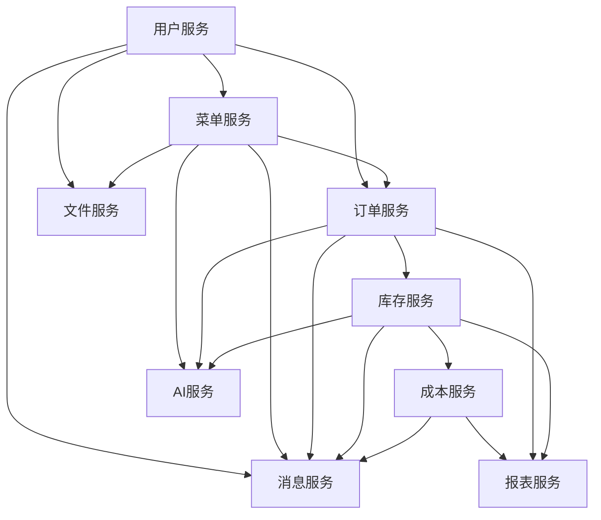

# 智能餐饮平台 - 微服务架构设计文档

## 1. 服务架构概述

基于智能餐饮平台的业务需求和技术规划，我们设计了9个核心微服务，构成完整的系统架构。本文档详细定义了每个服务的边界、API契约和数据模型。

## 2. 服务边界与依赖关系

### 2.1 服务边界定义

| 服务名称 | 服务ID | 业务边界 | 技术边界 |
|---------|---------|---------|---------|
| 用户服务 | user-service | 用户注册、登录、信息管理、权限控制 | Spring Boot + PostgreSQL + Keycloak |
| 菜单服务 | menu-service | 菜品管理、菜单配置、推荐算法、动态定价 | Spring Boot + PostgreSQL + Redis |
| 订单服务 | order-service | 订单创建、支付处理、状态追踪、订单历史 | Spring Boot + PostgreSQL + Kafka |
| 库存服务 | inventory-service | 库存管理、采购、预警、供应链协同 | Spring Boot + PostgreSQL + Redis |
| 成本服务 | cost-service | 成本核算、利润分析、成本优化 | Spring Boot + PostgreSQL + InfluxDB |
| 报表服务 | report-service | 数据可视化、报表生成、BI分析 | Spring Boot + PostgreSQL + Elasticsearch |
| AI服务 | ai-service | 智能推荐、预测分析、NLP处理 | Python + TensorFlow + Redis |
| 消息服务 | message-service | 通知管理、消息推送、事件处理 | Spring Boot + Kafka + Redis |
| 文件服务 | file-service | 文件存储、图片处理、资源管理 | Spring Boot + MinIO + FFmpeg |

### 2.2 服务依赖关系



## 3. API契约定义

### 3.1 API版本控制策略

- 使用URI路径版本控制：`/api/v1/...`
- 版本升级规则：
  - 新增API：保持当前版本
  - 变更API参数：使用新的版本号
  - 删除API：在当前版本中标记为废弃，在下一版本中删除

### 3.2 用户服务 API

#### 3.2.1 用户管理

| API路径 | 方法 | 描述 | 请求体 | 响应体 |
|---------|------|------|--------|--------|
| `/api/v1/users` | POST | 创建用户 | `{"username": "string", "password": "string", "email": "string", "role": "string"}` | `{"id": "long", "username": "string", "email": "string", "role": "string", "createdAt": "datetime"}` |
| `/api/v1/users/{id}` | GET | 获取用户信息 | N/A | `{"id": "long", "username": "string", "email": "string", "role": "string", "createdAt": "datetime"}` |
| `/api/v1/users/{id}` | PUT | 更新用户信息 | `{"username": "string", "email": "string", "role": "string"}` | `{"id": "long", "username": "string", "email": "string", "role": "string", "updatedAt": "datetime"}` |
| `/api/v1/users/{id}` | DELETE | 删除用户 | N/A | `{"success": "boolean", "message": "string"}` |

#### 3.2.2 认证授权

| API路径 | 方法 | 描述 | 请求体 | 响应体 |
|---------|------|------|--------|--------|
| `/api/v1/auth/login` | POST | 用户登录 | `{"username": "string", "password": "string"}` | `{"token": "string", "expiresIn": "long", "user": {...}}` |
| `/api/v1/auth/logout` | POST | 用户登出 | N/A | `{"success": "boolean", "message": "string"}` |
| `/api/v1/auth/refresh` | POST | 刷新令牌 | `{"refreshToken": "string"}` | `{"token": "string", "expiresIn": "long"}` |

### 3.3 菜单服务 API

#### 3.3.1 菜品管理

| API路径 | 方法 | 描述 | 请求体 | 响应体 |
|---------|------|------|--------|--------|
| `/api/v1/dishes` | POST | 创建菜品 | `{"name": "string", "description": "string", "price": "double", "category": "string", "imageUrl": "string"}` | `{"id": "long", "name": "string", "description": "string", "price": "double", "category": "string", "imageUrl": "string"}` |
| `/api/v1/dishes` | GET | 获取菜品列表 | N/A | `[{"id": "long", "name": "string", "price": "double", "category": "string", "imageUrl": "string"}]` |
| `/api/v1/dishes/{id}` | GET | 获取菜品详情 | N/A | `{"id": "long", "name": "string", "description": "string", "price": "double", "category": "string", "imageUrl": "string", "ingredients": [...]}` |
| `/api/v1/dishes/{id}` | PUT | 更新菜品 | `{"name": "string", "description": "string", "price": "double", "category": "string"}` | `{"id": "long", "name": "string", "description": "string", "price": "double", "category": "string"}` |

#### 3.3.2 智能推荐

| API路径 | 方法 | 描述 | 请求体 | 响应体 |
|---------|------|------|--------|--------|
| `/api/v1/menu/recommendations/{userId}` | GET | 获取用户推荐菜品 | N/A | `[{"dishId": "long", "name": "string", "price": "double", "score": "double"}]` |

### 3.4 订单服务 API

#### 3.4.1 订单管理

| API路径 | 方法 | 描述 | 请求体 | 响应体 |
|---------|------|------|--------|--------|
| `/api/v1/orders` | POST | 创建订单 | `{"userId": "long", "items": [{"dishId": "long", "quantity": "int", "price": "double"}], "totalAmount": "double", "paymentMethod": "string"}` | `{"id": "long", "orderNumber": "string", "status": "string", "totalAmount": "double", "createdAt": "datetime"}` |
| `/api/v1/orders/{id}` | GET | 获取订单详情 | N/A | `{"id": "long", "orderNumber": "string", "userId": "long", "items": [...], "status": "string", "totalAmount": "double", "createdAt": "datetime", "updatedAt": "datetime"}` |
| `/api/v1/orders/user/{userId}` | GET | 获取用户订单列表 | N/A | `[{"id": "long", "orderNumber": "string", "status": "string", "totalAmount": "double", "createdAt": "datetime"}]` |
| `/api/v1/orders/{id}/status` | PUT | 更新订单状态 | `{"status": "string"}` | `{"id": "long", "orderNumber": "string", "status": "string", "updatedAt": "datetime"}` |

## 4. 数据模型设计

### 4.1 用户服务数据模型

```
用户(User)
- id: Long (PK)
- username: String (唯一)
- password: String (加密)
- email: String (唯一)
- role: String (ADMIN, CUSTOMER, STAFF)
- status: String (ACTIVE, INACTIVE)
- createdAt: DateTime
- updatedAt: DateTime

权限(Role)
- id: Long (PK)
- name: String (ADMIN, CUSTOMER, STAFF)
- description: String

用户权限(UserRole)
- userId: Long (FK)
- roleId: Long (FK)
```

### 4.2 菜单服务数据模型

```
菜品(Dish)
- id: Long (PK)
- name: String
- description: String
- price: Double
- category: String
- imageUrl: String
- status: String (AVAILABLE, UNAVAILABLE)
- createdAt: DateTime
- updatedAt: DateTime

菜品成分(DishIngredient)
- id: Long (PK)
- dishId: Long (FK)
- ingredientId: Long (FK)
- quantity: Double
- unit: String

菜单(Menu)
- id: Long (PK)
- name: String
- description: String
- type: String (BREAKFAST, LUNCH, DINNER, SPECIAL)
- validFrom: DateTime
- validTo: DateTime
- status: String (ACTIVE, INACTIVE)

菜单菜品(MenuDish)
- id: Long (PK)
- menuId: Long (FK)
- dishId: Long (FK)
- position: Integer
```

### 4.3 订单服务数据模型

```
订单(Order)
- id: Long (PK)
- orderNumber: String (唯一)
- userId: Long (FK)
- status: String (CREATED, PAID, PREPARING, DELIVERING, DELIVERED, CANCELLED)
- totalAmount: Double
- paymentMethod: String
- paymentStatus: String (PENDING, COMPLETED, FAILED)
- createdAt: DateTime
- updatedAt: DateTime

订单项(OrderItem)
- id: Long (PK)
- orderId: Long (FK)
- dishId: Long (FK)
- quantity: Integer
- price: Double

订单历史(OrderHistory)
- id: Long (PK)
- orderId: Long (FK)
- status: String
- changedBy: String
- changedAt: DateTime
- reason: String
```

## 5. 服务间通信规范

### 5.1 同步通信

- 使用RESTful API + OpenFeign实现服务间直接调用
- 超时设置：1秒（默认），重要服务可延长至3秒
- 重试策略：最多3次，指数退避算法
- 熔断机制：使用Sentinel实现熔断和限流

### 5.2 异步通信

- 使用Kafka实现事件驱动的服务解耦
- 消息格式：JSON
- 消息确认：至少一次（At Least Once）
- 消息重试：使用死信队列(DLQ)处理失败消息

## 6. API版本管理

### 6.1 版本号规则

- 主版本号：重大功能变更，不兼容的API变更
- 次版本号：新功能添加，向后兼容
- 修订版本号：bug修复，向后兼容

### 6.2 版本控制策略

```
# API路径示例
/api/v1/users        # 版本1.0
/api/v2/users        # 版本2.0（不兼容变更）
/api/v1/users/v2     # 部分API升级到v2
```

### 6.3 版本生命周期

- **开发中**：API处于设计和开发阶段
- **测试中**：API在测试环境可用，可能随时变更
- **稳定**：API在生产环境可用，承诺向后兼容
- **废弃**：API将在未来版本中移除，建议使用替代方案

## 7. 数据一致性保障

### 7.1 事务管理

- 单服务内使用本地事务
- 跨服务使用SAGA模式实现分布式事务

### 7.2 数据同步

- 使用Debezium实现CDC（Change Data Capture）
- 数据最终一致性延迟：不超过5秒

### 7.3 数据备份

- 每日全量备份
- 每小时增量备份
- 备份保留周期：30天

## 8. 安全策略

### 8.1 API安全

- 使用JWT进行身份认证
- 基于RBAC的权限控制
- API网关实现请求过滤和防护

### 8.2 数据安全

- 敏感数据加密存储
- 传输过程加密（TLS 1.3）
- 定期安全审计和漏洞扫描

## 9. 部署与扩展性

### 9.1 部署架构

- 容器化部署（Docker）
- Kubernetes集群管理
- 服务网格（Istio）实现流量管理

### 9.2 扩展性设计

- 水平扩展：基于负载自动扩缩容
- 数据分片：按业务维度分片存储
- 缓存策略：多级缓存提高性能

## 10. 监控与维护

### 10.1 监控指标

- API调用次数、响应时间、错误率
- 服务资源使用率（CPU、内存、磁盘）
- 数据库连接数、查询性能

### 10.2 告警机制

- 基于阈值的告警
- 多级告警（INFO、WARNING、ERROR、CRITICAL）
- 告警通知（邮件、短信、即时通讯）

## 11. 文档维护

### 11.1 文档更新流程

- 服务变更后24小时内更新文档
- 文档变更需经过审核
- 保持文档与代码的一致性

### 11.2 版本控制

- 文档版本与服务版本对应
- 变更记录清晰可查

## 12. 附录

### 12.1 术语表

| 术语 | 解释 |
|------|------|
| API | 应用程序编程接口 |
| CDC | 变更数据捕获 |
| SAGA | 分布式事务模式 |
| JWT | JSON Web Token |
| RBAC | 基于角色的访问控制 |
| DLQ | 死信队列 |

### 12.2 参考文档

- [RESTful API设计指南](https://restfulapi.net/)
- [微服务架构设计模式](https://microservices.io/)
- [Kubernetes文档](https://kubernetes.io/docs/)

---

**文档版本**: 1.0.0  
**最后更新**: 2025-01-30  
**维护责任人**: YYC³团队