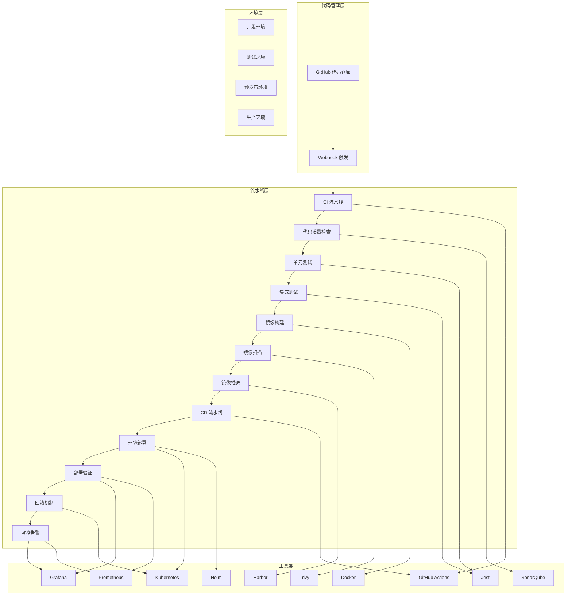

# 智能餐饮平台CI/CD流水线详细配置文档

## 1. CI/CD架构概述

本文档详细描述智能餐饮平台的CI/CD（持续集成/持续交付）流水线设计与配置，旨在实现代码的自动化构建、测试、部署和发布，提高开发效率、保证代码质量、加速业务迭代。

### 1.1 设计原则

1. **自动化优先**：尽可能自动化所有可重复的流程，减少人工干预
2. **分层构建**：采用分层构建策略，提高构建效率
3. **环境一致性**：确保从开发到生产环境的一致性
4. **快速反馈**：在流水线早期发现和解决问题，缩短反馈周期
5. **安全集成**：将安全检查融入流水线的各个阶段
6. **可扩展性**：支持微服务架构的横向扩展
7. **可回滚性**：确保部署失败时能够快速回滚到稳定版本

### 1.2 流水线架构图



## 2. 工具选型

| 工具类别 | 工具名称 | 版本 | 用途 | 优势 |
|---------|---------|-----|-----|-----|
| 代码管理 | GitHub | 最新 | 代码仓库、版本控制 | 广泛使用、生态完善、与GitHub Actions集成良好 |
| CI/CD工具 | GitHub Actions | 最新 | 流水线自动化 | 与GitHub深度集成、配置简单、支持多种环境 |
| 代码质量 | SonarQube | 9.9LTS | 代码质量检查、安全扫描 | 全面的代码质量分析、支持多种语言、可定制规则 |
| 自动化测试 | Jest | 29.7.0 | 单元测试、集成测试 | 快速、易用、支持快照测试 |
| 容器化 | Docker | 24.0.0 | 容器构建、运行 | 标准化容器格式、生态完善 |
| 镜像扫描 | Trivy | 0.46.0 | 容器镜像漏洞扫描 | 快速、全面、支持多种镜像格式 |
| 镜像仓库 | Harbor | 2.8.0 | 容器镜像管理 | 企业级功能、安全扫描集成、RBAC支持 |
| 编排工具 | Kubernetes | 1.27.0 | 容器编排、部署管理 | 强大的编排能力、高可用、可扩展 |
| 包管理 | Helm | 3.12.0 | Kubernetes应用打包、部署 | 简化部署配置、支持版本管理、回滚 |
| 监控告警 | Prometheus + Grafana | 2.45.0 + 10.2.0 | 监控、可视化、告警 | 强大的监控能力、灵活的可视化、丰富的告警规则 |

## 3. 流水线配置

### 3.1 整体流水线流程

| 阶段 | 名称 | 主要任务 | 触发条件 | 失败策略 |
|-----|-----|---------|---------|---------|
| 1 | 代码提交 | 开发者提交代码到GitHub | 代码push到develop/main分支 | 无 |
| 2 | CI触发 | Webhook触发GitHub Actions | 代码提交或PR创建 | 无 |
| 3 | 代码质量检查 | SonarQube代码分析 | CI触发后立即执行 | 严重问题时失败 |
| 4 | 自动化测试 | 单元测试、集成测试 | 代码质量检查通过后执行 | 测试失败时失败 |
| 5 | 镜像构建 | Docker镜像构建 | 测试通过后执行 | 构建失败时失败 |
| 6 | 镜像扫描 | Trivy漏洞扫描 | 镜像构建完成后执行 | 高危漏洞时失败 |
| 7 | 镜像推送 | 推送到Harbor镜像仓库 | 镜像扫描通过后执行 | 推送失败时失败 |
| 8 | CD触发 | 根据分支触发不同环境的部署 | 镜像推送完成后执行 | 无 |
| 9 | 环境部署 | 使用Helm部署到Kubernetes | CD触发后执行 | 部署失败时失败并回滚 |
| 10 | 部署验证 | 验证服务是否正常运行 | 部署完成后执行 | 验证失败时失败并回滚 |
| 11 | 监控告警 | 监控服务运行状态 | 部署验证通过后执行 | 异常时告警 |

### 3.2 代码质量检查配置

#### 3.2.1 SonarQube配置

1. **SonarQube服务器配置**

```properties
# sonar.properties
sonar.web.host=0.0.0.0
sonar.web.port=9000
sonar.jdbc.username=sonar
sonar.jdbc.password=sonar
sonar.jdbc.url=jdbc:postgresql://sonarqube-db:5432/sonar
sonar.log.level=INFO
sonar.path.data=/opt/sonarqube/data
sonar.path.temp=/opt/sonarqube/temp
sonar.path.logs=/opt/sonarqube/logs
```

2. **项目配置文件 (sonar-project.properties)**

```properties
# 项目基本信息 - 以API网关为例
sonar.projectKey=yyc3-api-gateway
sonar.projectName=API网关
sonar.projectVersion=1.0.0

# 源代码路径
sonar.sources=src

# 测试代码路径
sonar.tests=test

# 语言和编码
sonar.language=javascript
sonar.sourceEncoding=UTF-8

# JavaScript/TypeScript配置
sonar.javascript.lcov.reportPaths=coverage/lcov.info
sonar.javascript.nodejs.executable=/usr/local/bin/node

# 排除文件
sonar.exclusions=**/node_modules/**,**/dist/**,**/build/**
```

3. **GitHub Actions集成**

```yaml
# .github/workflows/ci-cd.yml
# SonarQube分析阶段集成在主CI/CD流水线中
sonarqube-analysis:
  name: SonarQube Analysis
  runs-on: ubuntu-latest
  needs: quality-check
  steps:
    - name: Checkout code
      uses: actions/checkout@v4

    - name: Setup Bun environment
      uses: oven-sh/setup-bun@v1.0.5
      with:
        bun-version: 1.1.20

    - name: Install dependencies
      run: bun install --frozen-lockfile

    - name: Run tests with coverage
      run: bun test --coverage

    - name: SonarQube Analysis
      uses: SonarSource/sonarqube-scan-action@v2.0.0
      env:
        SONAR_TOKEN: ${{ secrets.SONAR_TOKEN }}
        SONAR_HOST_URL: ${{ secrets.SONAR_HOST_URL }}

    - name: SonarQube Quality Gate check
      uses: SonarSource/sonarqube-quality-gate-action@v1.0.0
      timeout-minutes: 5
      env:
        SONAR_TOKEN: ${{ secrets.SONAR_TOKEN }}
```

### 3.3 自动化测试配置

#### 3.3.1 单元测试配置

1. **Maven Surefire插件配置**

```xml
<plugin>
    <groupId>org.apache.maven.plugins</groupId>
    <artifactId>maven-surefire-plugin</artifactId>
    <version>3.1.2</version>
    <configuration>
        <includes>
            <include>**/*Test.java</include>
        </includes>
        <excludes>
            <exclude>**/*IntegrationTest.java</exclude>
            <exclude>**/*E2ETest.java</exclude>
        </excludes>
        <argLine>-Xmx2g -XX:MaxPermSize=512m</argLine>
    </configuration>
</plugin>
```

2. **GitHub Actions集成**

```yaml
# .github/workflows/unit-tests.yml
name: Unit Tests

on:
  push:
    branches: [ develop, main ]
  pull_request:
    branches: [ develop, main ]

jobs:
  unit-tests:
    name: Unit Tests
    runs-on: ubuntu-latest
    steps:
      - name: Checkout code
        uses: actions/checkout@v3

      - name: Set up JDK 17
        uses: actions/setup-java@v3
        with:
          java-version: '17'
          distribution: 'adopt'

      - name: Cache Maven dependencies
        uses: actions/cache@v3
        with:
          path: ~/.m2/repository
          key: ${{ runner.os }}-maven-${{ hashFiles('**/pom.xml') }}
          restore-keys: |
            ${{ runner.os }}-maven-

      - name: Run unit tests
        run: mvn -B test-compile test -Dtest=**/*Test.java

      - name: Publish test results
        uses: actions/upload-artifact@v3
        with:
          name: test-results
          path: target/surefire-reports/
        if: always()
```

#### 3.3.2 集成测试配置

1. **Maven Failsafe插件配置**

```xml
<plugin>
    <groupId>org.apache.maven.plugins</groupId>
    <artifactId>maven-failsafe-plugin</artifactId>
    <version>3.1.2</version>
    <configuration>
        <includes>
            <include>**/*IntegrationTest.java</include>
        </includes>
        <argLine>-Xmx2g -XX:MaxPermSize=512m</argLine>
    </configuration>
    <executions>
        <execution>
            <goals>
                <goal>integration-test</goal>
                <goal>verify</goal>
            </goals>
        </execution>
    </executions>
</plugin>
```

2. **GitHub Actions集成**

```yaml
# .github/workflows/integration-tests.yml
name: Integration Tests

on:
  push:
    branches: [ develop, main ]
  pull_request:
    branches: [ develop, main ]

jobs:
  integration-tests:
    name: Integration Tests
    runs-on: ubuntu-latest
    services:
      postgres:
        image: postgres:14
        env:
          POSTGRES_DB: test_db
          POSTGRES_USER: test_user
          POSTGRES_PASSWORD: test_password
        ports:
          - 5432:5432
        options: >-
          --health-cmd pg_isready
          --health-interval 10s
          --health-timeout 5s
          --health-retries 5
      redis:
        image: redis:7
        ports:
          - 6379:6379
        options: >-
          --health-cmd "redis-cli ping"
          --health-interval 10s
          --health-timeout 5s
          --health-retries 5

    steps:
      - name: Checkout code
        uses: actions/checkout@v3

      - name: Set up JDK 17
        uses: actions/setup-java@v3
        with:
          java-version: '17'
          distribution: 'adopt'

      - name: Cache Maven dependencies
        uses: actions/cache@v3
        with:
          path: ~/.m2/repository
          key: ${{ runner.os }}-maven-${{ hashFiles('**/pom.xml') }}
          restore-keys: |
            ${{ runner.os }}-maven-

      - name: Run integration tests
        run: mvn -B verify -Dtest=**/*IntegrationTest.java
        env:
          DB_URL: jdbc:postgresql://localhost:5432/test_db
          DB_USER: test_user
          DB_PASSWORD: test_password
          REDIS_HOST: localhost
          REDIS_PORT: 6379

      - name: Publish test results
        uses: actions/upload-artifact@v3
        with:
          name: integration-test-results
          path: target/failsafe-reports/
        if: always()
```

### 3.4 容器镜像构建配置

#### 3.4.1 Dockerfile配置

```dockerfile
# 使用分层构建策略
FROM maven:3.8.8-eclipse-temurin-17 AS builder
WORKDIR /app
COPY pom.xml .
RUN mvn dependency:go-offline
COPY src ./src
RUN mvn clean package -DskipTests

FROM eclipse-temurin:17-jre-alpine
WORKDIR /app
COPY --from=builder /app/target/*.jar app.jar

# 添加健康检查
HEALTHCHECK --interval=30s --timeout=3s --start-period=60s --retries=3 \
    CMD java -jar app.jar health || exit 1

# 运行应用
ENTRYPOINT ["java", "-jar", "app.jar"]
```

#### 3.4.2 GitHub Actions集成

```yaml
# .github/workflows/build-push-image.yml
name: Build and Push Docker Image

on:
  push:
    branches: [ develop, main ]
    tags: [ 'v*.*.*' ]
  pull_request:
    branches: [ develop, main ]

jobs:
  build-and-push:
    name: Build and Push Docker Image
    runs-on: ubuntu-latest
    steps:
      - name: Checkout code
        uses: actions/checkout@v3

      - name: Set up QEMU
        uses: docker/setup-qemu-action@v2

      - name: Set up Docker Buildx
        uses: docker/setup-buildx-action@v2

      - name: Login to Harbor
        uses: docker/login-action@v2
        with:
          registry: harbor.yyc3.com
          username: ${{ secrets.HARBOR_USERNAME }}
          password: ${{ secrets.HARBOR_PASSWORD }}

      - name: Extract metadata (tags, labels)
        id: meta
        uses: docker/metadata-action@v4
        with:
          images: harbor.yyc3.com/yyc3/${{ github.event.repository.name }}
          tags: |
            type=ref,event=branch
            type=ref,event=pr
            type=semver,pattern={{version}}
            type=semver,pattern={{major}}.{{minor}}
            type=sha

      - name: Build and push
        uses: docker/build-push-action@v4
        with:
          context: .
          push: ${{ github.event_name != 'pull_request' }}
          tags: ${{ steps.meta.outputs.tags }}
          labels: ${{ steps.meta.outputs.labels }}
          cache-from: type=gha
          cache-to: type=gha,mode=max
          build-args: |
            NODE_ENV=production
            PORT=3000

# 多阶段构建示例 (Dockerfile)
```dockerfile
# 依赖安装阶段
FROM oven/bun:1-alpine AS deps
WORKDIR /app
COPY package.json bun.lockb ./
RUN bun install --production

# 构建阶段
FROM oven/bun:1-alpine AS builder
WORKDIR /app
COPY --from=deps /app/node_modules ./node_modules
COPY . .
RUN bun run build

# 生产阶段
FROM oven/bun:1-alpine
WORKDIR /app

# 创建非root用户
RUN addgroup -S yyc3 && adduser -S yyc3 -G yyc3

# 安装必要的系统包
RUN apk add --no-cache curl=8.4.0-r0 dumb-init=1.2.5-r2

# 设置目录权限
RUN mkdir -p /app/logs && chown -R yyc3:yyc3 /app

# 复制构建产物
COPY --from=builder /app/dist ./dist
COPY --from=deps /app/node_modules ./node_modules
COPY package.json ./

# 环境变量
ENV NODE_ENV=production
ENV PORT=3000
ENV LOG_DIR=/app/logs

# 健康检查
HEALTHCHECK --interval=30s --timeout=3s --start-period=5s --retries=3 \
  CMD curl -f http://localhost:3000/health || exit 1

# 使用非root用户
USER yyc3

# 启动应用
ENTRYPOINT ["dumb-init", "bun", "run", "start"]
```
```

### 3.5 镜像安全扫描配置

#### 3.5.1 Trivy扫描配置

```yaml
# .github/workflows/image-scan.yml
name: Docker Image Security Scan

on:
  push:
    branches: [ develop, main ]
    tags: [ 'v*.*.*' ]
  pull_request:
    branches: [ develop, main ]

jobs:
  image-scan:
    name: Docker Image Security Scan
    runs-on: ubuntu-latest
    steps:
      - name: Checkout code
        uses: actions/checkout@v3

      - name: Set up Docker Buildx
        uses: docker/setup-buildx-action@v2

      - name: Build Docker image
        uses: docker/build-push-action@v4
        with:
          context: .
          push: false
          load: true
          tags: ${{ github.event.repository.name }}:latest

      - name: Run Trivy vulnerability scanner
        uses: aquasecurity/trivy-action@master
        with:
          image-ref: '${{ github.event.repository.name }}:latest'
          format: 'sarif'
          output: 'trivy-results.sarif'
          severity: 'CRITICAL,HIGH'

      - name: Upload Trivy scan results to GitHub Security tab
        uses: github/codeql-action/upload-sarif@v2
        with:
          sarif_file: 'trivy-results.sarif'
        if: always()

      - name: Fail on critical or high vulnerabilities
        run: |
          if grep -q "CRITICAL\|HIGH" trivy-results.sarif; then
            echo "Critical or High vulnerabilities found!"
            exit 1
          fi
```

### 3.6 Kubernetes部署配置

#### 3.6.1 Helm Chart配置结构

```
user-service/
├── Chart.yaml          # Chart信息
├── values.yaml         # 默认配置值
├── templates/
│   ├── deployment.yaml # Deployment配置
│   ├── service.yaml    # Service配置
│   ├── ingress.yaml    # Ingress配置
│   ├── hpa.yaml        # HPA配置
│   ├── configmap.yaml  # ConfigMap配置
│   └── secret.yaml     # Secret配置
└── charts/             # 依赖的子Chart
```

#### 3.6.2 核心Helm模板

1. **API网关Deployment配置**

```yaml
# templates/api-gateway-deployment.yaml
apiVersion: apps/v1
kind: Deployment
metadata:
  name: api-gateway
  namespace: {{ .Release.Namespace }}
  labels:
    app: api-gateway
    environment: {{ .Values.environment }}
spec:
  replicas: {{ .Values.apiGateway.replicaCount }}
  selector:
    matchLabels:
      app: api-gateway
  template:
    metadata:
      labels:
        app: api-gateway
        environment: {{ .Values.environment }}
    spec:
      containers:
        - name: api-gateway
          image: {{ .Values.apiGateway.image.repository }}:{{ .Values.apiGateway.image.tag }}
          imagePullPolicy: {{ .Values.apiGateway.image.pullPolicy }}
          ports:
            - containerPort: 3000
          env:
            - name: NODE_ENV
              value: "production"
            - name: PORT
              value: "3000"
            - name: LOG_LEVEL
              value: "info"
            - name: SECRET_KEY
              valueFrom:
                secretKeyRef:
                  name: api-gateway-secret
                  key: secret-key
          livenessProbe:
            httpGet:
              path: /health
              port: 3000
            initialDelaySeconds: 30
            periodSeconds: 10
          readinessProbe:
            httpGet:
              path: /health
              port: 3000
            initialDelaySeconds: 10
            periodSeconds: 5
          resources:
            limits:
              cpu: 1000m
              memory: 1Gi
            requests:
              cpu: 500m
              memory: 512Mi
```

2. **API网关Service配置**

```yaml
# templates/api-gateway-service.yaml
{{- if .Values.apiGateway.enabled }}
apiVersion: v1
kind: Service
metadata:
  name: api-gateway-service
  namespace: {{ .Release.Namespace }}
  labels:
    app: api-gateway
    environment: {{ .Values.environment }}
spec:
  type: {{ .Values.apiGateway.service.type }}
  ports:
    - port: {{ .Values.apiGateway.service.port }}
      targetPort: 3000
      protocol: TCP
  selector:
    app: api-gateway
{{- end }}
      {{- with .Values.tolerations }}
      tolerations:
        {{- toYaml . | nindent 8 }}
      {{- end }}
```

2. **values.yaml配置**

```yaml
# values.yaml
replicaCount: 3

image:
  repository: harbor.yyc3.com/yyc3/user-service
  pullPolicy: IfNotPresent
  tag: "latest"

imagePullSecrets:
  - name: harbor-secret

deploymentStrategy: RollingUpdate
rollingUpdate:
  maxSurge: 1
  maxUnavailable: 0

service:
  type: ClusterIP
  port: 8080

ingress:
  enabled: true
  className: "nginx"
  annotations:
    kubernetes.io/ingress.class: nginx
    nginx.ingress.kubernetes.io/ssl-redirect: "true"
    cert-manager.io/cluster-issuer: "letsencrypt-prod"
  hosts:
    - host: user-service-dev.yyc3.com
      paths:
        - path: /
          pathType: ImplementationSpecific
  tls:
    - secretName: user-service-tls
      hosts:
        - user-service-dev.yyc3.com

livenessProbe:
  httpGet:
    path: /actuator/health/liveness
    port: http
  initialDelaySeconds: 60
  periodSeconds: 10
  timeoutSeconds: 3
  failureThreshold: 3

readinessProbe:
  httpGet:
    path: /actuator/health/readiness
    port: http
  initialDelaySeconds: 30
  periodSeconds: 5
  timeoutSeconds: 3
  failureThreshold: 3

resources:
  limits:
    cpu: 1000m
    memory: 2Gi
  requests:
    cpu: 500m
    memory: 1Gi

autoscaling:
  enabled: true
  minReplicas: 3
  maxReplicas: 10
  targetCPUUtilizationPercentage: 80
  targetMemoryUtilizationPercentage: 80

nodeSelector:
  role: app

affinity:
  podAntiAffinity:
    requiredDuringSchedulingIgnoredDuringExecution:
    - labelSelector:
        matchExpressions:
        - key: app.kubernetes.io/name
          operator: In
          values:
          - user-service
      topologyKey: "kubernetes.io/hostname"

tolerations:
  - key: "role"
    operator: "Equal"
    value: "app"
    effect: "NoSchedule"

configmap:
  SPRING_PROFILES_ACTIVE: dev
  SPRING_DATASOURCE_URL: jdbc:postgresql://postgres-dev:5432/user_service_dev
  SPRING_REDIS_HOST: redis-dev
  SPRING_REDIS_PORT: 6379
  SPRING_CLOUD_NACOS_DISCOVERY_SERVER_ADDR: nacos-dev:8848
  SPRING_CLOUD_NACOS_CONFIG_SERVER_ADDR: nacos-dev:8848

secret:
  SPRING_DATASOURCE_USERNAME: cm9vdA==
  SPRING_DATASOURCE_PASSWORD: cGFzc3dvcmQ=
  SPRING_REDIS_PASSWORD: cGFzc3dvcmQ=
  SPRING_CLOUD_NACOS_DISCOVERY_USERNAME: YWRtaW4=
  SPRING_CLOUD_NACOS_DISCOVERY_PASSWORD: YWRtaW4=
  SPRING_CLOUD_NACOS_CONFIG_USERNAME: YWRtaW4=
  SPRING_CLOUD_NACOS_CONFIG_PASSWORD: YWRtaW4=
```

### 3.7 环境部署配置

#### 3.7.1 GitHub Actions部署配置

```yaml
# .github/workflows/deploy.yml
name: Deploy to Kubernetes

on:
  push:
    branches:
      - develop
      - main
    tags:
      - 'v*.*.*'

jobs:
  deploy:
    name: Deploy to Kubernetes
    runs-on: ubuntu-latest
    environment: ${{ github.ref == 'refs/heads/main' && 'production' || github.ref == 'refs/heads/develop' && 'development' || 'staging' }}
    steps:
      - name: Checkout code
        uses: actions/checkout@v3

      - name: Set up Helm
        uses: azure/setup-helm@v3
        with:
          version: v3.12.0

      - name: Set up kubectl
        uses: azure/setup-kubectl@v3
        with:
          version: v1.27.0

      - name: Login to Kubernetes cluster
        uses: azure/k8s-set-context@v3
        with:
          kubeconfig: ${{ secrets.KUBE_CONFIG }}

      - name: Deploy to Kubernetes
        run: |
          # 部署前检查
          helm lint ./helm
          
          # 根据分支选择环境
          if [ "${{ github.ref }}" == "refs/heads/develop" ]; then
            ENV=dev
          elif [ "${{ github.ref }}" == "refs/heads/main" ]; then
            ENV=prod
          else
            ENV=staging
          fi
          
          # 部署应用
          helm upgrade --install ${{ github.event.repository.name }} ./helm \
            --namespace yyc3-${ENV} \
            --create-namespace \
            --set image.tag=${GITHUB_SHA::7} \
            --set configmap.SPRING_PROFILES_ACTIVE=${ENV} \
            --values ./helm/values-${ENV}.yaml

      - name: Verify deployment
        run: |
          # 根据分支选择环境
          if [ "${{ github.ref }}" == "refs/heads/develop" ]; then
            ENV=dev
          elif [ "${{ github.ref }}" == "refs/heads/main" ]; then
            ENV=prod
          else
            ENV=staging
          fi
          
          # 等待部署完成
          kubectl rollout status deployment/${{ github.event.repository.name }} -n yyc3-${ENV} --timeout=5m
          
          # 检查Pod状态
          kubectl get pods -n yyc3-${ENV} -l app.kubernetes.io/name=${{ github.event.repository.name }}
          
          # 检查服务状态
          kubectl get service -n yyc3-${ENV} ${{ github.event.repository.name }}

      - name: Rollback on failure
        if: failure()
        run: |
          # 根据分支选择环境
          if [ "${{ github.ref }}" == "refs/heads/develop" ]; then
            ENV=dev
          elif [ "${{ github.ref }}" == "refs/heads/main" ]; then
            ENV=prod
          else
            ENV=staging
          fi
          
          # 尝试回滚到上一个版本
          helm rollback ${{ github.event.repository.name }} 0 -n yyc3-${ENV}
```

## 4. 环境管理

### 4.1 环境分类

| 环境名称 | 用途 | 分支 | 部署策略 | 资源配置 | 数据来源 |
|---------|-----|-----|---------|---------|---------|
| 开发环境 (dev) | 开发人员测试 | develop | 自动部署 | 低配 | 测试数据 |
| 测试环境 (test) | 功能测试、集成测试 | release | 手动触发 | 中配 | 测试数据 |
| 预发布环境 (staging) | 预发布验证、用户验收测试 | main | 手动触发 | 高配 | 生产镜像数据 |
| 生产环境 (prod) | 线上业务运行 | tags | 手动触发+审批 | 高配 | 生产数据 |

### 4.2 环境隔离

1. **网络隔离**：使用Kubernetes Namespace实现环境间的网络隔离
2. **资源隔离**：使用ResourceQuota和LimitRange限制各环境的资源使用
3. **数据隔离**：每个环境使用独立的数据库实例和缓存实例
4. **配置隔离**：使用不同的配置文件和密钥管理各环境的配置

### 4.3 环境变量管理

使用Kubernetes ConfigMap和Secret管理环境变量：

1. **ConfigMap**：存储非敏感配置信息
2. **Secret**：存储敏感配置信息，如数据库密码、API密钥等
3. **外部配置中心**：使用Nacos作为外部配置中心，支持动态配置更新

## 5. 部署策略

### 5.1 滚动更新

```yaml
# 滚动更新配置示例
spec:
  strategy:
    type: RollingUpdate
    rollingUpdate:
      maxSurge: 25%  # 允许超过期望Pod数量的最大百分比
      maxUnavailable: 25%  # 允许不可用Pod的最大百分比
```

### 5.2 蓝绿部署

1. **部署蓝色环境**：部署新版本到蓝色环境
2. **验证蓝色环境**：在蓝色环境进行功能验证和性能测试
3. **切换流量**：将流量从绿色环境切换到蓝色环境
4. **监控蓝色环境**：监控蓝色环境的运行状态
5. **回滚（如有必要）**：如果出现问题，将流量切回绿色环境

### 5.3 灰度发布

1. **部署灰度版本**：部署新版本到部分Pod
2. **流量路由**：将部分用户流量路由到灰度版本
3. **监控和收集反馈**：监控灰度版本的运行状态和用户反馈
4. **逐步扩大灰度范围**：根据监控结果逐步扩大灰度范围
5. **全量发布或回滚**：如果灰度版本稳定，进行全量发布；否则回滚

## 6. 质量保障

### 6.1 代码质量检查

1. **静态代码分析**：使用SonarQube进行代码质量、安全性、可维护性分析
2. **代码风格检查**：使用Checkstyle、PMD等工具检查代码风格
3. **依赖检查**：使用OWASP Dependency-Check检查依赖库的安全漏洞

### 6.2 自动化测试

1. **单元测试**：对单个组件或函数进行测试，覆盖率要求≥80%
2. **集成测试**：测试组件间的交互，覆盖率要求≥60%
3. **端到端测试**：测试完整的业务流程，关键流程覆盖率要求≥100%
4. **性能测试**：使用JMeter进行性能测试，确保系统满足性能要求

### 6.3 安全检查

1. **代码安全扫描**：使用SonarQube、Snyk等工具进行代码安全扫描
2. **镜像安全扫描**：使用Trivy、Clair等工具进行容器镜像安全扫描
3. **依赖安全检查**：使用OWASP Dependency-Check、Snyk等工具检查依赖库的安全漏洞
4. **运行时安全**：使用Kube-bench、Kubeaudit等工具检查Kubernetes集群的安全配置

## 7. 监控与回滚

### 7.1 部署监控

1. **Pod状态监控**：监控Pod的运行状态、重启次数等
2. **服务可用性监控**：监控服务的响应时间、错误率、吞吐量等
3. **资源使用监控**：监控CPU、内存、磁盘、网络等资源的使用情况
4. **业务指标监控**：监控订单量、交易额、用户活跃度等业务指标

### 7.2 自动回滚

1. **基于健康检查的回滚**：当Pod健康检查失败时自动回滚
2. **基于监控指标的回滚**：当监控指标超过阈值时自动回滚
3. **手动回滚**：支持通过命令行或UI手动回滚到指定版本

```bash
# 手动回滚示例
helm rollback <release-name> <revision-number> -n <namespace>
```

## 8. CI/CD最佳实践

### 8.1 分支管理

采用Git Flow分支管理策略：

1. **master**：生产环境稳定版本
2. **develop**：开发环境集成版本
3. **feature/**：新功能开发分支
4. **release/**：发布准备分支
5. **hotfix/**：紧急修复分支

### 8.2 版本管理

采用语义化版本号（Semantic Versioning）：

```
MAJOR.MINOR.PATCH
```

- **MAJOR**：不兼容的API变更
- **MINOR**：向下兼容的功能性新增
- **PATCH**：向下兼容的问题修正

### 8.3 流水线优化

1. **缓存机制**：使用缓存减少构建时间
2. **并行执行**：并行执行测试和构建任务
3. **增量构建**：只构建变更的部分
4. **分层构建**：采用Docker分层构建策略
5. **故障隔离**：确保单个服务的构建失败不影响其他服务

### 8.4 安全最佳实践

1. **最小权限原则**：为CI/CD流水线和服务账号分配最小必要权限
2. **密钥管理**：使用加密的方式存储和管理密钥
3. **安全扫描**：在流水线的各个阶段进行安全扫描
4. **审计日志**：记录所有CI/CD操作的审计日志
5. **漏洞修复**：及时修复发现的安全漏洞

## 9. 常见问题与解决方案

### 9.1 构建失败

| 问题 | 可能原因 | 解决方案 |
|-----|---------|---------|
| 依赖下载失败 | 网络问题或依赖仓库不可用 | 检查网络连接，使用国内镜像源 |
| 编译错误 | 代码语法错误或依赖版本冲突 | 修复代码错误，检查依赖版本 |
| 测试失败 | 测试用例编写错误或功能实现错误 | 修复测试用例或功能实现 |
| 镜像构建失败 | Dockerfile语法错误或构建上下文问题 | 检查Dockerfile语法，确保构建上下文正确 |

### 9.2 部署失败

| 问题 | 可能原因 | 解决方案 |
|-----|---------|---------|
| 镜像拉取失败 | 镜像仓库认证失败或镜像不存在 | 检查镜像仓库认证信息，确保镜像存在 |
| Pod启动失败 | 配置错误或资源不足 | 检查配置文件，调整资源配额 |
| 健康检查失败 | 应用启动时间过长或功能异常 | 调整健康检查参数，修复应用功能 |
| 服务不可访问 | 网络配置错误或Ingress配置错误 | 检查网络策略和Ingress配置 |

### 9.3 性能问题

| 问题 | 可能原因 | 解决方案 |
|-----|---------|---------|
| 构建时间过长 | 依赖下载慢或构建任务过多 | 使用缓存，并行执行构建任务 |
| 部署时间过长 | Pod启动时间长或资源不足 | 优化应用启动时间，增加资源配额 |
| 测试时间过长 | 测试用例过多或测试效率低 | 优化测试用例，并行执行测试 |

## 10. 附录

### 10.1 常用命令

| 命令 | 用途 | 示例 |
|-----|-----|-----|
| `helm install` | 安装Helm Chart | `helm install user-service ./helm -n yyc3-dev` |
| `helm upgrade` | 升级Helm Chart | `helm upgrade user-service ./helm -n yyc3-dev` |
| `helm rollback` | 回滚Helm Chart | `helm rollback user-service 1 -n yyc3-dev` |
| `helm uninstall` | 卸载Helm Chart | `helm uninstall user-service -n yyc3-dev` |
| `helm status` | 查看Helm Chart状态 | `helm status user-service -n yyc3-dev` |
| `kubectl get pods` | 查看Pod状态 | `kubectl get pods -n yyc3-dev` |
| `kubectl describe pod` | 查看Pod详细信息 | `kubectl describe pod user-service-xxx -n yyc3-dev` |
| `kubectl logs` | 查看Pod日志 | `kubectl logs user-service-xxx -n yyc3-dev` |
| `kubectl rollout status` | 查看部署状态 | `kubectl rollout status deployment/user-service -n yyc3-dev` |
| `kubectl rollout history` | 查看部署历史 | `kubectl rollout history deployment/user-service -n yyc3-dev` |
| `kubectl rollout undo` | 回滚部署 | `kubectl rollout undo deployment/user-service -n yyc3-dev` |

### 10.2 CI/CD流水线检查清单

1. **代码质量**
   - [ ] SonarQube质量门通过
   - [ ] 代码覆盖率达到要求
   - [ ] 没有严重的代码异味

2. **自动化测试**
   - [ ] 单元测试全部通过
   - [ ] 集成测试全部通过
   - [ ] 端到端测试关键流程通过

3. **镜像构建与安全**
   - [ ] Docker镜像构建成功
   - [ ] 镜像安全扫描通过，没有高危漏洞
   - [ ] 镜像推送到镜像仓库成功

4. **部署验证**
   - [ ] Pod成功启动
   - [ ] 健康检查通过
   - [ ] 服务可以正常访问
   - [ ] 关键功能验证通过

5. **监控与告警**
   - [ ] 监控指标正常
   - [ ] 告警规则配置正确
   - [ ] 可以正常接收告警通知

---

**文档版本**: 1.0.0  
**最后更新**: 2025-01-30  
**维护责任人**: YYC³团队