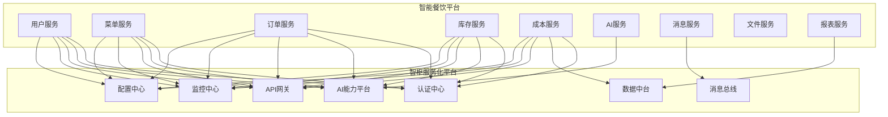

# 智能餐饮平台与智枢服务化平台集成方案

## 1. 概述

本文档详细描述智能餐饮平台与智枢服务化平台的集成方案，包括集成架构、接口规范、数据流转、安全策略等内容，确保两个平台能够高效、安全地协同工作，实现全链路智能化。

## 2. 集成架构设计

### 2.1 整体集成架构



### 2.2 集成原则

1. **松耦合**：服务间通过API网关通信，避免直接依赖
2. **高可用**：实现多级故障隔离和容错机制
3. **安全性**：统一认证授权，数据传输加密
4. **可扩展性**：模块化设计，支持按需集成
5. **可监控**：全链路监控，实时追踪集成状态

## 3. 核心集成点设计

### 3.1 认证授权集成

#### 3.1.1 集成概述

智能餐饮平台使用智枢服务化平台的认证中心实现统一认证授权，确保用户身份和权限管理的一致性。

#### 3.1.2 接口规范

| 接口名称 | 方法 | URL | 请求参数 | 响应参数 | 功能描述 |
|---------|------|-----|---------|---------|---------|
| 用户登录 | POST | /api/v1/auth/login | `{"username": "string", "password": "string"}` | `{"token": "string", "expiresIn": "long", "user": {...}}` | 用户身份验证 |
| 获取用户信息 | GET | /api/v1/auth/user | `Authorization: Bearer {token}` | `{"id": "long", "username": "string", "email": "string", "roles": [...]}` | 获取当前用户信息 |
| 权限验证 | POST | /api/v1/auth/validate | `{"token": "string", "resource": "string", "action": "string"}` | `{"valid": "boolean", "message": "string"}` | 验证用户权限 |
| 刷新令牌 | POST | /api/v1/auth/refresh | `{"refreshToken": "string"}` | `{"token": "string", "expiresIn": "long"}` | 刷新访问令牌 |

#### 3.1.3 实现细节

```java
// 智能餐饮平台 - 用户服务集成示例
@FeignClient(name = "auth-center", url = "${zhishu.auth-center.url}")
public interface AuthCenterClient {
    
    @PostMapping("/api/v1/auth/login")
    AuthResponse login(@RequestBody LoginRequest request);
    
    @GetMapping("/api/v1/auth/user")
    UserInfo getUserInfo(@RequestHeader("Authorization") String token);
    
    @PostMapping("/api/v1/auth/validate")
    PermissionResponse validatePermission(@RequestBody PermissionRequest request);
    
    @PostMapping("/api/v1/auth/refresh")
    AuthResponse refreshToken(@RequestBody RefreshTokenRequest request);
}
```

### 3.2 AI能力集成

#### 3.2.1 集成概述

智能餐饮平台集成智枢服务化平台的AI能力，包括智能推荐、预测分析、NLP处理等，提升业务智能化水平。

#### 3.2.2 AI能力列表

| AI能力 | 服务ID | 功能描述 | 技术栈 |
|-------|-------|---------|-------|
| 智能推荐 | ai-recommendation | 基于用户行为和偏好的菜品推荐 | TensorFlow, Redis |
| 需求预测 | ai-prediction | 基于历史数据的销售和库存需求预测 | PyTorch, InfluxDB |
| 文本分析 | ai-nlp | 客户评价分析和自动回复 | BERT, NLTK |
| 图像识别 | ai-vision | 菜品图像识别和分类 | YOLO, OpenCV |
| 语音识别 | ai-speech | 语音点餐和客服 | ASR, TTS |

#### 3.2.3 接口规范

| 接口名称 | 方法 | URL | 请求参数 | 响应参数 | 功能描述 |
|---------|------|-----|---------|---------|---------|
| 获取推荐菜品 | POST | /api/v1/ai/recommend/dishes | `{"userId": "long", "count": "int", "context": {...}}` | `{"recommendations": [{"dishId": "long", "score": "double", "reason": "string"}]}` | 为用户推荐菜品 |
| 销售预测 | POST | /api/v1/ai/predict/sales | `{"startDate": "string", "endDate": "string", "parameters": {...}}` | `{"predictions": [{"date": "string", "dishId": "long", "quantity": "int", "confidence": "double"}]}` | 预测菜品销售量 |
| 文本情感分析 | POST | /api/v1/ai/nlp/sentiment | `{"text": "string", "language": "string"}` | `{"sentiment": "string", "score": "double", "keywords": [...]}` | 分析文本情感 |
| 菜品图像识别 | POST | /api/v1/ai/vision/recognize | `{"imageUrl": "string", "confidenceThreshold": "double"}` | `{"results": [{"dishName": "string", "confidence": "double", "boundingBox": {...}}]}` | 识别菜品图像 |

#### 3.2.4 实现细节

```java
// 智能餐饮平台 - AI服务集成示例
@Service
public class ZhishuAIService {
    
    @Autowired
    private RestTemplate restTemplate;
    
    @Value("${zhishu.ai-platform.url}")
    private String aiPlatformUrl;
    
    @Value("${zhishu.api-key}")
    private String apiKey;
    
    public DishRecommendationResponse getDishRecommendations(Long userId, int count) {
        String url = aiPlatformUrl + "/api/v1/ai/recommend/dishes";
        
        HttpHeaders headers = new HttpHeaders();
        headers.setContentType(MediaType.APPLICATION_JSON);
        headers.set("X-API-KEY", apiKey);
        
        DishRecommendationRequest request = new DishRecommendationRequest();
        request.setUserId(userId);
        request.setCount(count);
        
        HttpEntity<DishRecommendationRequest> entity = new HttpEntity<>(request, headers);
        
        return restTemplate.postForObject(url, entity, DishRecommendationResponse.class);
    }
}
```

### 3.3 数据集成

#### 3.3.1 集成概述

智能餐饮平台与智枢服务化平台的数据中台集成，实现数据共享、数据分析和数据治理。

#### 3.3.2 数据集成模式

1. **批量数据同步**：定时同步历史数据
2. **实时数据流转**：使用CDC实现数据实时同步
3. **数据查询服务**：通过API查询数据中台的汇总数据

#### 3.3.3 接口规范

| 接口名称 | 方法 | URL | 请求参数 | 响应参数 | 功能描述 |
|---------|------|-----|---------|---------|---------|
| 同步用户数据 | POST | /api/v1/data/sync/users | `{"users": [...]}` | `{"success": "boolean", "count": "int", "failedIds": [...]}` | 同步用户数据 |
| 同步订单数据 | POST | /api/v1/data/sync/orders | `{"orders": [...]}` | `{"success": "boolean", "count": "int", "failedIds": [...]}` | 同步订单数据 |
| 查询销售报表 | GET | /api/v1/data/query/sales-report | `{"startDate": "string", "endDate": "string", "groupBy": "string"}` | `{"report": {...}}` | 查询销售报表数据 |
| 查询用户画像 | GET | /api/v1/data/query/user-profile/{userId} | N/A | `{"profile": {...}}` | 查询用户画像数据 |

#### 3.3.4 实现细节

```java
// 智能餐饮平台 - 数据集成示例
@Service
public class DataIntegrationService {
    
    @Autowired
    private JdbcTemplate jdbcTemplate;
    
    @Autowired
    private DataCenterClient dataCenterClient;
    
    @Scheduled(cron = "0 0 1 * * ?") // 每天凌晨1点执行
    public void syncDailyData() {
        // 获取昨天的订单数据
        String sql = "SELECT * FROM orders WHERE DATE(created_at) = DATE_SUB(CURDATE(), INTERVAL 1 DAY)";
        List<Order> orders = jdbcTemplate.query(sql, new OrderRowMapper());
        
        // 同步到数据中台
        SyncResponse response = dataCenterClient.syncOrders(orders);
        
        // 处理同步结果
        if (!response.isSuccess()) {
            // 记录失败日志
            log.error("订单数据同步失败，失败ID: {}", response.getFailedIds());
            // 重试失败的数据
            retryFailedSyncs(response.getFailedIds());
        }
    }
}
```

### 3.4 消息集成

#### 3.4.1 集成概述

智能餐饮平台与智枢服务化平台的消息总线集成，实现跨平台的消息传递和事件处理。

#### 3.4.2 消息主题设计

| 主题名称 | 描述 | 生产者 | 消费者 |
|---------|-----|-------|-------|
| user-registered | 用户注册事件 | 用户服务 | 消息服务、AI服务 |
| order-created | 订单创建事件 | 订单服务 | 库存服务、成本服务、消息服务 |
| inventory-updated | 库存更新事件 | 库存服务 | 成本服务、菜单服务 |
| dish-recommended | 菜品推荐事件 | AI服务 | 菜单服务、消息服务 |
| payment-completed | 支付完成事件 | 订单服务 | 消息服务、报表服务 |

#### 3.4.3 接口规范

| 接口名称 | 方法 | URL | 请求参数 | 响应参数 | 功能描述 |
|---------|------|-----|---------|---------|---------|
| 发布消息 | POST | /api/v1/message/publish | `{"topic": "string", "message": {...}, "headers": {...}}` | `{"messageId": "string", "status": "string"}` | 发布消息到消息总线 |
| 订阅消息 | POST | /api/v1/message/subscribe | `{"topic": "string", "callbackUrl": "string", "filter": {...}}` | `{"subscriptionId": "string", "status": "string"}` | 订阅消息主题 |
| 取消订阅 | DELETE | /api/v1/message/subscribe/{subscriptionId} | N/A | `{"success": "boolean", "message": "string"}` | 取消消息订阅 |
| 查询消息状态 | GET | /api/v1/message/{messageId} | N/A | `{"status": "string", "deliveryCount": "int", "lastDelivery": "string"}` | 查询消息状态 |

#### 3.4.4 实现细节

```java
// 智能餐饮平台 - 消息集成示例
@Service
public class MessageIntegrationService {
    
    @Autowired
    private MessageCenterClient messageCenterClient;
    
    public void publishOrderCreatedEvent(Order order) {
        OrderCreatedEvent event = new OrderCreatedEvent();
        event.setOrderId(order.getId());
        event.setOrderNumber(order.getOrderNumber());
        event.setUserId(order.getUserId());
        event.setTotalAmount(order.getTotalAmount());
        event.setCreatedAt(order.getCreatedAt());
        
        MessageRequest request = new MessageRequest();
        request.setTopic("order-created");
        request.setMessage(event);
        
        Map<String, String> headers = new HashMap<>();
        headers.put("source", "order-service");
        headers.put("version", "1.0");
        request.setHeaders(headers);
        
        MessageResponse response = messageCenterClient.publishMessage(request);
        
        if (!"SUCCESS".equals(response.getStatus())) {
            log.error("发布订单创建事件失败，消息ID: {}", response.getMessageId());
        }
    }
}
```

## 4. 安全策略

### 4.1 认证与授权

1. **统一认证**：使用智枢服务化平台的认证中心实现单点登录
2. **权限管理**：基于RBAC的细粒度权限控制
3. **令牌管理**：使用JWT令牌，支持刷新和吊销
4. **API密钥**：为每个服务分配唯一的API密钥

### 4.2 数据安全

1. **传输加密**：所有API调用使用TLS 1.3加密
2. **数据加密存储**：敏感数据加密存储，加密密钥统一管理
3. **数据脱敏**：接口返回数据进行脱敏处理
4. **访问审计**：记录所有数据访问日志

### 4.3 安全防护

1. **API网关防护**：实现限流、熔断、黑白名单
2. **DDoS防护**：防止分布式拒绝服务攻击
3. **SQL注入防护**：参数化查询，输入验证
4. **XSS防护**：输出编码，内容安全策略

## 5. 性能与可靠性

### 5.1 性能优化

1. **缓存策略**：多级缓存（本地缓存 + 分布式缓存）
2. **异步处理**：非关键路径使用异步通信
3. **批量处理**：减少API调用次数，使用批量接口
4. **连接池**：优化数据库和HTTP连接池配置

### 5.2 可靠性保障

1. **重试机制**：失败自动重试，指数退避算法
2. **熔断机制**：服务不可用时自动熔断
3. **降级策略**：核心功能优先，非核心功能降级
4. **故障转移**：多活部署，自动故障转移
5. **数据一致性**：使用SAGA模式保证分布式事务

## 6. 监控与告警

### 6.1 监控指标

| 指标类型 | 具体指标 | 监控对象 | 告警阈值 |
|---------|---------|---------|---------|
| 接口性能 | 响应时间 | 所有API | > 2秒 |
| 接口性能 | 错误率 | 所有API | > 5% |
| 接口性能 | QPS | 所有API | > 1000 |
| 系统资源 | CPU使用率 | 服务实例 | > 80% |
| 系统资源 | 内存使用率 | 服务实例 | > 85% |
| 数据库 | 连接数 | 数据库 | > 80% |
| 消息队列 | 消息堆积 | Kafka | > 10000 |

### 6.2 告警策略

| 告警级别 | 触发条件 | 通知方式 | 处理时间 |
|---------|---------|---------|---------|
| 紧急 | 核心服务不可用 | 短信 + 电话 | 10分钟内 |
| 严重 | 接口错误率>10% | 短信 + 邮件 | 30分钟内 |
| 警告 | 接口响应时间>3秒 | 邮件 | 2小时内 |
| 信息 | 服务重启 | 日志 | 24小时内 |

## 7. 部署与测试

### 7.1 部署架构

1. **容器化部署**：所有服务使用Docker容器
2. **Kubernetes集群**：使用K8s进行容器编排
3. **多环境部署**：开发、测试、预发布、生产环境
4. **灰度发布**：支持按比例灰度发布新版本

### 7.2 测试策略

1. **单元测试**：服务内部功能测试
2. **集成测试**：服务间接口测试
3. **端到端测试**：全流程业务测试
4. **性能测试**：负载和压力测试
5. **安全测试**：漏洞扫描和渗透测试

### 7.3 集成验证

| 集成点 | 验证内容 | 验证方法 | 验收标准 |
|-------|---------|---------|---------|
| 认证授权 | 登录、权限验证 | API测试 | 99.9%成功率 |
| AI能力 | 推荐、预测 | 功能测试 | 准确率>90% |
| 数据集成 | 数据同步、查询 | 数据比对 | 数据一致性100% |
| 消息集成 | 消息发布、订阅 | 事件测试 | 消息延迟<1秒 |

## 8. 维护与支持

### 8.1 文档维护

1. **接口文档**：使用Swagger自动生成和更新
2. **集成文档**：定期更新集成方案
3. **故障手册**：记录常见问题和解决方案
4. **变更日志**：记录所有变更内容

### 8.2 支持流程

1. **问题上报**：使用统一的问题追踪系统
2. **响应时间**：根据问题级别确定响应时间
3. **问题排查**：联合排查跨平台问题
4. **升级支持**：提供平台升级指导

## 9. 实施路线图

| 阶段 | 时间 | 实施内容 | 交付物 |
|-----|-----|---------|-------|
| 1 | 第1周 | 环境准备，API网关配置 | 环境准备报告 |
| 2 | 第2-3周 | 认证授权集成 | 集成测试报告 |
| 3 | 第4-5周 | AI能力集成 | AI功能测试报告 |
| 4 | 第6周 | 数据和消息集成 | 数据一致性报告 |
| 5 | 第7周 | 性能测试和优化 | 性能测试报告 |
| 6 | 第8周 | 系统联调和验收 | 验收报告 |

## 10. 附录

### 10.1 术语表

| 术语 | 解释 |
|------|-----|
| API网关 | 统一的API入口，提供路由、认证、限流等功能 |
| JWT | JSON Web Token，用于身份验证的令牌 |
| RBAC | 基于角色的访问控制 |
| SAGA | 分布式事务模式 |
| CDC | 变更数据捕获 |
| DLQ | 死信队列 |

### 10.2 联系方式

| 角色 | 联系方式 |
|-----|---------|
| 架构师 | architecture@yyc3.com |
| 开发负责人 | dev@yyc3.com |
| 运维负责人 | ops@yyc3.com |
| 客服支持 | support@yyc3.com |

---

**文档版本**: 1.0.0  
**最后更新**: 2025-01-30  
**维护责任人**: YYC³团队