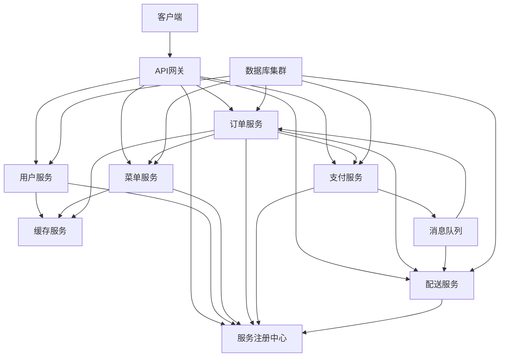
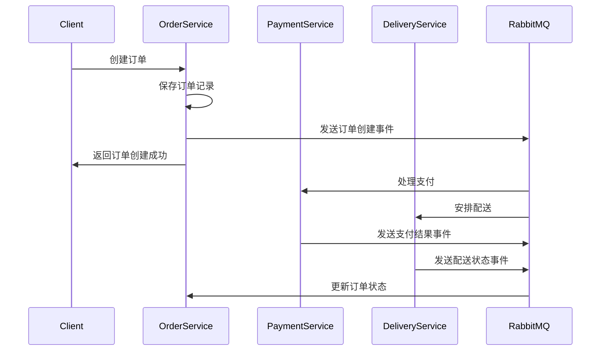

# 智能餐饮平台微服务通信与集成方案

## 1. 文档概述

### 1.1 文档目的

本文档旨在详细描述智能餐饮平台微服务架构下的服务间通信与集成方案，包括通信协议选择、消息传递机制、服务发现与负载均衡、API网关配置、数据一致性保障等方面，确保微服务系统能够高效、可靠地运行。

### 1.2 适用范围

本方案适用于智能餐饮平台所有微服务组件的开发、部署与维护，指导开发团队实现标准化的服务间通信与集成。

### 1.3 术语定义

| 术语 | 定义 |
|------|------|
| 微服务 | 小型、独立部署的服务单元，专注于单一业务功能 |
| API网关 | 统一的服务入口，负责请求路由、负载均衡、认证授权等 |
| 服务注册中心 | 管理微服务实例的注册与发现 |
| 消息队列 | 实现异步通信的中间件，支持消息的发布与订阅 |
| 同步通信 | 请求方发送请求后等待响应的通信方式 |
| 异步通信 | 请求方发送请求后不等待响应的通信方式 |

## 2. 通信架构概述

### 2.1 架构原则

- **松耦合**：服务间通信应基于明确定义的接口，减少直接依赖
- **高可用**：通信机制应具备容错能力，支持服务故障自动恢复
- **高性能**：选择合适的通信协议和序列化方式，优化通信效率
- **可观测性**：通信过程应具备完整的日志、监控和追踪能力
- **安全性**：通信数据应加密，支持身份认证和授权

### 2.2 架构图



## 3. 同步通信方案

### 3.1 REST API

#### 3.1.1 协议规范

- 使用HTTP/2协议，支持多路复用和头部压缩
- 统一使用JSON格式进行数据序列化
- 实现RESTful API设计原则，使用合适的HTTP方法（GET、POST、PUT、DELETE等）
- 合理使用HTTP状态码表示请求结果

#### 3.1.2 API设计规范

- 资源命名使用复数形式（如`/api/users`、`/api/menus`）
- 版本控制使用URL路径（如`/api/v1/users`）
- 查询参数使用 snake_case 命名风格
- 请求/响应体字段使用 camelCase 命名风格

#### 3.1.3 示例代码

```typescript
// 用户服务API示例（user-service/src/controllers/user.controller.ts）
import { Controller, Get, Post, Put, Delete, Param, Body } from '@nestjs/common';
import { UserService } from '../services/user.service';
import { UserDto } from '../dto/user.dto';

@Controller('api/v1/users')
export class UserController {
  constructor(private readonly userService: UserService) {}

  @Get()
  async findAll() {
    return await this.userService.findAll();
  }

  @Get(':id')
  async findOne(@Param('id') id: string) {
    return await this.userService.findOne(id);
  }

  @Post()
  async create(@Body() userDto: UserDto) {
    return await this.userService.create(userDto);
  }

  @Put(':id')
  async update(@Param('id') id: string, @Body() userDto: UserDto) {
    return await this.userService.update(id, userDto);
  }

  @Delete(':id')
  async remove(@Param('id') id: string) {
    return await this.userService.remove(id);
  }
}
```

### 3.2 gRPC

#### 3.2.1 适用场景

- 服务间需要高性能、低延迟通信
- 大量数据传输场景
- 内部服务通信，不需要暴露给外部客户端

#### 3.2.2 协议规范

- 使用Protocol Buffers（Proto3）作为接口定义语言
- 定义清晰的服务接口和消息类型
- 使用gRPC的四种通信模式：简单RPC、服务器流式RPC、客户端流式RPC、双向流式RPC

#### 3.2.3 示例代码

```protobuf
// 订单服务gRPC接口定义（order-service/src/proto/order.proto）
syntax = "proto3";

package order;

service OrderService {
  rpc CreateOrder(CreateOrderRequest) returns (OrderResponse);
  rpc GetOrder(GetOrderRequest) returns (OrderResponse);
  rpc ListOrders(ListOrdersRequest) returns (stream OrderResponse);
  rpc UpdateOrderStatus(UpdateOrderStatusRequest) returns (OrderResponse);
}

message CreateOrderRequest {
  string user_id = 1;
  repeated OrderItem items = 2;
  string delivery_address = 3;
}

message OrderItem {
  string menu_item_id = 1;
  int32 quantity = 2;
  double price = 3;
}

message GetOrderRequest {
  string order_id = 1;
}

message ListOrdersRequest {
  string user_id = 1;
}

message UpdateOrderStatusRequest {
  string order_id = 1;
  string status = 2;
}

message OrderResponse {
  string order_id = 1;
  string user_id = 2;
  repeated OrderItem items = 3;
  string status = 4;
  double total_amount = 5;
  string created_at = 6;
  string updated_at = 7;
}
```

```typescript
// 订单服务gRPC实现（order-service/src/services/order.grpc.service.ts）
import { Injectable } from '@nestjs/common';
import { OrderService } from '../proto/order_grpc_pb';
import { CreateOrderRequest, OrderResponse } from '../proto/order_pb';
import { OrderRepository } from '../repositories/order.repository';

@Injectable()
export class OrderGrpcService implements OrderService {
  constructor(private readonly orderRepository: OrderRepository) {}

  async createOrder(call: any, callback: any) {
    const request = call.request;
    const order = await this.orderRepository.create({
      userId: request.getUserId(),
      items: request.getItemsList().map(item => ({
        menuItemId: item.getMenuItemId(),
        quantity: item.getQuantity(),
        price: item.getPrice()
      })),
      status: 'CREATED',
      deliveryAddress: request.getDeliveryAddress()
    });

    const response = new OrderResponse();
    response.setOrderId(order.id);
    response.setUserId(order.userId);
    response.setStatus(order.status);
    response.setTotalAmount(order.totalAmount);
    response.setCreatedAt(order.createdAt.toISOString());
    response.setUpdatedAt(order.updatedAt.toISOString());

    callback(null, response);
  }

  // 其他方法实现...
}
```

## 4. 异步通信方案

### 4.1 消息队列选型

| 特性 | RabbitMQ | Kafka |
|------|----------|-------|
| 消息延迟 | 低 | 极低 |
| 吞吐量 | 中 | 高 |
| 持久化 | 支持 | 支持 |
| 消息确认 | 支持 | 支持 |
| 适用场景 | 事务性消息、短消息 | 大数据流、日志收集 |

**选型决策**：

- 核心业务流程（如订单创建、支付通知）使用RabbitMQ，确保消息可靠性和事务一致性
- 日志收集、数据同步等大数据量场景使用Kafka，利用其高吞吐量特性

### 4.2 RabbitMQ配置

#### 4.2.1 队列设计

| 队列名称 | 用途 | 持久化 | 消息过期时间 |
|----------|------|--------|--------------|
| order.created.queue | 订单创建事件 | 是 | 无 |
| order.cancelled.queue | 订单取消事件 | 是 | 无 |
| payment.success.queue | 支付成功事件 | 是 | 无 |
| payment.failed.queue | 支付失败事件 | 是 | 无 |
| order.completed.queue | 订单完成事件 | 是 | 无 |
| notification.email.queue | 邮件通知事件 | 是 | 60秒 |
| notification.sms.queue | SMS通知事件 | 是 | 60秒 |
| notification.push.queue | 推送通知事件 | 是 | 60秒 |

#### 4.2.2 配置代码

```typescript
// 消息队列配置（notification-service/src/config/rabbitmq.ts）
import amqp from 'amqplib';
import logger from './logger';

// RabbitMQ连接配置
const RABBITMQ_CONFIG = {
    host: process.env.RABBITMQ_HOST || 'localhost',
    port: parseInt(process.env.RABBITMQ_PORT || '5672'),
    username: process.env.RABBITMQ_USERNAME || 'guest',
    password: process.env.RABBITMQ_PASSWORD || 'guest',
    vhost: process.env.RABBITMQ_VHOST || '/'
};

// 队列名称常量
export const QUEUES = {
    ORDER_CREATED: 'order.created.queue',
    ORDER_CANCELLED: 'order.cancelled.queue',
    PAYMENT_SUCCESS: 'payment.success.queue',
    PAYMENT_FAILED: 'payment.failed.queue',
    ORDER_COMPLETED: 'order.completed.queue',
    NOTIFICATION_EMAIL: 'notification.email.queue',
    NOTIFICATION_SMS: 'notification.sms.queue',
    NOTIFICATION_PUSH: 'notification.push.queue'
};

// 交换机名称常量
export const EXCHANGES = {
    ORDER_EVENTS: 'order.events.exchange',
    PAYMENT_EVENTS: 'payment.events.exchange',
    NOTIFICATION_EVENTS: 'notification.events.exchange'
};

// 路由键常量
export const ROUTING_KEYS = {
    ORDER_CREATED: 'order.created',
    ORDER_CANCELLED: 'order.cancelled',
    PAYMENT_SUCCESS: 'payment.success',
    PAYMENT_FAILED: 'payment.failed',
    ORDER_COMPLETED: 'order.completed',
    SEND_EMAIL: 'notification.email',
    SEND_SMS: 'notification.sms',
    SEND_PUSH: 'notification.push'
};

let connection: amqp.Connection | null = null;
let channel: amqp.Channel | null = null;

/**
 * 建立RabbitMQ连接
 */
export const connectRabbitMQ = async (): Promise<void> => {
    try {
        const url = `amqp://${RABBITMQ_CONFIG.username}:${RABBITMQ_CONFIG.password}@${RABBITMQ_CONFIG.host}:${RABBITMQ_CONFIG.port}${RABBITMQ_CONFIG.vhost}`;
        connection = await amqp.connect(url);
        channel = await connection.createChannel();
        
        // 确保交换机存在
        await channel.assertExchange(EXCHANGES.ORDER_EVENTS, 'topic', { durable: true });
        await channel.assertExchange(EXCHANGES.PAYMENT_EVENTS, 'topic', { durable: true });
        await channel.assertExchange(EXCHANGES.NOTIFICATION_EVENTS, 'topic', { durable: true });
        
        // 确保队列存在并绑定
        await channel.assertQueue(QUEUES.ORDER_CREATED, { durable: true });
        await channel.bindQueue(QUEUES.ORDER_CREATED, EXCHANGES.ORDER_EVENTS, ROUTING_KEYS.ORDER_CREATED);
        
        await channel.assertQueue(QUEUES.ORDER_CANCELLED, { durable: true });
        await channel.bindQueue(QUEUES.ORDER_CANCELLED, EXCHANGES.ORDER_EVENTS, ROUTING_KEYS.ORDER_CANCELLED);
        
        await channel.assertQueue(QUEUES.PAYMENT_SUCCESS, { durable: true });
        await channel.bindQueue(QUEUES.PAYMENT_SUCCESS, EXCHANGES.PAYMENT_EVENTS, ROUTING_KEYS.PAYMENT_SUCCESS);
        
        await channel.assertQueue(QUEUES.PAYMENT_FAILED, { durable: true });
        await channel.bindQueue(QUEUES.PAYMENT_FAILED, EXCHANGES.PAYMENT_EVENTS, ROUTING_KEYS.PAYMENT_FAILED);
        
        await channel.assertQueue(QUEUES.ORDER_COMPLETED, { durable: true });
        await channel.bindQueue(QUEUES.ORDER_COMPLETED, EXCHANGES.ORDER_EVENTS, ROUTING_KEYS.ORDER_COMPLETED);
        
        await channel.assertQueue(QUEUES.NOTIFICATION_EMAIL, { 
            durable: true,
            arguments: {
                'x-dead-letter-exchange': 'dead.letter.exchange',
                'x-dead-letter-routing-key': 'dead.letter.email',
                'x-message-ttl': 60000,
                'x-max-length': 1000
            }
        });
        await channel.bindQueue(QUEUES.NOTIFICATION_EMAIL, EXCHANGES.NOTIFICATION_EVENTS, ROUTING_KEYS.SEND_EMAIL);
        
        await channel.assertQueue(QUEUES.NOTIFICATION_SMS, { 
            durable: true,
            arguments: {
                'x-dead-letter-exchange': 'dead.letter.exchange',
                'x-dead-letter-routing-key': 'dead.letter.sms',
                'x-message-ttl': 60000,
                'x-max-length': 1000
            }
        });
        await channel.bindQueue(QUEUES.NOTIFICATION_SMS, EXCHANGES.NOTIFICATION_EVENTS, ROUTING_KEYS.SEND_SMS);
        
        await channel.assertQueue(QUEUES.NOTIFICATION_PUSH, { 
            durable: true,
            arguments: {
                'x-dead-letter-exchange': 'dead.letter.exchange',
                'x-dead-letter-routing-key': 'dead.letter.push',
                'x-message-ttl': 60000,
                'x-max-length': 1000
            }
        });
        await channel.bindQueue(QUEUES.NOTIFICATION_PUSH, EXCHANGES.NOTIFICATION_EVENTS, ROUTING_KEYS.SEND_PUSH);
        
        // 死信队列配置
        await channel.assertExchange('dead.letter.exchange', 'topic', { durable: true });
        await channel.assertQueue('dead.letter.queue', { 
            durable: true
        });
        await channel.bindQueue('dead.letter.queue', 'dead.letter.exchange', '#');
        
        logger.info('RabbitMQ连接成功');
    } catch (error) {
        logger.error('RabbitMQ连接失败:', error);
        throw error;
    }
};

/**
 * 获取RabbitMQ通道
 */
export const getChannel = (): amqp.Channel => {
    if (!channel) {
        throw new Error('RabbitMQ通道未初始化');
    }
    return channel;
};

/**
 * 发送消息到队列
 * @param exchange 交换机名称
 * @param routingKey 路由键
 * @param message 消息内容
 * @param maxRetries 最大重试次数
 */
export const sendToQueue = async (exchange: string, routingKey: string, message: any, maxRetries = 3): Promise<void> => {
    let retries = 0;
    let success = false;
    
    while (retries < maxRetries && !success) {
        try {
            const channel = getChannel();
            const buffer = Buffer.from(JSON.stringify(message));
            
            await channel.publish(exchange, routingKey, buffer, { 
                persistent: true, // 消息持久化
                contentType: 'application/json'
            });
            
            success = true;
            logger.info(`消息发送成功: ${exchange} -> ${routingKey}`);
        } catch (error) {
            retries++;
            logger.error(`消息发送失败 (${retries}/${maxRetries}):`, error);
            
            if (retries < maxRetries) {
                // 指数退避重试
                const delay = Math.pow(2, retries) * 1000;
                await new Promise(resolve => setTimeout(resolve, delay));
            }
        }
    }
    
    if (!success) {
        logger.error(`消息发送失败（已达到最大重试次数）: ${exchange} -> ${routingKey}`);
        throw new Error('消息发送失败（已达到最大重试次数）');
    }
};

/**
 * 关闭RabbitMQ连接
 */
export const closeRabbitMQ = async (): Promise<void> => {
    try {
        if (channel) {
            await channel.close();
            channel = null;
        }
        
        if (connection) {
            await connection.close();
            connection = null;
        }
        
        logger.info('RabbitMQ连接已关闭');
    } catch (error) {
        logger.error('关闭RabbitMQ连接失败:', error);
        throw error;
    }
};
```

#### 4.2.3 消息生产者

```typescript
// 订单创建消息生产者（order-service/src/services/OrderService.ts）
import { sendToQueue, EXCHANGES, ROUTING_KEYS } from '../config/rabbitmq';

class OrderService {
    async createOrder(orderData: any): Promise<Order> {
        // 创建订单逻辑...
        const order = await this.orderRepository.create(orderData);
        
        // 发送订单创建事件
        await sendToQueue(
            EXCHANGES.ORDER_EVENTS,
            ROUTING_KEYS.ORDER_CREATED,
            {
                orderId: order.id,
                userId: order.userId,
                totalAmount: order.totalAmount,
                timestamp: new Date().toISOString()
            }
        );
        
        return order;
    }
}
```

#### 4.2.4 消息消费者

```typescript
// 订单创建消息消费者（notification-service/src/consumers/OrderCreatedConsumer.ts）
import { getChannel, QUEUES } from '../config/rabbitmq';
import notificationService from '../services/NotificationService';
import logger from '../config/logger';

/**
 * 订单创建事件消费者
 */
export const consumeOrderCreated = async (): Promise<void> => {
    try {
        const channel = getChannel();
        
        await channel.consume(QUEUES.ORDER_CREATED, async (message) => {
            if (message) {
                try {
                    const event = JSON.parse(message.content.toString());
                    logger.info('收到订单创建事件:', event);
                    
                    // 发送订单确认通知
                    await notificationService.sendOrderConfirmation(
                        event.orderId,
                        event.userId
                    );
                    
                    // 确认消息
                    channel.ack(message);
                } catch (error) {
                    logger.error('处理订单创建事件失败:', error);
                    // 拒绝消息并重新排队
                    channel.nack(message, false, true);
                }
            }
        }, { noAck: false });
        
        logger.info('开始消费订单创建事件');
    } catch (error) {
        logger.error('启动订单创建事件消费者失败:', error);
        throw error;
    }
};
```

#### 4.2.5 死信队列处理

```typescript
// 死信队列消费者（notification-service/src/consumers/DeadLetterConsumer.ts）
import { getChannel } from '../config/rabbitmq';
import logger from '../config/logger';

/**
 * 死信队列消费者
 */
export const consumeDeadLetter = async (): Promise<void> => {
    try {
        const channel = getChannel();
        
        await channel.consume('dead.letter.queue', async (message) => {
            if (message) {
                try {
                    const content = JSON.parse(message.content.toString());
                    logger.warn('收到死信消息:', {
                        content,
                        routingKey: message.fields.routingKey,
                        exchange: message.fields.exchange
                    });
                    
                    // 死信处理逻辑（如记录日志、人工干预等）
                    // 此处仅记录日志，实际项目中可根据业务需求实现重试或报警
                    
                    // 确认消息
                    channel.ack(message);
                } catch (error) {
                    logger.error('处理死信消息失败:', error);
                    channel.ack(message); // 死信不再重试
                }
            }
        }, { noAck: false });
        
        logger.info('开始消费死信队列');
    } catch (error) {
        logger.error('启动死信队列消费者失败:', error);
        throw error;
    }
};
```

### 4.3 Kafka配置

#### 4.3.1 主题设计

| 主题名称 | 用途 | 分区数 | 副本数 |
|----------|------|--------|--------|
| user-activity-log | 用户活动日志 | 3 | 2 |
| order-processing-log | 订单处理日志 | 3 | 2 |
| menu-updated-events | 菜单更新事件 | 2 | 2 |

#### 4.3.2 示例代码

```typescript
// 日志服务Kafka生产者（log-service/src/producers/activity.producer.ts）
import { Injectable } from '@nestjs/common';
import { ClientKafka } from '@nestjs/microservices';
import { Inject } from '@nestjs/common';

@Injectable()
export class ActivityProducer {
  constructor(@Inject('KAFKA_SERVICE') private readonly client: ClientKafka) {}

  async logUserActivity(activity: any) {
    return this.client.emit('user-activity-log', activity);
  }
}
```

## 5. 服务发现与负载均衡

### 5.1 服务注册中心

#### 5.1.1 选型决策

当前采用静态配置方式实现服务发现，通过配置文件维护各服务的URL和超时设置。

#### 5.1.2 配置示例

```typescript
// 服务发现配置（api-gateway/src/config/serviceDiscovery.ts）
interface ServiceConfig {
  url: string;
  timeout: number;
}

const services: Record<string, ServiceConfig> = {
  'user-service': {
    url: process.env.USER_SERVICE_URL || 'http://localhost:3201',
    timeout: 5000
  },
  'restaurant-service': {
    url: process.env.RESTAURANT_SERVICE_URL || 'http://localhost:3202',
    timeout: 5000
  },
  'order-service': {
    url: process.env.ORDER_SERVICE_URL || 'http://localhost:3203',
    timeout: 5000
  },
  'payment-service': {
    url: process.env.PAYMENT_SERVICE_URL || 'http://localhost:3204',
    timeout: 5000
  },
  'delivery-service': {
    url: process.env.DELIVERY_SERVICE_URL || 'http://localhost:3205',
    timeout: 5000
  },
  'notification-service': {
    url: process.env.NOTIFICATION_SERVICE_URL || 'http://localhost:3206',
    timeout: 5000
  },
  'analytics-service': {
    url: process.env.ANALYTICS_SERVICE_URL || 'http://localhost:3207',
    timeout: 5000
  }
};

export const getServiceConfig = (serviceName: string): ServiceConfig => {
  if (!services[serviceName]) {
    throw new Error(`Service ${serviceName} not found in configuration`);
  }
  return services[serviceName];
};
```

**注意**：静态配置方式适用于开发和测试环境，生产环境建议使用服务注册与发现中心（如Nacos或Consul）实现动态服务发现。

### 5.2 负载均衡策略

| 策略 | 描述 | 适用场景 |
|------|------|----------|
| 轮询 | 依次将请求分发到各个实例 | 无特殊要求的场景 |
| 随机 | 随机选择实例处理请求 | 负载波动较大的场景 |
| 权重 | 根据实例权重分发请求 | 实例性能差异较大的场景 |
| 最少活跃连接 | 选择活跃连接数最少的实例 | 长连接场景 |

**默认策略**：轮询

## 6. API网关配置

API网关是微服务架构的入口，负责请求路由、负载均衡、认证授权、限流熔断等功能。当前采用Express实现API网关。

```typescript
// API网关路由配置（api-gateway/src/routes/apiRoutes.ts）
import express from 'express';
import proxyService from '../services/proxyService';

const router = express.Router();

// 健康检查路由
router.get('/health', (req, res) => {
  res.status(200).json({ 
    status: 'UP', 
    service: 'api-gateway',
    timestamp: new Date().toISOString() 
  });
});

// 用户服务路由
router.all('/auth/*', async (req, res) => {
  await proxyService.forwardRequest('user-service', req, res);
});

router.all('/users/*', async (req, res) => {
  await proxyService.forwardRequest('user-service', req, res);
});

// 餐厅服务路由
router.all('/restaurants/*', async (req, res) => {
  await proxyService.forwardRequest('restaurant-service', req, res);
});

router.all('/menus/*', async (req, res) => {
  await proxyService.forwardRequest('restaurant-service', req, res);
});

// 订单服务路由
router.all('/orders/*', async (req, res) => {
  await proxyService.forwardRequest('order-service', req, res);
});

// 支付服务路由
router.all('/payments/*', async (req, res) => {
  await proxyService.forwardRequest('payment-service', req, res);
});

// 配送服务路由
router.all('/deliveries/*', async (req, res) => {
  await proxyService.forwardRequest('delivery-service', req, res);
});

// 通知服务路由
router.all('/notifications/*', async (req, res) => {
  await proxyService.forwardRequest('notification-service', req, res);
});

// 数据分析服务路由
router.all('/analytics/*', async (req, res) => {
  await proxyService.forwardRequest('analytics-service', req, res);
});

export default router;
```

```typescript
// API网关代理服务（api-gateway/src/services/proxyService.ts）
import axios from 'axios';
import express from 'express';
import { getServiceConfig } from '../config/serviceDiscovery';
import logger from '../config/logger';

class ProxyService {
  /**
   * 转发请求到目标服务
   * @param serviceName 服务名称
   * @param req Express请求对象
   * @param res Express响应对象
   */
  async forwardRequest(serviceName: string, req: express.Request, res: express.Response): Promise<void> {
    try {
      // 获取服务配置
      const serviceConfig = getServiceConfig(serviceName);
      
      // 构建目标URL
      const targetUrl = `${serviceConfig.url}${req.path}`;
      
      // 转发请求头
      const headers = { ...req.headers };
      delete headers.host;
      
      // 转发请求
      const axiosResponse = await axios({
        url: targetUrl,
        method: req.method,
        headers,
        data: req.body,
        params: req.query,
        timeout: serviceConfig.timeout,
      });
      
      // 转发响应头
      res.header(axiosResponse.headers);
      
      // 转发响应状态码和数据
      res.status(axiosResponse.status).send(axiosResponse.data);
      
      logger.info(`请求转发成功: ${req.method} ${req.path} -> ${targetUrl} (${axiosResponse.status})`);
    } catch (error: any) {
      logger.error(`请求转发失败: ${req.method} ${req.path} -> ${serviceName}`, error);
      
      if (error.code === 'ECONNABORTED') {
        res.status(504).json({ 
          code: 504, 
          message: '请求超时' 
        });
      } else if (error.response) {
        // 目标服务返回错误
        res.status(error.response.status).send(error.response.data);
      } else if (error.request) {
        // 请求发送但未收到响应
        res.status(503).json({ 
          code: 503, 
          message: '服务不可用' 
        });
      } else {
        // 其他错误
        res.status(500).json({ 
          code: 500, 
          message: '网关错误' 
        });
      }
    }
  }
}

export default new ProxyService();
```

## 7. 数据一致性保障

### 7.1 分布式事务

#### 7.1.1 两阶段提交（2PC）

- **适用场景**：强一致性要求的关键业务流程（如订单创建与支付）
- **实现方式**：使用Seata框架实现分布式事务管理

```java
// 订单服务分布式事务示例（order-service/src/main/java/com/yyc3/order/service/OrderServiceImpl.java）
@GlobalTransactional
public Order createOrder(OrderCreateRequest request) {
  // 创建订单
  Order order = orderRepository.save(request.toOrder());
  
  // 调用库存服务扣减库存
  inventoryFeignClient.deductInventory(request.getItems());
  
  // 调用支付服务创建支付记录
  paymentFeignClient.createPayment(order.getId(), order.getTotalAmount());
  
  return order;
}
```

#### 7.1.2 补偿事务（TCC）

- **适用场景**：需要自定义事务逻辑的复杂业务流程
- **实现方式**：Try-Confirm-Cancel模式

```typescript
// 订单服务TCC事务示例（order-service/src/services/order.tcc.service.ts）
@Injectable()
export class OrderTccService {
  @Transactional()
  async tryCreateOrder(request: OrderCreateRequest): Promise<Order> {
    // 创建订单（状态为PENDING）
    const order = await this.orderRepository.create({
      ...request,
      status: 'PENDING'
    });
    return order;
  }

  @Transactional()
  async confirmCreateOrder(orderId: string): Promise<void> {
    // 确认订单（状态改为CONFIRMED）
    await this.orderRepository.update(orderId, {
      status: 'CONFIRMED'
    });
  }

  @Transactional()
  async cancelCreateOrder(orderId: string): Promise<void> {
    // 取消订单（删除或标记为CANCELLED）
    await this.orderRepository.update(orderId, {
      status: 'CANCELLED'
    });
  }
}
```

### 7.2 最终一致性

#### 7.2.1 消息驱动

- **适用场景**：非实时性要求的业务流程
- **实现方式**：使用消息队列确保操作的最终一致性



## 8. 安全策略

### 8.1 通信加密

| 协议 | 加密方式 |
|------|----------|
| HTTP | TLS 1.2+ |
| gRPC | TLS 1.2+ |
| AMQP | TLS 1.2+ |
| Kafka | TLS 1.2+ |

### 8.2 认证与授权

#### 8.2.1 JWT认证

- 使用JSON Web Token进行用户身份验证
- 令牌有效期设置为1小时，支持刷新令牌

```typescript
// JWT认证服务（auth-service/src/services/jwt.service.ts）
import { Injectable } from '@nestjs/common';
import { JwtService } from '@nestjs/jwt';

@Injectable()
export class JwtAuthService {
  constructor(private readonly jwtService: JwtService) {}

  async generateToken(user: any): Promise<string> {
    const payload = {
      sub: user.id,
      username: user.username,
      role: user.role
    };
    
    return this.jwtService.sign(payload, {
      expiresIn: '1h',
      secret: process.env.JWT_SECRET
    });
  }

  async verifyToken(token: string): Promise<any> {
    return this.jwtService.verify(token, {
      secret: process.env.JWT_SECRET
    });
  }
}
```

#### 8.2.2 RBAC权限控制

- 基于角色的访问控制
- 定义清晰的角色和权限映射

| 角色 | 权限 |
|------|------|
| ADMIN | 所有功能的完全访问权限 |
| MANAGER | 餐厅管理功能（菜单、订单等） |
| USER | 用户功能（下单、支付等） |

## 9. 错误处理与重试机制

### 9.1 错误分类

| 错误类型 | 描述 | 处理方式 |
|----------|------|----------|
| 网络错误 | 网络连接中断或超时 | 重试机制 |
| 服务错误 | 服务内部错误（5xx） | 重试机制 + 熔断 |
| 客户端错误 | 请求参数错误（4xx） | 直接返回错误 |
| 业务错误 | 业务规则违反 | 直接返回错误 |

### 9.2 重试策略

| 策略 | 描述 | 适用场景 |
|------|------|----------|
| 固定间隔 | 每次重试间隔固定时间 | 网络不稳定场景 |
| 指数退避 | 重试间隔呈指数增长 | API调用限制场景 |
| 随机间隔 | 重试间隔随机 | 避免请求峰值 |

**默认策略**：指数退避（初始间隔1秒，最大间隔30秒，最大重试次数5次）

```typescript
// 重试机制示例（common/src/utils/retry.util.ts）
export async function retry<T>(fn: () => Promise<T>, options: RetryOptions): Promise<T> {
  const { maxAttempts = 3, initialDelay = 1000, factor = 2 } = options;
  let attempt = 0;

  while (true) {
    try {
      return await fn();
    } catch (error) {
      attempt++;
      if (attempt >= maxAttempts) {
        throw error;
      }

      const delay = initialDelay * Math.pow(factor, attempt - 1);
      await new Promise(resolve => setTimeout(resolve, delay));
    }
  }
}

interface RetryOptions {
  maxAttempts?: number;
  initialDelay?: number;
  factor?: number;
}
```

### 9.3 熔断机制

- 使用Resilience4j实现熔断功能
- 配置熔断阈值（如50%错误率，10秒内100个请求）

```yaml
# 熔断配置（common/src/config/resilience4j.yml）
resilience4j.circuitbreaker:
  instances:
    userService:
      slidingWindowSize: 100
      permittedNumberOfCallsInHalfOpenState: 10
      failureRateThreshold: 50
      waitDurationInOpenState: 10000
      recordExceptions:
        - org.springframework.web.client.HttpServerErrorException
        - java.net.ConnectException
```

## 10. 性能优化

### 10.1 缓存策略

#### 10.1.1 缓存层级

| 层级 | 缓存技术 | 适用场景 |
|------|----------|----------|
| 应用层 | Caffeine | 热点数据缓存 |
| 分布式 | Redis | 共享数据缓存 |

#### 10.1.2 缓存示例

```typescript
// 菜单服务缓存示例（menu-service/src/services/menu.cache.service.ts）
@Injectable()
export class MenuCacheService {
  @Cacheable({ key: 'menu:#{#restaurantId}', ttl: 3600 })
  async getMenuByRestaurantId(restaurantId: string): Promise<Menu[]> {
    return this.menuRepository.findByRestaurantId(restaurantId);
  }

  @CacheEvict({ key: 'menu:#{#restaurantId}' })
  async updateMenu(restaurantId: string, menu: Menu): Promise<Menu> {
    return this.menuRepository.update(menu);
  }
}
```

### 10.2 批量处理

- 减少服务间通信次数
- 合并多个小请求为一个大请求

```typescript
// 批量请求示例（order-service/src/controllers/order.controller.ts）
@Post('/batch')
async batchCreateOrders(@Body() requests: OrderCreateRequest[]): Promise<Order[]> {
  // 批量创建订单
  return this.orderService.batchCreate(requests);
}
```

## 11. 监控与调试

### 11.1 分布式追踪

- 使用Jaeger实现分布式追踪
- 跟踪请求在各个微服务间的流转

```typescript
// 分布式追踪示例（common/src/interceptors/tracing.interceptor.ts）
import { Injectable, NestInterceptor, ExecutionContext, CallHandler } from '@nestjs/common';
import { Observable } from 'rxjs';
import { Span, Tracer } from 'opentracing';
import { Request } from 'express';

@Injectable()
export class TracingInterceptor implements NestInterceptor {
  constructor(private readonly tracer: Tracer) {}

  intercept(context: ExecutionContext, next: CallHandler): Observable<any> {
    const request = context.switchToHttp().getRequest<Request>();
    const span = this.tracer.startSpan(`${request.method} ${request.path}`);
    
    // 设置span标签
    span.setTag('http.method', request.method);
    span.setTag('http.url', request.url);
    span.setTag('http.client_ip', request.ip);
    
    // 处理响应
    return next.handle().pipe(
      tap(() => {
        span.setTag('http.status_code', context.switchToHttp().getResponse().statusCode);
        span.finish();
      }),
      catchError(error => {
        span.setTag('error', true);
        span.log({ 'error.message': error.message });
        span.finish();
        throw error;
      })
    );
  }
}
```

### 11.2 日志聚合

- 使用ELK Stack（Elasticsearch、Logstash、Kibana）实现日志聚合
- 统一日志格式和字段

```typescript
// 日志配置示例（common/src/config/logger.ts）
export const loggerConfig = {
  level: process.env.LOG_LEVEL || 'info',
  format: combine(
    timestamp(),
    json({
      service: 'yyc3-catering',
      timestamp: true,
      context: true,
      level: true,
      message: true,
      stack: true
    })
  ),
  transports: [
    new ConsoleTransport(),
    new FileTransport({
      filename: 'logs/app.log',
      rotation: '24h'
    })
  ]
};
```

## 12. 部署与扩展

### 12.1 容器化部署

- 使用Docker容器化微服务
- 采用Kubernetes进行容器编排

```yaml
# 订单服务Kubernetes部署配置（order-service/k8s/deployment.yaml）
apiVersion: apps/v1
kind: Deployment
metadata:
  name: order-service
  namespace: yyc3-catering
spec:
  replicas: 3
  selector:
    matchLabels:
      app: order-service
  template:
    metadata:
      labels:
        app: order-service
    spec:
      containers:
      - name: order-service
        image: yyc3-catering/order-service:v1.0.0
        ports:
        - containerPort: 3000
        env:
        - name: NODE_ENV
          value: production
        - name: DATABASE_URL
          valueFrom:
            secretKeyRef:
              name: database-secret
              key: url
        - name: NACOS_SERVER_ADDR
          value: nacos-server:8848
        resources:
          limits:
            cpu: "1"
            memory: "1Gi"
          requests:
            cpu: "0.5"
            memory: "512Mi"
        livenessProbe:
          httpGet:
            path: /health
            port: 3000
          initialDelaySeconds: 30
          periodSeconds: 10
        readinessProbe:
          httpGet:
            path: /ready
            port: 3000
          initialDelaySeconds: 10
          periodSeconds: 5
```

### 12.2 弹性伸缩

- 基于CPU和内存使用率自动伸缩
- 配置最小和最大副本数

```yaml
# 订单服务HPA配置（order-service/k8s/hpa.yaml）
apiVersion: autoscaling/v2
kind: HorizontalPodAutoscaler
metadata:
  name: order-service-hpa
  namespace: yyc3-catering
spec:
  scaleTargetRef:
    apiVersion: apps/v1
    kind: Deployment
    name: order-service
  minReplicas: 2
  maxReplicas: 10
  metrics:
  - type: Resource
    resource:
      name: cpu
      target:
        type: Utilization
        averageUtilization: 70
  - type: Resource
    resource:
      name: memory
      target:
        type: Utilization
        averageUtilization: 80
```

## 13. 总结与下一步

### 13.1 方案总结

本文档详细描述了智能餐饮平台微服务架构下的通信与集成方案，包括：

- 同步通信（REST API、gRPC）和异步通信（RabbitMQ、Kafka）方案
- 服务发现与负载均衡配置
- API网关的功能模块和路由配置
- 数据一致性保障机制（分布式事务、最终一致性）
- 安全策略、错误处理与重试机制
- 性能优化、监控调试和部署扩展方案

### 13.2 下一步行动计划

1. 完成API网关和服务注册中心的搭建
2. 实现微服务间的REST API通信
3. 部署消息队列并实现异步通信
4. 配置服务发现与负载均衡
5. 实现数据一致性保障机制
6. 部署监控与调试工具
7. 进行性能测试和优化

## 14. 附录

### 14.1 参考文档

- [NestJS Microservices Documentation](https://docs.nestjs.com/microservices/basics)
- [Spring Cloud Gateway Documentation](https://spring.io/projects/spring-cloud-gateway)
- [Seata Distributed Transaction Documentation](https://seata.io/en-us/docs/overview/what-is-seata.html)
- [Resilience4j Documentation](https://resilience4j.readme.io/docs)
- [Jaeger Documentation](https://www.jaegertracing.io/docs/)

### 14.2 版本历史

| 版本 | 日期 | 作者 | 描述 |
|------|------|------|------|
| 1.0 | 2025-01-30 | YYC³团队 | 初始版本 |
| 1.1 | 2025-02-15 | YYC³团队 | 补充gRPC和TCC事务内容 |
| 1.2 | 2025-03-10 | YYC³团队 | 更新安全策略和监控方案 |
