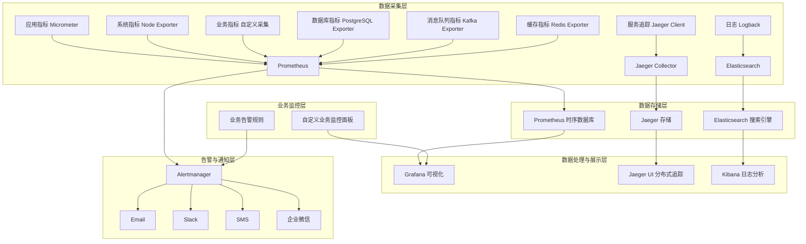
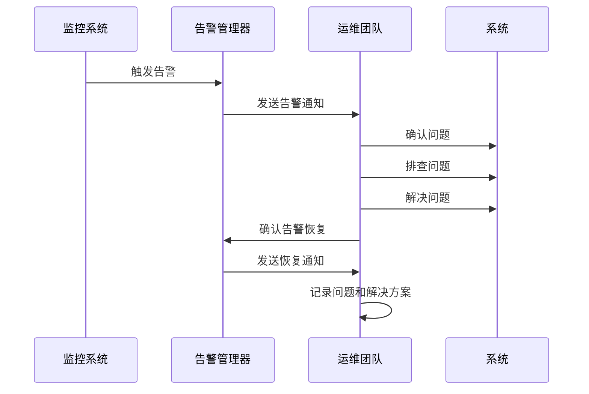

# 智能餐饮平台监控与告警方案

## 1. 监控架构概述

本文档详细描述智能餐饮平台的监控与告警方案，包括监控架构设计、指标定义、告警规则、监控工具配置、告警通知机制和响应流程，确保平台的可观测性、高可用性和稳定性。

### 1.1 设计原则

1. **全面性**：覆盖应用、服务、系统、业务等各个层面
2. **实时性**：确保监控数据的实时采集和分析
3. **可扩展性**：支持监控规模的横向扩展
4. **告警精确性**：减少误报和漏报
5. **可视化**：提供直观的监控数据可视化界面
6. **可追溯性**：支持监控数据的历史查询和分析

### 1.2 监控层次

| 监控层次 | 监控对象 | 主要指标 | 监控工具 |
|---------|---------|---------|---------|
| 应用层 | 微服务应用 | 响应时间、错误率、吞吐量 | Prometheus、Micrometer |
| 服务层 | 服务间通信 | 服务调用成功率、调用延迟、依赖关系 | Jaeger、Zipkin |
| 系统层 | 服务器、容器 | CPU、内存、磁盘、网络 | Prometheus、Node Exporter |
| 业务层 | 业务指标 | 订单量、交易额、用户活跃度 | 自定义业务监控 |
| 基础设施层 | 数据库、中间件 | 连接数、查询延迟、缓存命中率 | Prometheus、各种Exporter |

## 2. 监控架构设计

### 2.1 架构图



### 2.2 关键组件

| 组件 | 版本 | 用途 | 部署方式 |
|-----|-----|-----|---------|
| Prometheus | 2.45.0 | 时序数据库，存储监控指标 | 容器化 |
| Grafana | 10.2.0 | 监控数据可视化 | 容器化 |
| Jaeger | 1.46.0 | 分布式追踪 | 容器化 |
| Elasticsearch | 8.11.0 | 日志存储与分析 | 容器化 |
| Kibana | 8.11.0 | 日志可视化 | 容器化 |
| Logstash | 8.11.0 | 日志收集与处理 | 容器化 |
| Alertmanager | 0.25.0 | 告警管理与通知 | 容器化 |
| Node Exporter | 1.6.0 | 系统指标采集 | 容器化 |
| Micrometer | 1.11.0 | 应用指标采集 | 嵌入式 |

## 3. 指标定义

### 3.1 应用层指标

#### 3.1.1 通用应用指标

| 指标名称 | 指标类型 | 单位 | 描述 | 采集工具 |
|---------|---------|-----|-----|---------|
| `http_server_requests_count` | Counter | 次 | HTTP请求总数 | Micrometer |
| `http_server_requests_seconds` | Timer | 秒 | HTTP请求响应时间 | Micrometer |
| `http_server_requests_seconds_max` | Gauge | 秒 | HTTP请求最大响应时间 | Micrometer |
| `http_server_requests_seconds_sum` | Counter | 秒 | HTTP请求响应时间总和 | Micrometer |
| `http_server_requests_seconds_bucket` | Histogram | 秒 | HTTP请求响应时间分布 | Micrometer |
| `application_start_time_seconds` | Gauge | 秒 | 应用启动时间 | Micrometer |
| `jvm_memory_used_bytes` | Gauge | 字节 | JVM内存使用量 | Micrometer |
| `jvm_memory_committed_bytes` | Gauge | 字节 | JVM内存提交量 | Micrometer |
| `jvm_memory_max_bytes` | Gauge | 字节 | JVM内存最大值 | Micrometer |
| `jvm_gc_pause_seconds_sum` | Counter | 秒 | GC暂停时间总和 | Micrometer |
| `jvm_gc_pause_seconds_count` | Counter | 次 | GC暂停次数 | Micrometer |
| `jvm_threads_live` | Gauge | 个 | 活跃线程数 | Micrometer |
| `jvm_threads_daemon` | Gauge | 个 | 守护线程数 | Micrometer |
| `jvm_threads_peak` | Gauge | 个 | 峰值线程数 | Micrometer |
| `process_cpu_usage` | Gauge | 百分比 | 进程CPU使用率 | Micrometer |
| `process_start_time_seconds` | Gauge | 秒 | 进程启动时间 | Micrometer |

#### 3.1.2 用户服务特定指标

| 指标名称 | 指标类型 | 单位 | 描述 | 采集工具 |
|---------|---------|-----|-----|---------|
| `user_service_register_requests_count` | Counter | 次 | 用户注册请求总数 | Micrometer |
| `user_service_login_requests_count` | Counter | 次 | 用户登录请求总数 | Micrometer |
| `user_service_login_failure_count` | Counter | 次 | 用户登录失败次数 | Micrometer |
| `user_service_user_count` | Gauge | 个 | 用户总数 | Micrometer |
| `user_service_active_users_count` | Gauge | 个 | 活跃用户数 | Micrometer |

#### 3.1.3 订单服务特定指标

| 指标名称 | 指标类型 | 单位 | 描述 | 采集工具 |
|---------|---------|-----|-----|---------|
| `order_service_create_order_requests_count` | Counter | 次 | 创建订单请求总数 | Micrometer |
| `order_service_order_total_amount_sum` | Counter | 元 | 订单总金额 | Micrometer |
| `order_service_order_count` | Counter | 次 | 订单总数 | Micrometer |
| `order_service_pending_orders_count` | Gauge | 个 | 待处理订单数 | Micrometer |
| `order_service_processing_time_seconds` | Timer | 秒 | 订单处理时间 | Micrometer |

### 3.2 服务层指标

| 指标名称 | 指标类型 | 单位 | 描述 | 采集工具 |
|---------|---------|-----|-----|---------|
| `grpc_server_requests_count` | Counter | 次 | gRPC请求总数 | Micrometer |
| `grpc_server_requests_seconds` | Timer | 秒 | gRPC请求响应时间 | Micrometer |
| `grpc_server_requests_seconds_max` | Gauge | 秒 | gRPC请求最大响应时间 | Micrometer |
| `grpc_server_requests_seconds_sum` | Counter | 秒 | gRPC请求响应时间总和 | Micrometer |
| `service_discovery_registered_services` | Gauge | 个 | 注册服务数 | Nacos Exporter |
| `service_discovery_healthy_instances` | Gauge | 个 | 健康实例数 | Nacos Exporter |
| `service_discovery_unhealthy_instances` | Gauge | 个 | 不健康实例数 | Nacos Exporter |

### 3.3 系统层指标

#### 3.3.1 服务器指标

| 指标名称 | 指标类型 | 单位 | 描述 | 采集工具 |
|---------|---------|-----|-----|---------|
| `node_cpu_seconds_total` | Counter | 秒 | CPU使用时间 | Node Exporter |
| `node_memory_MemTotal_bytes` | Gauge | 字节 | 总内存 | Node Exporter |
| `node_memory_MemAvailable_bytes` | Gauge | 字节 | 可用内存 | Node Exporter |
| `node_filesystem_size_bytes` | Gauge | 字节 | 文件系统总大小 | Node Exporter |
| `node_filesystem_free_bytes` | Gauge | 字节 | 文件系统可用空间 | Node Exporter |
| `node_network_receive_bytes_total` | Counter | 字节 | 网络接收字节数 | Node Exporter |
| `node_network_transmit_bytes_total` | Counter | 字节 | 网络发送字节数 | Node Exporter |
| `node_load1` | Gauge | - | 1分钟负载 | Node Exporter |
| `node_load5` | Gauge | - | 5分钟负载 | Node Exporter |
| `node_load15` | Gauge | - | 15分钟负载 | Node Exporter |

#### 3.3.2 容器指标

| 指标名称 | 指标类型 | 单位 | 描述 | 采集工具 |
|---------|---------|-----|-----|---------|
| `container_cpu_usage_seconds_total` | Counter | 秒 | 容器CPU使用时间 | cAdvisor |
| `container_memory_usage_bytes` | Gauge | 字节 | 容器内存使用量 | cAdvisor |
| `container_memory_limit_bytes` | Gauge | 字节 | 容器内存限制 | cAdvisor |
| `container_filesystem_usage_bytes` | Gauge | 字节 | 容器文件系统使用量 | cAdvisor |
| `container_filesystem_limit_bytes` | Gauge | 字节 | 容器文件系统限制 | cAdvisor |
| `container_network_receive_bytes_total` | Counter | 字节 | 容器网络接收字节数 | cAdvisor |
| `container_network_transmit_bytes_total` | Counter | 字节 | 容器网络发送字节数 | cAdvisor |

### 3.4 基础设施层指标

#### 3.4.1 数据库指标（PostgreSQL）

| 指标名称 | 指标类型 | 单位 | 描述 | 采集工具 |
|---------|---------|-----|-----|---------|
| `postgresql_up` | Gauge | 0/1 | 数据库连接状态 | PostgreSQL Exporter |
| `postgresql_connections_total` | Gauge | 个 | 总连接数 | PostgreSQL Exporter |
| `postgresql_connections_active` | Gauge | 个 | 活跃连接数 | PostgreSQL Exporter |
| `postgresql_connections_idle` | Gauge | 个 | 空闲连接数 | PostgreSQL Exporter |
| `postgresql_connections_max` | Gauge | 个 | 最大连接数 | PostgreSQL Exporter |
| `postgresql_locks_total` | Gauge | 个 | 锁总数 | PostgreSQL Exporter |
| `postgresql_query_duration_seconds` | Histogram | 秒 | 查询执行时间 | PostgreSQL Exporter |
| `postgresql_table_size_bytes` | Gauge | 字节 | 表大小 | PostgreSQL Exporter |
| `postgresql_index_size_bytes` | Gauge | 字节 | 索引大小 | PostgreSQL Exporter |

#### 3.4.2 消息队列指标（Kafka）

| 指标名称 | 指标类型 | 单位 | 描述 | 采集工具 |
|---------|---------|-----|-----|---------|
| `kafka_brokers` | Gauge | 个 | Broker数量 | Kafka Exporter |
| `kafka_topic_partitions` | Gauge | 个 | 分区数量 | Kafka Exporter |
| `kafka_topic_messages_in_total` | Counter | 条 | 消息总条数 | Kafka Exporter |
| `kafka_topic_partition_current_offset` | Gauge | 个 | 当前偏移量 | Kafka Exporter |
| `kafka_topic_partition_oldest_offset` | Gauge | 个 | 最旧偏移量 | Kafka Exporter |
| `kafka_topic_partition_lag` | Gauge | 个 | 消费延迟 | Kafka Exporter |
| `kafka_consumergroup_lag` | Gauge | 个 | 消费者组延迟 | Kafka Exporter |

#### 3.4.3 缓存指标（Redis）

| 指标名称 | 指标类型 | 单位 | 描述 | 采集工具 |
|---------|---------|-----|-----|---------|
| `redis_up` | Gauge | 0/1 | Redis连接状态 | Redis Exporter |
| `redis_connected_clients` | Gauge | 个 | 连接客户端数 | Redis Exporter |
| `redis_commands_processed_total` | Counter | 条 | 处理命令总数 | Redis Exporter |
| `redis_keyspace_hits_total` | Counter | 次 | 键空间命中数 | Redis Exporter |
| `redis_keyspace_misses_total` | Counter | 次 | 键空间未命中数 | Redis Exporter |
| `redis_memory_used_bytes` | Gauge | 字节 | 内存使用量 | Redis Exporter |
| `redis_memory_max_bytes` | Gauge | 字节 | 最大内存 | Redis Exporter |
| `redis_db_keys` | Gauge | 个 | 数据库键数量 | Redis Exporter |

### 3.5 业务层指标

| 指标名称 | 指标类型 | 单位 | 描述 | 采集工具 |
|---------|---------|-----|-----|---------|
| `business_daily_orders_count` | Counter | 次 | 日订单量 | 自定义业务监控 |
| `business_daily_transaction_amount` | Counter | 元 | 日交易额 | 自定义业务监控 |
| `business_daily_active_users` | Gauge | 个 | 日活跃用户数 | 自定义业务监控 |
| `business_average_order_value` | Gauge | 元 | 平均客单价 | 自定义业务监控 |
| `business_order_conversion_rate` | Gauge | 百分比 | 订单转化率 | 自定义业务监控 |
| `business_top_selling_menu_items` | Gauge | 个 | 热销菜品数量 | 自定义业务监控 |
| `business_waiting_time_seconds` | Timer | 秒 | 用户等待时间 | 自定义业务监控 |

## 4. 告警规则

### 4.1 告警级别

| 级别 | 颜色 | 描述 | 通知方式 | 响应时间要求 |
|-----|-----|-----|---------|------------|
| 紧急（Critical） | 红色 | 影响核心业务功能，需要立即处理 | 电话 + 短信 + 企业微信 | 5分钟内响应 |
| 严重（Major） | 橙色 | 影响部分业务功能，需要尽快处理 | 短信 + 企业微信 | 15分钟内响应 |
| 警告（Warning） | 黄色 | 潜在问题，需要关注 | 企业微信 | 1小时内响应 |
| 信息（Info） | 蓝色 | 普通信息，用于监控和分析 | 企业微信（可选） | 无 |

### 4.2 应用层告警规则

#### 4.2.1 通用应用告警

| 告警名称 | 指标 | 告警条件 | 级别 | 描述 |
|---------|-----|---------|-----|-----|
| 应用响应时间过长 | `http_server_requests_seconds_sum` / `http_server_requests_count` | > 2秒，持续5分钟 | 严重 | 应用响应时间超过阈值，可能影响用户体验 |
| 应用错误率过高 | `http_server_requests_count{status=~"5.."}` / `http_server_requests_count` | > 5%，持续3分钟 | 紧急 | 应用错误率超过阈值，需要立即处理 |
| 应用吞吐量异常 | `http_server_requests_count` | < 10 QPS 或 > 1000 QPS，持续10分钟 | 警告 | 应用吞吐量异常，可能存在性能问题 |
| JVM内存使用率过高 | `jvm_memory_used_bytes` / `jvm_memory_max_bytes` | > 85%，持续5分钟 | 严重 | JVM内存使用率过高，可能导致OOM |
| JVM GC频率过高 | `jvm_gc_pause_seconds_count` | > 10次/分钟，持续5分钟 | 警告 | JVM GC频率过高，可能影响性能 |
| JVM GC时间过长 | `jvm_gc_pause_seconds_sum` | > 1秒/次，持续3次 | 严重 | JVM GC时间过长，可能导致应用暂停 |
| 应用实例不可用 | `up` | == 0，持续1分钟 | 紧急 | 应用实例不可用，需要立即恢复 |

#### 4.2.2 用户服务告警

| 告警名称 | 指标 | 告警条件 | 级别 | 描述 |
|---------|-----|---------|-----|-----|
| 用户登录失败率过高 | `user_service_login_failure_count` / `user_service_login_requests_count` | > 10%，持续3分钟 | 严重 | 用户登录失败率过高，可能存在安全问题 |
| 用户注册请求激增 | `rate(user_service_register_requests_count[5m])` | > 100次/分钟，持续5分钟 | 警告 | 用户注册请求激增，可能存在异常注册 |

#### 4.2.3 订单服务告警

| 告警名称 | 指标 | 告警条件 | 级别 | 描述 |
|---------|-----|---------|-----|-----|
| 订单处理时间过长 | `order_service_processing_time_seconds` | > 30秒，持续5分钟 | 严重 | 订单处理时间过长，可能影响用户体验 |
| 待处理订单积压 | `order_service_pending_orders_count` | > 100个，持续10分钟 | 严重 | 待处理订单积压，需要增加处理能力 |
| 订单量异常下降 | `rate(order_service_order_count[30m])` | < 50% of 24h average，持续30分钟 | 紧急 | 订单量异常下降，可能存在严重问题 |

### 4.3 服务层告警规则

| 告警名称 | 指标 | 告警条件 | 级别 | 描述 |
|---------|-----|---------|-----|-----|
| 服务调用成功率过低 | `grpc_server_requests_count{code=~"OK"}` / `grpc_server_requests_count` | < 95%，持续3分钟 | 严重 | 服务调用成功率过低，可能影响业务功能 |
| 服务调用延迟过高 | `grpc_server_requests_seconds_sum` / `grpc_server_requests_count` | > 500ms，持续5分钟 | 警告 | 服务调用延迟过高，可能影响性能 |
| 服务实例数量不足 | `service_discovery_healthy_instances` | < 2个，持续1分钟 | 紧急 | 服务实例数量不足，存在单点故障风险 |

### 4.4 系统层告警规则

#### 4.4.1 服务器告警

| 告警名称 | 指标 | 告警条件 | 级别 | 描述 |
|---------|-----|---------|-----|-----|
| CPU使用率过高 | `100 - (avg by(instance) (irate(node_cpu_seconds_total{mode="idle"}[5m])) * 100)` | > 85%，持续10分钟 | 严重 | CPU使用率过高，可能影响服务器性能 |
| 内存使用率过高 | `100 - (node_memory_MemAvailable_bytes / node_memory_MemTotal_bytes) * 100` | > 80%，持续10分钟 | 严重 | 内存使用率过高，可能导致系统不稳定 |
| 磁盘使用率过高 | `100 - (node_filesystem_free_bytes{fstype=~"ext4|xfs"} / node_filesystem_size_bytes{fstype=~"ext4|xfs"}) * 100` | > 80%，持续15分钟 | 警告 | 磁盘使用率过高，可能导致磁盘空间不足 |
| 磁盘IO过高 | `irate(node_disk_io_time_seconds_total[5m])` | > 0.8，持续5分钟 | 警告 | 磁盘IO过高，可能影响磁盘性能 |
| 网络流量异常 | `irate(node_network_receive_bytes_total[5m])` + `irate(node_network_transmit_bytes_total[5m])` | > 1Gbps，持续10分钟 | 警告 | 网络流量异常，可能存在网络问题 |
| 服务器不可达 | `node_up` | == 0，持续1分钟 | 紧急 | 服务器不可达，需要立即处理 |

#### 4.4.2 容器告警

| 告警名称 | 指标 | 告警条件 | 级别 | 描述 |
|---------|-----|---------|-----|-----|
| 容器CPU使用率过高 | `container_cpu_usage_seconds_total` / `container_spec_cpu_quota` | > 0.8，持续10分钟 | 严重 | 容器CPU使用率过高，可能影响容器性能 |
| 容器内存使用率过高 | `container_memory_usage_bytes` / `container_spec_memory_limit_bytes` | > 0.85，持续10分钟 | 严重 | 容器内存使用率过高，可能导致容器OOM |
| 容器重启频繁 | `rate(kube_pod_container_status_restarts_total[5m])` | > 3次/分钟，持续5分钟 | 紧急 | 容器重启频繁，可能存在严重问题 |
| 容器不可用 | `kube_pod_status_phase{phase="Running"}` | == 0，持续1分钟 | 紧急 | 容器不可用，需要立即恢复 |

### 4.5 基础设施层告警规则

#### 4.5.1 数据库告警

| 告警名称 | 指标 | 告警条件 | 级别 | 描述 |
|---------|-----|---------|-----|-----|
| 数据库连接失败 | `postgresql_up` | == 0，持续1分钟 | 紧急 | 数据库连接失败，可能导致应用不可用 |
| 数据库连接数过高 | `postgresql_connections_active` / `postgresql_connections_max` | > 0.85，持续5分钟 | 严重 | 数据库连接数过高，可能导致新连接失败 |
| 数据库查询延迟过高 | `postgresql_query_duration_seconds` | > 5秒，持续3分钟 | 严重 | 数据库查询延迟过高，可能影响应用性能 |
| 数据库表空间不足 | `postgresql_table_size_bytes` / `node_filesystem_size_bytes{mountpoint="/var/lib/postgresql/data"}` | > 0.8，持续15分钟 | 警告 | 数据库表空间不足，需要扩容 |

#### 4.5.2 消息队列告警

| 告警名称 | 指标 | 告警条件 | 级别 | 描述 |
|---------|-----|---------|-----|-----|
| Kafka Broker不可用 | `kafka_brokers` | < 3个，持续1分钟 | 紧急 | Kafka Broker不可用，可能导致消息丢失 |
| Kafka消息堆积 | `kafka_topic_partition_lag` | > 1000条，持续5分钟 | 严重 | Kafka消息堆积，可能影响数据处理 |
| Kafka消费延迟过高 | `kafka_consumergroup_lag` | > 5000条，持续10分钟 | 严重 | Kafka消费延迟过高，可能导致数据不一致 |

#### 4.5.3 缓存告警

| 告警名称 | 指标 | 告警条件 | 级别 | 描述 |
|---------|-----|---------|-----|-----|
| Redis连接失败 | `redis_up` | == 0，持续1分钟 | 紧急 | Redis连接失败，可能导致应用不可用 |
| Redis内存使用率过高 | `redis_memory_used_bytes` / `redis_memory_max_bytes` | > 85%，持续5分钟 | 严重 | Redis内存使用率过高，可能导致缓存驱逐或OOM |
| Redis命中率过低 | `redis_keyspace_hits_total` / (`redis_keyspace_hits_total` + `redis_keyspace_misses_total`) | < 80%，持续10分钟 | 警告 | Redis命中率过低，可能影响性能 |

### 4.6 业务层告警规则

| 告警名称 | 指标 | 告警条件 | 级别 | 描述 |
|---------|-----|---------|-----|-----|
| 订单量异常下降 | `rate(business_daily_orders_count[30m])` | < 50% of 24h average，持续30分钟 | 紧急 | 订单量异常下降，可能存在严重问题 |
| 交易额异常波动 | `rate(business_daily_transaction_amount[1h])` | < 30% or > 200% of 24h average，持续1小时 | 严重 | 交易额异常波动，可能存在业务问题 |
| 活跃用户数异常下降 | `business_daily_active_users` | < 50% of 7d average，持续2小时 | 严重 | 活跃用户数异常下降，可能存在应用问题 |
| 平均客单价异常 | `business_average_order_value` | < 50% or > 200% of 7d average，持续2小时 | 警告 | 平均客单价异常，可能存在业务问题 |

## 5. 监控工具配置

### 5.1 Prometheus配置

#### 5.1.1 基本配置

```yaml
global:
  scrape_interval: 15s
  evaluation_interval: 15s

rule_files:
  - /etc/prometheus/rules/*.rules

scrape_configs:
  # 监控Prometheus自身
  - job_name: 'prometheus'
    static_configs:
    - targets: ['localhost:9090']

  # 监控Node Exporter
  - job_name: 'node_exporter'
    static_configs:
    - targets: ['node-exporter:9100']

  # 监控Kubernetes节点
  - job_name: 'kubernetes_nodes'
    kubernetes_sd_configs:
    - role: node
    relabel_configs:
    - source_labels: [__address__]
      regex: '(.*):10250'
      replacement: '${1}:9100'
      target_label: __address__

  # 监控Kubernetes Pods
  - job_name: 'kubernetes_pods'
    kubernetes_sd_configs:
    - role: pod
    relabel_configs:
    - source_labels: [__meta_kubernetes_pod_annotation_prometheus_io_scrape]
      action: keep
      regex: true
    - source_labels: [__meta_kubernetes_pod_annotation_prometheus_io_path]
      action: replace
      target_label: __metrics_path__
      regex: (.+)
    - source_labels: [__address__, __meta_kubernetes_pod_annotation_prometheus_io_port]
      action: replace
      regex: ([^:]+)(?::\d+)?;(\d+)
      replacement: $1:$2
      target_label: __address__

  # 监控PostgreSQL
  - job_name: 'postgresql'
    static_configs:
    - targets: ['postgresql-exporter:9187']

  # 监控Kafka
  - job_name: 'kafka'
    static_configs:
    - targets: ['kafka-exporter:9308']

  # 监控Redis
  - job_name: 'redis'
    static_configs:
    - targets: ['redis-exporter:9121']
```

#### 5.1.2 告警规则配置示例

```yaml
groups:
- name: application_alerts
  rules:
  - alert: HighErrorRate
    expr: sum(rate(http_server_requests_count{status=~"5.."}[5m])) by (service, instance) / sum(rate(http_server_requests_count[5m])) by (service, instance) > 0.05
    for: 3m
    labels:
      severity: critical
    annotations:
      summary: "High error rate for {{ $labels.service }} on {{ $labels.instance }}"
      description: "Error rate is {{ $value | printf '%.2f%%' }} for {{ $labels.service }} on {{ $labels.instance }}"

- name: system_alerts
  rules:
  - alert: HighCpuUsage
    expr: 100 - (avg by(instance) (irate(node_cpu_seconds_total{mode="idle"}[5m])) * 100) > 85
    for: 10m
    labels:
      severity: major
    annotations:
      summary: "High CPU usage on {{ $labels.instance }}"
      description: "CPU usage is {{ $value | printf '%.2f%%' }} on {{ $labels.instance }}"
```

### 5.2 Alertmanager配置

```yaml
global:
  resolve_timeout: 5m
  smtp_smarthost: 'smtp.example.com:587'
  smtp_from: 'alertmanager@yyc3.com'
  smtp_auth_username: 'alertmanager@yyc3.com'
  smtp_auth_password: 'password'
  smtp_require_tls: true

route:
  group_by: ['alertname', 'service', 'severity']
  group_wait: 30s
  group_interval: 5m
  repeat_interval: 1h
  receiver: 'default-receiver'
  routes:
  - match:
      severity: critical
    receiver: 'critical-receiver'
    continue: true
  - match:
      severity: major
    receiver: 'major-receiver'
    continue: true

receivers:
- name: 'default-receiver'
  wechat_configs:
  - corp_id: 'wwxxxxx'
    api_url: 'https://qyapi.weixin.qq.com/cgi-bin/'
    send_resolved: true
    to_party: '1'
    agent_id: '1000001'
    api_secret: 'xxxxxxx'

- name: 'major-receiver'
  wechat_configs:
  - corp_id: 'wwxxxxx'
    api_url: 'https://qyapi.weixin.qq.com/cgi-bin/'
    send_resolved: true
    to_party: '1'
    agent_id: '1000001'
    api_secret: 'xxxxxxx'
  webhook_configs:
  - url: 'https://sms-api.example.com/send'
    send_resolved: true

- name: 'critical-receiver'
  wechat_configs:
  - corp_id: 'wwxxxxx'
    api_url: 'https://qyapi.weixin.qq.com/cgi-bin/'
    send_resolved: true
    to_party: '1'
    agent_id: '1000001'
    api_secret: 'xxxxxxx'
  webhook_configs:
  - url: 'https://sms-api.example.com/send'
    send_resolved: true
  - url: 'https://phone-api.example.com/call'
    send_resolved: false

inhibit_rules:
  - source_match:
      severity: 'critical'
    target_match:
      severity: 'warning'
    equal: ['alertname', 'service', 'instance']
```

### 5.3 Grafana配置

#### 5.3.1 数据源配置

| 数据源名称 | 类型 | URL | 访问方式 |
|---------|-----|-----|---------|
| Prometheus | Prometheus | http://prometheus:9090 | Server |
| Elasticsearch | Elasticsearch | http://elasticsearch:9200 | Server |
| Jaeger | Jaeger | http://jaeger:16686 | Browser |

#### 5.3.2 仪表板配置

1. **全局概览仪表板**：
   - 显示平台整体运行状态
   - 包含核心业务指标、系统资源使用情况、应用性能指标

2. **应用性能仪表板**：
   - 按微服务显示应用性能指标
   - 包含响应时间、错误率、吞吐量等

3. **系统资源仪表板**：
   - 显示服务器和容器的系统资源使用情况
   - 包含CPU、内存、磁盘、网络等指标

4. **数据库仪表板**：
   - 显示数据库的运行状态和性能指标
   - 包含连接数、查询延迟、表空间等指标

5. **业务指标仪表板**：
   - 显示核心业务指标
   - 包含订单量、交易额、用户活跃度等指标

### 5.4 应用指标采集配置

#### 5.4.1 Spring Boot应用配置

1. **添加依赖**：

```xml
<dependency>
    <groupId>io.micrometer</groupId>
    <artifactId>micrometer-registry-prometheus</artifactId>
</dependency>
<dependency>
    <groupId>io.micrometer</groupId>
    <artifactId>micrometer-tracing-bridge-brave</artifactId>
</dependency>
<dependency>
    <groupId>io.zipkin.reporter2</groupId>
    <artifactId>zipkin-reporter-brave</artifactId>
</dependency>
```

2. **配置文件**：

```yaml
management:
  endpoints:
    web:
      exposure:
        include: health,info,metrics,prometheus
  endpoint:
    health:
      probes:
        enabled: true
  metrics:
    tags:
      application: ${spring.application.name}
  tracing:
    sampling:
      probability: 1.0
  zipkin:
    tracing:
      endpoint: http://zipkin:9411/api/v2/spans
```

3. **自定义业务指标**：

```java
@Service
public class BusinessMetricsService {
    private final Counter orderCounter;
    private final Counter transactionAmountCounter;
    private final Gauge activeUsersGauge;

    public BusinessMetricsService(MeterRegistry meterRegistry) {
        // 订单计数器
        orderCounter = Counter.builder("business_daily_orders_count")
                .description("Daily order count")
                .register(meterRegistry);

        // 交易额计数器
        transactionAmountCounter = Counter.builder("business_daily_transaction_amount")
                .description("Daily transaction amount")
                .baseUnit("元")
                .register(meterRegistry);

        // 活跃用户 gauge
        AtomicInteger activeUsers = new AtomicInteger(0);
        activeUsersGauge = Gauge.builder("business_active_users_count", activeUsers, AtomicInteger::get)
                .description("Active users count")
                .register(meterRegistry);
    }

    public void incrementOrderCount() {
        orderCounter.increment();
    }

    public void incrementTransactionAmount(BigDecimal amount) {
        transactionAmountCounter.increment(amount.doubleValue());
    }

    // 其他业务指标方法...
}
```

## 6. 告警通知机制

### 6.1 通知渠道

| 渠道 | 适用级别 | 特点 | 配置方式 |
|-----|---------|-----|---------|
| 企业微信 | 所有级别 | 即时通知，支持群组 | Alertmanager Webhook |
| 短信 | 紧急、严重 | 高优先级，即时到达 | Alertmanager Webhook |
| 电话 | 紧急 | 最高优先级，强制提醒 | Alertmanager Webhook |
| 邮件 | 警告、信息 | 详细信息，便于归档 | Alertmanager SMTP |
| Slack | 所有级别（可选） | 团队协作，支持集成 | Alertmanager Webhook |

### 6.2 通知内容

通知内容应包含以下信息：
1. 告警级别
2. 告警名称
3. 告警时间
4. 告警条件
5. 当前值
6. 影响范围
7. 建议处理方法
8. 查看链接（Grafana、Jaeger等）

## 7. 响应流程

### 7.1 告警响应流程



### 7.2 问题处理流程

1. **确认问题**：
   - 收到告警后，首先确认问题是否真实存在
   - 登录Grafana、Jaeger等工具查看详细监控数据
   - 定位问题的具体位置和影响范围

2. **问题分类**：
   - 根据告警级别和影响范围对问题进行分类
   - 确定问题的优先级和处理顺序

3. **问题排查**：
   - 查看应用日志、系统日志、数据库日志等
   - 使用监控工具分析问题的根本原因
   - 必要时进行现场调试

4. **问题解决**：
   - 根据问题的根本原因制定解决方案
   - 实施解决方案，解决问题
   - 验证解决方案的有效性

5. **恢复验证**：
   - 确认系统已经恢复正常运行
   - 监控系统指标，确保问题不再复发

6. **总结记录**：
   - 记录问题的详细信息、根本原因、解决方案和恢复时间
   - 更新知识库，便于未来参考
   - 分析问题产生的原因，提出改进措施，防止类似问题再次发生

### 7.3 升级流程

如果问题在规定时间内无法解决，应按照以下流程进行升级：

1. **初级升级**：
   - 升级到团队负责人
   - 时间要求：紧急告警5分钟内，严重告警15分钟内

2. **中级升级**：
   - 升级到技术经理
   - 时间要求：紧急告警10分钟内，严重告警30分钟内

3. **高级升级**：
   - 升级到CTO或运维总监
   - 时间要求：紧急告警20分钟内，严重告警1小时内

## 8. 监控维护

### 8.1 日常维护

1. **监控数据检查**：定期检查监控数据的完整性和准确性
2. **告警规则优化**：根据实际情况优化告警规则，减少误报和漏报
3. **仪表板更新**：根据业务需求更新仪表板，添加新的监控指标
4. **监控工具升级**：定期升级监控工具，确保使用最新版本

### 8.2 定期回顾

1. **每周回顾**：
   - 回顾本周的告警情况
   - 分析告警的根本原因
   - 提出改进措施

2. **月度回顾**：
   - 回顾本月的系统运行状态
   - 分析性能趋势和瓶颈
   - 制定下月的优化计划

3. **季度回顾**：
   - 回顾本季度的监控体系运行情况
   - 评估监控体系的有效性和完整性
   - 制定下季度的监控体系改进计划

## 9. 附录

### 9.1 指标查询示例

1. **应用响应时间**：
   ```
   sum by (service) (http_server_requests_seconds_sum) / sum by (service) (http_server_requests_count)
   ```

2. **应用错误率**：
   ```
   sum by (service) (http_server_requests_count{status=~"5.."}) / sum by (service) (http_server_requests_count)
   ```

3. **系统CPU使用率**：
   ```
   100 - (avg by (instance) (irate(node_cpu_seconds_total{mode="idle"}[5m])) * 100)
   ```

4. **系统内存使用率**：
   ```
   100 - (node_memory_MemAvailable_bytes / node_memory_MemTotal_bytes) * 100
   ```

### 9.2 常用命令

| 命令 | 用途 |
|-----|-----|
| `promtool check config prometheus.yml` | 检查Prometheus配置文件 |
| `promtool check rules rules/*.rules` | 检查Prometheus告警规则 |
| `grafana-cli plugins list-remote` | 列出可用的Grafana插件 |
| `grafana-cli plugins install <plugin-name>` | 安装Grafana插件 |
| `kubectl logs -f prometheus-0 -n monitoring` | 查看Prometheus日志 |
| `kubectl logs -f alertmanager-0 -n monitoring` | 查看Alertmanager日志 |

### 9.3 参考资源

1. Prometheus官方文档：https://prometheus.io/docs/
2. Grafana官方文档：https://grafana.com/docs/
3. Jaeger官方文档：https://www.jaegertracing.io/docs/
4. Micrometer官方文档：https://micrometer.io/docs/

---

## 10. 实施与部署指南

### 10.1 Alertmanager配置

以下是项目中实际使用的Alertmanager配置文件（`prometheus/alertmanager.yml`）：

```yaml
# Alertmanager配置文件
global:
  resolve_timeout: 5m
  smtp_smarthost: 'smtp.example.com:587'
  smtp_from: 'alertmanager@example.com'
  smtp_auth_username: 'alertmanager'
  smtp_auth_password: 'password'

route:
  group_by: ['alertname', 'severity', 'service']
  group_wait: 10s
  group_interval: 1m
  repeat_interval: 1h
  receiver: 'email-notifications'
  routes:
    - match:
        severity: critical
      receiver: 'webhook-notifications'
    - match:
        service: 'database'
      receiver: 'database-team'

receivers:
- name: 'email-notifications'
  email_configs:
  - to: 'oncall@example.com'
    send_resolved: true

- name: 'webhook-notifications'
  webhook_configs:
  - url: 'http://notification-service:8080/api/v1/alerts'
    send_resolved: true

- name: 'database-team'
  email_configs:
  - to: 'database-team@example.com'
    send_resolved: true

inhibit_rules:
  - source_match:
      severity: 'critical'
    target_match:
      severity: 'warning'
    equal: ['alertname', 'service', 'instance']
```

### 10.2 告警规则配置

以下是项目中实际使用的告警规则文件（`prometheus/rules/alerts.yml`）：

```yaml
groups:
- name: system-resources
  rules:
  - alert: HighCPUUsage
    expr: 100 - (avg by (instance) (irate(node_cpu_seconds_total{mode="idle"}[5m])) * 100) > 80
    for: 5m
    labels:
      severity: warning
    annotations:
      summary: "High CPU Usage on {{ $labels.instance }}"
      description: "CPU usage is above 80% for the last 5 minutes"

  - alert: HighMemoryUsage
    expr: 100 - (node_memory_MemAvailable_bytes / node_memory_MemTotal_bytes) * 100 > 85
    for: 5m
    labels:
      severity: warning
    annotations:
      summary: "High Memory Usage on {{ $labels.instance }}"
      description: "Memory usage is above 85% for the last 5 minutes"

  - alert: LowDiskSpace
    expr: 100 - (node_filesystem_avail_bytes{mountpoint="/"} / node_filesystem_size_bytes{mountpoint="/"}) * 100 > 90
    for: 10m
    labels:
      severity: critical
    annotations:
      summary: "Low Disk Space on {{ $labels.instance }}"
      description: "Disk space is below 10% on {{ $labels.mountpoint }} for the last 10 minutes"

- name: application-performance
  rules:
  - alert: HighAPIResponseTime
    expr: histogram_quantile(0.95, sum by (service, route, le) (rate(http_server_requests_seconds_bucket[5m]))) > 2
    for: 5m
    labels:
      severity: warning
    annotations:
      summary: "High API Response Time for {{ $labels.service }}"
      description: "95th percentile response time is above 2s for {{ $labels.route }}"

  - alert: HighErrorRate
    expr: sum by (service) (rate(http_server_requests_count{status=~"5.."}[5m])) / sum by (service) (rate(http_server_requests_count[5m])) > 0.05
    for: 5m
    labels:
      severity: critical
    annotations:
      summary: "High Error Rate for {{ $labels.service }}"
      description: "Error rate is above 5% for the last 5 minutes"

  - alert: ServiceUnavailable
    expr: up{service=~"api-.*"} == 0
    for: 1m
    labels:
      severity: critical
    annotations:
      summary: "Service {{ $labels.service }} is unavailable"
      description: "Service has been down for more than 1 minute"

- name: database-alerts
  rules:
  - alert: HighDatabaseConnections
    expr: mysql_global_status_threads_connected > 200
    for: 5m
    labels:
      severity: warning
    annotations:
      summary: "High Database Connections"
      description: "MySQL connections are above 200 for the last 5 minutes"

  - alert: HighQueryLatency
    expr: histogram_quantile(0.95, rate(mysql_global_status_query_response_time[5m])) > 1000
    for: 5m
    labels:
      severity: warning
    annotations:
      summary: "High Query Latency"
      description: "95th percentile query latency is above 1s for the last 5 minutes"

- name: cache-alerts
  rules:
  - alert: LowRedisHitRate
    expr: redis_keyspace_hits_total / (redis_keyspace_hits_total + redis_keyspace_misses_total) < 0.9
    for: 10m
    labels:
      severity: warning
    annotations:
      summary: "Low Redis Hit Rate"
      description: "Redis hit rate is below 90% for the last 10 minutes"

  - alert: HighRedisMemoryUsage
    expr: redis_memory_used_bytes / redis_memory_max_bytes > 0.8
    for: 5m
    labels:
      severity: warning
    annotations:
      summary: "High Redis Memory Usage"
      description: "Redis memory usage is above 80% for the last 5 minutes"
```

### 10.3 Grafana配置

#### 10.3.1 数据源配置

以下是Grafana的Prometheus数据源配置文件（`grafana/provisioning/datasources/prometheus.yml`）：

```yaml
apiVersion: 1

datasources:
- name: Prometheus
  type: prometheus
  access: proxy
  url: http://localhost:9090
  isDefault: true
  jsonData:
    timeInterval: "15s"
  version: 1
  editable: true
```

#### 10.3.2 全局监控仪表板

项目中已创建了全局监控仪表板（`grafana/provisioning/dashboards/global-overview.json`），提供了系统全局视图，包含系统资源、应用性能、数据库和缓存等核心指标的可视化展示。

### 10.4 部署与运行

#### 10.4.1 Prometheus部署

```bash
# 启动Prometheus
cd /path/to/project
prometheus --config.file=prometheus/prometheus.yml --storage.tsdb.path=prometheus/data
```

#### 10.4.2 Alertmanager部署

```bash
# 启动Alertmanager
cd /path/to/project
alertmanager --config.file=prometheus/alertmanager.yml
```

#### 10.4.3 Grafana部署

```bash
# 启动Grafana
grafana-server --homepath=/usr/share/grafana --config=/etc/grafana/grafana.ini
```

#### 10.4.4 Docker部署（可选）

可以使用Docker Compose部署整个监控系统：

```yaml
version: '3.8'

services:
  prometheus:
    image: prom/prometheus:latest
    volumes:
      - ./prometheus/prometheus.yml:/etc/prometheus/prometheus.yml
      - ./prometheus/rules:/etc/prometheus/rules
      - prometheus_data:/prometheus
    ports:
      - "9090:9090"
    command:
      - '--config.file=/etc/prometheus/prometheus.yml'
      - '--storage.tsdb.path=/prometheus'
      - '--web.console.libraries=/etc/prometheus/console_libraries'
      - '--web.console.templates=/etc/prometheus/consoles'
      - '--web.enable-lifecycle'

  alertmanager:
    image: prom/alertmanager:latest
    volumes:
      - ./prometheus/alertmanager.yml:/etc/alertmanager/alertmanager.yml
    ports:
      - "9093:9093"
    command:
      - '--config.file=/etc/alertmanager/alertmanager.yml'

  grafana:
    image: grafana/grafana:latest
    volumes:
      - ./grafana/provisioning:/etc/grafana/provisioning
      - grafana_data:/var/lib/grafana
    ports:
      - "3000:3000"
    environment:
      - GF_SECURITY_ADMIN_PASSWORD=admin

volumes:
  prometheus_data:
  grafana_data:
```

### 10.5 验证与测试

#### 10.5.1 验证Prometheus配置

```bash
promtool check config prometheus/prometheus.yml
```

#### 10.5.2 验证告警规则

```bash
promtool check rules prometheus/rules/alerts.yml
```

#### 10.5.3 测试告警触发

可以使用以下命令模拟一个告警：

```bash
curl -X POST -H 'Content-Type: application/json' -d '[{"labels": {"alertname": "TestAlert", "severity": "warning"}, "annotations": {"summary": "Test alert", "description": "This is a test alert"}}]' http://localhost:9093/api/v1/alerts
```

---

**文档版本**: 1.1.0  
**最后更新**: 2025-12-06  
**维护责任人**: YYC³团队