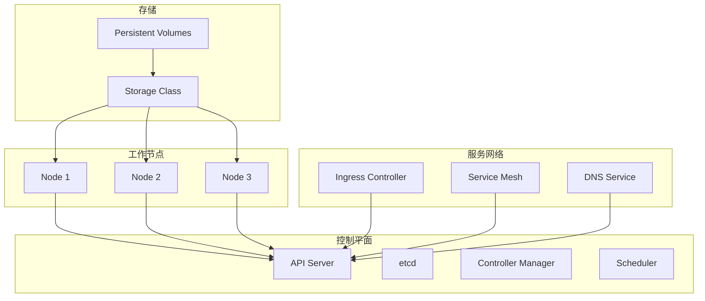
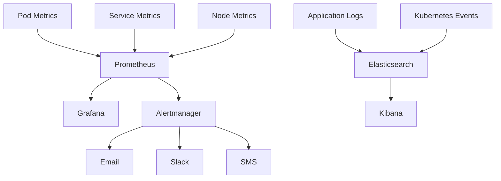
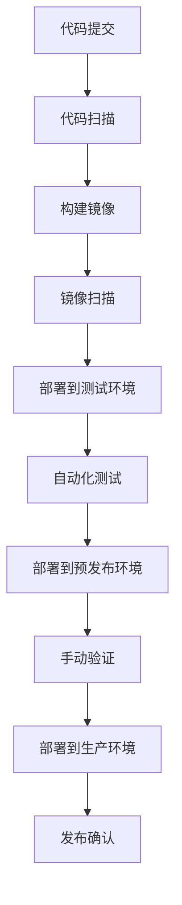

# 智能餐饮平台部署架构文档

## 1. 部署架构概述

本文档详细描述智能餐饮平台的部署架构，包括容器化设计、Kubernetes资源配置、环境管理等内容，确保平台能够高效、可靠地运行。

### 1.1 架构目标

1. **高可用性**：实现99.9%的服务可用性
2. **可扩展性**：支持水平扩展以应对业务增长
3. **安全性**：确保数据和服务的安全
4. **可管理性**：简化部署和运维管理
5. **成本效益**：优化资源利用率，降低成本

### 1.2 技术栈

| 技术 | 版本 | 用途 |
|-----|-----|-----|
| Docker | 24.0+ | 容器化平台 |
| Kubernetes | 1.27+ | 容器编排 |
| Istio | 1.18+ | 服务网格 |
| Helm | 3.12+ | 包管理 |
| Prometheus | 2.45+ | 监控 |
| Grafana | 10.2+ | 可视化 |
| ELK Stack | 8.11+ | 日志管理 |
| MinIO | 2023.12+ | 对象存储 |
| Kafka | 3.5+ | 消息队列 |
| PostgreSQL | 15+ | 关系数据库 |
| Redis | 7.2+ | 缓存 |

## 2. 容器化设计

### 2.1 Docker镜像规范

#### 2.1.1 基础镜像选择

- **Java服务**：使用`openjdk:17-jdk-slim`作为基础镜像
- **Python服务**：使用`python:3.11-slim`作为基础镜像
- **前端服务**：使用`nginx:alpine`作为基础镜像

#### 2.1.2 镜像构建最佳实践

1. **多阶段构建**：减少镜像大小
2. **最小化镜像**：只包含必要的依赖
3. **版本控制**：使用语义化版本号
4. **安全扫描**：构建时进行漏洞扫描
5. **镜像签名**：确保镜像完整性

#### 2.1.3 Dockerfile示例

```dockerfile
# 用户服务 Dockerfile
FROM openjdk:17-jdk-slim AS builder

# 设置工作目录
WORKDIR /app

# 复制构建文件
COPY pom.xml .
COPY src ./src

# 构建应用
RUN ./mvnw clean package -DskipTests

# 最终镜像
FROM openjdk:17-jdk-slim

# 设置工作目录
WORKDIR /app

# 复制应用
COPY --from=builder /app/target/user-service.jar .

# 设置环境变量
ENV JAVA_OPTS="-Xmx512m -Xms256m"

# 暴露端口
EXPOSE 3201

# 启动应用
CMD ["sh", "-c", "java $JAVA_OPTS -jar user-service.jar"]
```

### 2.2 容器配置

#### 2.2.1 资源限制

| 服务名称 | CPU请求 | CPU限制 | 内存请求 | 内存限制 |
|---------|---------|---------|---------|---------|
| 用户服务 | 200m | 500m | 512Mi | 1Gi |
| 菜单服务 | 300m | 800m | 1Gi | 2Gi |
| 订单服务 | 400m | 1 | 1.5Gi | 3Gi |
| 库存服务 | 300m | 800m | 1Gi | 2Gi |
| 成本服务 | 200m | 500m | 512Mi | 1Gi |
| AI服务 | 1 | 2 | 2Gi | 4Gi |
| 消息服务 | 200m | 500m | 512Mi | 1Gi |
| 文件服务 | 300m | 800m | 1Gi | 2Gi |
| 报表服务 | 400m | 1 | 1.5Gi | 3Gi |

#### 2.2.2 健康检查

```yaml
livenessProbe:
  httpGet:
    path: /actuator/health/liveness
    port: 3201
  initialDelaySeconds: 60
  periodSeconds: 30
  timeoutSeconds: 5
  failureThreshold: 3

readinessProbe:
  httpGet:
    path: /actuator/health/readiness
    port: 3201
  initialDelaySeconds: 30
  periodSeconds: 10
  timeoutSeconds: 5
  failureThreshold: 3
```

## 3. Kubernetes集群架构

### 3.1 集群拓扑



### 3.2 节点配置

| 节点类型 | CPU | 内存 | 磁盘 | 数量 | 用途 |
|---------|-----|-----|-----|-----|-----|
| 控制平面 | 8核 | 16Gi | 500Gi SSD | 3 | 集群管理 |
| 工作节点 | 16核 | 32Gi | 1TB SSD | 6 | 服务部署 |
| 存储节点 | 8核 | 16Gi | 4TB SSD | 3 | 存储服务 |

## 4. Kubernetes资源定义

### 4.1 Namespace配置

```yaml
apiVersion: v1
kind: Namespace
metadata:
  name: yyc3-catering
  labels:
    name: yyc3-catering
    environment: production
```

### 4.2 Deployment配置

```yaml
apiVersion: apps/v1
kind: Deployment
metadata:
  name: user-service
  namespace: yyc3-catering
  labels:
    app: user-service
    tier: backend
    version: v1.0.0
spec:
  replicas: 3
  selector:
    matchLabels:
      app: user-service
      tier: backend
  strategy:
    type: RollingUpdate
    rollingUpdate:
      maxSurge: 1
      maxUnavailable: 0
  template:
    metadata:
      labels:
        app: user-service
        tier: backend
        version: v1.0.0
    spec:
      containers:
      - name: user-service
        image: yyc3-registry/user-service:v1.0.0
        imagePullPolicy: Always
        ports:
        - containerPort: 3201
        resources:
          requests:
            cpu: "200m"
            memory: "512Mi"
          limits:
            cpu: "500m"
            memory: "1Gi"
        livenessProbe:
          httpGet:
            path: /actuator/health/liveness
            port: 3201
          initialDelaySeconds: 60
          periodSeconds: 30
          timeoutSeconds: 5
          failureThreshold: 3
        readinessProbe:
          httpGet:
            path: /actuator/health/readiness
            port: 3201
          initialDelaySeconds: 30
          periodSeconds: 10
          timeoutSeconds: 5
          failureThreshold: 3
        env:
        - name: SPRING_PROFILES_ACTIVE
          value: "prod"
        - name: SPRING_DATASOURCE_URL
          valueFrom:
            secretKeyRef:
              name: user-service-secrets
              key: datasource-url
        - name: SPRING_DATASOURCE_USERNAME
          valueFrom:
            secretKeyRef:
              name: user-service-secrets
              key: datasource-username
        - name: SPRING_DATASOURCE_PASSWORD
          valueFrom:
            secretKeyRef:
              name: user-service-secrets
              key: datasource-password
      imagePullSecrets:
      - name: yyc3-registry-secret
```

### 4.3 Service配置

```yaml
apiVersion: v1
kind: Service
metadata:
  name: user-service
  namespace: yyc3-catering
  labels:
    app: user-service
    tier: backend
spec:
  type: ClusterIP
  selector:
    app: user-service
    tier: backend
  ports:
  - port: 3201
    targetPort: 3201
    name: http
```

### 4.4 Ingress配置

```yaml
apiVersion: networking.k8s.io/v1
kind: Ingress
metadata:
  name: yyc3-catering-ingress
  namespace: yyc3-catering
  annotations:
    kubernetes.io/ingress.class: "nginx"
    cert-manager.io/cluster-issuer: "letsencrypt-prod"
    nginx.ingress.kubernetes.io/ssl-redirect: "true"
    nginx.ingress.kubernetes.io/proxy-read-timeout: "300"
spec:
  tls:
  - hosts:
    - api.catering.yyc3.com
    secretName: yyc3-catering-tls
  rules:
  - host: api.catering.yyc3.com
    http:
      paths:
      - path: /api/v1/users
        pathType: Prefix
        backend:
          service:
            name: user-service
            port:
              number: 3201
      - path: /api/v1/menu
        pathType: Prefix
        backend:
          service:
            name: menu-service
            port:
              number: 3202
      - path: /api/v1/orders
        pathType: Prefix
        backend:
          service:
            name: order-service
            port:
              number: 3203
```

### 4.5 ConfigMap配置

```yaml
apiVersion: v1
kind: ConfigMap
metadata:
  name: user-service-config
  namespace: yyc3-catering
data:
  application-prod.yml: |
    server:
      port: 3201
    spring:
      application:
        name: user-service
      cloud:
        nacos:
          server-addr: nacos:8848
          discovery:
            service: user-service
      datasource:
        driver-class-name: org.postgresql.Driver
      jpa:
        hibernate:
          ddl-auto: update
        show-sql: false
    management:
      endpoints:
        web:
          exposure:
            include: health,info,metrics,prometheus
      endpoint:
        health:
          probes:
            enabled: true
```

### 4.6 Secret配置

```yaml
apiVersion: v1
kind: Secret
metadata:
  name: user-service-secrets
  namespace: yyc3-catering
type: Opaque
data:
  datasource-url: cG9zdGdyZXNxbDovL3Bvc3RncmVzOi5zeXN0ZW06NTQzMi91c2VyX3NlcnZpY2U=
  datasource-username: cG9zdGdyZXM=
  datasource-password: cGFzc3dvcmQxMjM=
  jwt-secret: c2VjcmV0X2tleV9mb3Jfand0
```

## 5. 存储方案

### 5.1 存储类型

| 存储类型 | 用途 | 技术 | 复制策略 |
|---------|-----|-----|---------|
| 块存储 | 数据库 | Persistent Volumes | 3副本 |
| 对象存储 | 文件服务 | MinIO | 3副本 |
| 共享存储 | 配置文件 | NFS | 3副本 |

### 5.2 StorageClass配置

```yaml
apiVersion: storage.k8s.io/v1
kind: StorageClass
metadata:
  name: yyc3-catering-storage
  annotations:
    storageclass.kubernetes.io/is-default-class: "true"
provisioner: kubernetes.io/aws-ebs
parameters:
  type: gp3
  iopsPerGB: "1000"
  throughput: "125"
  fsType: ext4
reclaimPolicy: Retain
volumeBindingMode: WaitForFirstConsumer
allowVolumeExpansion: true
```

## 6. 网络设计

### 6.1 网络架构

1. **Pod网络**：使用Calico实现Pod间通信
2. **服务网络**：使用Kubernetes ClusterIP实现服务发现
3. **外部访问**：使用Ingress Controller实现外部流量入口
4. **服务网格**：使用Istio实现服务间通信的安全性和可观测性

### 6.2 网络策略

```yaml
apiVersion: networking.k8s.io/v1
kind: NetworkPolicy
metadata:
  name: user-service-network-policy
  namespace: yyc3-catering
spec:
  podSelector:
    matchLabels:
      app: user-service
  policyTypes:
  - Ingress
  - Egress
  ingress:
  - from:
    - namespaceSelector:
        matchLabels:
          name: yyc3-catering
    - podSelector:
        matchLabels:
          app: menu-service
    - podSelector:
        matchLabels:
          app: order-service
    ports:
    - protocol: TCP
      port: 3201
  egress:
  - to:
    - namespaceSelector:
        matchLabels:
          name: kube-system
    ports:
    - protocol: TCP
      port: 53
    - protocol: UDP
      port: 53
  - to:
    - namespaceSelector:
        matchLabels:
          name: yyc3-catering
    - podSelector:
        matchLabels:
          app: nacos
    ports:
    - protocol: TCP
      port: 8848
```

## 7. 安全配置

### 7.1 认证授权

1. **RBAC配置**：
   ```yaml
   apiVersion: rbac.authorization.k8s.io/v1
   kind: Role
   metadata:
     name: yyc3-catering-role
     namespace: yyc3-catering
   rules:
   - apiGroups: [""]
     resources: ["pods", "services", "configmaps", "secrets"]
     verbs: ["get", "list", "watch"]
   ```

2. **ServiceAccount配置**：
   ```yaml
   apiVersion: v1
   kind: ServiceAccount
   metadata:
     name: yyc3-catering-service-account
     namespace: yyc3-catering
   ```

### 7.2 数据加密

1. **传输加密**：使用TLS 1.3加密所有外部和内部通信
2. **存储加密**：使用KMS加密持久卷数据
3. **Secret加密**：使用Kubernetes Secrets存储敏感信息

### 7.3 访问控制

1. **网络隔离**：使用NetworkPolicy限制Pod间通信
2. **访问审计**：启用Kubernetes审计日志
3. **入侵检测**：部署Falco进行容器安全监控

## 8. 部署流程

### 8.1 环境准备

1. **创建命名空间**：
   ```bash
   kubectl create namespace yyc3-catering
   ```

2. **创建Secret**：
   ```bash
   kubectl create secret generic user-service-secrets \
     --namespace yyc3-catering \
     --from-literal=datasource-url=postgresql://postgres:5432/user_service \
     --from-literal=datasource-username=postgres \
     --from-literal=datasource-password=password123 \
     --from-literal=jwt-secret=secret_key_for_jwt
   ```

3. **创建ConfigMap**：
   ```bash
   kubectl create configmap user-service-config \
     --namespace yyc3-catering \
     --from-file=application-prod.yml
   ```

### 8.2 部署服务

1. **使用kubectl部署**：
   ```bash
   kubectl apply -f user-service-deployment.yml -n yyc3-catering
   kubectl apply -f user-service-service.yml -n yyc3-catering
   ```

2. **使用Helm部署**：
   ```bash
   helm repo add yyc3-catering https://charts.yyc3.com/catering
   helm install user-service yyc3-catering/user-service \
     --namespace yyc3-catering \
     --values user-service-values.yml
   ```

### 8.3 部署验证

1. **检查Pod状态**：
   ```bash
   kubectl get pods -n yyc3-catering
   ```

2. **检查Service状态**：
   ```bash
   kubectl get services -n yyc3-catering
   ```

3. **检查Ingress状态**：
   ```bash
   kubectl get ingress -n yyc3-catering
   ```

## 9. 环境管理

### 9.1 环境配置

| 环境 | 集群规模 | 资源配置 | 用途 |
|-----|---------|---------|-----|
| 开发 | 1控制平面 + 2工作节点 | 4核/8Gi | 开发测试 |
| 测试 | 3控制平面 + 3工作节点 | 8核/16Gi | 功能测试 |
| 预发布 | 3控制平面 + 4工作节点 | 12核/24Gi | 预发布验证 |
| 生产 | 3控制平面 + 6工作节点 | 16核/32Gi | 生产运行 |

### 9.2 环境隔离

1. **命名空间隔离**：每个环境使用独立的命名空间
2. **网络隔离**：使用NetworkPolicy限制跨环境通信
3. **存储隔离**：每个环境使用独立的存储资源

### 9.3 配置管理

1. **集中配置**：使用Nacos作为配置中心
2. **配置版本**：支持配置的版本管理和回滚
3. **配置加密**：敏感配置加密存储

## 10. 监控与告警

### 10.1 监控架构



### 10.2 Prometheus配置

```yaml
global:
  scrape_interval: 15s
  evaluation_interval: 15s

rule_files:
  - /etc/prometheus/rules/*.rules

scrape_configs:
  - job_name: 'kubernetes-pods'
    kubernetes_sd_configs:
    - role: pod
    relabel_configs:
    - source_labels: [__meta_kubernetes_pod_annotation_prometheus_io_scrape]
      action: keep
      regex: true
    - source_labels: [__meta_kubernetes_pod_annotation_prometheus_io_path]
      action: replace
      target_label: __metrics_path__
      regex: (.+)
    - source_labels: [__address__, __meta_kubernetes_pod_annotation_prometheus_io_port]
      action: replace
      regex: ([^:]+)(?::\d+)?;(\d+)
      replacement: $1:$2
      target_label: __address__
    - action: labelmap
      regex: __meta_kubernetes_pod_label_(.+)
    - source_labels: [__meta_kubernetes_namespace]
      action: replace
      target_label: kubernetes_namespace
    - source_labels: [__meta_kubernetes_pod_name]
      action: replace
      target_label: kubernetes_pod_name
```

### 10.3 告警规则

```yaml
groups:
- name: yyc3-catering-alerts
  rules:
  - alert: HighCpuUsage
    expr: 100 - (avg by(instance) (irate(node_cpu_seconds_total{mode="idle"}[5m])) * 100) > 80
    for: 5m
    labels:
      severity: warning
    annotations:
      summary: "High CPU usage on {{ $labels.instance }}"
      description: "CPU usage is above 80% for 5 minutes"

  - alert: HighMemoryUsage
    expr: (100 - (node_memory_MemAvailable_bytes / node_memory_MemTotal_bytes) * 100) > 85
    for: 5m
    labels:
      severity: warning
    annotations:
      summary: "High memory usage on {{ $labels.instance }}"
      description: "Memory usage is above 85% for 5 minutes"

  - alert: PodDown
    expr: kube_pod_status_phase{phase="Running"} == 0
    for: 2m
    labels:
      severity: critical
    annotations:
      summary: "Pod {{ $labels.pod }} is down"
      description: "Pod {{ $labels.pod }} has been in {{ $labels.phase }} state for 2 minutes"
```

## 11. CI/CD集成

### 11.1 流水线架构



### 11.2 流水线配置示例（GitLab CI）

```yaml
stages:
  - build
  - test
  - deploy

variables:
  DOCKER_REGISTRY: registry.yyc3.com
  DOCKER_IMAGE: yyc3-catering/user-service
  K8S_NAMESPACE: yyc3-catering

build:
  stage: build
  image: docker:24.0
  services:
    - docker:24.0-dind
  script:
    - docker login -u $REGISTRY_USER -p $REGISTRY_PASSWORD $DOCKER_REGISTRY
    - docker build -t $DOCKER_REGISTRY/$DOCKER_IMAGE:$CI_COMMIT_TAG .
    - docker push $DOCKER_REGISTRY/$DOCKER_IMAGE:$CI_COMMIT_TAG
  only:
    - tags

deploy_test:
  stage: deploy
  image: bitnami/kubectl:1.27
  script:
    - kubectl config use-context test-cluster
    - kubectl set image deployment/user-service user-service=$DOCKER_REGISTRY/$DOCKER_IMAGE:$CI_COMMIT_TAG -n $K8S_NAMESPACE
    - kubectl rollout status deployment/user-service -n $K8S_NAMESPACE
  only:
    - tags
  environment:
    name: test

deploy_production:
  stage: deploy
  image: bitnami/kubectl:1.27
  script:
    - kubectl config use-context production-cluster
    - kubectl set image deployment/user-service user-service=$DOCKER_REGISTRY/$DOCKER_IMAGE:$CI_COMMIT_TAG -n $K8S_NAMESPACE
    - kubectl rollout status deployment/user-service -n $K8S_NAMESPACE
  only:
    - tags
  environment:
    name: production
  when: manual
```

## 12. 灾难恢复

### 12.1 备份策略

| 数据类型 | 备份频率 | 保留周期 | 备份方式 |
|---------|---------|---------|---------|
| 数据库 | 每日全量 + 每小时增量 | 30天 | pg_dump + WAL日志 |
| 配置文件 | 每日全量 | 14天 | tar压缩 |
| 对象存储 | 实时同步 | 90天 | MinIO复制 |

### 12.2 恢复流程

1. **数据库恢复**：
   ```bash
   # 恢复全量备份
   pg_restore -h postgres -U postgres -d user_service user_service_backup.dump
   
   # 恢复WAL日志
   pg_basebackup -D /var/lib/postgresql/data -h primary -U replicator -X stream
   ```

2. **应用恢复**：
   ```bash
   # 删除现有 deployment
   kubectl delete deployment user-service -n yyc3-catering
   
   # 重新部署
   kubectl apply -f user-service-deployment.yml -n yyc3-catering
   ```

### 12.3 容灾架构

1. **跨可用区部署**：在多个可用区部署服务
2. **跨区域复制**：数据跨区域复制
3. **故障转移**：自动或手动故障转移到备用区域

## 13. 附录

### 13.1 命令参考

| 命令 | 用途 |
|-----|-----|
| `kubectl get pods -n yyc3-catering` | 查看Pod状态 |
| `kubectl describe pod <pod-name> -n yyc3-catering` | 查看Pod详细信息 |
| `kubectl logs <pod-name> -n yyc3-catering` | 查看Pod日志 |
| `kubectl exec -it <pod-name> -n yyc3-catering -- bash` | 进入Pod |
| `kubectl rollout restart deployment <deployment-name> -n yyc3-catering` | 重启部署 |
| `kubectl rollout status deployment <deployment-name> -n yyc3-catering` | 查看部署状态 |

### 13.2 常见问题

| 问题 | 解决方案 |
|-----|---------|
| Pod一直处于Pending状态 | 检查资源是否充足，是否有节点满足Pod的资源需求 |
| Pod一直处于CrashLoopBackOff状态 | 查看Pod日志，检查应用是否有错误 |
| Service无法访问 | 检查Service的selector是否正确，Pod是否正常运行 |
| Ingress无法访问 | 检查Ingress配置是否正确，Ingress Controller是否正常运行 |

---

**文档版本**: 1.0.0  
**最后更新**: 2025-01-30  
**维护责任人**: YYC³团队