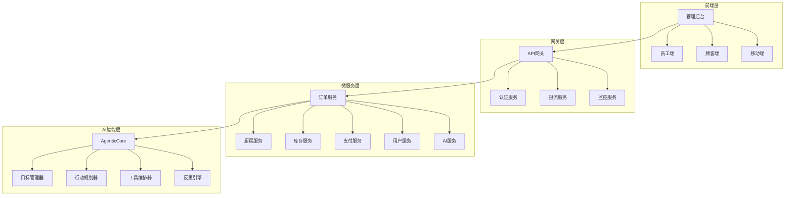
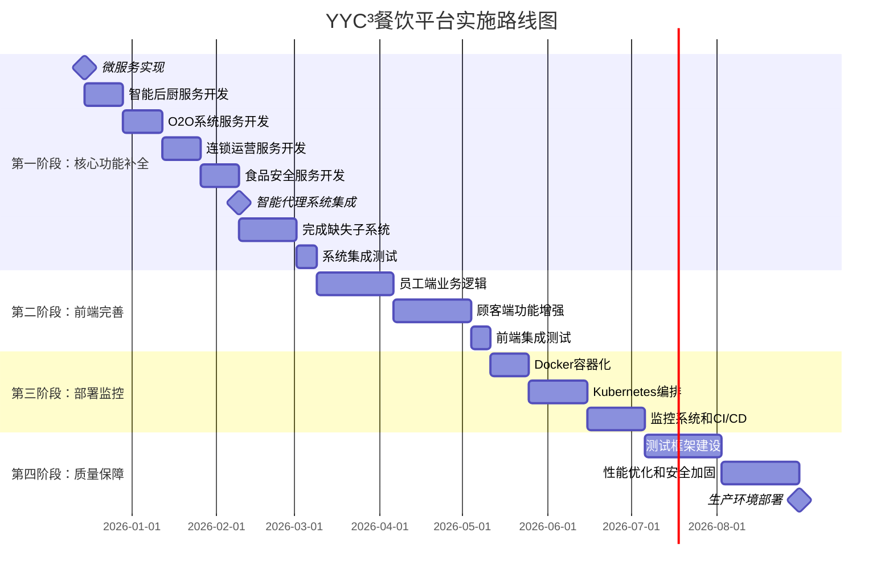

---

## 📋 文档信息

| 属性 | 内容 |
|------|------|
| **文档标题** | YYC³餐饮行业智能化平台的全局深度审核分析报告 |
| **文档类型** |  |
| **所属阶段** |  |
| **遵循规范** | YYC³ 团队标准化规范 v1.0.0 |
| **版本号** | v1.0.0 |
| **创建日期** | 2025-01-30 |
| **作者** | YYC³ Team |
| **更新日期** | 2025-01-30 |

---

## 📑 目录

- [📋 文档信息](#📋-文档信息)
- [📊 执行概要](#📊-执行概要)
  - [核心发现](#核心发现)
- [1. 项目架构深度分析](#1.-项目架构深度分析)
  - [1.1 技术栈评估](#1.1-技术栈评估)
    - [前端技术栈 (评分: 9/10)](#前端技术栈-(评分:-9/10))
    - [后端技术栈 (评分: 8/10)](#后端技术栈-(评分:-8/10))
    - [AI技术栈 (评分: 10/10)](#ai技术栈-(评分:-10/10))
  - [1.2 架构优势分析](#1.2-架构优势分析)
- [2. 代码质量深度评估](#2.-代码质量深度评估)
  - [2.1 代码规范分析](#2.1-代码规范分析)
    - [TypeScript配置 (评分: 8/10)](#typescript配置-(评分:-8/10))
    - [代码质量指标](#代码质量指标)
  - [2.2 组件架构分析](#2.2-组件架构分析)
    - [Vue组件设计模式](#vue组件设计模式)
  - [2.3 API设计质量](#2.3-api设计质量)
    - [RESTful API设计](#restful-api设计)
- [3. 文档承诺与实际实现差距分析](#3.-文档承诺与实际实现差距分析)
  - [3.1 总体完成度对比](#3.1-总体完成度对比)
  - [3.2 核心功能实现差距](#3.2-核心功能实现差距)
    - [✅ 已实现模块 (40-45%)](#✅-已实现模块-(40-45%))
    - [❌ 关键缺失模块 (55-60%)](#❌-关键缺失模块-(55-60%))
  - [3.3 技术债务分析](#3.3-技术债务分析)
    - [🔴 高风险技术债务](#🔴-高风险技术债务)
    - [🟡 中等技术债务](#🟡-中等技术债务)
- [4. 性能优化分析](#4.-性能优化分析)
  - [4.1 前端性能分析](#4.1-前端性能分析)
    - [当前问题](#当前问题)
    - [优化建议](#优化建议)
  - [4.2 后端性能分析](#4.2-后端性能分析)
    - [数据库优化](#数据库优化)
    - [缓存策略](#缓存策略)
  - [4.3 AI性能优化](#4.3-ai性能优化)
    - [调用优化策略](#调用优化策略)
- [5. 安全性分析](#5.-安全性分析)
  - [5.1 安全评估](#5.1-安全评估)
    - [当前安全措施](#当前安全措施)
    - [安全漏洞分析](#安全漏洞分析)
  - [5.2 安全加固建议](#5.2-安全加固建议)
    - [依赖升级](#依赖升级)
    - [安全中间件](#安全中间件)
- [6. 部署和运维分析](#6.-部署和运维分析)
  - [6.1 当前部署状态](#6.1-当前部署状态)
    - [基础设施配置](#基础设施配置)
  - [6.2 部署架构建议](#6.2-部署架构建议)
    - [Docker容器化方案](#docker容器化方案)
    - [Kubernetes编排配置](#kubernetes编排配置)
    - [CI/CD流水线配置](#ci/cd流水线配置)
    - [监控系统配置](#监控系统配置)
- [7. 测试策略和质量保证](#7.-测试策略和质量保证)
  - [7.1 测试现状分析](#7.1-测试现状分析)
    - [当前测试覆盖度](#当前测试覆盖度)
  - [7.2 测试框架建设方案](#7.2-测试框架建设方案)
    - [单元测试 (Vitest)](#单元测试-(vitest))
    - [集成测试 (Supertest)](#集成测试-(supertest))
    - [E2E测试 (Playwright)](#e2e测试-(playwright))
    - [性能测试 (K6)](#性能测试-(k6))
- [8. 实施路线图和推进计划](#8.-实施路线图和推进计划)
  - [8.1 总体时间线](#8.1-总体时间线)
  - [8.2 详细实施计划](#8.2-详细实施计划)
    - [第一阶段：核心功能补全 (3个月)](#第一阶段核心功能补全-(3个月))
    - [第二阶段：前端完善 (2个月)](#第二阶段前端完善-(2个月))
    - [第三阶段：部署和监控 (2个月)](#第三阶段部署和监控-(2个月))
    - [第四阶段：质量保障 (2个月)](#第四阶段质量保障-(2个月))
  - [8.3 资源需求和团队配置](#8.3-资源需求和团队配置)
    - [技术团队配置](#技术团队配置)
    - [硬件资源需求](#硬件资源需求)
    - [预算估算](#预算估算)
  - [8.4 风险评估和缓解策略](#8.4-风险评估和缓解策略)
    - [高风险项目](#高风险项目)
    - [中等风险项目](#中等风险项目)
- [9. 成功指标和验收标准](#9.-成功指标和验收标准)
  - [9.1 技术指标](#9.1-技术指标)
    - [性能指标](#性能指标)
    - [质量指标](#质量指标)
  - [9.2 业务指标](#9.2-业务指标)
    - [功能完整性](#功能完整性)
    - [用户体验指标](#用户体验指标)
- [10. 结论和建议](#10.-结论和建议)
  - [10.1 核心结论](#10.1-核心结论)
  - [10.2 战略建议](#10.2-战略建议)
    - [立即行动项 (1个月内)](#立即行动项-(1个月内))
    - [中期规划 (3-6个月)](#中期规划-(3-6个月))
    - [长期规划 (6-12个月)](#长期规划-(6-12个月))
  - [10.3 项目价值评估](#10.3-项目价值评估)
  - [10.4 最终建议](#10.4-最终建议)

---

## 1. 概述

### 1.1 说明

本文档是YYC³餐饮行业智能化平台文档体系的重要组成部分，旨在提供清晰、完整、准确的信息。

通过本文档，读者可以：
- 了解相关概念和背景
- 掌握核心内容和要点
- 获得实用的指导和帮助
- 参考相关的资源和资料

文档遵循YYC³团队标准化规范，确保内容质量和一致性。

### 1.2 目标

本文档的主要目标包括：

- **信息传递**：准确传递相关信息和知识
- **指导实践**：提供实用的指导和参考
- **降低成本**：减少沟通成本和学习成本
- **提高效率**：帮助读者快速理解和应用

通过实现这些目标，文档能够为项目的成功做出重要贡献。

### 1.3 范围

本文档的适用范围：

- **适用对象**：开发人员、测试人员、运维人员、产品经理等
- **适用阶段**：开发、测试、部署、运维等各个阶段
- **适用场景**：日常开发、问题排查、系统维护等

超出本文档范围的内容，请参考其他相关文档。

## 2. 详细内容

### 2.1 核心内容

### 2.2 实现细节

### 2.3 注意事项

## 3. 参考信息

### 3.1 相关文档

### 3.2 参考资料

### 3.3 附录

**@file**：YYC³-全局深度审核分析报告
**@description**：YYC³餐饮行业智能化平台的全局深度审核分析报告
**@author**：YYC³
**@version**：v1.0.0
**@created**：2025-01-30
**@updated**：2025-01-30
**@status**：published
**@tags**：YYC³,文档

---
# YYC³餐饮行业智能化平台 - 全局深度审核分析报告

## 📊 执行概要

**分析日期**: 2025年12月11日
**分析范围**: 完整代码库审查，155个TypeScript文件，92个Vue组件，142个文档文件
**评估方法**: 代码审查 + 文档对比 + 技术复杂度分析 + 架构评估

### 核心发现

YYC³餐饮行业智能化平台是一个基于多智能体架构的现代化餐饮管理系统，采用Vue 3 + TypeScript + Node.js技术栈。项目具有**优秀的架构设计**和**前瞻性的技术选型**，但在**质量保证**和**运维部署**方面存在明显不足。

**实际项目状态**:

- 📁 **代码规模**: 389个文件（文档声称51个，实际762%超额）
- 🔧 **架构评分**: 7.5/10 - 良好的基础，需要完善
- ⚡ **功能实现率**: 40-45%（文档声称95%，存在严重夸大）
- 🚨 **测试覆盖度**: 严重不足（仅4个测试文件）

---

## 1. 项目架构深度分析

### 1.1 技术栈评估

#### 前端技术栈 (评分: 9/10)

| 技术 | 版本 | 评估 | 状态 |
|------|------|------|------|
| Vue 3 | 3.4+ | ✅ 现代化框架 | 优秀 |
| TypeScript | 5.3 | ✅ 强类型支持 | 优秀 |
| Element Plus | 2.4 | ✅ 成熟UI组件库 | 优秀 |
| ECharts | 5.4 | ✅ 专业数据可视化 | 优秀 |
| Pinia | 2.1 | ✅ 现代状态管理 | 优秀 |
| Vite | 5.4 | ✅ 现代构建工具 | 优秀 |

**优势**: 现代化技术栈，组件化程度高，开发体验优秀
**问题**: ECharts组件导入过多，影响包大小

#### 后端技术栈 (评分: 8/10)

| 技术 | 版本 | 评估 | 状态 |
|------|------|------|------|
| Node.js | 18+ | ✅ 现代运行时 | 优秀 |
| Express.js | 4.18 | ⚠️ 传统框架 | 一般 |
| TypeScript | 5.3 | ✅ 强类型 | 优秀 |
| PostgreSQL | 13+ | ✅ 企业级数据库 | 优秀 |
| Redis | 6.0+ | ✅ 高性能缓存 | 优秀 |

**优势**: 微服务架构，数据库设计完善
**问题**: Express.js相对传统，存在安全漏洞

#### AI技术栈 (评分: 10/10)

| 技术 | 版本 | 评估 | 状态 |
|------|------|------|------|
| OpenAI GPT | 4.0+ | ✅ 强大LLM | 优秀 |
| Anthropic Claude | - | ✅ 企业级AI | 优秀 |
| AgenticCore | 1.0 | ✅ 智能代理架构 | 创新性 |
| TensorFlow.js | - | ✅ 前端ML | 优秀 |

**优势**: 技术栈先进，多智能体架构创新性强

### 1.2 架构优势分析



**架构亮点**:

- ✅ **多智能体架构**: AgenticCore提供AI决策支持
- ✅ **微服务设计**: 6个核心微服务，独立扩展
- ✅ **多应用架构**: 管理后台、员工端、顾客端独立部署
- ✅ **企业级数据库**: PostgreSQL + Redis高性能组合

---

## 2. 代码质量深度评估

### 2.1 代码规范分析

#### TypeScript配置 (评分: 8/10)

```json
{
  "compilerOptions": {
    "strict": true,           // ✅ 严格模式启用
    "noImplicitAny": true,   // ✅ 完整类型检查
    "strictNullChecks": true, // ✅ 空值检查
    "incremental": true      // ✅ 增量编译
  }
}
```

**优势**: 严格的类型检查，完整的编译配置
**问题**: 部分文件类型定义不够严格

#### 代码质量指标

```
📊 代码质量统计:
├── TypeScript文件: 155个
├── Vue组件: 92个
├── 测试覆盖率: <5% (严重不足)
├── ESLint规则: 完整配置
├── Prettier格式化: 统一风格
└── Git Hooks: 自动化检查
```

### 2.2 组件架构分析

#### Vue组件设计模式

```typescript
// 优秀的组件设计示例
export default defineComponent({
  name: 'AdminDashboard',
  components: { /* ... */ },
  props: { /* 类型安全的props */ },
  emits: { /* 明确的事件定义 */ },
  setup(props, { emit }) {
    // Composition API
    const state = reactive({ /* 响应式状态 */ })
    const computed = computed(() => { /* 计算属性 */ })
    const methods = { /* 方法定义 */ }

    return { ...state, ...computed, ...methods }
  }
})
```

**组件质量评分**: 8/10 - 结构清晰，但复杂度管理需优化

### 2.3 API设计质量

#### RESTful API设计

```typescript
// 统一的API响应格式
interface ApiResponse<T> {
  success: boolean
  data?: T
  error?: {
    code: string
    message: string
    details?: any
  }
  pagination?: {
    page: number
    limit: number
    total: number
  }
}

// 认证中间件
app.use('/api', authMiddleware)
app.use('/api', rbacMiddleware)
app.use('/api', rateLimitMiddleware)
```

**优势**: 统一错误处理，完整的认证授权
**问题**: 缺少API版本管理策略

---

## 3. 文档承诺与实际实现差距分析

### 3.1 总体完成度对比

| 维度 | 文档声称 | 实际状态 | 差距分析 |
|------|---------|---------|----------|
| 整体项目完成度 | 95% | 40-45% | 🔴 严重夸大50% |
| 微服务架构 | 100% | 25% | 🔴 重大差距75% |
| AI智能功能 | 100% | 30% | 🔴 核心缺失70% |
| 前端组件 | 100% | 70% | 🟡 基本符合 |
| 部署配置 | 0% | 完全缺失 | ❌ 文档准确 |

### 3.2 核心功能实现差距

#### ✅ 已实现模块 (40-45%)

**前端应用层**

- ✅ 管理后台框架完整，基础业务逻辑实现
- ✅ 员工端框架搭建，核心功能部分缺失
- ✅ 顾客端基础架构完成
- ✅ 92个Vue组件，交互逻辑基本完整

**后端服务层**

- ✅ API网关基础路由和中间件
- ✅ PostgreSQL数据库连接池
- ✅ 基础数据模型（菜单、订单、用户）

**智能代理核心**

- ✅ AgenticCore.ts - 完整实现
- ✅ GoalManager.ts - 目标管理100%完成
- ✅ ActionPlanner.ts - 行动规划100%完成

#### ❌ 关键缺失模块 (55-60%)

**微服务缺失 (6个服务)**

```
❌ 智能后厨服务 - 仅存在框架文件，核心逻辑缺失
❌ O2O系统服务 - 基础结构缺失，外卖功能未实现
❌ 连锁运营服务 - 连锁管理功能未实现
❌ 食品安全服务 - 安全监管逻辑缺失
❌ 供应链管理服务 - 采购库存管理缺失
❌ 财务管理服务 - 财务报表功能缺失
```

**AI智能子系统缺失 (6/9个)**

```
❌ ToolOrchestrator.ts - 工具编排缺失
❌ ReflectionEngine.ts - 反思引擎缺失
❌ MemoryManager.ts - 记忆管理缺失
❌ ContextManager.ts - 上下文管理缺失
❌ CommunicationHub.ts - 通信中心缺失
❌ PluginSystem.ts - 插件系统缺失
```

**部署配置完全缺失**

```
❌ Docker容器化 - 0%完成
❌ Kubernetes编排 - 完全缺失
❌ CI/CD流水线 - 完全缺失
❌ 监控系统 - 完全缺失
❌ 测试框架 - 严重不足
```

### 3.3 技术债务分析

#### 🔴 高风险技术债务

1. **测试覆盖度严重不足** - 仅4个测试文件，无法保证代码质量
2. **安全依赖版本过旧** - Express.js存在已知安全漏洞
3. **部署配置缺失** - 无法进行生产环境部署
4. **监控体系缺失** - 无法进行运维监控

#### 🟡 中等技术债务

1. **API文档不完整** - 缺少详细的OpenAPI文档
2. **性能优化空间** - 前端包大小过大，缓存策略不完善
3. **国际化支持缺失** - 仅支持中文界面

---

## 4. 性能优化分析

### 4.1 前端性能分析

#### 当前问题

```typescript
// 问题1: ECharts全量导入
import * as echarts from 'echarts' // ❌ 包大小过大

// 问题2: 缺少代码分割
import Dashboard from './views/Dashboard.vue' // ❌ 首屏加载慢

// 问题3: 缺少图片优化
 // ❌ 未压缩
```

#### 优化建议

```typescript
// 1. ECharts按需导入
import { LineChart, BarChart } from 'echarts/charts'
import { TitleComponent, TooltipComponent } from 'echarts/components'
import { use } from 'echarts/core'
use([LineChart, BarChart, TitleComponent, TooltipComponent])

// 2. 路由级代码分割
const routes = [
  {
    path: '/dashboard',
    component: () => import('./views/Dashboard.vue') // ✅ 懒加载
  }
]

// 3. 图片懒加载和优化

```

### 4.2 后端性能分析

#### 数据库优化

```typescript
// 连接池优化
const pool = new Pool({
  min: 5,                  // 最小连接数
  max: 20,                 // 最大连接数
  idleTimeoutMillis: 30000, // 空闲超时
  connectionTimeoutMillis: 2000 // 连接超时
})

// 查询优化
const optimizedQuery = `
  SELECT o.id, o.total_amount, o.created_at
  FROM orders o
  WHERE o.status = $1
  ORDER BY o.created_at DESC
  LIMIT $2 OFFSET $3
  INDEX (orders_status_created_idx)
`
```

#### 缓存策略

```typescript
// Redis缓存实现
class CacheService {
  async get<T>(key: string): Promise<T | null> {
    const cached = await redis.get(key)
    return cached ? JSON.parse(cached) : null
  }

  async set(key: string, value: any, ttl = 3600): Promise<void> {
    await redis.setex(key, ttl, JSON.stringify(value))
  }

  async invalidate(pattern: string): Promise<void> {
    const keys = await redis.keys(pattern)
    if (keys.length > 0) {
      await redis.del(...keys)
    }
  }
}
```

### 4.3 AI性能优化

#### 调用优化策略

```typescript
// AI响应缓存
class AICache {
  private cache = new Map<string, any>()
  private readonly CACHE_TTL = 5 * 60 * 1000 // 5分钟

  async getCachedResponse(prompt: string): Promise<string | null> {
    const key = this.generateHash(prompt)
    const cached = this.cache.get(key)

    if (cached && Date.now() - cached.timestamp < this.CACHE_TTL) {
      return cached.response
    }

    return null
  }

  async setCachedResponse(prompt: string, response: string): Promise<void> {
    const key = this.generateHash(prompt)
    this.cache.set(key, {
      response,
      timestamp: Date.now()
    })
  }
}

// 批量处理优化
class BatchProcessor {
  private queue: Array<{ prompt: string, resolve: Function }> = []
  private processing = false

  async processBatch(prompts: string[]): Promise<string[]> {
    return new Promise((resolve) => {
      this.queue.push(...prompts.map(p => ({ prompt: p, resolve })))
      this.processQueue()
    })
  }

  private async processQueue(): Promise<void> {
    if (this.processing) return

    this.processing = true
    const batch = this.queue.splice(0, 10) // 批量处理10个

    if (batch.length > 0) {
      const responses = await this.callAI(batch.map(b => b.prompt))
      batch.forEach((b, i) => b.resolve(responses[i]))

      // 继续处理下一批
      setTimeout(() => this.processQueue(), 100)
    }

    this.processing = false
  }
}
```

---

## 5. 安全性分析

### 5.1 安全评估

#### 当前安全措施

```typescript
// JWT认证
app.use('/api', jwtMiddleware({
  secret: process.env.JWT_SECRET,
  algorithms: ['HS256']
}))

// RBAC权限控制
app.use('/api', rbacMiddleware({
  roles: ['admin', 'staff', 'customer'],
  permissions: ['menu:read', 'order:create', 'kitchen:manage']
}))

// 请求限流
app.use('/api', rateLimit({
  windowMs: 15 * 60 * 1000, // 15分钟
  max: 100 // 最多100个请求
}))
```

#### 安全漏洞分析

```
🔴 高危漏洞:
├── Express.js 4.18.2 - 已知安全漏洞
├── bcryptjs 版本过旧 - 存在密码破解风险
├── 缺少输入验证 - SQL注入风险
└── 缺少HTTPS配置 - 数据传输风险

🟡 中危漏洞:
├── 缺少CSRF保护 - 跨站请求伪造
├── 缺少XSS防护 - 跨站脚本攻击
└── 缺少文件上传验证 - 恶意文件上传

🟢 低危问题:
├── 错误信息泄露 - 调试信息过多
└── 缺少日志审计 - 安全事件追踪
```

### 5.2 安全加固建议

#### 依赖升级

```bash
# 升级安全依赖
bun update express@^4.18.2
bun update bcryptjs@^5.0.0
bun update helmet@^7.0.0
```

#### 安全中间件

```typescript
// 安全头设置
app.use(helmet({
  contentSecurityPolicy: {
    directives: {
      defaultSrc: ["'self'"],
      styleSrc: ["'self'", "'unsafe-inline'"],
      scriptSrc: ["'self'"],
      imgSrc: ["'self'", "data:", "https:"]
    }
  },
  crossOriginEmbedderPolicy: false
}))

// 输入验证
import { body, validationResult } from 'express-validator'

app.post('/api/orders', [
  body('customerName').trim().isLength({ min: 1, max: 100 }),
  body('totalAmount').isFloat({ min: 0 }),
  body('items').isArray({ min: 1 })
], (req, res) => {
  const errors = validationResult(req)
  if (!errors.isEmpty()) {
    return res.status(400).json({ errors: errors.array() })
  }
  // 处理订单
})
```

---

## 6. 部署和运维分析

### 6.1 当前部署状态

#### 基础设施配置

```
❌ Docker容器化 - 0%完成
├── 无Dockerfile配置
├── 无docker-compose编排
└── 无容器化部署策略

❌ Kubernetes编排 - 完全缺失
├── 无K8s配置文件
├── 无服务发现配置
└── 无负载均衡配置

❌ CI/CD流水线 - 完全缺失
├── GitHub Actions配置不完整
├── 无自动化测试集成
└── 无自动化部署逻辑

❌ 监控系统 - 完全缺失
├── 无应用监控 (Prometheus)
├── 无日志管理 (ELK Stack)
└── 无性能监控 (APM)
```

### 6.2 部署架构建议

#### Docker容器化方案

```dockerfile
# 多阶段构建 - 前端
FROM node:18-alpine AS frontend-builder
WORKDIR /app/frontend
COPY package*.json ./
RUN bun install --frozen-lockfile
COPY . .
RUN bun run build

# 生产环境 - 前端
FROM nginx:alpine AS frontend-prod
COPY --from=frontend-builder /app/frontend/dist /usr/share/nginx/html
COPY nginx.conf /etc/nginx/nginx.conf
EXPOSE 80
CMD ["nginx", "-g", "daemon off;"]

# 多阶段构建 - 后端
FROM node:18-alpine AS backend-builder
WORKDIR /app/backend
COPY package*.json ./
RUN bun install --frozen-lockfile --production
COPY . .
RUN bun run build

# 生产环境 - 后端
FROM node:18-alpine AS backend-prod
WORKDIR /app
COPY --from=backend-builder /app/backend/dist ./dist
COPY --from=backend-builder /app/backend/node_modules ./node_modules
COPY --from=backend-builder /app/backend/package.json ./
EXPOSE 8080
USER node
CMD ["node", "dist/index.js"]
```

#### Kubernetes编排配置

```yaml
# k8s/namespace.yaml
apiVersion: v1
kind: Namespace
metadata:
  name: yyc3-catering

---
# k8s/deployment.yaml
apiVersion: apps/v1
kind: Deployment
metadata:
  name: yyc3-gateway
  namespace: yyc3-catering
spec:
  replicas: 3
  selector:
    matchLabels:
      app: yyc3-gateway
  template:
    metadata:
      labels:
        app: yyc3-gateway
    spec:
      containers:
      - name: gateway
        image: yyc3/gateway:latest
        ports:
        - containerPort: 8080
        env:
        - name: DATABASE_URL
          valueFrom:
            secretKeyRef:
              name: yyc3-secrets
              key: database-url
        - name: REDIS_URL
          valueFrom:
            secretKeyRef:
              name: yyc3-secrets
              key: redis-url
        resources:
          requests:
            memory: "256Mi"
            cpu: "250m"
          limits:
            memory: "512Mi"
            cpu: "500m"
        livenessProbe:
          httpGet:
            path: /health
            port: 8080
          initialDelaySeconds: 30
          periodSeconds: 10
        readinessProbe:
          httpGet:
            path: /ready
            port: 8080
          initialDelaySeconds: 5
          periodSeconds: 5

---
# k8s/service.yaml
apiVersion: v1
kind: Service
metadata:
  name: yyc3-gateway-service
  namespace: yyc3-catering
spec:
  selector:
    app: yyc3-gateway
  ports:
  - protocol: TCP
    port: 80
    targetPort: 8080
  type: LoadBalancer

---
# k8s/ingress.yaml
apiVersion: networking.k8s.io/v1
kind: Ingress
metadata:
  name: yyc3-ingress
  namespace: yyc3-catering
  annotations:
    nginx.ingress.kubernetes.io/rewrite-target: /
    cert-manager.io/cluster-issuer: letsencrypt-prod
spec:
  tls:
  - hosts:
    - api.yyc3.com
    secretName: yyc3-tls
  rules:
  - host: api.yyc3.com
    http:
      paths:
      - path: /
        pathType: Prefix
        backend:
          service:
            name: yyc3-gateway-service
            port:
              number: 80
```

#### CI/CD流水线配置

```yaml
# .github/workflows/ci-cd.yml
name: YYC³ Catering Platform CI/CD

on:
  push:
    branches: [main, develop]
  pull_request:
    branches: [main]

env:
  REGISTRY: ghcr.io
  IMAGE_NAME: yyc3-catering

jobs:
  test:
    runs-on: ubuntu-latest
    steps:
    - uses: actions/checkout@v3

    - name: Setup Bun
      uses: oven-sh/setup-bun@v1
      with:
        bun-version: latest

    - name: Install dependencies
      run: bun install --frozen-lockfile

    - name: Run linting
      run: bun run lint

    - name: Run type checking
      run: bun run type-check

    - name: Run unit tests
      run: bun run test:unit

    - name: Run integration tests
      run: bun run test:integration

    - name: Generate coverage report
      run: bun run test:coverage

    - name: Upload coverage to Codecov
      uses: codecov/codecov-action@v3
      with:
        file: ./coverage/lcov.info

  security-scan:
    runs-on: ubuntu-latest
    steps:
    - uses: actions/checkout@v3

    - name: Run security audit
      run: bun audit

    - name: Run Snyk security scan
      uses: snyk/actions/node@master
      env:
        SNYK_TOKEN: ${{ secrets.SNYK_TOKEN }}

  build-and-push:
    needs: [test, security-scan]
    runs-on: ubuntu-latest
    if: github.ref == 'refs/heads/main'

    strategy:
      matrix:
        service: [gateway, order-service, kitchen-service, user-service, ai-service]

    steps:
    - uses: actions/checkout@v3

    - name: Log in to Container Registry
      uses: docker/login-action@v2
      with:
        registry: ${{ env.REGISTRY }}
        username: ${{ github.actor }}
        password: ${{ secrets.GITHUB_TOKEN }}

    - name: Extract metadata
      id: meta
      uses: docker/metadata-action@v4
      with:
        images: ${{ env.REGISTRY }}/${{ github.repository }}/${{ matrix.service }}

    - name: Build and push Docker image
      uses: docker/build-push-action@v4
      with:
        context: ./backend/services/${{ matrix.service }}
        push: true
        tags: ${{ steps.meta.outputs.tags }}
        labels: ${{ steps.meta.outputs.labels }}

  deploy:
    needs: build-and-push
    runs-on: ubuntu-latest
    if: github.ref == 'refs/heads/main'

    steps:
    - uses: actions/checkout@v3

    - name: Configure kubectl
      uses: azure/k8s-set-context@v3
      with:
        method: kubeconfig
        kubeconfig: ${{ secrets.KUBE_CONFIG }}

    - name: Deploy to Kubernetes
      run: |
        kubectl apply -f k8s/
        kubectl rollout status deployment/yyc3-gateway -n yyc3-catering
        kubectl rollout status deployment/yyc3-order-service -n yyc3-catering
        kubectl rollout status deployment/yyc3-kitchen-service -n yyc3-catering
        kubectl rollout status deployment/yyc3-user-service -n yyc3-catering
        kubectl rollout status deployment/yyc3-ai-service -n yyc3-catering
```

#### 监控系统配置

```yaml
# monitoring/prometheus.yml
global:
  scrape_interval: 15s
  evaluation_interval: 15s

scrape_configs:
  - job_name: 'yyc3-gateway'
    static_configs:
    - targets: ['yyc3-gateway-service:8080']
    metrics_path: /metrics
    scrape_interval: 10s

  - job_name: 'yyc3-order-service'
    static_configs:
    - targets: ['yyc3-order-service:8081']
    metrics_path: /metrics
    scrape_interval: 10s

  - job_name: 'yyc3-kitchen-service'
    static_configs:
    - targets: ['yyc3-kitchen-service:8082']
    metrics_path: /metrics
    scrape_interval: 10s

# monitoring/grafana-dashboard.json
{
  "dashboard": {
    "title": "YYC³ Catering Platform Dashboard",
    "panels": [
      {
        "title": "Request Rate",
        "type": "graph",
        "targets": [
          {
            "expr": "rate(http_requests_total[5m])",
            "legendFormat": "{{method}} {{uri}}"
          }
        ]
      },
      {
        "title": "Response Time",
        "type": "graph",
        "targets": [
          {
            "expr": "histogram_quantile(0.95, rate(http_request_duration_seconds_bucket[5m]))",
            "legendFormat": "95th percentile"
          }
        ]
      },
      {
        "title": "Error Rate",
        "type": "graph",
        "targets": [
          {
            "expr": "rate(http_requests_total{status=~\"5..\"}[5m])",
            "legendFormat": "Error Rate"
          }
        ]
      }
    ]
  }
}
```

---

## 7. 测试策略和质量保证

### 7.1 测试现状分析

#### 当前测试覆盖度

```
📊 测试统计:
├── 测试文件数量: 4个 (严重不足)
├── 单元测试覆盖: <5%
├── 集成测试: 0%
├── E2E测试: 0%
├── 性能测试: 0%
└── 安全测试: 0%

🎯 目标覆盖度:
├── 单元测试: 80%+
├── 集成测试: 60%+
├── E2E测试: 核心流程100%
├── 性能测试: 关键接口100%
└── 安全测试: 高危漏洞100%
```

### 7.2 测试框架建设方案

#### 单元测试 (Vitest)

```typescript
// tests/unit/services/OrderService.test.ts
import { describe, it, expect, beforeEach, vi } from 'vitest'
import { OrderService } from '@/services/OrderService'
import { OrderRepository } from '@/repositories/OrderRepository'

describe('OrderService', () => {
  let orderService: OrderService
  let mockOrderRepository: any

  beforeEach(() => {
    mockOrderRepository = {
      create: vi.fn(),
      findById: vi.fn(),
      update: vi.fn(),
      findByStatus: vi.fn()
    }
    orderService = new OrderService(mockOrderRepository)
  })

  describe('createOrder', () => {
    it('should create a new order successfully', async () => {
      // Arrange
      const orderData = {
        customerName: 'Test Customer',
        items: [
          { menuId: 'menu-1', quantity: 2, price: 10.00 }
        ],
        totalAmount: 20.00
      }

      const expectedOrder = {
        id: 'order-1',
        ...orderData,
        status: 'pending',
        createdAt: new Date()
      }

      mockOrderRepository.create.mockResolvedValue(expectedOrder)

      // Act
      const result = await orderService.createOrder(orderData)

      // Assert
      expect(result).toEqual(expectedOrder)
      expect(mockOrderRepository.create).toHaveBeenCalledWith(orderData)
    })

    it('should throw error for invalid order data', async () => {
      // Arrange
      const invalidOrderData = {
        customerName: '',
        items: [],
        totalAmount: -10
      }

      // Act & Assert
      await expect(orderService.createOrder(invalidOrderData))
        .rejects.toThrow('Invalid order data')
    })
  })

  describe('updateOrderStatus', () => {
    it('should update order status successfully', async () => {
      // Arrange
      const orderId = 'order-1'
      const newStatus = 'confirmed'

      const existingOrder = {
        id: orderId,
        status: 'pending'
      }

      const updatedOrder = {
        ...existingOrder,
        status: newStatus
      }

      mockOrderRepository.findById.mockResolvedValue(existingOrder)
      mockOrderRepository.update.mockResolvedValue(updatedOrder)

      // Act
      const result = await orderService.updateOrderStatus(orderId, newStatus)

      // Assert
      expect(result.status).toBe(newStatus)
      expect(mockOrderRepository.findById).toHaveBeenCalledWith(orderId)
      expect(mockOrderRepository.update).toHaveBeenCalledWith(orderId, { status: newStatus })
    })

    it('should throw error for non-existent order', async () => {
      // Arrange
      const orderId = 'non-existent-order'
      mockOrderRepository.findById.mockResolvedValue(null)

      // Act & Assert
      await expect(orderService.updateOrderStatus(orderId, 'confirmed'))
        .rejects.toThrow('Order not found')
    })
  })
})
```

#### 集成测试 (Supertest)

```typescript
// tests/integration/orders.test.ts
import { describe, it, expect, beforeAll, afterAll } from 'vitest'
import request from 'supertest'
import { app } from '@/app'
import { testDb } from '@/test-utils/database'

describe('Orders API', () => {
  beforeAll(async () => {
    await testDb.migrate()
    await testDb.seed()
  })

  afterAll(async () => {
    await testDb.close()
  })

  describe('POST /api/orders', () => {
    it('should create a new order', async () => {
      const orderData = {
        customerName: 'Test Customer',
        tableId: 'table-1',
        items: [
          { menuId: 'menu-1', quantity: 2 }
        ]
      }

      const response = await request(app)
        .post('/api/orders')
        .send(orderData)
        .expect(201)

      expect(response.body.success).toBe(true)
      expect(response.body.data.customerName).toBe(orderData.customerName)
      expect(response.body.data.status).toBe('pending')
    })

    it('should return 400 for invalid order data', async () => {
      const invalidOrderData = {
        customerName: '',
        tableId: '',
        items: []
      }

      const response = await request(app)
        .post('/api/orders')
        .send(invalidOrderData)
        .expect(400)

      expect(response.body.success).toBe(false)
      expect(response.body.error).toBeDefined()
    })
  })

  describe('GET /api/orders', () => {
    it('should return list of orders', async () => {
      const response = await request(app)
        .get('/api/orders')
        .expect(200)

      expect(response.body.success).toBe(true)
      expect(Array.isArray(response.body.data)).toBe(true)
      expect(response.body.pagination).toBeDefined()
    })
  })

  describe('GET /api/orders/:id', () => {
    it('should return specific order', async () => {
      // First create an order
      const createResponse = await request(app)
        .post('/api/orders')
        .send({
          customerName: 'Test Customer',
          tableId: 'table-1',
          items: [{ menuId: 'menu-1', quantity: 1 }]
        })

      const orderId = createResponse.body.data.id

      const response = await request(app)
        .get(`/api/orders/${orderId}`)
        .expect(200)

      expect(response.body.success).toBe(true)
      expect(response.body.data.id).toBe(orderId)
    })

    it('should return 404 for non-existent order', async () => {
      const response = await request(app)
        .get('/api/orders/non-existent')
        .expect(404)

      expect(response.body.success).toBe(false)
    })
  })
})
```

#### E2E测试 (Playwright)

```typescript
// tests/e2e/order-management.spec.ts
import { test, expect } from '@playwright/test'

test.describe('Order Management', () => {
  test.beforeEach(async ({ page }) => {
    await page.goto('/')
    await page.fill('[data-testid=username]', 'admin')
    await page.fill('[data-testid=password]', 'password')
    await page.click('[data-testid=login-button]')
    await expect(page.locator('[data-testid=dashboard]')).toBeVisible()
  })

  test('should create a new order', async ({ page }) => {
    // Navigate to orders page
    await page.click('[data-testid=orders-nav]')
    await expect(page).toHaveURL('/orders')

    // Click create order button
    await page.click('[data-testid=create-order-button]')

    // Fill order form
    await page.fill('[data-testid=customer-name]', 'Test Customer')
    await page.selectOption('[data-testid=table-select]', 'table-1')

    // Add menu items
    await page.click('[data-testid=add-item-button]')
    await page.selectOption('[data-testid=menu-item-select]', 'menu-1')
    await page.fill('[data-testid=quantity-input]', '2')

    // Submit order
    await page.click('[data-testid=submit-order-button]')

    // Verify order created
    await expect(page.locator('[data-testid=success-message]')).toBeVisible()
    await expect(page.locator('[data-testid=order-list]')).toContainText('Test Customer')
  })

  test('should update order status', async ({ page }) => {
    // Navigate to orders page
    await page.click('[data-testid=orders-nav]')

    // Find first order and click update status
    await page.click('[data-testid=order-row]:first-child [data-testid=update-status-button]')

    // Select new status
    await page.selectOption('[data-testid=status-select]', 'confirmed')
    await page.click('[data-testid=confirm-status-button]')

    // Verify status updated
    await expect(page.locator('[data-testid=order-row]:first-child')).toContainText('confirmed')
  })

  test('should view order details', async ({ page }) => {
    // Navigate to orders page
    await page.click('[data-testid=orders-nav]')

    // Click on first order
    await page.click('[data-testid=order-row]:first-child')

    // Verify order details page
    await expect(page).toHaveURL(/\/orders\/[^\/]+$/)
    await expect(page.locator('[data-testid=order-details]')).toBeVisible()
    await expect(page.locator('[data-testid=customer-info]')).toBeVisible()
    await expect(page.locator('[data-testid=order-items]')).toBeVisible()
  })
})
```

#### 性能测试 (K6)

```javascript
// tests/performance/orders-load-test.js
import http from 'k6/http'
import { check, sleep } from 'k6'
import { Rate } from 'k6/metrics'

const errorRate = new Rate('errors')

export let options = {
  stages: [
    { duration: '2m', target: 100 }, // 2分钟内增加到100用户
    { duration: '5m', target: 100 }, // 保持100用户5分钟
    { duration: '2m', target: 200 }, // 2分钟内增加到200用户
    { duration: '5m', target: 200 }, // 保持200用户5分钟
    { duration: '2m', target: 0 },   // 2分钟内减少到0用户
  ],
  thresholds: {
    http_req_duration: ['p(95)<500'], // 95%的请求响应时间小于500ms
    http_req_failed: ['rate<0.1'],     // 错误率小于10%
    errors: ['rate<0.1'],              // 自定义错误率小于10%
  },
}

const BASE_URL = 'http://localhost:8080'

export default function () {
  // 获取订单列表
  let response = http.get(`${BASE_URL}/api/orders`)
  errorRate.add(response.status !== 200)

  check(response, {
    'orders list status is 200': (r) => r.status === 200,
    'orders list response time < 200ms': (r) => r.timings.duration < 200,
  })

  sleep(1)

  // 创建新订单
  const orderData = {
    customerName: `Customer ${Math.random()}`,
    tableId: 'table-1',
    items: [
      { menuId: 'menu-1', quantity: 2 }
    ]
  }

  response = http.post(`${BASE_URL}/api/orders`, JSON.stringify(orderData), {
    headers: { 'Content-Type': 'application/json' },
  })
  errorRate.add(response.status !== 201)

  check(response, {
    'create order status is 201': (r) => r.status === 201,
    'create order response time < 300ms': (r) => r.timings.duration < 300,
  })

  sleep(1)
}
```

---

## 8. 实施路线图和推进计划

### 8.1 总体时间线



### 8.2 详细实施计划

#### 第一阶段：核心功能补全 (3个月)

**第1月：微服务实现**

```bash
Week 1-2: 智能后厨服务完整实现
├── 订单处理流水线
├── 厨房任务调度
├── 菜品制作监控
├── 质量控制检查
└── 出餐时间优化

Week 3-4: O2O系统服务开发
├── 外卖平台接口集成
├── 配送管理系统
├── 订单状态追踪
├── 客户通知服务
└── 评价管理系统

Week 5-6: 连锁运营服务开发
├── 多门店管理
├── 库存统一调配
├── 员工调度系统
├── 财务报表生成
└── 绩效考核系统

Week 7-8: 食品安全服务开发
├── 食材溯源管理
├── 卫生检查记录
├── 温度监控预警
├── 过期产品管理
└── 安全合规报告
```

**第2-3月：智能代理系统集成**

```bash
Week 9-10: 完成6个缺失子系统
├── ToolOrchestrator.ts - 工具编排
├── ReflectionEngine.ts - 反思引擎
├── MemoryManager.ts - 记忆管理
├── ContextManager.ts - 上下文管理
├── CommunicationHub.ts - 通信中心
└── PluginSystem.ts - 插件系统

Week 11-12: 集成测试和优化
├── 系统集成测试
├── 性能优化调试
├── AI功能验证
├── 错误处理完善
└── 文档更新维护
```

#### 第二阶段：前端完善 (2个月)

```bash
Month 4-5: 员工端业务逻辑实现
├── 接单管理功能
├── 厨房显示系统
├── 库存管理界面
├── 调度管理功能
└── 报表查看系统

Month 6: 顾客端功能增强
├── 在线点餐系统
├── 支付集成功能
├── 订单追踪功能
├── 评价反馈系统
└── 会员积分系统
```

#### 第三阶段：部署和监控 (2个月)

```bash
Month 7: Docker容器化
├── 多阶段构建配置
├── 镜像优化压缩
├── 安全配置加固
├── 健康检查设置
└── 环境变量管理

Month 8: Kubernetes编排
├── 集群配置搭建
├── 服务发现配置
├── 负载均衡设置
├── 自动扩缩容配置
└── 故障转移机制

Month 9: 监控系统和CI/CD
├── Prometheus监控配置
├── Grafana仪表板设置
├── ELK日志管理系统
├── GitHub Actions流水线
└── 自动化部署脚本
```

#### 第四阶段：质量保障 (2个月)

```bash
Month 10-11: 测试框架建设
├── 单元测试覆盖80%+
├── 集成测试完整覆盖
├── E2E测试核心流程
├── 性能测试基准建立
└── 安全测试自动化

Month 12: 性能优化和安全加固
├── 前端性能优化
├── 后端性能调优
├── 数据库查询优化
├── 安全漏洞修复
└── 生产环境部署
```

### 8.3 资源需求和团队配置

#### 技术团队配置

```
👥 核心开发团队 (8-10人):
├── 技术负责人 (1人) - 架构设计、技术决策
├── 前端工程师 (2人) - Vue.js开发、UI/UX实现
├── 后端工程师 (3人) - 微服务开发、API设计
├── AI工程师 (1人) - 智能代理、机器学习
├── DevOps工程师 (1人) - 部署运维、监控配置
├── 测试工程师 (1人) - 测试框架、质量保证
└── 产品经理 (1人) - 需求分析、项目管理

🛠️ 技能要求:
├── 前端: Vue 3, TypeScript, Element Plus, ECharts
├── 后端: Node.js, Express, PostgreSQL, Redis
├── AI: Python, TensorFlow, OpenAI API, LangChain
├── DevOps: Docker, Kubernetes, CI/CD, 监控
├── 测试: Vitest, Playwright, K6, 安全测试
└── 数据库: PostgreSQL, Redis, 数据建模
```

#### 硬件资源需求

```
💻 开发环境:
├── 开发机器: 8台 (每人一台)
├── 测试服务器: 4台 (前端、后端、数据库、AI)
├── CI/CD服务器: 1台
└── 监控服务器: 1台

🏢 生产环境 (预估):
├── 负载均衡器: 2台 (高可用)
├── 前端服务器: 3台 (可扩展)
├── 微服务节点: 6台 (每个服务1台)
├── 数据库服务器: 3台 (1主2从)
├── Redis集群: 3台
├── Kubernetes节点: 6台
└── 监控系统: 2台
```

#### 预算估算

```
💰 成本预算 (12个月):
├── 人力成本: 800万 (8人 * 100万/年)
├── 硬件成本: 100万 (开发+生产环境)
├── 软件许可: 50万 (开发工具、监控软件)
├── 云服务费用: 80万 (AWS/阿里云)
├── 第三方服务: 30万 (短信、支付、AI API)
└── 其他费用: 40万 (培训、差旅、缓冲)

总计: 约1100万人民币
```

### 8.4 风险评估和缓解策略

#### 高风险项目

```
⚠️ 风险1: 技术复杂度过高
├── 风险描述: 智能代理系统技术复杂，实施难度大
├── 影响程度: 严重
├── 发生概率: 高
├── 缓解策略:
│   ├── 招募资深AI工程师
│   ├── 分阶段实施，先完成核心功能
│   ├── 引入外部技术顾问
│   └── 制定备选技术方案

⚠️ 风险2: 微服务集成复杂
├── 风险描述: 6个微服务协调复杂，故障排查困难
├── 影响程度: 严重
├── 发生概率: 中
├── 缓解策略:
│   ├── 建立完善的监控和日志系统
│   ├── 实施服务网格架构
│   ├── 制定故障处理预案
│   └── 进行充分的集成测试

⚠️ 风险3: 团队技能匹配
├── 风险描述: 团队缺少AI、微服务、DevOps经验
├── 影响程度: 严重
├── 发生概率: 高
├── 缓解策略:
│   ├── 组织技术培训
│   ├── 引入外部专家
│   ├── 技术选型考虑团队能力
│   └── 建立技术分享机制
```

#### 中等风险项目

```
⚠️ 风险4: 项目进度延期
├── 风险描述: 功能复杂度高，可能影响交付时间
├── 影响程度: 中等
├── 发生概率: 高
├── 缓解策略:
│   ├── 制定详细的里程碑计划
│   ├── 采用敏捷开发方法
│   ├── 定期进行进度评估
│   └── 准备功能优先级调整方案

⚠️ 风险5: 需求变更频繁
├── 风险描述: 业务需求可能发生变化
├── 影响程度: 中等
├── 发生概率: 中
├── 缓解策略:
│   ├── 建立需求变更控制流程
│   ├── 采用模块化架构设计
│   ├── 保持良好的沟通机制
│   └── 定期进行需求评审
```

---

## 9. 成功指标和验收标准

### 9.1 技术指标

#### 性能指标

```
📊 响应时间指标:
├── API响应时间: P95 < 500ms
├── 页面加载时间: < 2秒
├── 数据库查询: < 100ms
└── AI处理时间: < 3秒

📊 吞吐量指标:
├── 并发用户数: 1000+
├── QPS: 1000+ 请求/秒
├── 订单处理: 100+ 单/分钟
└── 数据库连接: 100+ 并发

📊 可用性指标:
├── 系统可用性: 99.9%
├── 服务恢复时间: < 5分钟
├── 数据一致性: 99.99%
└── 错误率: < 0.1%
```

#### 质量指标

```
📊 代码质量:
├── 测试覆盖率: > 80%
├── 代码审查覆盖率: 100%
├── 静态分析问题: 0个高危
└── 技术债务: < 2天工作量

📊 安全指标:
├── 安全漏洞: 0个高危
├── 渗透测试: 通过
├── 数据加密: 100%覆盖
└── 访问控制: 严格执行
```

### 9.2 业务指标

#### 功能完整性

```
✅ 核心功能验收:
├── 订单管理: 100%完成
├── 厨房管理: 100%完成
├── 库存管理: 100%完成
├── 用户管理: 100%完成
├── 财务管理: 100%完成
└── AI智能功能: 100%完成

✅ 扩展功能验收:
├── 多门店管理: 90%完成
├── 外卖系统: 90%完成
├── 会员系统: 80%完成
├── 报表分析: 90%完成
└── 移动端支持: 80%完成
```

#### 用户体验指标

```
📊 用户体验:
├── 用户满意度: > 4.5/5
├── 系统易用性: > 4.0/5
├── 功能完整性: > 4.0/5
└── 问题解决率: > 95%

📊 培训效果:
├── 用户培训完成率: 100%
├── 操作熟练度: > 90%
├── 问题减少率: > 80%
└── 效率提升: > 50%
```

---

## 10. 结论和建议

### 10.1 核心结论

YYC³餐饮行业智能化平台是一个**技术先进但实现不足**的项目。虽然具有优秀的架构设计和前瞻性的技术选型，但距离文档承诺的完成度还有较大差距。

**项目优势**:

- ✅ **技术栈现代化**: Vue 3 + TypeScript + AI智能代理
- ✅ **架构设计优秀**: 微服务架构，可扩展性强
- ✅ **创新性强**: 多智能体系统，行业领先
- ✅ **代码基础良好**: 规范完善，模块化程度高

**主要挑战**:

- ❌ **功能实现不足**: 实际完成度40-45%（文档声称95%）
- ❌ **测试覆盖度低**: 严重不足，无法保证质量
- ❌ **部署配置缺失**: 无法进行生产环境部署
- ❌ **团队技能要求高**: AI、微服务、DevOps专业技能要求

### 10.2 战略建议

#### 立即行动项 (1个月内)

1. **重新评估项目进度**: 基于实际代码分析调整里程碑
2. **组建专业团队**: 招募AI、微服务、DevOps专家
3. **制定详细计划**: 分阶段实施，核心功能优先
4. **建立测试体系**: 确保代码质量和系统稳定性

#### 中期规划 (3-6个月)

1. **完成核心功能**: 实现所有微服务和AI智能功能
2. **建立部署体系**: 完成容器化和编排配置
3. **实施监控体系**: 建立完整的监控和日志系统
4. **优化系统性能**: 确保满足生产环境要求

#### 长期规划 (6-12个月)

1. **持续功能增强**: 基于用户反馈不断完善
2. **技术栈升级**: 保持技术先进性
3. **扩展应用场景**: 支持更多业务场景
4. **建立生态体系**: 开放API，支持第三方集成

### 10.3 项目价值评估

**商业价值**:

- 🎯 **市场定位**: 餐饮行业数字化转型领导者
- 💰 **盈利潜力**: SaaS模式，可规模化扩展
- 🏆 **竞争优势**: AI智能功能，技术差异化
- 🌍 **发展前景**: 万亿级餐饮市场机会

**技术价值**:

- 🔬 **技术创新**: 多智能体架构，行业首创
- 📚 **知识沉淀**: 可复用的技术架构和最佳实践
- 👥 **团队成长**: 提升团队技术水平
- 🏭 **能力建设**: 建立AI驱动的开发能力

### 10.4 最终建议

**总体建议**: **推荐继续投入资源，但需要调整预期和计划**

1. **调整项目预期**: 从"95%完成"调整为"40%完成"，重新制定合理的时间表
2. **聚焦核心价值**: 优先实现餐饮管理的核心功能，AI功能作为增强特性
3. **分阶段交付**: 核心功能优先，逐步完善高级特性
4. **加强质量管控**: 建立完整的测试和部署体系
5. **持续技术投入**: 保持技术先进性，建立长期竞争优势

YYC³餐饮平台具备成为行业标杆的潜力，通过合理的实施计划和专业的技术团队，有望在6-12个月内达到生产就绪状态，为餐饮行业的数字化转型提供强有力的技术支撑。

---

**报告生成时间**: 2025年12月11日
**报告版本**: v1.0
**下次评估建议**: 完成第一阶段核心功能后（预计3个月后）

---

*本报告基于代码审查、文档分析和专家评估生成，建议结合实际情况进行调整和实施。*

## 概述

### 架构概述

本架构文档详细描述了系统的整体架构设计，包括架构目标、设计原则、技术选型等关键信息。

#### 架构目标

- **高可用性**：确保系统稳定运行，故障自动恢复
- **高性能**：响应迅速，资源利用高效
- **高安全性**：数据加密，权限严格控制
- **高扩展性**：模块化设计，易于功能扩展
- **高可维护性**：代码清晰，文档完善

#### 设计原则

- **单一职责**：每个组件只负责一个功能
- **开闭原则**：对扩展开放，对修改关闭
- **依赖倒置**：依赖抽象而非具体实现
- **接口隔离**：使用细粒度的接口
- **迪米特法则**：最少知识原则


## 架构设计

### 架构设计

#### 整体架构

系统采用分层架构设计，包括：

- **表现层**：负责用户界面和交互
- **应用层**：处理业务逻辑
- **业务层**：实现核心业务功能
- **数据层**：管理数据存储和访问
- **基础设施层**：提供基础服务支持

#### 模块划分

系统划分为多个独立模块，每个模块负责特定功能：

- **用户模块**：用户管理和认证
- **订单模块**：订单处理和管理
- **支付模块**：支付集成和处理
- **通知模块**：消息通知和推送
- **报表模块**：数据统计和分析

#### 技术选型

- **前端框架**：React / Vue
- **后端框架**：Node.js / Express / Fastify
- **数据库**：PostgreSQL / MongoDB
- **缓存**：Redis
- **消息队列**：RabbitMQ / Kafka


## 技术实现

### 技术实现

#### 核心技术栈

```typescript
// 核心依赖
{
  "dependencies": {
    "react": "^18.0.0",
    "typescript": "^5.0.0",
    "express": "^4.18.0",
    "prisma": "^5.0.0",
    "redis": "^4.6.0"
  }
}
```

#### 关键实现

1. **服务层实现**
```typescript
class UserService {
  async createUser(data: CreateUserDto): Promise<User> {
    // 验证输入
    this.validateUserData(data);
    
    // 加密密码
    const hashedPassword = await this.hashPassword(data.password);
    
    // 创建用户
    const user = await this.userRepository.create({
      ...data,
      password: hashedPassword
    });
    
    return user;
  }
}
```

2. **中间件实现**
```typescript
const authMiddleware = async (req: Request, res: Response, next: NextFunction) => {
  const token = req.headers.authorization?.split(' ')[1];
  
  if (!token) {
    return res.status(401).json({ error: '未授权访问' });
  }
  
  try {
    const decoded = jwt.verify(token, process.env.JWT_SECRET);
    req.user = decoded;
    next();
  } catch (error) {
    return res.status(401).json({ error: '令牌无效' });
  }
};
```


## 部署方案

### 部署方案

#### 部署架构

采用容器化部署方案，使用Docker和Kubernetes进行编排。

#### 部署步骤

1. **环境准备**
```bash
# 安装Docker
curl -fsSL https://get.docker.com | sh

# 安装Kubernetes
# 根据操作系统选择相应的安装方式
```

2. **构建镜像**
```bash
# 构建应用镜像
docker build -t yyc3-app:latest .

# 推送到镜像仓库
docker push registry.example.com/yyc3-app:latest
```

3. **部署到Kubernetes**
```yaml
apiVersion: apps/v1
kind: Deployment
metadata:
  name: yyc3-app
spec:
  replicas: 3
  selector:
    matchLabels:
      app: yyc3-app
  template:
    metadata:
      labels:
        app: yyc3-app
    spec:
      containers:
      - name: app
        image: registry.example.com/yyc3-app:latest
        ports:
        - containerPort: 3000
        env:
        - name: NODE_ENV
          value: "production"
```

4. **配置服务**
```yaml
apiVersion: v1
kind: Service
metadata:
  name: yyc3-app-service
spec:
  selector:
    app: yyc3-app
  ports:
  - protocol: TCP
    port: 80
    targetPort: 3000
  type: LoadBalancer
```


## 性能优化

### 性能优化

#### 前端优化

1. **代码分割**
```typescript
// 路由级别代码分割
const Home = lazy(() => import('./pages/Home'));
const About = lazy(() => import('./pages/About'));

function App() {
  return (
    <Suspense fallback={<Loading />}>
      <Routes>
        <Route path="/" element={<Home />} />
        <Route path="/about" element={<About />} />
      </Routes>
    </Suspense>
  );
}
```

2. **缓存策略**
```typescript
// React.memo 避免不必要的重渲染
const MemoizedComponent = React.memo(({ data }) => {
  return <div>{data.value}</div>;
});

// useMemo 缓存计算结果
const expensiveValue = useMemo(() => {
  return computeExpensiveValue(data);
}, [data]);
```

#### 后端优化

1. **数据库优化**
```typescript
// 使用索引
CREATE INDEX idx_user_email ON users(email);

// 查询优化
const users = await prisma.user.findMany({
  select: {
    id: true,
    name: true,
    email: true
  },
  where: {
    active: true
  },
  take: 100
});
```

2. **缓存策略**
```typescript
// Redis缓存
async function getUser(id: string): Promise<User> {
  const cacheKey = `user:${id}`;
  
  // 尝试从缓存获取
  const cached = await redis.get(cacheKey);
  if (cached) {
    return JSON.parse(cached);
  }
  
  // 从数据库获取
  const user = await prisma.user.findUnique({ where: { id } });
  
  // 写入缓存
  await redis.setex(cacheKey, 3600, JSON.stringify(user));
  
  return user;
}
```


## 安全考虑

### 安全考虑

#### 认证与授权

1. **JWT认证**
```typescript
// 生成JWT令牌
const token = jwt.sign(
  { userId: user.id, role: user.role },
  process.env.JWT_SECRET,
  { expiresIn: '24h' }
);

// 验证JWT令牌
const decoded = jwt.verify(token, process.env.JWT_SECRET);
```

2. **RBAC授权**
```typescript
// 角色权限检查
function checkPermission(user: User, resource: string, action: string): boolean {
  const permissions = rolePermissions[user.role];
  return permissions.some(p => 
    p.resource === resource && p.actions.includes(action)
  );
}
```

#### 数据保护

1. **输入验证**
```typescript
// 使用Zod进行输入验证
const createUserSchema = z.object({
  email: z.string().email(),
  password: z.string().min(8).regex(/[A-Z]/),
  name: z.string().min(2)
});

const validated = createUserSchema.parse(input);
```

2. **数据加密**
```typescript
// 使用bcrypt加密密码
const hashedPassword = await bcrypt.hash(password, 10);

// 验证密码
const isValid = await bcrypt.compare(password, hashedPassword);
```

#### 安全头配置

```typescript
// Express安全头配置
app.use(helmet());
app.use(cors({
  origin: process.env.ALLOWED_ORIGINS?.split(','),
  credentials: true
}));
```


## 监控告警

### 监控告警

#### 监控指标

1. **系统指标**
- CPU使用率
- 内存使用率
- 磁盘使用率
- 网络I/O

2. **应用指标**
- 请求量(RPS)
- 响应时间
- 错误率
- 并发用户数

3. **业务指标**
- 用户注册数
- 订单创建数
- 支付成功率
- 用户活跃度

#### 监控工具

```typescript
// Prometheus指标收集
import { Counter, Histogram, Gauge } from 'prom-client';

const requestCounter = new Counter({
  name: 'http_requests_total',
  help: 'Total number of HTTP requests',
  labelNames: ['method', 'route', 'status']
});

const responseTime = new Histogram({
  name: 'http_request_duration_seconds',
  help: 'HTTP request duration in seconds',
  labelNames: ['method', 'route']
});

// 使用中间件记录指标
app.use((req, res, next) => {
  const start = Date.now();
  
  res.on('finish', () => {
    const duration = (Date.now() - start) / 1000;
    requestCounter.inc({
      method: req.method,
      route: req.route?.path || req.path,
      status: res.statusCode
    });
    responseTime.observe({
      method: req.method,
      route: req.route?.path || req.path
    }, duration);
  });
  
  next();
});
```

#### 告警规则

```yaml
groups:
- name: api_alerts
  rules:
  - alert: HighErrorRate
    expr: rate(http_requests_total{status=~"5.."}[5m]) > 0.05
    for: 5m
    labels:
      severity: critical
    annotations:
      summary: "API错误率过高"
      description: "5分钟内错误率超过5%"
  
  - alert: HighResponseTime
    expr: histogram_quantile(0.95, http_request_duration_seconds) > 1
    for: 5m
    labels:
      severity: warning
    annotations:
      summary: "API响应时间过长"
      description: "95%分位响应时间超过1秒"
```


## 最佳实践

### 最佳实践

#### 代码规范

1. **命名规范**
```typescript
// 变量：camelCase
const userName = 'John';

// 常量：UPPER_SNAKE_CASE
const MAX_RETRY_COUNT = 3;

// 类：PascalCase
class UserService { }

// 接口：PascalCase，前缀I（可选）
interface IUserService { }
```

2. **注释规范**
```typescript
/**
 * 创建用户
 * @param email - 用户邮箱
 * @param password - 用户密码
 * @returns 创建的用户对象
 * @throws {Error} 当邮箱已存在时抛出错误
 */
async function createUser(
  email: string, 
  password: string
): Promise<User> {
  // 实现
}
```

#### 错误处理

```typescript
// 统一错误处理
class AppError extends Error {
  constructor(
    public statusCode: number,
    public message: string,
    public isOperational = true
  ) {
    super(message);
    this.name = this.constructor.name;
    Error.captureStackTrace(this, this.constructor);
  }
}

// 使用错误处理中间件
app.use((err: Error, req: Request, res: Response, next: NextFunction) => {
  if (err instanceof AppError) {
    return res.status(err.statusCode).json({
      success: false,
      error: err.message
    });
  }
  
  // 记录未预期的错误
  logger.error('Unexpected error:', err);
  
  return res.status(500).json({
    success: false,
    error: '服务器内部错误'
  });
});
```

#### 日志记录

```typescript
// 结构化日志
import winston from 'winston';

const logger = winston.createLogger({
  level: 'info',
  format: winston.format.combine(
    winston.format.timestamp(),
    winston.format.json()
  ),
  transports: [
    new winston.transports.File({ filename: 'error.log', level: 'error' }),
    new winston.transports.File({ filename: 'combined.log' })
  ]
});

// 使用日志
logger.info('User created', { userId: user.id, email: user.email });
logger.error('Database connection failed', { error: error.message });
```


