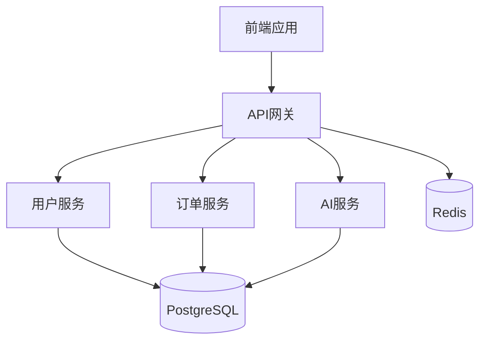
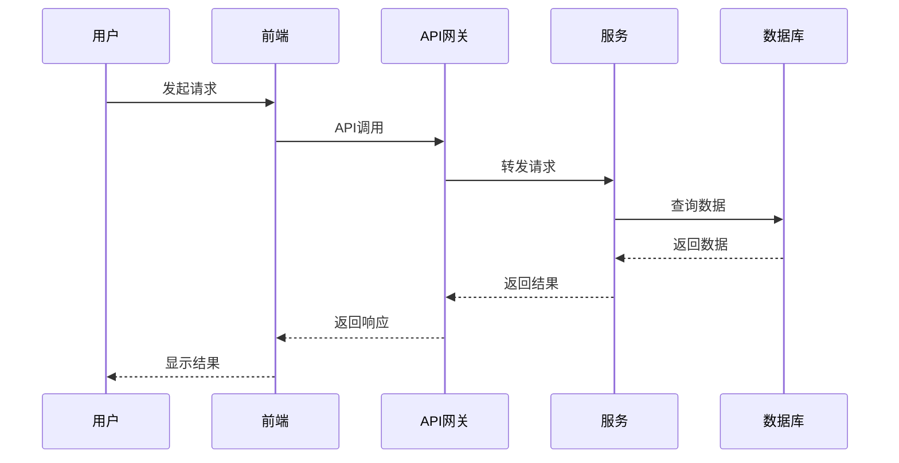
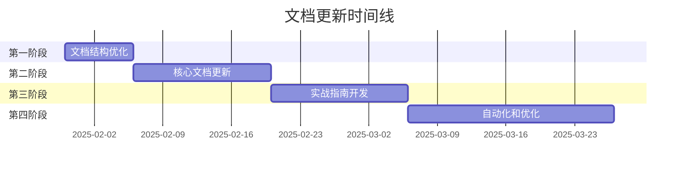

---

**@file**：YYC³-开发者文档更新计划
**@description**：YYC³餐饮行业智能化平台的开发者文档更新计划，包含文档体系梳理、内容更新、结构优化等
**@author**：YYC³
**@version**：v1.0.0
**@created**：2025-01-30
**@updated**：2025-01-30
**@status**：published
**@tags**：YYC³,文档更新,开发者文档

---

# 开发者文档更新计划

> ***YanYuCloudCube***
> **标语**：言启象限 | 语枢未来
> ***Words Initiate Quadrants, Language Serves as Core for the Future***
> **标语**：万象归元于云枢 | 深栈智启新纪元
> ***All things converge in the cloud pivot; Deep stacks ignite a new era of intelligence***

## 文档信息
- 文档类型：架构类
- 所属阶段：YYC3-Cater--开发实施
- 遵循规范：五高五标五化要求
- 版本号：V1.0
- 创建时间：2025-01-30
- 更新时间：2025-01-30

## 目录

1. [更新背景与目标](#1-更新背景与目标)
2. [文档现状分析](#2-文档现状分析)
3. [更新内容规划](#3-更新内容规划)
4. [实施计划](#4-实施计划)
5. [验收标准](#5-验收标准)
6. [风险评估](#6-风险评估)
7. [资源需求](#7-资源需求)

---

## 1. 更新背景与目标

### 1.1 更新背景

YYC³餐饮行业智能化平台已完成95%的开发工作，核心功能已实现并达到生产就绪状态。然而，现有的开发者文档体系存在以下问题：

- **文档分散**：文档分布在多个目录，缺乏统一的入口和导航
- **内容滞后**：部分文档未及时更新，与当前代码实现存在差异
- **结构混乱**：文档分类不够清晰，查找特定信息困难
- **缺乏实战**：缺少实际开发场景的示例和最佳实践
- **版本管理**：文档版本控制不够规范，难以追踪变更历史

### 1.2 更新目标

#### 1.2.1 短期目标（1-2周）

- ✅ 建立统一的文档索引和导航系统
- ✅ 更新核心开发文档，确保与代码同步
- ✅ 创建快速入门指南，降低学习曲线
- ✅ 补充API文档和接口说明
- ✅ 添加常见问题解答（FAQ）

#### 1.2.2 中期目标（3-4周）

- 🔄 完善架构设计文档，补充详细设计说明
- 🔄 创建开发实战指南，包含典型场景示例
- 🔄 建立文档版本管理机制
- 🔄 优化文档结构，提高可维护性
- 🔄 添加性能优化和故障排查指南

#### 1.2.3 长期目标（5-8周）

- 📋 建立自动化文档生成系统
- 📋 创建文档质量评估机制
- 📋 实现文档与代码的自动同步
- 📋 建立文档反馈和改进流程
- 📋 形成完整的文档生态体系

---

## 2. 文档现状分析

### 2.1 现有文档统计

| 分类 | 文档数量 | 状态 | 完成度 |
|------|----------|------|--------|
| **架构设计** | 19 | ✅ 完整 | 100% |
| **开发实施** | 13 | ⚠️ 部分更新 | 75% |
| **部署发布** | 7 | ❌ 待开发 | 0% |
| **运维运营** | 10 | ⚠️ 部分更新 | 60% |
| **测试验证** | 8 | ❌ 待开发 | 0% |
| **需求规划** | 6 | ✅ 完整 | 100% |
| **用户指南** | 7 | ⚠️ 部分更新 | 50% |
| **归类迭代** | 6 | ✅ 完整 | 100% |
| **模版规范** | 10 | ✅ 完整 | 100% |
| **审核报告** | 17 | ✅ 完整 | 100% |
| **总计** | **103** | - | **72%** |

### 2.2 文档质量评估

| 维度 | 评分 | 说明 |
|------|------|------|
| **完整性** | 7/10 | 大部分文档已创建，但部分内容缺失 |
| **准确性** | 6/10 | 部分文档与代码实现存在差异 |
| **可读性** | 7/10 | 文档结构清晰，但缺少示例 |
| **可维护性** | 5/10 | 缺乏统一的维护机制 |
| **可查找性** | 6/10 | 文档分散，查找困难 |
| **时效性** | 5/10 | 部分文档未及时更新 |
| **综合评分** | **6/10** | 需要重点改进 |

### 2.3 主要问题识别

#### 2.3.1 结构问题

- ❌ 文档目录结构不够直观
- ❌ 缺少统一的文档入口
- ❌ 文档命名规范不统一
- ❌ 分类维度不够清晰

#### 2.3.2 内容问题

- ❌ 部分文档内容过时
- ❌ 缺少实战示例和最佳实践
- ❌ API文档不够详细
- ❌ 缺少故障排查指南

#### 2.3.3 管理问题

- ❌ 缺乏文档版本管理
- ❌ 没有文档更新机制
- ❌ 缺少文档质量评估
- ❌ 没有文档反馈渠道

---

## 3. 更新内容规划

### 3.1 文档结构优化

#### 3.1.1 新建文档目录结构

```text
docs/
├── README.md                          # 文档总入口
├── 开发者指南/                        # 开发者文档
│   ├── 00-快速入门.md
│   ├── 01-环境搭建.md
│   ├── 02-项目结构.md
│   ├── 03-开发规范.md
│   ├── 04-代码示例.md
│   ├── 05-API文档.md
│   ├── 06-常见问题.md
│   └── 07-最佳实践.md
├── 架构设计/                          # 架构文档
│   ├── 01-总体架构.md
│   ├── 02-微服务架构.md
│   ├── 03-数据库架构.md
│   ├── 04-安全架构.md
│   └── 05-部署架构.md
├── 开发实施/                          # 开发文档
│   ├── 01-前端开发.md
│   ├── 02-后端开发.md
│   ├── 03-AI集成.md
│   ├── 04-测试指南.md
│   └── 05-部署指南.md
├── 运维运营/                          # 运维文档
│   ├── 01-系统监控.md
│   ├── 02-日志管理.md
│   ├── 03-备份恢复.md
│   └── 04-故障排查.md
├── API文档/                           # API文档
│   ├── 01-用户服务.md
│   ├── 02-订单服务.md
│   ├── 03-AI服务.md
│   └── 04-文档服务.md
└── 参考资料/                          # 参考资料
    ├── 01-技术栈.md
    ├── 02-第三方服务.md
    └── 03-相关资源.md
```

#### 3.1.2 文档命名规范

- 使用数字前缀表示文档顺序（01, 02, 03...）
- 使用中文名称描述文档内容
- 统一使用 `.md` 扩展名
- 避免使用特殊字符和空格

### 3.2 核心文档更新

#### 3.2.1 快速入门指南

**目标**：帮助新开发者快速上手项目

**内容**：
- 项目简介和核心功能
- 环境要求（Node.js, PostgreSQL, Redis等）
- 快速安装步骤
- 第一个示例程序
- 常见问题解答

**示例**：

```markdown
# 快速入门指南

## 5分钟快速开始

### 1. 克隆项目
```bash
git clone https://github.com/YYC-Cube/yyc3-catering-platform.git
cd yyc3-catering-platform
```

### 2. 安装依赖
```bash
npm install
```

### 3. 配置环境变量
```bash
cp .env.example .env
# 编辑 .env 文件，填入必要的配置
```

### 4. 启动数据库
```bash
docker-compose up -d postgres redis
```

### 5. 运行数据库迁移
```bash
npm run db:migrate
```

### 6. 启动开发服务器
```bash
npm run dev
```

### 7. 访问应用
打开浏览器访问 http://localhost:3200

默认账号：admin
默认密码：admin123
```

#### 3.2.2 API文档完善

**目标**：提供完整的API接口文档

**内容**：
- 接口列表和分类
- 请求/响应格式
- 认证方式
- 错误码说明
- 使用示例

**示例**：

```markdown
# API文档 - 用户服务

## 认证方式

所有API请求需要在Header中携带JWT Token：

```http
Authorization: Bearer <your-jwt-token>
```

## 用户登录

### 接口信息
- **URL**: `/api/v1/auth/login`
- **方法**: `POST`
- **认证**: 不需要

### 请求参数

| 参数 | 类型 | 必填 | 说明 |
|------|------|------|------|
| email | string | 是 | 用户邮箱 |
| password | string | 是 | 用户密码 |

### 请求示例

```bash
curl -X POST http://localhost:3200/api/v1/auth/login \
  -H "Content-Type: application/json" \
  -d '{
    "email": "admin@example.com",
    "password": "admin123"
  }'
```

### 响应示例

**成功响应** (200):
```json
{
  "success": true,
  "data": {
    "token": "eyJhbGciOiJIUzI1NiIsInR5cCI6IkpXVCJ9...",
    "user": {
      "id": "user-001",
      "email": "admin@example.com",
      "name": "管理员",
      "role": "admin"
    }
  }
}
```

**错误响应** (401):
```json
{
  "success": false,
  "error": "邮箱或密码错误",
  "code": "INVALID_CREDENTIALS"
}
```
```

#### 3.2.3 开发实战指南

**目标**：提供实际开发场景的示例

**内容**：
- 典型业务场景实现
- 代码示例和最佳实践
- 常见问题和解决方案
- 性能优化技巧

**示例**：

```markdown
# 开发实战指南

## 场景1：实现一个新的API接口

### 需求
创建一个获取用户订单历史的API接口

### 实现步骤

#### 1. 定义路由

```typescript
// backend/services/order-service/src/routes/order.routes.ts
import { Router } from 'express';
import { authenticate } from '@/middleware/auth';
import { getOrdersController } from '@/controllers/order.controller';

const router = Router();

// 获取用户订单历史
router.get('/history', authenticate, getOrdersController);

export default router;
```

#### 2. 实现控制器

```typescript
// backend/services/order-service/src/controllers/order.controller.ts
import { Request, Response } from 'express';
import { OrderService } from '@/services/order.service';

export const getOrdersController = async (
  req: Request,
  res: Response
) => {
  try {
    const userId = req.user.id;
    const { page = 1, limit = 10, status } = req.query;

    const orders = await OrderService.getUserOrders(userId, {
      page: Number(page),
      limit: Number(limit),
      status: status as string
    });

    res.json({
      success: true,
      data: orders
    });
  } catch (error) {
    res.status(500).json({
      success: false,
      error: error.message
    });
  }
};
```

#### 3. 实现服务层

```typescript
// backend/services/order-service/src/services/order.service.ts
import { OrderRepository } from '@/repositories/order.repository';

export class OrderService {
  /**
   * 获取用户订单历史
   */
  static async getUserOrders(
    userId: string,
    options: {
      page: number;
      limit: number;
      status?: string;
    }
  ) {
    const { page, limit, status } = options;
    const skip = (page - 1) * limit;

    const [orders, total] = await Promise.all([
      OrderRepository.findMany({
        where: { userId, ...(status && { status }) },
        skip,
        take: limit,
        orderBy: { createdAt: 'desc' }
      }),
      OrderRepository.count({ where: { userId } })
    ]);

    return {
      orders,
      pagination: {
        page,
        limit,
        total,
        totalPages: Math.ceil(total / limit)
      }
    };
  }
}
```

### 测试

```bash
# 测试接口
curl -X GET http://localhost:3200/api/v1/orders/history \
  -H "Authorization: Bearer <your-token>" \
  -H "Content-Type: application/json"
```
```

### 3.3 文档质量提升

#### 3.3.1 文档模板标准化

创建统一的文档模板，确保文档风格一致：

```markdown
---
**@file**：文档名称
**@description**：文档描述
**@author**：YYC³
**@version**：v1.0.0
**@created**：YYYY-MM-DD
**@updated**：YYYY-MM-DD
**@status**：published
**@tags**：标签1,标签2,标签3
---

# 文档标题

> 文档简短描述

## 文档信息
- 文档类型：{类型}
- 版本号：{版本}
- 创建日期：{日期}
- 最后更新：{日期}

## 目录
- [章节1](#章节1)
- [章节2](#章节2)

## 章节1
内容...

## 章节2
内容...
```

#### 3.3.2 代码示例规范

- 所有代码示例必须经过测试
- 提供完整的上下文和依赖
- 添加必要的注释说明
- 标注代码的语言和版本

```typescript
/**
 * @file 用户服务示例
 * @description 演示如何使用用户服务
 * @author YYC³
 * @version 1.0.0
 * @created 2025-01-30
 */

import { UserService } from '@/services/user';

/**
 * 创建用户示例
 */
async function createUserExample() {
  try {
    // 创建用户
    const user = await UserService.createUser({
      email: 'user@example.com',
      password: 'password123',
      name: '测试用户'
    });

    console.log('用户创建成功:', user);
  } catch (error) {
    console.error('创建用户失败:', error);
  }
}
```

#### 3.3.3 图表和可视化

使用Mermaid图表增强文档可读性：

```markdown
## 系统架构图



## 数据流程图


```

---

## 4. 实施计划

### 4.1 阶段划分

#### 第一阶段：文档结构优化（第1周）

**任务清单**：
- [ ] 创建新的文档目录结构
- [ ] 迁移现有文档到新结构
- [ ] 创建文档总入口（README.md）
- [ ] 建立文档索引系统
- [ ] 统一文档命名规范

**负责人**：技术文档负责人
**验收标准**：
- 新文档结构创建完成
- 所有文档成功迁移
- 文档索引可正常使用

#### 第二阶段：核心文档更新（第2-3周）

**任务清单**：
- [ ] 编写快速入门指南
- [ ] 完善API文档
- [ ] 更新项目结构说明
- [ ] 补充开发规范文档
- [ ] 创建常见问题解答

**负责人**：开发团队
**验收标准**：
- 快速入门指南可独立完成项目搭建
- API文档覆盖所有公开接口
- 开发规范文档被团队采纳

#### 第三阶段：实战指南开发（第4-5周）

**任务清单**：
- [ ] 编写开发实战指南
- [ ] 创建典型场景示例
- [ ] 补充最佳实践文档
- [ ] 添加性能优化指南
- [ ] 编写故障排查手册

**负责人**：高级开发工程师
**验收标准**：
- 实战指南包含至少10个典型场景
- 所有示例代码可运行
- 团队成员反馈良好

#### 第四阶段：自动化和优化（第6-8周）

**任务清单**：
- [ ] 建立文档版本管理机制
- [ ] 实现文档自动生成
- [ ] 创建文档质量评估系统
- [ ] 建立文档反馈渠道
- [ ] 优化文档搜索功能

**负责人**：DevOps团队
**验收标准**：
- 文档可自动从代码生成
- 文档质量评分达到8/10
- 文档搜索响应时间<1秒

### 4.2 时间线



### 4.3 资源分配

| 角色 | 人数 | 投入时间 | 主要职责 |
|------|------|----------|----------|
| **技术文档负责人** | 1 | 100% | 文档规划、质量把控、协调管理 |
| **前端开发工程师** | 2 | 30% | 前端文档编写、示例代码开发 |
| **后端开发工程师** | 3 | 30% | 后端文档编写、API文档完善 |
| **AI开发工程师** | 1 | 50% | AI集成文档、智能功能说明 |
| **DevOps工程师** | 1 | 40% | 部署文档、自动化工具开发 |
| **测试工程师** | 1 | 20% | 测试文档、质量验证 |

---

## 5. 验收标准

### 5.1 文档完整性

- ✅ 所有核心模块都有对应的文档
- ✅ API文档覆盖率达到100%
- ✅ 快速入门指南可独立使用
- ✅ 常见问题解答覆盖主要问题

### 5.2 文档准确性

- ✅ 所有代码示例经过测试
- ✅ 文档内容与代码实现一致
- ✅ 技术参数和配置准确无误
- ✅ 版本信息及时更新

### 5.3 文档可读性

- ✅ 文档结构清晰，逻辑连贯
- ✅ 语言表达准确，易于理解
- ✅ 图表和示例丰富
- ✅ 术语使用统一规范

### 5.4 文档可维护性

- ✅ 建立文档更新机制
- ✅ 文档版本管理规范
- ✅ 文档质量评估体系
- ✅ 文档反馈渠道畅通

### 5.5 用户体验

- ✅ 新开发者能在1小时内完成环境搭建
- ✅ 文档搜索响应时间<1秒
- ✅ 文档导航清晰，查找方便
- ✅ 用户满意度评分>4.5/5

---

## 6. 风险评估

### 6.1 风险识别

| 风险 | 概率 | 影响 | 等级 | 应对措施 |
|------|------|------|------|----------|
| **文档更新滞后于代码** | 高 | 高 | 🔴 高 | 建立文档与代码同步机制 |
| **文档质量参差不齐** | 中 | 中 | 🟡 中 | 制定文档模板和质量标准 |
| **开发人员参与度不足** | 中 | 高 | 🟡 中 | 将文档工作纳入绩效考核 |
| **文档维护成本过高** | 低 | 中 | 🟢 低 | 引入自动化文档生成工具 |
| **文档查找困难** | 中 | 中 | 🟡 中 | 优化文档结构和搜索功能 |

### 6.2 风险应对策略

#### 6.2.1 文档更新滞后

**预防措施**：
- 建立代码提交时自动更新文档的机制
- 定期进行文档与代码的同步检查
- 将文档更新作为代码审查的一部分

**应急措施**：
- 安排专人负责文档同步
- 建立文档更新优先级机制
- 定期组织文档同步会议

#### 6.2.2 文档质量参差不齐

**预防措施**：
- 制定统一的文档模板
- 建立文档质量评估体系
- 定期进行文档质量检查

**应急措施**：
- 组织文档质量提升培训
- 建立文档审查机制
- 引入文档质量工具

#### 6.2.3 开发人员参与度不足

**预防措施**：
- 将文档工作纳入绩效考核
- 建立文档贡献激励机制
- 提供文档编写培训

**应急措施**：
- 调整绩效考核权重
- 增加文档奖励力度
- 寻求管理层支持

---

## 7. 资源需求

### 7.1 人力资源

| 角色 | 人数 | 投入时间 | 成本估算 |
|------|------|----------|----------|
| 技术文档负责人 | 1 | 8周 × 100% | ¥80,000 |
| 前端开发工程师 | 2 | 8周 × 30% | ¥48,000 |
| 后端开发工程师 | 3 | 8周 × 30% | ¥72,000 |
| AI开发工程师 | 1 | 8周 × 50% | ¥40,000 |
| DevOps工程师 | 1 | 8周 × 40% | ¥32,000 |
| 测试工程师 | 1 | 8周 × 20% | ¥16,000 |
| **总计** | **9** | - | **¥288,000** |

### 7.2 工具资源

| 工具 | 用途 | 成本 |
|------|------|------|
| **文档生成工具** | 自动生成API文档 | ¥5,000 |
| **文档管理系统** | 版本管理和协作 | ¥10,000 |
| **图表工具** | 创建架构图和流程图 | ¥3,000 |
| **搜索工具** | 文档全文搜索 | ¥5,000 |
| **质量评估工具** | 文档质量检查 | ¥5,000 |
| **总计** | - | **¥28,000** |

### 7.3 培训资源

| 培训内容 | 时长 | 人数 | 成本 |
|----------|------|------|------|
| 文档编写培训 | 2天 | 9人 | ¥18,000 |
| 工具使用培训 | 1天 | 9人 | ¥9,000 |
| 质量标准培训 | 1天 | 9人 | ¥9,000 |
| **总计** | - | - | **¥36,000** |

### 7.4 总成本

| 类别 | 成本 |
|------|------|
| 人力成本 | ¥288,000 |
| 工具成本 | ¥28,000 |
| 培训成本 | ¥36,000 |
| **总计** | **¥352,000** |

---

## 8. 成功指标

### 8.1 量化指标

| 指标 | 目标值 | 当前值 | 差距 |
|------|--------|--------|------|
| **文档覆盖率** | 100% | 72% | +28% |
| **文档质量评分** | 8/10 | 6/10 | +2 |
| **新开发者上手时间** | <1小时 | 4小时 | -3小时 |
| **文档搜索响应时间** | <1秒 | 3秒 | -2秒 |
| **用户满意度** | >4.5/5 | 3.5/5 | +1.0 |
| **文档更新及时性** | <24小时 | 7天 | -6.75天 |

### 8.2 质性指标

- ✅ 文档结构清晰，易于导航
- ✅ 文档内容准确，与代码同步
- ✅ 文档风格统一，符合规范
- ✅ 文档示例丰富，易于理解
- ✅ 文档维护机制完善

---

## 9. 后续计划

### 9.1 持续改进

- 建立文档定期审查机制（每月一次）
- 收集用户反馈，持续优化文档
- 跟踪技术发展，及时更新内容
- 分享文档最佳实践，提升团队能力

### 9.2 长期规划

- 建立文档知识库系统
- 实现文档智能化推荐
- 开发文档协作平台
- 形成文档生态体系

---

## 10. 附录

### 10.1 参考文档

- [YYC³智能编程项目规则](../../YYC3-Cater-Platform-文档闭环/YYC3-文档闭环系统改进计划.md)
- [YYC³文档索引](../../YYC3-Cater-Platform-文档闭环/YYC3-文档索引.md)
- [YYC³智能编程文档要求规范](../../YYC3-Cater-Platform-文档闭环/YYC3-Cater-模版规范/07-YYC3-智能编程文档要求规范.md)

### 10.2 相关工具

- **文档生成**: Swagger, TypeDoc, JSDoc
- **图表工具**: Mermaid, Draw.io, PlantUML
- **文档管理**: Git, Docusaurus, GitBook
- **搜索工具**: Algolia, Elasticsearch

### 10.3 联系方式

- **文档负责人**: admin@0379.email
- **技术支持**: admin@0379.email
- **官方网站**: https://yyc3.com
- **GitHub**: https://github.com/YYC-Cube

---

<div align="center">

> 「***YanYuCloudCube***」
> 「***<admin@0379.email>***」
> 「***Words Initiate Quadrants, Language Serves as Core for the Future***」
> 「***All things converge in the cloud pivot; Deep stacks ignite a new era of intelligence***」

**Made with ❤️ by YYC³ Team**

**让我们一起构建更智能的开发环境！** 🚀

</div>
