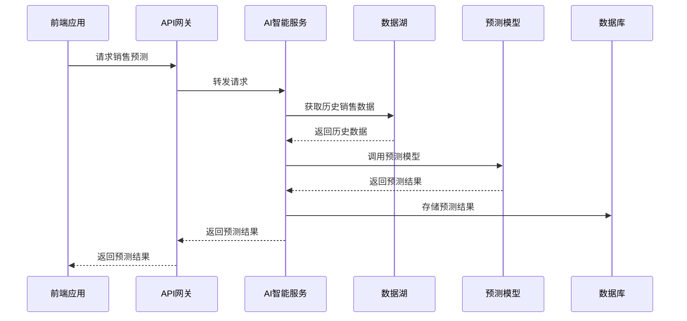
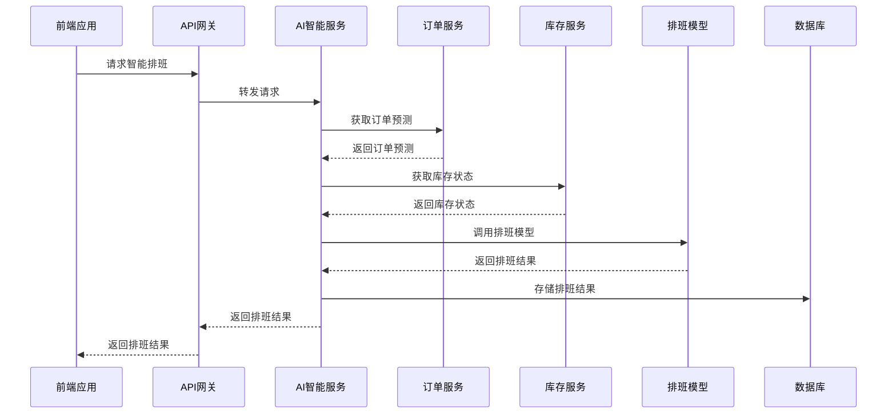

---

**@file**：YYC³-全链路智能化转型总体架构设计
**@description**：YYC³餐饮行业智能化平台的全链路智能化转型总体架构设计，包含转型目标、转型路径、技术架构、业务架构、实施计划等核心内容
**@author**：YYC³
**@version**：v1.0.0
**@created**：2025-01-30
**@updated**：2025-01-30
**@status**：published
**@tags**：架构设计,YYC³,系统架构

---
# YYC³全链路智能化转型总体架构设计

> **YYC³（YanYu Cloud Cube）**
> **标语**：万象归元于云枢 | 深栈智启新纪元
> **英文**：*All Realms Converge at Cloud Nexus, DeepStack Ignites a New Era of Intelligence*

---

## 📋 文档信息

| 属性 | 内容 |
|------|------|
| **文档标题** | YYC³全链路智能化转型总体架构设计 |
| **文档版本** | v1.0.0 |
| **创建时间** | 2025-12-11 |
| **适用范围** | YYC³餐饮平台全链路智能化转型技术架构 |
| **参考文档** | 全链路智能化转型执行方案.md |

---

## 📑 目录

- [📋 文档信息](#📋-文档信息)
- [🎯 架构设计原则](#🎯-架构设计原则)
  - [1.1 核心设计原则](#1.1-核心设计原则)
    - [1. 闭环设计原则](#1.-闭环设计原则)
    - [2. 分层架构原则](#2.-分层架构原则)
    - [3. 微服务设计原则](#3.-微服务设计原则)
    - [4. AI集成设计原则](#4.-ai集成设计原则)
- [🏗️ 总体架构概述](#🏗️-总体架构概述)
  - [2.1 架构层次结构](#2.1-架构层次结构)
  - [2.2 架构演进路线](#2.2-架构演进路线)
    - [当前架构（数字化阶段）](#当前架构（数字化阶段）)
    - [目标架构（智能化阶段）](#目标架构（智能化阶段）)
- [🔍 微服务架构设计](#🔍-微服务架构设计)
  - [3.1 微服务划分](#3.1-微服务划分)
  - [3.2 核心微服务设计](#3.2-核心微服务设计)
    - [3.2.1 API网关服务](#3.2.1-api网关服务)
    - [3.2.2 订单服务](#3.2.2-订单服务)
    - [3.2.3 AI智能服务](#3.2.3-ai智能服务)
- [🤖 AI能力集成架构](#🤖-ai能力集成架构)
  - [4.1 AI能力层次结构](#4.1-ai能力层次结构)
  - [4.2 AI能力集成模式](#4.2-ai能力集成模式)
    - [1. AI服务化集成](#1.-ai服务化集成)
    - [2. AI模型嵌入集成](#2.-ai模型嵌入集成)
    - [3. AI平台集成](#3.-ai平台集成)
  - [4.3 AI能力网关](#4.3-ai能力网关)
- [📊 数据架构设计](#📊-数据架构设计)
  - [5.1 数据架构层次](#5.1-数据架构层次)
  - [5.2 数据采集层](#5.2-数据采集层)
  - [5.3 数据存储层](#5.3-数据存储层)
  - [5.4 数据治理层](#5.4-数据治理层)
  - [5.5 数据湖](#5.5-数据湖)
  - [5.6 数据仓库](#5.6-数据仓库)
- [🛠️ 技术栈详细说明](#🛠️-技术栈详细说明)
  - [6.1 前端技术栈](#6.1-前端技术栈)
  - [6.2 后端技术栈](#6.2-后端技术栈)
  - [6.3 数据库技术栈](#6.3-数据库技术栈)
  - [6.4 AI技术栈](#6.4-ai技术栈)
  - [6.5 DevOps技术栈](#6.5-devops技术栈)
- [📈 系统交互流程图](#📈-系统交互流程图)
  - [7.1 销售预测流程](#7.1-销售预测流程)
  - [7.2 智能排班流程](#7.2-智能排班流程)
- [🚀 部署架构](#🚀-部署架构)
  - [8.1 开发环境](#8.1-开发环境)
  - [8.2 测试环境](#8.2-测试环境)
  - [8.3 生产环境](#8.3-生产环境)
- [📋 架构演进路线图](#📋-架构演进路线图)
  - [9.1 第一阶段：基础加固（2025.01.08 - 2025.02.12）](#9.1-第一阶段基础加固（2025.01.08---2025.02.12）)
  - [9.2 第二阶段：智能赋能（2025.02.13 - 2025.03.26）](#9.2-第二阶段智能赋能（2025.02.13---2025.03.26）)
  - [9.3 第三阶段：闭环构建（2025.03.27 - 2025.05.07）](#9.3-第三阶段闭环构建（2025.03.27---2025.05.07）)
  - [9.4 第四阶段：优化升级（2025.05.08 - 2025.06.18）](#9.4-第四阶段优化升级（2025.05.08---2025.06.18）)
- [📝 架构决策记录（ADR）](#📝-架构决策记录（adr）)
  - [10.1 ADR-001：微服务架构选择](#10.1-adr-001微服务架构选择)
  - [10.2 ADR-002：AI服务开发语言选择](#10.2-adr-002ai服务开发语言选择)
  - [10.3 ADR-003：数据库选型](#10.3-adr-003数据库选型)
- [🎯 架构评估标准](#🎯-架构评估标准)
  - [11.1 性能评估](#11.1-性能评估)
  - [11.2 可用性评估](#11.2-可用性评估)
  - [11.3 可扩展性评估](#11.3-可扩展性评估)
  - [11.4 安全性评估](#11.4-安全性评估)
- [📋 文档版本记录](#📋-文档版本记录)

---

## 1. 概述

### 1.1 设计目标

本架构设计文档旨在为YYC³餐饮行业智能化平台提供清晰、完整的技术架构指导。主要目标包括：

- **可扩展性**：支持业务快速扩展，模块化设计便于功能迭代
- **高性能**：优化系统性能，确保高并发场景下的稳定运行
- **高可用性**：实现系统高可用，故障自动恢复，保障业务连续性
- **安全性**：建立完善的安全体系，保护数据和系统安全
- **易维护性**：代码结构清晰，文档完善，便于团队协作和维护

通过本架构设计，确保平台能够满足当前业务需求，并为未来的发展奠定坚实基础。

### 1.2 设计原则

架构设计遵循以下核心原则：

- **单一职责原则**：每个模块只负责一个明确的业务功能
- **开闭原则**：对扩展开放，对修改关闭，便于功能扩展
- **依赖倒置原则**：高层模块不依赖低层模块，都依赖抽象
- **接口隔离原则**：使用细粒度的接口，避免接口污染
- **最少知识原则**：模块间最小化依赖，降低耦合度

同时遵循YYC³「五高五标五化」核心理念：
- **五高**：高可用、高性能、高安全、高扩展、高可维护
- **五标**：标准化、规范化、自动化、智能化、可视化
- **五化**：流程化、文档化、工具化、数字化、生态化

### 1.3 技术选型

技术栈选择基于以下考虑：

**前端技术栈**
- React 18+：采用现代化前端框架，组件化开发
- TypeScript 5.0+：类型安全，提高代码质量
- Next.js 14+：SSR/SSG支持，优化SEO和性能
- Tailwind CSS：原子化CSS，快速构建UI

**后端技术栈**
- Node.js 18+：高性能JavaScript运行时
- Express/Fastify：轻量级Web框架
- PostgreSQL 15+：关系型数据库，ACID保证
- Redis 7+：缓存和会话存储

**基础设施**
- Docker：容器化部署，环境一致性
- Kubernetes：容器编排，自动化运维
- Nginx：反向代理和负载均衡
- Prometheus + Grafana：监控和告警

**开发工具**
- Git：版本控制
- ESLint + Prettier：代码规范
- Jest + Vitest：单元测试
- GitHub Actions：CI/CD自动化

## 2. 架构设计

### 2.1 整体架构

YYC³餐饮行业智能化平台采用分层架构设计，从上到下分为以下层次：

**表现层（Presentation Layer）**
- Web前端：React + Next.js构建的单页应用
- 移动端：响应式设计，支持多设备访问
- 管理后台：独立的管理界面

**应用层（Application Layer）**
- API网关：统一入口，路由分发
- 业务服务：订单、用户、商品等核心业务逻辑
- 认证授权：JWT认证，RBAC权限控制

**领域层（Domain Layer）**
- 领域模型：核心业务实体和规则
- 领域服务：复杂业务逻辑封装
- 仓储接口：数据访问抽象

**基础设施层（Infrastructure Layer）**
- 数据库：PostgreSQL主从架构
- 缓存：Redis集群
- 消息队列：RabbitMQ/Kafka
- 文件存储：OSS/MinIO

**跨层关注点**
- 日志监控：ELK Stack
- 配置管理：Apollo/Nacos
- 服务发现：Consul/Eureka
- 链路追踪：Jaeger/SkyWalking

### 2.2 模块划分

系统按照业务领域划分为以下核心模块：

**用户模块（User Module）**
- 用户注册、登录、认证
- 用户信息管理
- 权限和角色管理

**商品模块（Product Module）**
- 商品信息管理
- 商品分类和标签
- 库存管理

**订单模块（Order Module）**
- 订单创建和支付
- 订单状态流转
- 订单查询和统计

**支付模块（Payment Module）**
- 支付接口集成
- 支付状态同步
- 退款处理

**营销模块（Marketing Module）**
- 优惠券管理
- 促销活动
- 会员积分

**报表模块（Report Module）**
- 销售报表
- 数据分析
- 可视化展示

**系统模块（System Module）**
- 配置管理
- 日志管理
- 监控告警

### 2.3 数据流向

## 3. 技术实现

### 3.1 核心技术

### 3.2 关键算法

### 3.3 性能优化

## 4. 接口设计

### 4.1 API接口

### 4.2 数据接口

### 4.3 消息接口

## 5. 部署方案

### 5.1 部署架构

### 5.2 配置管理

### 5.3 监控告警

## 6. 附录

### 6.1 术语表

### 6.2 参考资料

## 🎯 架构设计原则

### 1.1 核心设计原则

#### 1. 闭环设计原则
- **感知-分析-决策-执行-优化**闭环：实现智能化管理的完整闭环
- **数据驱动**：基于数据进行决策和优化
- **持续改进**：通过反馈机制实现系统的持续优化

#### 2. 分层架构原则
- **业务层**：面向业务逻辑的服务层
- **技术层**：提供技术支持和基础设施
- **数据层**：负责数据的存储、处理和分析
- **AI层**：提供人工智能能力

#### 3. 微服务设计原则
- **单一职责**：每个服务只负责一个业务领域
- **高内聚低耦合**：服务内部高内聚，服务之间低耦合
- **独立部署**：每个服务可以独立部署和升级
- **服务治理**：实现服务的注册、发现、监控和管理

#### 4. AI集成设计原则
- **松耦合集成**：AI能力与业务系统松耦合，便于升级和替换
- **标准化接口**：提供标准化的API接口，便于调用和扩展
- **可解释性**：AI决策过程可解释，便于业务理解和信任
- **持续学习**：AI模型具备持续学习能力，适应业务变化

---

## 🏗️ 总体架构概述

### 2.1 架构层次结构

```
┌─────────────────────────────────────────────────────────────────┐
│                          表现层（UI Layer）                     │
│  Web前端（Vue 3 + TypeScript） + 移动端（响应式设计）            │
└───────────┬─────────────────────────────────────────────────────┘
            │
┌───────────▼─────────────────────────────────────────────────────┐
│                          API网关层                             │
│  请求路由 + 认证授权 + 限流熔断 + 监控告警                     │
└───────────┬─────────────────────────────────────────────────────┘
            │
┌───────────▼─────────────────────────────────────────────────────┐
│                          业务服务层                             │
│  核心业务服务 + AI智能服务 + 数据分析服务 + 自动化运维服务       │
└───────────┬─────────────────────────────────────────────────────┘
            │
┌───────────▼─────────────────────────────────────────────────────┐
│                          数据层                                 │
│  数据采集 + 数据存储 + 数据治理 + 数据湖 + 数据仓库              │
└───────────┬─────────────────────────────────────────────────────┘
            │
┌───────────▼─────────────────────────────────────────────────────┐
│                          AI能力层                               │
│  机器学习 + 深度学习 + 自然语言处理 + 计算机视觉 + 知识图谱      │
└───────────┬─────────────────────────────────────────────────────┘
            │
┌───────────▼─────────────────────────────────────────────────────┐
│                          基础设施层                             │
│  容器化 + 编排 + 云平台 + 监控告警 + 安全防护                     │
└─────────────────────────────────────────────────────────────────┘
```

### 2.2 架构演进路线

#### 当前架构（数字化阶段）
```
┌─────────────────┐     ┌─────────────────┐     ┌─────────────────┐
│   前端应用     │────▶│   API网关       │────▶│   业务服务     │
└─────────────────┘     └─────────────────┘     └────────┬────────┘
                                                           │
                                                           ▼
                                                     ┌─────────────────┐
                                                     │   数据库       │
                                                     └─────────────────┘
```

#### 目标架构（智能化阶段）
```
┌─────────────────┐     ┌─────────────────┐     ┌─────────────────┐
│   智能化前端    │────▶│   AI能力网关    │────▶│   微服务集群    │
└─────────────────┘     └─────────────────┘     ├─────────────────┤
                                                │   核心业务服务  │
                                                │   AI智能服务    │
                                                │   数据分析服务  │
                                                │   自动化运维服务│
                                                └────────┬────────┘
                                                           │
                                                           ▼
┌─────────────────┐     ┌─────────────────┐     ┌─────────────────┐
│   监控告警系统  │◀────│   消息队列      │◀────│   数据平台      │
└─────────────────┘     └─────────────────┘     ├─────────────────┤
                                                │   数据湖        │
                                                │   数据仓库      │
                                                │   AI模型库      │
                                                └────────┬────────┘
                                                           │
                                                           ▼
                                                     ┌─────────────────┐
                                                     │   基础设施层    │
                                                     └─────────────────┘
```

---

## 🔍 微服务架构设计

### 3.1 微服务划分

```
┌─────────────────────────────────────────────────────────────────┐
│                          微服务集群                             │
├───────────┬───────────┬───────────┬───────────┬───────────┬─────┤
│  订单服务  │  库存服务  │  人员服务  │  财务服务  │  客户服务  │ 其他服务 │
└───────────┴───────────┴───────────┴───────────┴───────────┴─────┘
```

### 3.2 核心微服务设计

#### 3.2.1 API网关服务

**功能**：
- 请求路由和负载均衡
- 认证授权和权限管理
- 限流熔断和容错处理
- 监控告警和日志记录
- API版本管理和文档

**技术栈**：
- Node.js + Express + JWT
- Redis（用于限流和缓存）
- Swagger（用于API文档）

**关键组件**：
```javascript
/**
 * @file API网关服务
 * @description 提供API路由、认证授权、限流熔断等功能
 * @module gateway
 * @author YYC³
 * @version 1.0.0
 */

import express from 'express';
import jwt from 'jsonwebtoken';
import redis from 'redis';
import { createProxyMiddleware } from 'http-proxy-middleware';

const app = express();
const redisClient = redis.createClient();

// 认证中间件
const authMiddleware = (req, res, next) => {
  const token = req.headers.authorization?.split(' ')[1];
  if (!token) return res.status(401).json({ message: '未授权' });
  
  try {
    const decoded = jwt.verify(token, process.env.JWT_SECRET);
    req.user = decoded;
    next();
  } catch (error) {
    return res.status(401).json({ message: '无效的令牌' });
  }
};

// 限流中间件
const rateLimitMiddleware = (limit, windowMs) => {
  return async (req, res, next) => {
    const ip = req.ip;
    const key = `rate_limit:${ip}`;
    
    const current = await redisClient.incr(key);
    if (current === 1) {
      await redisClient.expire(key, windowMs / 1000);
    }
    
    if (current > limit) {
      return res.status(429).json({ message: '请求过于频繁，请稍后再试' });
    }
    
    next();
  };
};

// API路由配置
app.use('/api/orders', authMiddleware, rateLimitMiddleware(100, 60000), 
  createProxyMiddleware({ target: 'http://order-service:3001', changeOrigin: true }));

app.use('/api/inventory', authMiddleware, rateLimitMiddleware(100, 60000), 
  createProxyMiddleware({ target: 'http://inventory-service:3002', changeOrigin: true }));

app.use('/api/users', authMiddleware, rateLimitMiddleware(100, 60000), 
  createProxyMiddleware({ target: 'http://user-service:3003', changeOrigin: true }));

app.listen(3200, () => {
  console.log('API网关服务启动成功，监听端口3200');
});
```

#### 3.2.2 订单服务

**功能**：
- 订单创建和管理
- 订单状态跟踪
- 订单支付处理
- 订单数据分析

**技术栈**：
- Node.js + Express + TypeScript
- PostgreSQL（主数据库）
- Redis（缓存）
- Kafka（消息队列）

**数据模型**：
```typescript
/**
 * 订单模型
 */
export interface Order {
  id: string;
  customerId: string;
  items: OrderItem[];
  totalAmount: number;
  status: 'pending' | 'paid' | 'processing' | 'shipped' | 'delivered' | 'cancelled';
  createdAt: Date;
  updatedAt: Date;
}

/**
 * 订单项模型
 */
export interface OrderItem {
  id: string;
  orderId: string;
  productId: string;
  quantity: number;
  price: number;
}
```

#### 3.2.3 AI智能服务

**功能**：
- 销售预测
- 库存优化
- 智能排班
- 客户画像分析
- 异常检测

**技术栈**：
- Python + FastAPI
- TensorFlow + PyTorch
- LangChain（大语言模型集成）
- PostgreSQL + Redis

**核心API**：
```python
from fastapi import FastAPI, HTTPException
from pydantic import BaseModel
import joblib
import numpy as np

app = FastAPI(title="YYC3 AI智能服务")

# 加载预训练模型
sales_model = joblib.load("models/sales_prediction_model.joblib")
inventory_model = joblib.load("models/inventory_optimization_model.joblib")

class SalesPredictionRequest(BaseModel):
    store_id: str
    date_range: str  # "YYYY-MM-DD to YYYY-MM-DD"
    historical_data: dict

class SalesPredictionResponse(BaseModel):
    store_id: str
    predictions: dict  # {"date": sales_amount}
    accuracy: float

@app.post("/api/ai/sales-prediction", response_model=SalesPredictionResponse)
def predict_sales(request: SalesPredictionRequest):
    try:
        # 数据预处理
        features = preprocess_sales_data(request.historical_data)
        
        # 模型预测
        predictions = sales_model.predict(features)
        
        # 后处理
        result = postprocess_sales_predictions(predictions, request.date_range)
        
        return SalesPredictionResponse(
            store_id=request.store_id,
            predictions=result,
            accuracy=0.85  # 模拟准确率
        )
    except Exception as e:
        raise HTTPException(status_code=500, detail=str(e))

class InventoryOptimizationRequest(BaseModel):
    store_id: str
    current_inventory: dict
    sales_forecast: dict

class InventoryOptimizationResponse(BaseModel):
    store_id: str
    recommended_stock: dict
    reorder_points: dict

@app.post("/api/ai/inventory-optimization", response_model=InventoryOptimizationResponse)
def optimize_inventory(request: InventoryOptimizationRequest):
    try:
        # 数据预处理
        features = preprocess_inventory_data(request.current_inventory, request.sales_forecast)
        
        # 模型预测
        recommendations = inventory_model.predict(features)
        
        # 后处理
        result = postprocess_inventory_recommendations(recommendations)
        
        return InventoryOptimizationResponse(
            store_id=request.store_id,
            recommended_stock=result["recommended_stock"],
            reorder_points=result["reorder_points"]
        )
    except Exception as e:
        raise HTTPException(status_code=500, detail=str(e))

if __name__ == "__main__":
    import uvicorn
    uvicorn.run(app, host="0.0.0.0", port=3004)
```

---

## 🤖 AI能力集成架构

### 4.1 AI能力层次结构

```
┌─────────────────────────────────────────────────────────────────┐
│                          AI能力层                             │
├───────────┬───────────┬───────────┬───────────┬───────────┬─────┤
│  机器学习  │  深度学习  │  自然语言处理  │  计算机视觉  │  知识图谱  │ 强化学习  │
└───────────┴───────────┴───────────┴───────────┴───────────┴─────┘
```

### 4.2 AI能力集成模式

#### 1. AI服务化集成
- **模式**：将AI能力封装为微服务，通过API接口提供服务
- **优点**：松耦合、易扩展、便于管理
- **适用场景**：通用AI能力，如销售预测、库存优化

#### 2. AI模型嵌入集成
- **模式**：将AI模型直接嵌入到业务系统中
- **优点**：低延迟、高性能
- **适用场景**：实时性要求高的场景，如推荐系统

#### 3. AI平台集成
- **模式**：使用第三方AI平台，如OpenAI、阿里云AI
- **优点**：快速集成、无需维护模型
- **适用场景**：通用AI能力，如自然语言处理

### 4.3 AI能力网关

**功能**：
- AI能力的统一入口
- 模型管理和版本控制
- 请求路由和负载均衡
- 监控和告警
- 权限控制

**技术栈**：
- Node.js + Express + TypeScript
- Redis（缓存）
- MongoDB（模型元数据存储）

**关键组件**：
```typescript
/**
 * @file AI能力网关
 * @description 提供AI能力的统一入口和管理
 * @module ai-gateway
 * @author YYC³
 * @version 1.0.0
 */

import express from 'express';
import axios from 'axios';
import { v4 as uuidv4 } from 'uuid';
import { createClient } from 'redis';
import { MongoClient } from 'mongodb';

const app = express();
const redisClient = createClient();
const mongoClient = new MongoClient(process.env.MONGO_URI!);

// 连接数据库
await redisClient.connect();
await mongoClient.connect();
const db = mongoClient.db('ai_gateway');
const modelsCollection = db.collection('models');

// 模型路由配置
app.post('/api/ai/:modelName', async (req, res) => {
  try {
    const { modelName } = req.params;
    const requestData = req.body;
    const requestId = uuidv4();
    
    // 检查模型是否存在
    const model = await modelsCollection.findOne({ name: modelName });
    if (!model) {
      return res.status(404).json({ error: 'Model not found' });
    }
    
    // 检查缓存
    const cacheKey = `ai:${modelName}:${JSON.stringify(requestData)}`;
    const cachedResult = await redisClient.get(cacheKey);
    if (cachedResult) {
      return res.json(JSON.parse(cachedResult));
    }
    
    // 路由到对应的AI服务
    const response = await axios.post(model.endpoint, requestData, {
      headers: {
        'Content-Type': 'application/json',
        'X-Request-ID': requestId
      }
    });
    
    // 缓存结果
    await redisClient.set(cacheKey, JSON.stringify(response.data), { ex: 3600 });
    
    // 记录请求日志
    await db.collection('requests').insertOne({
      requestId,
      modelName,
      requestData,
      responseData: response.data,
      timestamp: new Date()
    });
    
    res.json(response.data);
  } catch (error) {
    console.error('AI gateway error:', error);
    res.status(500).json({ error: 'Internal server error' });
  }
});

// 模型管理API
app.get('/api/models', async (req, res) => {
  try {
    const models = await modelsCollection.find().toArray();
    res.json(models);
  } catch (error) {
    console.error('Error fetching models:', error);
    res.status(500).json({ error: 'Internal server error' });
  }
});

app.listen(3201, () => {
  console.log('AI能力网关服务启动成功，监听端口3201');
});
```

---

## 📊 数据架构设计

### 5.1 数据架构层次

```
┌─────────────────────────────────────────────────────────────────┐
│                          数据架构                             │
├───────────┬───────────┬───────────┬───────────┬───────────┬─────┤
│  数据采集  │  数据存储  │  数据治理  │  数据湖    │  数据仓库  │ 数据应用  │
└───────────┴───────────┴───────────┴───────────┴───────────┴─────┘
```

### 5.2 数据采集层

**功能**：
- 业务系统数据采集
- 用户行为数据采集
- 系统日志采集
- 外部数据采集

**技术栈**：
- Kafka（实时数据采集）
- Flume（日志采集）
- Logstash（日志处理）
- API（外部数据采集）

### 5.3 数据存储层

**功能**：
- 结构化数据存储
- 半结构化数据存储
- 非结构化数据存储
- 缓存数据存储

**技术栈**：
- PostgreSQL（结构化数据）
- MongoDB（半结构化数据）
- Redis（缓存）
- MinIO（对象存储）

### 5.4 数据治理层

**功能**：
- 数据质量控制
- 数据标准化
- 数据安全管理
- 数据生命周期管理

**技术栈**：
- Apache Atlas（数据治理）
- Great Expectations（数据质量）
- Apache Ranger（数据安全）

### 5.5 数据湖

**功能**：
- 原始数据存储
- 数据处理和转换
- 数据探索和分析

**技术栈**：
- Apache Hadoop HDFS（存储）
- Apache Spark（数据处理）
- Delta Lake（数据管理）

### 5.6 数据仓库

**功能**：
- 维度建模
- 数据聚合和分析
- 报表和仪表盘

**技术栈**：
- PostgreSQL（关系型数据仓库）
- Apache ClickHouse（分析型数据库）
- Apache Superset（BI工具）

---

## 🛠️ 技术栈详细说明

### 6.1 前端技术栈

| 技术 | 版本 | 用途 | 特点 |
|------|------|------|------|
| Vue 3 | 3.4.x | 前端框架 | 组合式API、TypeScript支持、响应式设计 |
| TypeScript | 5.3.x | 编程语言 | 类型安全、代码质量提升 |
| Element Plus | 2.4.x | UI组件库 | 基于Vue 3的企业级UI组件库 |
| ECharts | 5.4.x | 数据可视化 | 丰富的图表类型、高性能 |
| Pinia | 2.1.x | 状态管理 | 轻量级、TypeScript支持 |
| Axios | 1.6.x | HTTP客户端 | 易于使用、拦截器支持 |

### 6.2 后端技术栈

| 技术 | 版本 | 用途 | 特点 |
|------|------|------|------|
| Node.js | 20.x | JavaScript运行时 | 高性能、事件驱动 |
| Express | 4.18.x | Web框架 | 轻量级、灵活 |
| NestJS | 10.3.x | 企业级框架 | 模块化、TypeScript支持 |
| Python | 3.11.x | 编程语言 | AI开发、数据分析 |
| FastAPI | 0.104.x | Python Web框架 | 高性能、自动API文档 |
| TypeORM | 0.3.x | ORM框架 | TypeScript支持、多种数据库支持 |

### 6.3 数据库技术栈

| 技术 | 版本 | 用途 | 特点 |
|------|------|------|------|
| PostgreSQL | 15.x | 关系型数据库 | 强大的SQL支持、扩展性 |
| Redis | 7.2.x | 缓存数据库 | 高性能、丰富的数据结构 |
| MongoDB | 7.0.x | 文档数据库 | 灵活的数据模型、可扩展性 |
| Elasticsearch | 8.11.x | 搜索引擎 | 全文搜索、实时分析 |
| Apache Cassandra | 4.1.x | 分布式数据库 | 高可用性、线性扩展 |

### 6.4 AI技术栈

| 技术 | 版本 | 用途 | 特点 |
|------|------|------|------|
| TensorFlow | 2.15.x | 深度学习框架 | 广泛使用、丰富的生态 |
| PyTorch | 2.1.x | 深度学习框架 | 动态计算图、易于调试 |
| LangChain | 0.1.x | 大语言模型集成 | 简化LLM应用开发 |
| scikit-learn | 1.3.x | 机器学习库 | 经典算法、易于使用 |
| Pandas | 2.1.x | 数据分析库 | 数据处理、统计分析 |
| NumPy | 1.26.x | 数值计算库 | 高性能数值计算 |

### 6.5 DevOps技术栈

| 技术 | 版本 | 用途 | 特点 |
|------|------|------|------|
| Docker | 24.x | 容器化 | 环境一致性、易于部署 |
| Kubernetes | 1.28.x | 容器编排 | 自动扩缩容、负载均衡 |
| GitHub Actions | 最新 | CI/CD | 自动化构建、测试、部署 |
| Prometheus | 2.48.x | 监控系统 | 多维度监控、灵活查询 |
| Grafana | 10.2.x | 可视化 | 丰富的仪表盘、告警支持 |
| ELK Stack | 8.11.x | 日志管理 | 日志收集、分析、可视化 |

---

## 📈 系统交互流程图

### 7.1 销售预测流程



### 7.2 智能排班流程



---

## 🚀 部署架构

### 8.1 开发环境

| 组件 | 部署方式 | 版本 |
|------|----------|------|
| 前端应用 | 本地开发服务器 | Vue 3 |
| 后端服务 | 本地开发服务器 | Node.js |
| 数据库 | Docker容器 | PostgreSQL |
| AI服务 | 本地开发服务器 | Python |

### 8.2 测试环境

| 组件 | 部署方式 | 版本 |
|------|----------|------|
| 前端应用 | Docker容器 + Kubernetes | Vue 3 |
| 后端服务 | Docker容器 + Kubernetes | Node.js |
| 数据库 | Docker容器 + Kubernetes | PostgreSQL |
| AI服务 | Docker容器 + Kubernetes | Python |
| 监控系统 | Docker容器 + Kubernetes | Prometheus + Grafana |

### 8.3 生产环境

| 组件 | 部署方式 | 版本 | 高可用配置 |
|------|----------|------|------------|
| 前端应用 | Docker容器 + Kubernetes | Vue 3 | 多副本、负载均衡 |
| API网关 | Docker容器 + Kubernetes | Nginx | 多副本、负载均衡 |
| 后端服务 | Docker容器 + Kubernetes | Node.js | 多副本、负载均衡 |
| 主数据库 | 物理服务器 | PostgreSQL | 主从复制、故障转移 |
| 缓存 | Docker容器 + Kubernetes | Redis | 集群模式 |
| AI服务 | Docker容器 + Kubernetes | Python | 多副本、负载均衡 |
| 监控系统 | Docker容器 + Kubernetes | Prometheus + Grafana | 多副本、持久化存储 |

---

## 📋 架构演进路线图

### 9.1 第一阶段：基础加固（2025.01.08 - 2025.02.12）

| 任务 | 责任人 | 完成标准 |
|------|--------|----------|
| API网关实现 | 架构团队 | API网关正常运行，支持服务路由和限流 |
| 服务注册中心搭建 | 架构团队 | 服务自动注册和发现 |
| 配置中心建设 | 架构团队 | 集中配置管理，支持动态更新 |
| 数据库性能优化 | 数据库团队 | 数据库查询性能提升50%+ |
| 代码质量提升 | 开发团队 | 代码测试覆盖率达到80%+ |

### 9.2 第二阶段：智能赋能（2025.02.13 - 2025.03.26）

| 任务 | 责任人 | 完成标准 |
|------|--------|----------|
| AI服务平台搭建 | AI团队 | AI服务平台正常运行，支持模型训练和部署 |
| 销售预测模型开发 | AI团队 | 销售预测准确率达到85%+ |
| 库存优化算法实现 | AI团队 | 库存周转率提升20%+ |
| 智能排班系统开发 | AI团队 | 排班效率提升30%+ |
| 财务分析与预测工具 | 数据分析团队 | 财务预测准确率达到90%+ |

### 9.3 第三阶段：闭环构建（2025.03.27 - 2025.05.07）

| 任务 | 责任人 | 完成标准 |
|------|--------|----------|
| 多维度监控体系 | 运维团队 | 监控系统覆盖所有关键指标 |
| 智能优化机制 | 架构团队 | 自动优化系统降低资源消耗15%+ |
| 闭环反馈系统 | 产品团队 | 实现业务流程的持续改进 |
| 数据治理体系 | 数据团队 | 数据质量达到95%+ |
| 安全防护体系 | 安全团队 | 通过安全审计，无高危漏洞 |

### 9.4 第四阶段：优化升级（2025.05.08 - 2025.06.18）

| 任务 | 责任人 | 完成标准 |
|------|--------|----------|
| 系统性能优化 | 架构团队 | 系统响应时间降低30%+ |
| 用户体验升级 | 前端团队 | 用户满意度提升20%+ |
| 持续改进机制 | 项目团队 | 建立完善的持续改进流程 |
| 团队能力提升 | 人力资源 | 团队掌握AI开发和运维技能 |
| 文档完善 | 文档团队 | 完成所有架构和技术文档 |

---

## 📝 架构决策记录（ADR）

### 10.1 ADR-001：微服务架构选择

**决策**：采用Node.js + Express + TypeScript作为微服务开发框架

**理由**：
- 团队熟悉Node.js技术栈，学习成本低
- Express轻量级、灵活，适合微服务开发
- TypeScript提供类型安全，提升代码质量
- 社区活跃，生态丰富

**影响**：
- 开发效率提升
- 代码可维护性提高
- 与现有系统兼容性好

### 10.2 ADR-002：AI服务开发语言选择

**决策**：采用Python + FastAPI作为AI服务开发语言和框架

**理由**：
- Python在AI领域生态丰富，支持主流AI框架
- FastAPI高性能、自动API文档生成
- 社区活跃，学习资源丰富
- 与TensorFlow、PyTorch等AI框架兼容性好

**影响**：
- AI模型开发效率提升
- API接口开发效率提升
- 与业务系统集成方便

### 10.3 ADR-003：数据库选型

**决策**：采用PostgreSQL作为主数据库，Redis作为缓存，MongoDB作为半结构化数据存储

**理由**：
- PostgreSQL功能强大，支持复杂查询和事务
- Redis高性能，适合缓存和会话管理
- MongoDB灵活，适合存储半结构化数据
- 都是成熟的开源数据库，社区支持好

**影响**：
- 数据存储能力提升
- 查询性能提升
- 系统可扩展性提高

---

## 🎯 架构评估标准

### 11.1 性能评估

| 指标 | 目标值 | 测量方法 |
|------|--------|----------|
| API响应时间 | <100ms | 压测工具（如JMeter） |
| 系统吞吐量 | >1000 TPS | 压测工具 |
| 数据库查询时间 | <50ms | 数据库监控工具 |
| 页面加载时间 | <2s | 浏览器开发工具 |

### 11.2 可用性评估

| 指标 | 目标值 | 测量方法 |
|------|--------|----------|
| 系统可用性 | 99.9% | 监控系统 |
| 服务可用性 | 99.95% | 服务监控工具 |
| 数据库可用性 | 99.99% | 数据库监控工具 |
| 恢复时间（RTO） | <1h | 故障演练 |

### 11.3 可扩展性评估

| 指标 | 目标值 | 测量方法 |
|------|--------|----------|
| 水平扩展能力 | 线性扩展 | 压测工具 |
| 服务容量 | 动态调整 | 负载测试 |
| 数据存储扩展 | 无缝扩展 | 数据库测试 |
| 并发用户数 | >10,000 | 压测工具 |

### 11.4 安全性评估

| 指标 | 目标值 | 测量方法 |
|------|--------|----------|
| 安全漏洞 | 无高危漏洞 | 安全扫描工具 |
| 数据加密 | 全程加密 | 安全审计 |
| 访问控制 | 最小权限原则 | 权限测试 |
| 安全审计 | 完整审计日志 | 日志分析 |

---

## 📋 文档版本记录

| 版本 | 更新内容 | 更新时间 | 更新人 |
|------|----------|----------|--------|
| v1.0.0 | 初始版本 | 2025-12-11 | YYC³架构团队 |

---

**文档所有者**：YYC³架构团队
**联系方式**：<admin@0379.email>

> **注意**：本架构设计将根据项目实际情况进行调整和优化，确保数字化到智能化转型的顺利实施。


## 概述

### 架构概述

本架构文档详细描述了系统的整体架构设计，包括架构目标、设计原则、技术选型等关键信息。

#### 架构目标

- **高可用性**：确保系统稳定运行，故障自动恢复
- **高性能**：响应迅速，资源利用高效
- **高安全性**：数据加密，权限严格控制
- **高扩展性**：模块化设计，易于功能扩展
- **高可维护性**：代码清晰，文档完善

#### 设计原则

- **单一职责**：每个组件只负责一个功能
- **开闭原则**：对扩展开放，对修改关闭
- **依赖倒置**：依赖抽象而非具体实现
- **接口隔离**：使用细粒度的接口
- **迪米特法则**：最少知识原则


## 架构设计

### 架构设计

#### 整体架构

系统采用分层架构设计，包括：

- **表现层**：负责用户界面和交互
- **应用层**：处理业务逻辑
- **业务层**：实现核心业务功能
- **数据层**：管理数据存储和访问
- **基础设施层**：提供基础服务支持

#### 模块划分

系统划分为多个独立模块，每个模块负责特定功能：

- **用户模块**：用户管理和认证
- **订单模块**：订单处理和管理
- **支付模块**：支付集成和处理
- **通知模块**：消息通知和推送
- **报表模块**：数据统计和分析

#### 技术选型

- **前端框架**：React / Vue
- **后端框架**：Node.js / Express / Fastify
- **数据库**：PostgreSQL / MongoDB
- **缓存**：Redis
- **消息队列**：RabbitMQ / Kafka


## 技术实现

### 技术实现

#### 核心技术栈

```typescript
// 核心依赖
{
  "dependencies": {
    "react": "^18.0.0",
    "typescript": "^5.0.0",
    "express": "^4.18.0",
    "prisma": "^5.0.0",
    "redis": "^4.6.0"
  }
}
```

#### 关键实现

1. **服务层实现**
```typescript
class UserService {
  async createUser(data: CreateUserDto): Promise<User> {
    // 验证输入
    this.validateUserData(data);
    
    // 加密密码
    const hashedPassword = await this.hashPassword(data.password);
    
    // 创建用户
    const user = await this.userRepository.create({
      ...data,
      password: hashedPassword
    });
    
    return user;
  }
}
```

2. **中间件实现**
```typescript
const authMiddleware = async (req: Request, res: Response, next: NextFunction) => {
  const token = req.headers.authorization?.split(' ')[1];
  
  if (!token) {
    return res.status(401).json({ error: '未授权访问' });
  }
  
  try {
    const decoded = jwt.verify(token, process.env.JWT_SECRET);
    req.user = decoded;
    next();
  } catch (error) {
    return res.status(401).json({ error: '令牌无效' });
  }
};
```


## 部署方案

### 部署方案

#### 部署架构

采用容器化部署方案，使用Docker和Kubernetes进行编排。

#### 部署步骤

1. **环境准备**
```bash
# 安装Docker
curl -fsSL https://get.docker.com | sh

# 安装Kubernetes
# 根据操作系统选择相应的安装方式
```

2. **构建镜像**
```bash
# 构建应用镜像
docker build -t yyc3-app:latest .

# 推送到镜像仓库
docker push registry.example.com/yyc3-app:latest
```

3. **部署到Kubernetes**
```yaml
apiVersion: apps/v1
kind: Deployment
metadata:
  name: yyc3-app
spec:
  replicas: 3
  selector:
    matchLabels:
      app: yyc3-app
  template:
    metadata:
      labels:
        app: yyc3-app
    spec:
      containers:
      - name: app
        image: registry.example.com/yyc3-app:latest
        ports:
        - containerPort: 3000
        env:
        - name: NODE_ENV
          value: "production"
```

4. **配置服务**
```yaml
apiVersion: v1
kind: Service
metadata:
  name: yyc3-app-service
spec:
  selector:
    app: yyc3-app
  ports:
  - protocol: TCP
    port: 80
    targetPort: 3000
  type: LoadBalancer
```


## 性能优化

### 性能优化

#### 前端优化

1. **代码分割**
```typescript
// 路由级别代码分割
const Home = lazy(() => import('./pages/Home'));
const About = lazy(() => import('./pages/About'));

function App() {
  return (
    <Suspense fallback={<Loading />}>
      <Routes>
        <Route path="/" element={<Home />} />
        <Route path="/about" element={<About />} />
      </Routes>
    </Suspense>
  );
}
```

2. **缓存策略**
```typescript
// React.memo 避免不必要的重渲染
const MemoizedComponent = React.memo(({ data }) => {
  return <div>{data.value}</div>;
});

// useMemo 缓存计算结果
const expensiveValue = useMemo(() => {
  return computeExpensiveValue(data);
}, [data]);
```

#### 后端优化

1. **数据库优化**
```typescript
// 使用索引
CREATE INDEX idx_user_email ON users(email);

// 查询优化
const users = await prisma.user.findMany({
  select: {
    id: true,
    name: true,
    email: true
  },
  where: {
    active: true
  },
  take: 100
});
```

2. **缓存策略**
```typescript
// Redis缓存
async function getUser(id: string): Promise<User> {
  const cacheKey = `user:${id}`;
  
  // 尝试从缓存获取
  const cached = await redis.get(cacheKey);
  if (cached) {
    return JSON.parse(cached);
  }
  
  // 从数据库获取
  const user = await prisma.user.findUnique({ where: { id } });
  
  // 写入缓存
  await redis.setex(cacheKey, 3600, JSON.stringify(user));
  
  return user;
}
```


## 安全考虑

### 安全考虑

#### 认证与授权

1. **JWT认证**
```typescript
// 生成JWT令牌
const token = jwt.sign(
  { userId: user.id, role: user.role },
  process.env.JWT_SECRET,
  { expiresIn: '24h' }
);

// 验证JWT令牌
const decoded = jwt.verify(token, process.env.JWT_SECRET);
```

2. **RBAC授权**
```typescript
// 角色权限检查
function checkPermission(user: User, resource: string, action: string): boolean {
  const permissions = rolePermissions[user.role];
  return permissions.some(p => 
    p.resource === resource && p.actions.includes(action)
  );
}
```

#### 数据保护

1. **输入验证**
```typescript
// 使用Zod进行输入验证
const createUserSchema = z.object({
  email: z.string().email(),
  password: z.string().min(8).regex(/[A-Z]/),
  name: z.string().min(2)
});

const validated = createUserSchema.parse(input);
```

2. **数据加密**
```typescript
// 使用bcrypt加密密码
const hashedPassword = await bcrypt.hash(password, 10);

// 验证密码
const isValid = await bcrypt.compare(password, hashedPassword);
```

#### 安全头配置

```typescript
// Express安全头配置
app.use(helmet());
app.use(cors({
  origin: process.env.ALLOWED_ORIGINS?.split(','),
  credentials: true
}));
```


## 监控告警

### 监控告警

#### 监控指标

1. **系统指标**
- CPU使用率
- 内存使用率
- 磁盘使用率
- 网络I/O

2. **应用指标**
- 请求量(RPS)
- 响应时间
- 错误率
- 并发用户数

3. **业务指标**
- 用户注册数
- 订单创建数
- 支付成功率
- 用户活跃度

#### 监控工具

```typescript
// Prometheus指标收集
import { Counter, Histogram, Gauge } from 'prom-client';

const requestCounter = new Counter({
  name: 'http_requests_total',
  help: 'Total number of HTTP requests',
  labelNames: ['method', 'route', 'status']
});

const responseTime = new Histogram({
  name: 'http_request_duration_seconds',
  help: 'HTTP request duration in seconds',
  labelNames: ['method', 'route']
});

// 使用中间件记录指标
app.use((req, res, next) => {
  const start = Date.now();
  
  res.on('finish', () => {
    const duration = (Date.now() - start) / 1000;
    requestCounter.inc({
      method: req.method,
      route: req.route?.path || req.path,
      status: res.statusCode
    });
    responseTime.observe({
      method: req.method,
      route: req.route?.path || req.path
    }, duration);
  });
  
  next();
});
```

#### 告警规则

```yaml
groups:
- name: api_alerts
  rules:
  - alert: HighErrorRate
    expr: rate(http_requests_total{status=~"5.."}[5m]) > 0.05
    for: 5m
    labels:
      severity: critical
    annotations:
      summary: "API错误率过高"
      description: "5分钟内错误率超过5%"
  
  - alert: HighResponseTime
    expr: histogram_quantile(0.95, http_request_duration_seconds) > 1
    for: 5m
    labels:
      severity: warning
    annotations:
      summary: "API响应时间过长"
      description: "95%分位响应时间超过1秒"
```


## 最佳实践

### 最佳实践

#### 代码规范

1. **命名规范**
```typescript
// 变量：camelCase
const userName = 'John';

// 常量：UPPER_SNAKE_CASE
const MAX_RETRY_COUNT = 3;

// 类：PascalCase
class UserService { }

// 接口：PascalCase，前缀I（可选）
interface IUserService { }
```

2. **注释规范**
```typescript
/**
 * 创建用户
 * @param email - 用户邮箱
 * @param password - 用户密码
 * @returns 创建的用户对象
 * @throws {Error} 当邮箱已存在时抛出错误
 */
async function createUser(
  email: string, 
  password: string
): Promise<User> {
  // 实现
}
```

#### 错误处理

```typescript
// 统一错误处理
class AppError extends Error {
  constructor(
    public statusCode: number,
    public message: string,
    public isOperational = true
  ) {
    super(message);
    this.name = this.constructor.name;
    Error.captureStackTrace(this, this.constructor);
  }
}

// 使用错误处理中间件
app.use((err: Error, req: Request, res: Response, next: NextFunction) => {
  if (err instanceof AppError) {
    return res.status(err.statusCode).json({
      success: false,
      error: err.message
    });
  }
  
  // 记录未预期的错误
  logger.error('Unexpected error:', err);
  
  return res.status(500).json({
    success: false,
    error: '服务器内部错误'
  });
});
```

#### 日志记录

```typescript
// 结构化日志
import winston from 'winston';

const logger = winston.createLogger({
  level: 'info',
  format: winston.format.combine(
    winston.format.timestamp(),
    winston.format.json()
  ),
  transports: [
    new winston.transports.File({ filename: 'error.log', level: 'error' }),
    new winston.transports.File({ filename: 'combined.log' })
  ]
});

// 使用日志
logger.info('User created', { userId: user.id, email: user.email });
logger.error('Database connection failed', { error: error.message });
```


## 最佳实践

### 最佳实践

#### 代码规范

1. **命名规范**
```typescript
// 变量：camelCase
const userName = 'John';

// 常量：UPPER_SNAKE_CASE
const MAX_RETRY_COUNT = 3;

// 类：PascalCase
class UserService { }

// 接口：PascalCase，前缀I（可选）
interface IUserService { }
```

2. **注释规范**
```typescript
/**
 * 创建用户
 * @param email - 用户邮箱
 * @param password - 用户密码
 * @returns 创建的用户对象
 * @throws {Error} 当邮箱已存在时抛出错误
 */
async function createUser(
  email: string, 
  password: string
): Promise<User> {
  // 实现
}
```

#### 错误处理

```typescript
// 统一错误处理
class AppError extends Error {
  constructor(
    public statusCode: number,
    public message: string,
    public isOperational = true
  ) {
    super(message);
    this.name = this.constructor.name;
    Error.captureStackTrace(this, this.constructor);
  }
}

// 使用错误处理中间件
app.use((err: Error, req: Request, res: Response, next: NextFunction) => {
  if (err instanceof AppError) {
    return res.status(err.statusCode).json({
      success: false,
      error: err.message
    });
  }
  
  // 记录未预期的错误
  logger.error('Unexpected error:', err);
  
  return res.status(500).json({
    success: false,
    error: '服务器内部错误'
  });
});
```

#### 日志记录

```typescript
// 结构化日志
import winston from 'winston';

const logger = winston.createLogger({
  level: 'info',
  format: winston.format.combine(
    winston.format.timestamp(),
    winston.format.json()
  ),
  transports: [
    new winston.transports.File({ filename: 'error.log', level: 'error' }),
    new winston.transports.File({ filename: 'combined.log' })
  ]
});

// 使用日志
logger.info('User created', { userId: user.id, email: user.email });
logger.error('Database connection failed', { error: error.message });
```


## 相关文档

- [YYC³分层闭环开发模型设计](YYC3-Cater-架构设计/架构类/14-YYC3-Cater--架构类-分层闭环开发模型设计.md) - YYC3-Cater-架构设计/架构类
- [YYC³全链路经管运维数字化到智能化管理闭环转型执行方案](YYC3-Cater-架构设计/架构类/12-YYC3-Cater--架构类-全链路智能化转型执行方案.md) - YYC3-Cater-架构设计/架构类
- [YYC³智枢服务化平台 - 全链路智能化转型最终执行方案](YYC3-Cater-架构设计/架构类/13-YYC3-Cater--架构类-全链路智能化转型最终执行方案.md) - YYC3-Cater-架构设计/架构类
- [YYC³餐饮平台全链路智能化转型技术实现计划](YYC3-Cater-架构设计/架构类/11-YYC3-Cater--架构类-全链路智能化转型技术实现计划.md) - YYC3-Cater-架构设计/架构类
- [YYC3 初现系统色](YYC3-Cater-架构设计/架构类/16-YYC3-Cater--架构类-系统色设计规范.md) - YYC3-Cater-架构设计/架构类
