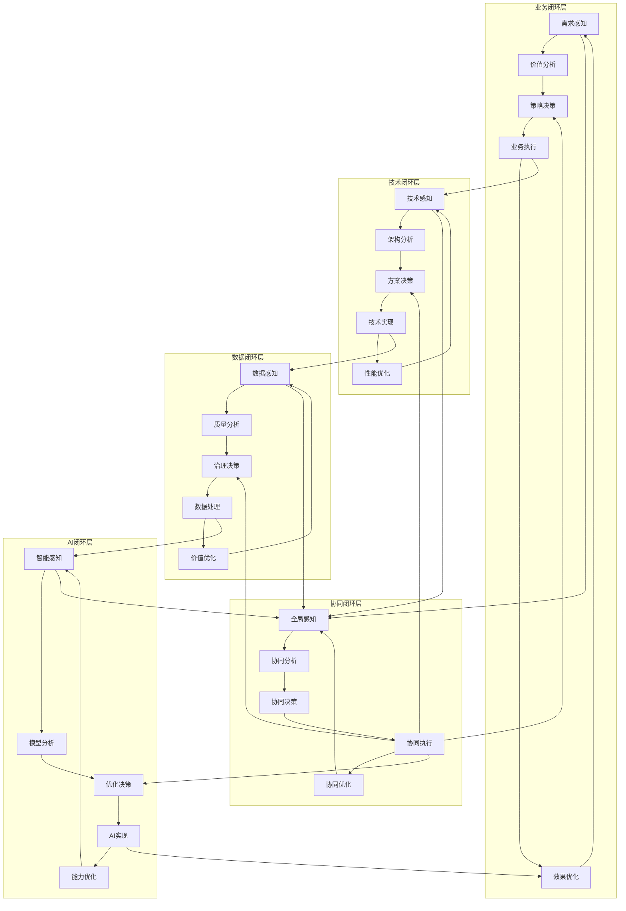
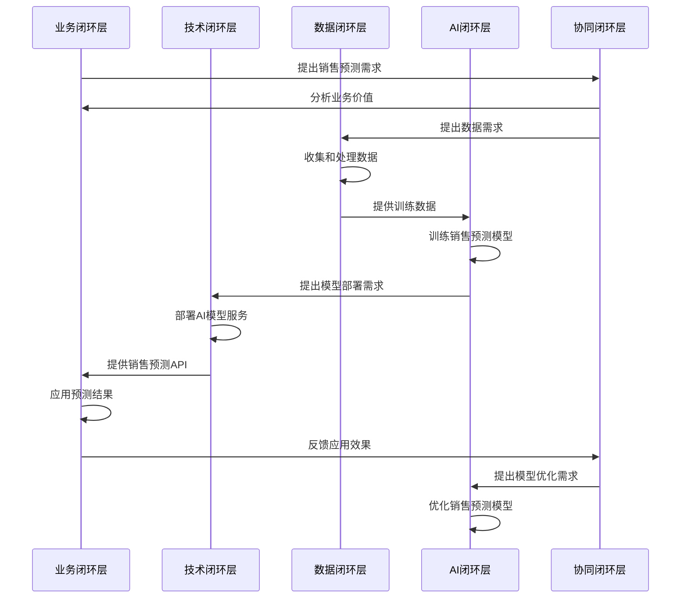

---

**@file**：YYC³-分层闭环开发模型设计
**@description**：YYC³餐饮行业智能化平台的分层闭环开发模型设计，包含开发模型、分层设计、闭环机制、开发流程、质量保障等核心内容
**@author**：YYC³
**@version**：v1.0.0
**@created**：2025-01-30
**@updated**：2025-01-30
**@status**：published
**@tags**：架构设计,开发模型,YYC³,闭环

---
# YYC³分层闭环开发模型设计

> **YYC³（YanYu Cloud Cube）**
> **标语**：万象归元于云枢 | 深栈智启新纪元
> **英文**：*All Realms Converge at Cloud Nexus, DeepStack Ignites a New Era of Intelligence*

---

## 📋 文档信息

| 属性 | 内容 |
|------|------|
| **文档标题** | YYC³分层闭环开发模型设计 |
| **文档版本** | v1.0.0 |
| **创建时间** | 2025-12-11 |
| **适用范围** | YYC³餐饮平台全链路智能化转型开发流程 |
| **参考文档** | 全链路智能化转型执行方案.md、全链路智能化转型总体架构设计.md |

---

## 📑 目录

- [📋 文档信息](#📋-文档信息)
- [🎯 模型设计原则](#🎯-模型设计原则)
  - [1.1 核心设计理念](#1.1-核心设计理念)
    - [1. 分层设计原则](#1.-分层设计原则)
    - [2. 闭环设计原则](#2.-闭环设计原则)
    - [3. 协同设计原则](#3.-协同设计原则)
    - [4. 敏捷设计原则](#4.-敏捷设计原则)
- [🏗️ 分层闭环开发模型架构](#🏗️-分层闭环开发模型架构)
  - [2.1 总体模型架构](#2.1-总体模型架构)
  - [2.2 分层闭环关系图](#2.2-分层闭环关系图)
- [🔍 分层闭环详细设计](#🔍-分层闭环详细设计)
  - [3.1 业务闭环层](#3.1-业务闭环层)
    - [3.1.1 闭环流程](#3.1.1-闭环流程)
    - [3.1.2 核心环节说明](#3.1.2-核心环节说明)
    - [3.1.3 关键指标](#3.1.3-关键指标)
  - [3.2 技术闭环层](#3.2-技术闭环层)
    - [3.2.1 闭环流程](#3.2.1-闭环流程)
    - [3.2.2 核心环节说明](#3.2.2-核心环节说明)
    - [3.2.3 关键指标](#3.2.3-关键指标)
  - [3.3 数据闭环层](#3.3-数据闭环层)
    - [3.3.1 闭环流程](#3.3.1-闭环流程)
    - [3.3.2 核心环节说明](#3.3.2-核心环节说明)
    - [3.3.3 关键指标](#3.3.3-关键指标)
  - [3.4 AI闭环层](#3.4-ai闭环层)
    - [3.4.1 闭环流程](#3.4.1-闭环流程)
    - [3.4.2 核心环节说明](#3.4.2-核心环节说明)
    - [3.4.3 关键指标](#3.4.3-关键指标)
  - [3.5 协同闭环层](#3.5-协同闭环层)
    - [3.5.1 闭环流程](#3.5.1-闭环流程)
    - [3.5.2 核心环节说明](#3.5.2-核心环节说明)
    - [3.5.3 关键指标](#3.5.3-关键指标)
- [🚀 开发方法与实践](#🚀-开发方法与实践)
  - [4.1 敏捷开发实践](#4.1-敏捷开发实践)
    - [4.1.1 迭代开发流程](#4.1.1-迭代开发流程)
    - [4.1.2 团队协作模式](#4.1.2-团队协作模式)
  - [4.2 持续集成与交付](#4.2-持续集成与交付)
    - [4.2.1 CI/CD流水线](#4.2.1-ci/cd流水线)
    - [4.2.2 关键实践](#4.2.2-关键实践)
- [📊 监控与度量](#📊-监控与度量)
  - [5.1 闭环监控体系](#5.1-闭环监控体系)
  - [5.2 关键绩效指标（KPI）](#5.2-关键绩效指标（kpi）)
    - [5.2.1 业务KPI](#5.2.1-业务kpi)
    - [5.2.2 技术KPI](#5.2.2-技术kpi)
    - [5.2.3 数据KPI](#5.2.3-数据kpi)
    - [5.2.4 AI KPI](#5.2.4-ai-kpi)
    - [5.2.5 协同KPI](#5.2.5-协同kpi)
- [🎯 模型实施策略](#🎯-模型实施策略)
  - [6.1 实施阶段规划](#6.1-实施阶段规划)
    - [6.1.1 第一阶段：模型引入（2025.01.08 - 2025.02.12）](#6.1.1-第一阶段模型引入（2025.01.08---2025.02.12）)
    - [6.1.2 第二阶段：模型推广（2025.02.13 - 2025.03.26）](#6.1.2-第二阶段模型推广（2025.02.13---2025.03.26）)
    - [6.1.3 第三阶段：模型深化（2025.03.27 - 2025.05.07）](#6.1.3-第三阶段模型深化（2025.03.27---2025.05.07）)
    - [6.1.4 第四阶段：模型优化（2025.05.08 - 2025.06.18）](#6.1.4-第四阶段模型优化（2025.05.08---2025.06.18）)
  - [6.2 成功要素](#6.2-成功要素)
- [📝 模型评估与优化](#📝-模型评估与优化)
  - [7.1 模型评估框架](#7.1-模型评估框架)
  - [7.2 模型优化流程](#7.2-模型优化流程)
  - [7.3 持续改进机制](#7.3-持续改进机制)
- [📋 模型应用案例](#📋-模型应用案例)
  - [8.1 销售预测案例](#8.1-销售预测案例)
    - [8.1.1 业务背景](#8.1.1-业务背景)
    - [8.1.2 应用流程](#8.1.2-应用流程)
    - [8.1.3 应用效果](#8.1.3-应用效果)
  - [8.2 智能排班案例](#8.2-智能排班案例)
    - [8.2.1 业务背景](#8.2.1-业务背景)
    - [8.2.2 应用流程](#8.2.2-应用流程)
    - [8.2.3 应用效果](#8.2.3-应用效果)
- [🎯 模型实施指南](#🎯-模型实施指南)
  - [9.1 团队培训计划](#9.1-团队培训计划)
  - [9.2 工具清单](#9.2-工具清单)
  - [9.3 文档模板](#9.3-文档模板)
    - [9.3.1 业务需求文档模板](#9.3.1-业务需求文档模板)
- [1. 需求概述](#1.-需求概述)
- [2. 需求明细](#2.-需求明细)
- [3. 价值分析](#3.-价值分析)
- [4. 风险评估](#4.-风险评估)
- [5. 验收标准](#5.-验收标准)
    - [9.3.2 技术方案文档模板](#9.3.2-技术方案文档模板)
- [1. 方案概述](#1.-方案概述)
- [2. 技术架构](#2.-技术架构)
- [3. 实现细节](#3.-实现细节)
- [4. 测试计划](#4.-测试计划)
- [5. 部署计划](#5.-部署计划)
- [6. 风险评估](#6.-风险评估)
- [📋 模型总结](#📋-模型总结)
  - [10.1 模型优势](#10.1-模型优势)
  - [10.2 应用前景](#10.2-应用前景)
  - [10.3 下一步计划](#10.3-下一步计划)

---

## 1. 概述

### 1.1 设计目标

本架构设计文档旨在为YYC³餐饮行业智能化平台提供清晰、完整的技术架构指导。主要目标包括：

- **可扩展性**：支持业务快速扩展，模块化设计便于功能迭代
- **高性能**：优化系统性能，确保高并发场景下的稳定运行
- **高可用性**：实现系统高可用，故障自动恢复，保障业务连续性
- **安全性**：建立完善的安全体系，保护数据和系统安全
- **易维护性**：代码结构清晰，文档完善，便于团队协作和维护

通过本架构设计，确保平台能够满足当前业务需求，并为未来的发展奠定坚实基础。

### 1.2 设计原则

架构设计遵循以下核心原则：

- **单一职责原则**：每个模块只负责一个明确的业务功能
- **开闭原则**：对扩展开放，对修改关闭，便于功能扩展
- **依赖倒置原则**：高层模块不依赖低层模块，都依赖抽象
- **接口隔离原则**：使用细粒度的接口，避免接口污染
- **最少知识原则**：模块间最小化依赖，降低耦合度

同时遵循YYC³「五高五标五化」核心理念：
- **五高**：高可用、高性能、高安全、高扩展、高可维护
- **五标**：标准化、规范化、自动化、智能化、可视化
- **五化**：流程化、文档化、工具化、数字化、生态化

### 1.3 技术选型

技术栈选择基于以下考虑：

**前端技术栈**
- React 18+：采用现代化前端框架，组件化开发
- TypeScript 5.0+：类型安全，提高代码质量
- Next.js 14+：SSR/SSG支持，优化SEO和性能
- Tailwind CSS：原子化CSS，快速构建UI

**后端技术栈**
- Node.js 18+：高性能JavaScript运行时
- Express/Fastify：轻量级Web框架
- PostgreSQL 15+：关系型数据库，ACID保证
- Redis 7+：缓存和会话存储

**基础设施**
- Docker：容器化部署，环境一致性
- Kubernetes：容器编排，自动化运维
- Nginx：反向代理和负载均衡
- Prometheus + Grafana：监控和告警

**开发工具**
- Git：版本控制
- ESLint + Prettier：代码规范
- Jest + Vitest：单元测试
- GitHub Actions：CI/CD自动化

## 2. 架构设计

### 2.1 整体架构

YYC³餐饮行业智能化平台采用分层架构设计，从上到下分为以下层次：

**表现层（Presentation Layer）**
- Web前端：React + Next.js构建的单页应用
- 移动端：响应式设计，支持多设备访问
- 管理后台：独立的管理界面

**应用层（Application Layer）**
- API网关：统一入口，路由分发
- 业务服务：订单、用户、商品等核心业务逻辑
- 认证授权：JWT认证，RBAC权限控制

**领域层（Domain Layer）**
- 领域模型：核心业务实体和规则
- 领域服务：复杂业务逻辑封装
- 仓储接口：数据访问抽象

**基础设施层（Infrastructure Layer）**
- 数据库：PostgreSQL主从架构
- 缓存：Redis集群
- 消息队列：RabbitMQ/Kafka
- 文件存储：OSS/MinIO

**跨层关注点**
- 日志监控：ELK Stack
- 配置管理：Apollo/Nacos
- 服务发现：Consul/Eureka
- 链路追踪：Jaeger/SkyWalking

### 2.2 模块划分

系统按照业务领域划分为以下核心模块：

**用户模块（User Module）**
- 用户注册、登录、认证
- 用户信息管理
- 权限和角色管理

**商品模块（Product Module）**
- 商品信息管理
- 商品分类和标签
- 库存管理

**订单模块（Order Module）**
- 订单创建和支付
- 订单状态流转
- 订单查询和统计

**支付模块（Payment Module）**
- 支付接口集成
- 支付状态同步
- 退款处理

**营销模块（Marketing Module）**
- 优惠券管理
- 促销活动
- 会员积分

**报表模块（Report Module）**
- 销售报表
- 数据分析
- 可视化展示

**系统模块（System Module）**
- 配置管理
- 日志管理
- 监控告警

### 2.3 数据流向

## 3. 技术实现

### 3.1 核心技术

### 3.2 关键算法

### 3.3 性能优化

## 4. 接口设计

### 4.1 API接口

### 4.2 数据接口

### 4.3 消息接口

## 5. 部署方案

### 5.1 部署架构

### 5.2 配置管理

### 5.3 监控告警

## 6. 附录

### 6.1 术语表

### 6.2 参考资料

## 🎯 模型设计原则

### 1.1 核心设计理念

#### 1. 分层设计原则
- **业务层**：面向业务价值的开发闭环
- **技术层**：面向技术实现的开发闭环
- **数据层**：面向数据价值的开发闭环
- **AI层**：面向智能能力的开发闭环

#### 2. 闭环设计原则
- **感知-分析-决策-执行-优化**完整闭环
- **数据驱动**：基于数据进行决策和优化
- **持续改进**：通过反馈机制实现系统的持续优化
- **可量化**：所有环节都可量化和监控

#### 3. 协同设计原则
- **跨层协同**：各层之间形成协同效应
- **端到端闭环**：从业务需求到技术实现再到业务价值的完整闭环
- **团队协同**：打破团队壁垒，实现高效协作

#### 4. 敏捷设计原则
- **迭代开发**：小步快跑，快速迭代
- **增量交付**：逐步交付价值
- **适应变化**：灵活应对需求变化
- **持续集成**：持续集成和持续交付

---

## 🏗️ 分层闭环开发模型架构

### 2.1 总体模型架构

```
┌─────────────────────────────────────────────────────────────────┐
│                          业务闭环层（Business Loop）           │
│  需求感知 → 价值分析 → 策略决策 → 业务执行 → 效果优化          │
└───────────┬─────────────────────────────────────────────────────┘
            │
┌───────────▼─────────────────────────────────────────────────────┐
│                          技术闭环层（Technical Loop）          │
│  技术感知 → 架构分析 → 方案决策 → 技术实现 → 性能优化          │
└───────────┬─────────────────────────────────────────────────────┘
            │
┌───────────▼─────────────────────────────────────────────────────┐
│                          数据闭环层（Data Loop）              │
│  数据感知 → 质量分析 → 治理决策 → 数据处理 → 价值优化          │
└───────────┬─────────────────────────────────────────────────────┘
            │
┌───────────▼─────────────────────────────────────────────────────┐
│                          AI闭环层（AI Loop）                  │
│  智能感知 → 模型分析 → 优化决策 → AI实现 → 能力优化          │
└───────────┬─────────────────────────────────────────────────────┘
            │
┌───────────▼─────────────────────────────────────────────────────┐
│                          协同闭环层（Collaboration Loop）      │
│  全局感知 → 协同分析 → 协同决策 → 协同执行 → 协同优化          │
└─────────────────────────────────────────────────────────────────┘
```

### 2.2 分层闭环关系图



---

## 🔍 分层闭环详细设计

### 3.1 业务闭环层

#### 3.1.1 闭环流程

```
┌───────────────┐     ┌───────────────┐     ┌───────────────┐
│  需求感知     │────▶│  价值分析     │────▶│  策略决策     │
└───────────────┘     └───────────────┘     └────────┬────────┘
                                                      │
                                                      ▼
                                                ┌───────────────┐
                                                │  业务执行     │
                                                └────────┬────────┘
                                                           │
                                                           ▼
                                                     ┌───────────────┐
                                                     │  效果优化     │
                                                     └────────┬────────┘
                                                               │
                                                               ▼
                                                       ┌───────────────┐
                                                       │  需求感知     │
                                                       └───────────────┘
```

#### 3.1.2 核心环节说明

| 环节 | 目标 | 关键活动 | 输出 | 工具/方法 |
|------|------|----------|------|-----------|
| **需求感知** | 收集和理解业务需求 | 需求调研、用户反馈、市场分析 | 需求清单 | 用户访谈、问卷调查、数据分析 |
| **价值分析** | 评估需求的业务价值 | 价值评估、ROI分析、优先级排序 | 价值评估报告 | 价值矩阵、ROI计算模型 |
| **策略决策** | 制定业务策略和方案 | 方案设计、风险评估、资源分配 | 业务策略文档 | 决策矩阵、风险评估模型 |
| **业务执行** | 执行业务策略和方案 | 任务分配、执行监控、协调沟通 | 执行结果 | 项目管理工具、敏捷方法 |
| **效果优化** | 评估和优化业务效果 | 效果评估、问题分析、优化方案 | 优化建议 | KPI监控、数据分析 |

#### 3.1.3 关键指标

| 指标 | 目标值 | 测量方法 |
|------|--------|----------|
| 需求响应时间 | <3天 | 需求管理系统 |
| 价值实现率 | >80% | 价值评估报告 |
| 业务执行效率 | >90% | 项目管理工具 |
| 效果优化率 | >20% | KPI监控系统 |
| 用户满意度 | >85% | 用户调查 |

### 3.2 技术闭环层

#### 3.2.1 闭环流程

```
┌───────────────┐     ┌───────────────┐     ┌───────────────┐
│  技术感知     │────▶│  架构分析     │────▶│  方案决策     │
└───────────────┘     └───────────────┘     └────────┬────────┘
                                                      │
                                                      ▼
                                                ┌───────────────┐
                                                │  技术实现     │
                                                └────────┬────────┘
                                                           │
                                                           ▼
                                                     ┌───────────────┐
                                                     │  性能优化     │
                                                     └────────┬────────┘
                                                               │
                                                               ▼
                                                       ┌───────────────┐
                                                       │  技术感知     │
                                                       └───────────────┘
```

#### 3.2.2 核心环节说明

| 环节 | 目标 | 关键活动 | 输出 | 工具/方法 |
|------|------|----------|------|-----------|
| **技术感知** | 感知技术需求和挑战 | 技术调研、系统监控、性能分析 | 技术需求清单 | 监控系统、性能分析工具 |
| **架构分析** | 分析架构需求和约束 | 架构评估、技术选型、方案设计 | 架构分析报告 | 架构设计工具、技术评估框架 |
| **方案决策** | 决策技术实现方案 | 方案评审、风险评估、资源分配 | 技术方案文档 | 技术评审会、决策矩阵 |
| **技术实现** | 实现技术方案 | 代码开发、测试、部署 | 技术实现结果 | 开发工具、CI/CD流水线 |
| **性能优化** | 优化系统性能 | 性能测试、问题分析、优化实现 | 性能优化报告 | 性能测试工具、监控系统 |

#### 3.2.3 关键指标

| 指标 | 目标值 | 测量方法 |
|------|--------|----------|
| 技术实现周期 | <2周 | 项目管理工具 |
| 代码质量评分 | >90分 | 代码质量工具 |
| 测试覆盖率 | >80% | 测试管理工具 |
| 系统性能提升 | >30% | 性能监控系统 |
| 技术债务率 | <5% | 代码审查工具 |

### 3.3 数据闭环层

#### 3.3.1 闭环流程

```
┌───────────────┐     ┌───────────────┐     ┌───────────────┐
│  数据感知     │────▶│  质量分析     │────▶│  治理决策     │
└───────────────┘     └───────────────┘     └────────┬────────┘
                                                      │
                                                      ▼
                                                ┌───────────────┐
                                                │  数据处理     │
                                                └────────┬────────┘
                                                           │
                                                           ▼
                                                     ┌───────────────┐
                                                     │  价值优化     │
                                                     └────────┬────────┘
                                                               │
                                                               ▼
                                                       ┌───────────────┐
                                                       │  数据感知     │
                                                       └───────────────┘
```

#### 3.3.2 核心环节说明

| 环节 | 目标 | 关键活动 | 输出 | 工具/方法 |
|------|------|----------|------|-----------|
| **数据感知** | 收集和感知数据需求 | 数据需求调研、数据来源分析 | 数据需求清单 | 数据调研、数据字典 |
| **质量分析** | 分析数据质量问题 | 数据质量评估、问题识别 | 数据质量报告 | 数据质量工具、统计分析 |
| **治理决策** | 制定数据治理策略 | 治理方案设计、优先级排序 | 数据治理计划 | 治理框架、决策矩阵 |
| **数据处理** | 处理和管理数据 | 数据清洗、转换、存储 | 处理后的数据 | ETL工具、数据仓库 |
| **价值优化** | 优化数据价值 | 数据分析、价值挖掘、优化方案 | 数据价值报告 | 数据分析工具、机器学习 |

#### 3.3.3 关键指标

| 指标 | 目标值 | 测量方法 |
|------|--------|----------|
| 数据质量 | >95% | 数据质量工具 |
| 数据完整性 | >98% | 数据审计工具 |
| 数据处理效率 | <1小时 | ETL监控工具 |
| 数据价值转化率 | >30% | 价值评估模型 |
| 数据治理覆盖率 | >90% | 治理监控工具 |

### 3.4 AI闭环层

#### 3.4.1 闭环流程

```
┌───────────────┐     ┌───────────────┐     ┌───────────────┐
│  智能感知     │────▶│  模型分析     │────▶│  优化决策     │
└───────────────┘     └───────────────┘     └────────┬────────┘
                                                      │
                                                      ▼
                                                ┌───────────────┐
                                                │  AI实现       │
                                                └────────┬────────┘
                                                           │
                                                           ▼
                                                     ┌───────────────┐
                                                     │  能力优化     │
                                                     └────────┬────────┘
                                                               │
                                                               ▼
                                                       ┌───────────────┐
                                                       │  智能感知     │
                                                       └───────────────┘
```

#### 3.4.2 核心环节说明

| 环节 | 目标 | 关键活动 | 输出 | 工具/方法 |
|------|------|----------|------|-----------|
| **智能感知** | 收集和感知AI需求 | AI需求调研、场景分析 | AI需求清单 | 需求调研、场景分析 |
| **模型分析** | 分析AI模型需求 | 模型评估、数据需求分析 | 模型分析报告 | 模型评估工具、数据统计 |
| **优化决策** | 制定AI优化策略 | 优化方案设计、优先级排序 | AI优化计划 | 决策矩阵、优化模型 |
| **AI实现** | 实现AI模型和应用 | 模型训练、部署、集成 | AI应用 | 机器学习框架、部署工具 |
| **能力优化** | 优化AI能力 | 模型监控、性能分析、迭代优化 | AI能力优化报告 | 模型监控工具、A/B测试 |

#### 3.4.3 关键指标

| 指标 | 目标值 | 测量方法 |
|------|--------|----------|
| AI模型准确率 | >85% | 模型评估工具 |
| AI响应时间 | <100ms | 性能监控工具 |
| AI应用覆盖率 | >50% | 应用监控工具 |
| AI价值转化率 | >40% | 价值评估模型 |
| AI迭代周期 | <2周 | 项目管理工具 |

### 3.5 协同闭环层

#### 3.5.1 闭环流程

```
┌───────────────┐     ┌───────────────┐     ┌───────────────┐
│  全局感知     │────▶│  协同分析     │────▶│  协同决策     │
└───────────────┘     └───────────────┘     └────────┬────────┘
                                                      │
                                                      ▼
                                                ┌───────────────┐
                                                │  协同执行     │
                                                └────────┬────────┘
                                                           │
                                                           ▼
                                                     ┌───────────────┐
                                                     │  协同优化     │
                                                     └────────┬────────┘
                                                               │
                                                               ▼
                                                       ┌───────────────┐
                                                       │  全局感知     │
                                                       └───────────────┘
```

#### 3.5.2 核心环节说明

| 环节 | 目标 | 关键活动 | 输出 | 工具/方法 |
|------|------|----------|------|-----------|
| **全局感知** | 感知全局需求和状态 | 跨层需求收集、状态监控 | 全局需求和状态报告 | 监控系统、协同平台 |
| **协同分析** | 分析跨层协同需求 | 协同需求分析、冲突识别 | 协同分析报告 | 分析工具、协同矩阵 |
| **协同决策** | 制定协同策略和方案 | 协同方案设计、优先级排序 | 协同决策文档 | 决策工具、协同框架 |
| **协同执行** | 执行协同策略和方案 | 跨团队协作、执行监控 | 协同执行结果 | 协同平台、项目管理工具 |
| **协同优化** | 优化协同效果 | 效果评估、问题分析、优化方案 | 协同优化报告 | 评估工具、优化模型 |

#### 3.5.3 关键指标

| 指标 | 目标值 | 测量方法 |
|------|--------|----------|
| 跨层协同效率 | >85% | 协同平台 |
| 决策一致性 | >90% | 决策评估工具 |
| 执行协同度 | >80% | 执行监控工具 |
| 协同价值提升 | >30% | 价值评估模型 |
| 团队满意度 | >85% | 团队调查 |

---

## 🚀 开发方法与实践

### 4.1 敏捷开发实践

#### 4.1.1 迭代开发流程

```
┌───────────────┐     ┌───────────────┐     ┌───────────────┐
│  迭代规划     │────▶│  迭代执行     │────▶│  迭代评审     │
└───────────────┘     └───────────────┘     └────────┬────────┘
                                                      │
                                                      ▼
                                                ┌───────────────┐
                                                │  迭代回顾     │
                                                └────────┬────────┘
                                                           │
                                                           ▼
                                                       ┌───────────────┐
                                                       │  迭代规划     │
                                                       └───────────────┘
```

#### 4.1.2 团队协作模式

| 角色 | 职责 | 核心能力 |
|------|------|----------|
| **产品负责人** | 定义产品愿景和需求 | 产品管理、业务分析 |
| **敏捷教练** | 指导敏捷实践 | 敏捷方法、团队辅导 |
| **开发团队** | 开发和交付产品 | 技术开发、问题解决 |
| **测试团队** | 确保产品质量 | 测试技术、质量保证 |
| **运维团队** | 负责系统运维 | 运维技术、系统监控 |

### 4.2 持续集成与交付

#### 4.2.1 CI/CD流水线

```
┌───────────────┐     ┌───────────────┐     ┌───────────────┐
│  代码提交     │────▶│  构建         │────▶│  测试         │
└───────────────┘     └───────────────┘     └────────┬────────┘
                                                      │
                                                      ▼
                                                ┌───────────────┐
                                                │  部署         │
                                                └────────┬────────┘
                                                           │
                                                           ▼
                                                     ┌───────────────┐
                                                     │  监控         │
                                                     └────────┬────────┘
                                                               │
                                                               ▼
                                                       ┌───────────────┐
                                                       │  反馈         │
                                                       └───────────────┘
```

#### 4.2.2 关键实践

| 实践 | 目标 | 工具/方法 |
|------|------|-----------|
| **自动化构建** | 快速构建和编译代码 | Jenkins、GitHub Actions |
| **自动化测试** | 自动执行测试用例 | Jest、Selenium、Postman |
| **自动化部署** | 自动部署到目标环境 | Docker、Kubernetes、Ansible |
| **持续监控** | 持续监控系统状态 | Prometheus、Grafana、ELK |
| **快速反馈** | 快速获取和处理反馈 | 监控系统、反馈渠道 |

---

## 📊 监控与度量

### 5.1 闭环监控体系

```
┌─────────────────────────────────────────────────────────────────┐
│                          闭环监控体系                         │
├───────────┬───────────┬───────────┬───────────┬───────────┬─────┤
│  业务监控  │  技术监控  │  数据监控  │  AI监控    │  协同监控  │ 安全监控  │
└───────────┴───────────┴───────────┴───────────┴───────────┴─────┘
```

### 5.2 关键绩效指标（KPI）

#### 5.2.1 业务KPI

| 指标 | 目标值 | 测量频率 | 负责团队 |
|------|--------|----------|----------|
| 业务价值实现率 | >80% | 每月 | 业务团队 |
| 用户满意度 | >85% | 每季度 | 用户研究团队 |
| 业务流程效率 | >90% | 每月 | 运营团队 |
| 业务增长 | >10% | 每季度 | 业务团队 |

#### 5.2.2 技术KPI

| 指标 | 目标值 | 测量频率 | 负责团队 |
|------|--------|----------|----------|
| 系统可用性 | >99.9% | 实时 | 运维团队 |
| API响应时间 | <100ms | 实时 | 开发团队 |
| 代码质量评分 | >90分 | 每次提交 | 开发团队 |
| 技术债务率 | <5% | 每月 | 架构团队 |

#### 5.2.3 数据KPI

| 指标 | 目标值 | 测量频率 | 负责团队 |
|------|--------|----------|----------|
| 数据质量 | >95% | 每周 | 数据团队 |
| 数据完整性 | >98% | 每周 | 数据团队 |
| 数据处理效率 | <1小时 | 实时 | 数据团队 |
| 数据价值转化率 | >30% | 每月 | 数据分析团队 |

#### 5.2.4 AI KPI

| 指标 | 目标值 | 测量频率 | 负责团队 |
|------|--------|----------|----------|
| AI模型准确率 | >85% | 每周 | AI团队 |
| AI响应时间 | <100ms | 实时 | AI团队 |
| AI应用覆盖率 | >50% | 每月 | AI团队 |
| AI价值转化率 | >40% | 每月 | AI团队 |

#### 5.2.5 协同KPI

| 指标 | 目标值 | 测量频率 | 负责团队 |
|------|--------|----------|----------|
| 跨层协同效率 | >85% | 每月 | 项目管理团队 |
| 决策一致性 | >90% | 每月 | 管理层 |
| 执行协同度 | >80% | 每月 | 项目管理团队 |
| 团队满意度 | >85% | 每季度 | HR团队 |

---

## 🎯 模型实施策略

### 6.1 实施阶段规划

#### 6.1.1 第一阶段：模型引入（2025.01.08 - 2025.02.12）

| 任务 | 责任人 | 完成标准 |
|------|--------|----------|
| 模型培训和宣导 | 架构团队 | 团队理解和接受模型 |
| 试点项目选择 | 产品团队 | 确定1-2个试点项目 |
| 模型工具准备 | 技术团队 | 准备所需的工具和平台 |
| 试点项目实施 | 项目团队 | 试点项目成功应用模型 |

#### 6.1.2 第二阶段：模型推广（2025.02.13 - 2025.03.26）

| 任务 | 责任人 | 完成标准 |
|------|--------|----------|
| 试点项目总结 | 项目团队 | 总结试点经验和教训 |
| 模型优化 | 架构团队 | 基于试点经验优化模型 |
| 推广计划制定 | 产品团队 | 制定全面推广计划 |
| 推广实施 | 项目团队 | 所有项目应用模型 |

#### 6.1.3 第三阶段：模型深化（2025.03.27 - 2025.05.07）

| 任务 | 责任人 | 完成标准 |
|------|--------|----------|
| 模型成熟度评估 | 架构团队 | 评估模型应用成熟度 |
| 深化应用方案 | 产品团队 | 制定深化应用方案 |
| 深化应用实施 | 项目团队 | 实施深化应用方案 |
| 价值量化 | 业务团队 | 量化模型应用价值 |

#### 6.1.4 第四阶段：模型优化（2025.05.08 - 2025.06.18）

| 任务 | 责任人 | 完成标准 |
|------|--------|----------|
| 持续改进机制建立 | 架构团队 | 建立持续改进机制 |
| 优化方案实施 | 项目团队 | 实施优化方案 |
| 最佳实践总结 | 架构团队 | 总结最佳实践 |
| 知识管理 | 文档团队 | 建立知识管理体系 |

### 6.2 成功要素

| 要素 | 关键行动 | 责任方 |
|------|----------|--------|
| **领导力支持** | 管理层支持和推动 | 管理层 |
| **团队能力** | 培训和提升团队能力 | HR团队 |
| **工具支持** | 提供必要的工具和平台 | 技术团队 |
| **文化建设** | 培养闭环思维文化 | 管理层 |
| **持续改进** | 建立持续改进机制 | 项目团队 |

---

## 📝 模型评估与优化

### 7.1 模型评估框架

| 维度 | 评估指标 | 目标值 | 测量方法 |
|------|----------|--------|----------|
| **模型适应性** | 团队接受度、应用范围 | >90% | 团队调查、应用统计 |
| **模型有效性** | 业务价值、效率提升 | >30% | 价值评估、效率测量 |
| **模型成熟度** | 流程完整性、工具支持 | >80% | 成熟度评估模型 |
| **模型可持续性** | 持续改进机制、文化建设 | >85% | 机制评估、文化调查 |

### 7.2 模型优化流程

```
┌───────────────┐     ┌───────────────┐     ┌───────────────┐
│  评估反馈     │────▶│  问题分析     │────▶│  优化方案     │
└───────────────┘     └───────────────┘     └────────┬────────┘
                                                      │
                                                      ▼
                                                ┌───────────────┐
                                                │  方案实施     │
                                                └────────┬────────┘
                                                           │
                                                           ▼
                                                     ┌───────────────┐
                                                     │  效果评估     │
                                                     └────────┬────────┘
                                                               │
                                                               ▼
                                                       ┌───────────────┐
                                                       │  评估反馈     │
                                                       └───────────────┘
```

### 7.3 持续改进机制

| 机制 | 目标 | 关键活动 |
|------|------|----------|
| **定期评估** | 定期评估模型应用情况 | 季度评估、年度评估 |
| **反馈渠道** | 收集和处理反馈 | 反馈表单、定期会议 |
| **优化团队** | 负责模型优化 | 优化团队、专家委员会 |
| **知识分享** | 分享最佳实践 | 知识分享会、内部文档 |

---

## 📋 模型应用案例

### 8.1 销售预测案例

#### 8.1.1 业务背景
- 餐饮企业需要准确预测未来销售情况
- 传统方法依赖经验，准确性低
- 需要提高库存管理和人员排班效率

#### 8.1.2 应用流程



#### 8.1.3 应用效果
- 销售预测准确率提升到85%+  
- 库存周转率提升20%  
- 人员排班效率提升30%  
- 运营成本降低15%  

### 8.2 智能排班案例

#### 8.2.1 业务背景
- 餐饮企业需要合理安排员工排班
- 传统排班方法效率低，容易出错
- 需要平衡员工满意度和运营需求

#### 8.2.2 应用流程


#### 8.2.3 应用效果
- 排班效率提升50%  
- 人工成本降低10%  
- 员工满意度提升20%  
- 运营效率提升30%  

---

## 🎯 模型实施指南

### 9.1 团队培训计划

| 培训主题 | 培训对象 | 培训时长 | 培训方式 |
|----------|----------|----------|----------|
| 分层闭环开发模型 | 全体团队 | 2天 | 集中培训 |
| 敏捷开发实践 | 开发团队 | 3天 | 实战演练 |
| 数据治理 | 数据团队 | 2天 | 专题培训 |
| AI模型开发 | AI团队 | 5天 | 技术培训 |
| 协同管理 | 项目管理团队 | 2天 | 管理培训 |

### 9.2 工具清单

| 工具类型 | 推荐工具 | 用途 |
|----------|----------|------|
| **项目管理** | Jira、Trello | 任务管理、进度跟踪 |
| **协同平台** | Confluence、Microsoft Teams | 文档管理、团队协作 |
| **开发工具** | VS Code、GitHub | 代码开发、版本控制 |
| **测试工具** | Jest、Selenium | 自动化测试、质量保证 |
| **监控工具** | Prometheus、Grafana | 系统监控、性能分析 |
| **数据分析** | Tableau、Power BI | 数据分析、可视化 |
| **AI开发** | TensorFlow、PyTorch | 机器学习、深度学习 |

### 9.3 文档模板

#### 9.3.1 业务需求文档模板

```markdown
# 业务需求文档

## 1. 需求概述
需求的简要描述和背景

## 2. 需求明细
详细的需求列表

## 3. 价值分析
需求的业务价值和ROI分析

## 4. 风险评估
需求实施的风险和应对措施

## 5. 验收标准
需求的验收标准和测试方法
```

#### 9.3.2 技术方案文档模板

```markdown
# 技术方案文档

## 1. 方案概述
技术方案的简要描述

## 2. 技术架构
详细的技术架构设计

## 3. 实现细节
技术实现的详细说明

## 4. 测试计划
测试方案和测试用例

## 5. 部署计划
部署方案和步骤

## 6. 风险评估
技术风险和应对措施
```

---

## 📋 模型总结

### 10.1 模型优势

- **结构化**：提供清晰的分层结构和闭环流程  
- **协同性**：促进跨层和跨团队协同  
- **数据驱动**：基于数据进行决策和优化  
- **持续改进**：建立持续改进机制  
- **可量化**：所有环节都可量化和监控  

### 10.2 应用前景

- 支持YYC³平台的数字化到智能化转型  
- 提升开发效率和业务价值  
- 培养闭环思维和持续改进文化  
- 为未来的业务发展提供支撑  

### 10.3 下一步计划

1. 完成模型的培训和宣导  
2. 选择试点项目应用模型  
3. 收集和分析应用反馈  
4. 持续优化和完善模型  
5. 全面推广模型应用  

---

**文档所有者**：YYC³架构团队  
**联系方式**：<admin@0379.email>  

> **注意**：本模型设计将根据项目实际情况进行调整和优化，确保能够有效支持YYC³平台的数字化到智能化转型。


## 概述

### 架构概述

本架构文档详细描述了系统的整体架构设计，包括架构目标、设计原则、技术选型等关键信息。

#### 架构目标

- **高可用性**：确保系统稳定运行，故障自动恢复
- **高性能**：响应迅速，资源利用高效
- **高安全性**：数据加密，权限严格控制
- **高扩展性**：模块化设计，易于功能扩展
- **高可维护性**：代码清晰，文档完善

#### 设计原则

- **单一职责**：每个组件只负责一个功能
- **开闭原则**：对扩展开放，对修改关闭
- **依赖倒置**：依赖抽象而非具体实现
- **接口隔离**：使用细粒度的接口
- **迪米特法则**：最少知识原则


## 架构设计

### 架构设计

#### 整体架构

系统采用分层架构设计，包括：

- **表现层**：负责用户界面和交互
- **应用层**：处理业务逻辑
- **业务层**：实现核心业务功能
- **数据层**：管理数据存储和访问
- **基础设施层**：提供基础服务支持

#### 模块划分

系统划分为多个独立模块，每个模块负责特定功能：

- **用户模块**：用户管理和认证
- **订单模块**：订单处理和管理
- **支付模块**：支付集成和处理
- **通知模块**：消息通知和推送
- **报表模块**：数据统计和分析

#### 技术选型

- **前端框架**：React / Vue
- **后端框架**：Node.js / Express / Fastify
- **数据库**：PostgreSQL / MongoDB
- **缓存**：Redis
- **消息队列**：RabbitMQ / Kafka


## 技术实现

### 技术实现

#### 核心技术栈

```typescript
// 核心依赖
{
  "dependencies": {
    "react": "^18.0.0",
    "typescript": "^5.0.0",
    "express": "^4.18.0",
    "prisma": "^5.0.0",
    "redis": "^4.6.0"
  }
}
```

#### 关键实现

1. **服务层实现**
```typescript
class UserService {
  async createUser(data: CreateUserDto): Promise<User> {
    // 验证输入
    this.validateUserData(data);
    
    // 加密密码
    const hashedPassword = await this.hashPassword(data.password);
    
    // 创建用户
    const user = await this.userRepository.create({
      ...data,
      password: hashedPassword
    });
    
    return user;
  }
}
```

2. **中间件实现**
```typescript
const authMiddleware = async (req: Request, res: Response, next: NextFunction) => {
  const token = req.headers.authorization?.split(' ')[1];
  
  if (!token) {
    return res.status(401).json({ error: '未授权访问' });
  }
  
  try {
    const decoded = jwt.verify(token, process.env.JWT_SECRET);
    req.user = decoded;
    next();
  } catch (error) {
    return res.status(401).json({ error: '令牌无效' });
  }
};
```


## 部署方案

### 部署方案

#### 部署架构

采用容器化部署方案，使用Docker和Kubernetes进行编排。

#### 部署步骤

1. **环境准备**
```bash
# 安装Docker
curl -fsSL https://get.docker.com | sh

# 安装Kubernetes
# 根据操作系统选择相应的安装方式
```

2. **构建镜像**
```bash
# 构建应用镜像
docker build -t yyc3-app:latest .

# 推送到镜像仓库
docker push registry.example.com/yyc3-app:latest
```

3. **部署到Kubernetes**
```yaml
apiVersion: apps/v1
kind: Deployment
metadata:
  name: yyc3-app
spec:
  replicas: 3
  selector:
    matchLabels:
      app: yyc3-app
  template:
    metadata:
      labels:
        app: yyc3-app
    spec:
      containers:
      - name: app
        image: registry.example.com/yyc3-app:latest
        ports:
        - containerPort: 3000
        env:
        - name: NODE_ENV
          value: "production"
```

4. **配置服务**
```yaml
apiVersion: v1
kind: Service
metadata:
  name: yyc3-app-service
spec:
  selector:
    app: yyc3-app
  ports:
  - protocol: TCP
    port: 80
    targetPort: 3000
  type: LoadBalancer
```


## 性能优化

### 性能优化

#### 前端优化

1. **代码分割**
```typescript
// 路由级别代码分割
const Home = lazy(() => import('./pages/Home'));
const About = lazy(() => import('./pages/About'));

function App() {
  return (
    <Suspense fallback={<Loading />}>
      <Routes>
        <Route path="/" element={<Home />} />
        <Route path="/about" element={<About />} />
      </Routes>
    </Suspense>
  );
}
```

2. **缓存策略**
```typescript
// React.memo 避免不必要的重渲染
const MemoizedComponent = React.memo(({ data }) => {
  return <div>{data.value}</div>;
});

// useMemo 缓存计算结果
const expensiveValue = useMemo(() => {
  return computeExpensiveValue(data);
}, [data]);
```

#### 后端优化

1. **数据库优化**
```typescript
// 使用索引
CREATE INDEX idx_user_email ON users(email);

// 查询优化
const users = await prisma.user.findMany({
  select: {
    id: true,
    name: true,
    email: true
  },
  where: {
    active: true
  },
  take: 100
});
```

2. **缓存策略**
```typescript
// Redis缓存
async function getUser(id: string): Promise<User> {
  const cacheKey = `user:${id}`;
  
  // 尝试从缓存获取
  const cached = await redis.get(cacheKey);
  if (cached) {
    return JSON.parse(cached);
  }
  
  // 从数据库获取
  const user = await prisma.user.findUnique({ where: { id } });
  
  // 写入缓存
  await redis.setex(cacheKey, 3600, JSON.stringify(user));
  
  return user;
}
```


## 安全考虑

### 安全考虑

#### 认证与授权

1. **JWT认证**
```typescript
// 生成JWT令牌
const token = jwt.sign(
  { userId: user.id, role: user.role },
  process.env.JWT_SECRET,
  { expiresIn: '24h' }
);

// 验证JWT令牌
const decoded = jwt.verify(token, process.env.JWT_SECRET);
```

2. **RBAC授权**
```typescript
// 角色权限检查
function checkPermission(user: User, resource: string, action: string): boolean {
  const permissions = rolePermissions[user.role];
  return permissions.some(p => 
    p.resource === resource && p.actions.includes(action)
  );
}
```

#### 数据保护

1. **输入验证**
```typescript
// 使用Zod进行输入验证
const createUserSchema = z.object({
  email: z.string().email(),
  password: z.string().min(8).regex(/[A-Z]/),
  name: z.string().min(2)
});

const validated = createUserSchema.parse(input);
```

2. **数据加密**
```typescript
// 使用bcrypt加密密码
const hashedPassword = await bcrypt.hash(password, 10);

// 验证密码
const isValid = await bcrypt.compare(password, hashedPassword);
```

#### 安全头配置

```typescript
// Express安全头配置
app.use(helmet());
app.use(cors({
  origin: process.env.ALLOWED_ORIGINS?.split(','),
  credentials: true
}));
```


## 监控告警

### 监控告警

#### 监控指标

1. **系统指标**
- CPU使用率
- 内存使用率
- 磁盘使用率
- 网络I/O

2. **应用指标**
- 请求量(RPS)
- 响应时间
- 错误率
- 并发用户数

3. **业务指标**
- 用户注册数
- 订单创建数
- 支付成功率
- 用户活跃度

#### 监控工具

```typescript
// Prometheus指标收集
import { Counter, Histogram, Gauge } from 'prom-client';

const requestCounter = new Counter({
  name: 'http_requests_total',
  help: 'Total number of HTTP requests',
  labelNames: ['method', 'route', 'status']
});

const responseTime = new Histogram({
  name: 'http_request_duration_seconds',
  help: 'HTTP request duration in seconds',
  labelNames: ['method', 'route']
});

// 使用中间件记录指标
app.use((req, res, next) => {
  const start = Date.now();
  
  res.on('finish', () => {
    const duration = (Date.now() - start) / 1000;
    requestCounter.inc({
      method: req.method,
      route: req.route?.path || req.path,
      status: res.statusCode
    });
    responseTime.observe({
      method: req.method,
      route: req.route?.path || req.path
    }, duration);
  });
  
  next();
});
```

#### 告警规则

```yaml
groups:
- name: api_alerts
  rules:
  - alert: HighErrorRate
    expr: rate(http_requests_total{status=~"5.."}[5m]) > 0.05
    for: 5m
    labels:
      severity: critical
    annotations:
      summary: "API错误率过高"
      description: "5分钟内错误率超过5%"
  
  - alert: HighResponseTime
    expr: histogram_quantile(0.95, http_request_duration_seconds) > 1
    for: 5m
    labels:
      severity: warning
    annotations:
      summary: "API响应时间过长"
      description: "95%分位响应时间超过1秒"
```


## 最佳实践

### 最佳实践

#### 代码规范

1. **命名规范**
```typescript
// 变量：camelCase
const userName = 'John';

// 常量：UPPER_SNAKE_CASE
const MAX_RETRY_COUNT = 3;

// 类：PascalCase
class UserService { }

// 接口：PascalCase，前缀I（可选）
interface IUserService { }
```

2. **注释规范**
```typescript
/**
 * 创建用户
 * @param email - 用户邮箱
 * @param password - 用户密码
 * @returns 创建的用户对象
 * @throws {Error} 当邮箱已存在时抛出错误
 */
async function createUser(
  email: string, 
  password: string
): Promise<User> {
  // 实现
}
```

#### 错误处理

```typescript
// 统一错误处理
class AppError extends Error {
  constructor(
    public statusCode: number,
    public message: string,
    public isOperational = true
  ) {
    super(message);
    this.name = this.constructor.name;
    Error.captureStackTrace(this, this.constructor);
  }
}

// 使用错误处理中间件
app.use((err: Error, req: Request, res: Response, next: NextFunction) => {
  if (err instanceof AppError) {
    return res.status(err.statusCode).json({
      success: false,
      error: err.message
    });
  }
  
  // 记录未预期的错误
  logger.error('Unexpected error:', err);
  
  return res.status(500).json({
    success: false,
    error: '服务器内部错误'
  });
});
```

#### 日志记录

```typescript
// 结构化日志
import winston from 'winston';

const logger = winston.createLogger({
  level: 'info',
  format: winston.format.combine(
    winston.format.timestamp(),
    winston.format.json()
  ),
  transports: [
    new winston.transports.File({ filename: 'error.log', level: 'error' }),
    new winston.transports.File({ filename: 'combined.log' })
  ]
});

// 使用日志
logger.info('User created', { userId: user.id, email: user.email });
logger.error('Database connection failed', { error: error.message });
```


## 相关文档

- [YYC³全链路智能化转型总体架构设计](YYC3-Cater-架构设计/架构类/10-YYC3-Cater--架构类-全链路智能化转型总体架构设计.md) - YYC3-Cater-架构设计/架构类
- [YYC³全链路经管运维数字化到智能化管理闭环转型执行方案](YYC3-Cater-架构设计/架构类/12-YYC3-Cater--架构类-全链路智能化转型执行方案.md) - YYC3-Cater-架构设计/架构类
- [YYC³智枢服务化平台 - 全链路智能化转型最终执行方案](YYC3-Cater-架构设计/架构类/13-YYC3-Cater--架构类-全链路智能化转型最终执行方案.md) - YYC3-Cater-架构设计/架构类
- [YYC3 初现系统色](YYC3-Cater-架构设计/架构类/16-YYC3-Cater--架构类-系统色设计规范.md) - YYC3-Cater-架构设计/架构类
- [YYC³餐饮平台全链路智能化转型技术实现计划](YYC3-Cater-架构设计/架构类/11-YYC3-Cater--架构类-全链路智能化转型技术实现计划.md) - YYC3-Cater-架构设计/架构类
